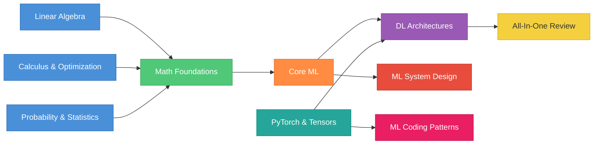

# AI/ML Interviews Study Guide

A structured collection of study guides for **Machine Learning Engineer (MLE)** interview preparation. Covers math foundations, ML theory, deep learning architectures, systems design, hands-on PyTorch, and coding patterns — everything you need for theory, design, and coding rounds.

> **New here?** Start with [Why This Matters](guides/why-this-matters.md) — a practical guide showing exactly where every topic shows up in a real LLM training pipeline. It will tell you why all of this is worth your time.

---

## Guides

### Theory & Math
| Guide | Description | Focus |
|---|---|---|
| [Linear Algebra](guides/linear-algebra.md) | Vectors, matrices, decompositions, PCA | Basics first, then ML applications |
| [Calculus & Optimization](guides/calculus.md) | Derivatives, gradients, optimization, backprop | Basics first, then ML applications |
| [Probability & Statistics](guides/statistics.md) | Distributions, estimation, Bayes, information theory | Basics first, then ML applications |
| [Quant Stats Skill-Building](guides/quant-stats-skill-building.md) | 6-week applied plan: CIs, paired bootstrap, power, FDR, eval overfitting | Hands-on, with runnable [companion notebooks](notebooks/) (Colab-ready) |
| [Quant Stats FAQ](guides/quant-stats-faq.md) | FAQs for the skill-building series: who it's for, what to cut, how to apply it | Companion to the skill-building guide |
| [Eval Design Case Study](guides/eval-design-case-study.md) | METR-style end-to-end: hypothesis → pre-registration → sample size → synth data → hierarchical bootstrap → decision | Design-side companion with a [runnable notebook](notebooks/eval_design_case_study.ipynb) |

### Deep Learning & Systems
| Guide | Description | Focus |
|---|---|---|
| [Deep Learning Architectures](guides/deep-learning-architectures.md) | CNNs, RNNs, transformers, GANs, diffusion models | Basics first, then modern architectures |
| [LLMs & NLP](guides/llm-nlp.md) | NLP basics, transformer internals, attention variants, fine-tuning, RAG | Deep dive on LLM-specific topics |
| [ML System Design](guides/ml-system-design.md) | Data pipelines, serving, monitoring, worked examples | Framework first, then real-world systems |
| [RLHF & Monte Carlo](guides/rlhf-monte-carlo-guide.md) | RLHF pipeline, PPO, Monte Carlo rollouts explained simply | Beginner-friendly deep dive on RL for LLMs |

### Hands-On & Coding
| Guide | Description | Focus |
|---|---|---|
| [PyTorch & Tensors](guides/pytorch.md) | Tensors, autograd, modules, training loops | Basics first, then production patterns |
| [ML Coding Patterns](guides/ml-coding-patterns.md) | From-scratch implementations, interview coding | NumPy basics first, then PyTorch |

### Reference & Motivation
| Guide | Description | Focus |
|---|---|---|
| [Why This Matters](guides/why-this-matters.md) | Practical guide mapping topics to real LLM pipelines | Motivation — why every topic is worth learning |
| [All-In-One Guide](guides/all-in-one-guide.md) | Complete ML theory reference | ML, DL, RL, systems — everything in one file |
| [Resources and References](guides/resources.md) | Curated articles, papers, courses, and tools | Best external resources, organized by topic |

---

## How to Use

1. **Start with the math.** The Linear Algebra, Calculus, and Statistics guides cover fundamentals in the first half — start here if you're rusty.
2. **Learn the architectures.** The Deep Learning Architectures guide covers everything from MLPs to modern transformers and diffusion models.
3. **Master system design.** The ML System Design guide gives you a reusable framework plus worked examples (recommendations, LLM serving, fraud detection).
4. **Get hands-on with PyTorch.** Tensors, autograd, and training patterns — the practical skills that complement the theory.
5. **Practice coding.** The ML Coding Patterns guide has from-scratch implementations of every major algorithm, ready for whiteboard interviews.
6. **Review with the all-in-one guide.** A fast refresher covering ML theory, deep learning, RL, and systems in a single file.
7. **Use Mermaid diagrams.** All guides include colorful Mermaid diagrams — render them in any Markdown viewer that supports Mermaid (GitHub, VS Code with extensions, etc.).

---

## Topics Covered

### Math Foundations
- **Linear Algebra** — vectors, matrices, norms, eigenvalues, SVD, PCA, positive definiteness, condition numbers
- **Calculus & Optimization** — derivatives, gradients, chain rule, Jacobians, Hessians, convexity, gradient descent, backpropagation, Lagrange multipliers
- **Probability & Statistics** — probability axioms, Bayes' theorem, distributions, MLE/MAP, hypothesis testing, information theory, sampling

### Deep Learning & Systems
- **Architectures** — MLPs, CNNs, RNNs/LSTMs, transformers, attention variants, GANs, VAEs, diffusion models, vision transformers, multi-modal models
- **System Design** — data pipelines, feature stores, serving architecture, monitoring, A/B testing, recommendation systems, LLM serving, fraud detection, MLOps

### Hands-On & Coding
- **PyTorch** — tensor operations, broadcasting, memory layout, autograd, nn.Module, training loops, mixed precision, DDP/FSDP, debugging
- **Coding Patterns** — linear/logistic regression from scratch, KNN, K-means, decision trees, PCA, neural nets with backprop, attention, transformer blocks, evaluation metrics

### All-In-One Review
- Classical ML — bias-variance, regularization, SVMs, ensembles
- Training dynamics — optimizers, learning rate schedules, mixed precision
- Reinforcement learning — policy gradients, PPO, DPO, RLHF
- GPU hardware — memory hierarchy, roofline model, tensor cores
- Distributed training — data/tensor/pipeline parallelism, ZeRO
- Inference systems — KV cache, speculative decoding, quantization

---

## Quick Self-Test

Before the interview, you should be able to do all of these from a blank page in under 5 minutes each:

**Theory**
- [ ] Derive PCA from the max-variance principle
- [ ] Backprop through a 2-layer MLP with cross-entropy loss
- [ ] Bias-variance decomposition for squared loss
- [ ] Ridge regression = MAP with Gaussian prior
- [ ] MLE for Gaussian parameters
- [ ] Derive the gradient of cross-entropy loss

**Deep Learning**
- [ ] Scaled dot-product attention + justify the sqrt(d_k) scaling
- [ ] Draw a pre-norm transformer block
- [ ] Explain LSTM gating mechanism
- [ ] Compare GQA vs MHA vs MQA

**RLHF & Alignment**
- [ ] Explain the 3 stages of RLHF (pretrain → reward model → PPO)
- [ ] Describe a Monte Carlo rollout in LLM training
- [ ] How is a reward model trained from human preferences?
- [ ] Why does PPO clip updates? (conceptually)
- [ ] Map state, action, reward, and policy to an LLM

**Systems**
- [ ] Sketch 3D parallelism (DP x TP x PP) on 8 GPUs
- [ ] Explain prefill vs decode bottlenecks in LLM inference
- [ ] Design a two-stage recommendation system

**Coding**
- [ ] Write a PyTorch training loop from scratch
- [ ] Implement scaled dot-product attention in PyTorch
- [ ] Implement logistic regression with numpy
- [ ] Implement K-means clustering with numpy
