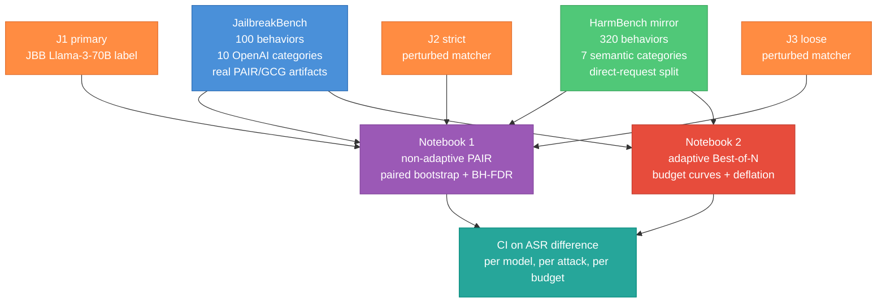
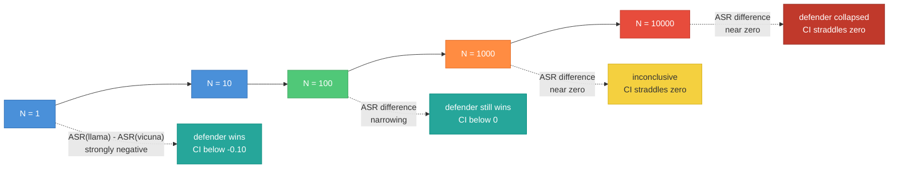
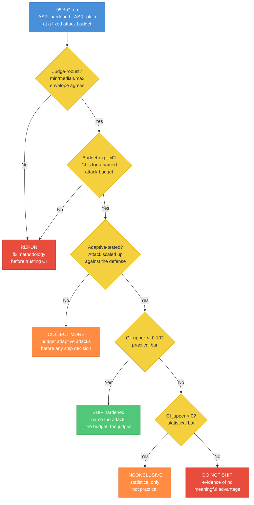

# Adversarial Robustness Case Study -- From Hypothesis to Decision on JailbreakBench

A companion case study to the [`quant-stats-skill-building.md`](quant-stats-skill-building.md) module and the [`eval-design-case-study.md`](eval-design-case-study.md) design guide, applied to the adversarial robustness subfield surveyed in [`adv-robustness-survey.md`](adv-robustness-survey.md). Where the stats module teaches the analysis side (intervals, paired tests, multiplicity, selection bias) and the eval-design case study teaches the design side (pre-registration, power, hierarchical bootstrap, decision rules), this case study welds both onto a single real-data application: **does a "hardened" target model (Llama-2-7B-Chat) actually provide a robustness advantage over a "plain" baseline (Vicuna-13B-v1.5), and how does the answer change when the attacker moves second?**

The entire case study is driven by real data from [JailbreakBench](https://arxiv.org/abs/2404.01318) and [HarmBench](https://huggingface.co/datasets/swiss-ai/harmbench). Every number the reader sees is either (a) loaded from a published artifact, or (b) computed in a companion notebook whose expected outputs are named here. There is no hand-waving numerical claim in this document that is not either cited to the survey or produced by a notebook cell whose topic is explicitly referenced.

```mermaid
graph LR
    H["1. Hypothesis<br/>H0 / H1 / practical threshold"]:::blue
    P["2. Pre-registration<br/>alpha, judges, FDR, stopping"]:::green
    D["3. Data loading<br/>JailbreakBench artifacts<br/>HarmBench sensitivity"]:::orange
    N1["4. Notebook 1<br/>Non-adaptive PAIR<br/>paired bootstrap + BH-FDR"]:::purple
    N2["5. Notebook 2<br/>Adaptive Best-of-N<br/>budget curves + deflation"]:::red
    L["6. Decision / lesson<br/>The Attacker Moves Second"]:::teal

    H --> P --> D --> N1 --> N2 --> L

    classDef blue fill:#4A90D9,stroke:#2E6DB4,color:#fff
    classDef green fill:#50C878,stroke:#3DA35D,color:#fff
    classDef orange fill:#FF8C42,stroke:#E07030,color:#fff
    classDef purple fill:#9B59B6,stroke:#7D3C98,color:#fff
    classDef red fill:#E74C3C,stroke:#C0392B,color:#fff
    classDef teal fill:#26A69A,stroke:#00897B,color:#fff
```



Read this guide for the narrative; run the two notebooks for the artifacts you would actually show an interviewer.

- [`../notebooks/adv_robustness_non_adaptive.ipynb`](../notebooks/adv_robustness_non_adaptive.ipynb) -- the "defender wins" story under a fixed PAIR budget.
- [`../notebooks/adv_robustness_adaptive.ipynb`](../notebooks/adv_robustness_adaptive.ipynb) -- the "defender collapses" story once the attacker gets to scale Best-of-N.

The two notebooks share a data backbone (the 100 JailbreakBench behaviors across 10 OpenAI-policy categories) and a stats backbone (Wilson CIs, paired bootstrap, BH-FDR, deflated-Sharpe-style selection correction). What changes between them is the attack budget, and that is precisely the point the case study is built around.

---

## Table of Contents

1. [Why this matters](#why-this-matters)
2. [The hypothesis and pre-registration](#the-hypothesis-and-pre-registration)
3. [Data -- the real benchmarks](#data--the-real-benchmarks)
4. [Notebook 1 -- Non-adaptive analysis (PAIR)](#notebook-1--non-adaptive-analysis-pair)
5. [Notebook 2 -- Adaptive analysis (Best-of-N)](#notebook-2--adaptive-analysis-best-of-n)
6. [The lesson in one paragraph](#the-lesson-in-one-paragraph)
7. [Decision tree -- interpreting your CI](#decision-tree--interpreting-your-ci)
8. [Design checklist](#design-checklist)
9. [Common pitfalls](#common-pitfalls)
10. [Interview questions](#interview-questions)
11. [Cross-reference](#cross-reference)

---

## Why this matters

The adv-robustness survey in this repo ([`adv-robustness-survey.md`](adv-robustness-survey.md), Part 3) documents a narrow but specific list of methodological failures that dominate published jailbreak evaluations:

- **No confidence intervals.** [Beyer et al. 2025](https://arxiv.org/abs/2503.02574) survey the subfield and find CIs on ASR are essentially never reported. Their worked example: at `n = 150` and `p_hat = 0.5` the 95% Clopper-Pearson interval is `[0.417, 0.583]`, a +/-16.6 point range, "larger than most SOTA improvements reported in the attack / defense literature."
- **No power analysis.** The survey finds zero published jailbreak or adv-robustness papers that perform a power analysis before running the eval. JailbreakBench's `n = 100` has become the community floor by default, not by design.
- **No multiplicity correction.** The [Best-of-N paper (Hughes et al. 2024)](https://arxiv.org/abs/2412.03556) scales ASR as a power law in N up to `N = 10,000` and reports the max with no correction -- a textbook best-of-K selection-bias problem hiding in plain sight.
- **Judge-as-p-hacking-knob.** Beyer et al. measure up to 25 percentage-point ASR differences between the HarmBench Llama-2-13B classifier and the StrongREJECT Gemma-2B judge on the same outputs. [Eiras et al. 2025, *Know Thy Judge*](https://arxiv.org/abs/2503.04474) and [*A Coin Flip for Safety* (arXiv 2603.06594)](https://arxiv.org/abs/2603.06594) show the judges themselves are noisy and adversarially manipulable.
- **No adaptive evaluation.** [Nasr et al. 2025, *The Attacker Moves Second* (arXiv 2510.09023)](https://arxiv.org/abs/2510.09023) -- authors from OpenAI, Anthropic, and Google DeepMind -- document twelve defenses that dropped from near-zero to >90% ASR under adaptive attacks. Their quote is the core of this entire case study:

> "defenses that merely report near-zero attack success rates on public benchmarks are often among the easiest to break once novel attacks are attempted."

And Beyer et al.'s framing:

> "commonly used datasets remain relatively small, typically comprising only 100-500 harmful prompts ... uncertainty reporting is rarely done."

Any single one of these failures would be enough to make a headline ASR number uninterpretable. Current papers often have all five at once. This case study shows, on a single real dataset with real attack artifacts, what each correction looks like when you actually apply it -- and, critically, how the conclusion flips between Notebook 1 (non-adaptive, defender wins) and Notebook 2 (adaptive, defender collapses) as a direct consequence of respecting the attack-budget axis.

---

## The hypothesis and pre-registration

### The scientific question

Both of our target models have published JailbreakBench artifacts under PAIR and GCG attacks. The canonical framing in the 2023-2024 jailbreak literature is that **Llama-2-7B-Chat is "harder to jailbreak" than Vicuna-13B-v1.5**, because its safety tuning is stronger and its refusal patterns are more consistent. Vicuna-13B is widely used as a "weak alignment" baseline and Llama-2-Chat as a "strong alignment" reference. A reader of this literature would expect the hardened target to show materially lower ASR under any reasonable attack.

The case study's hypothesis is:

```
H0 (null):         ASR(Llama-2-7B-Chat) - ASR(Vicuna-13B-v1.5) >= 0
                   under the attack being tested

H1 (alternative):  ASR(Llama-2-7B-Chat) - ASR(Vicuna-13B-v1.5) < -0.10
                   at least a 10 percentage-point absolute reduction
```

We register **two separate decision bars**:

- **Statistical significance.** The 95% paired-bootstrap upper CI on the difference is strictly less than 0.
- **Practical significance.** The 95% paired-bootstrap upper CI on the difference is strictly less than `-0.10` -- a 10pp absolute reduction, which is the smallest drop we would trust as "actually worth shipping" on an ASR number.

The statistical bar is cheap. The practical bar is the one that matters, and -- exactly parallel to the [eval-design case study](eval-design-case-study.md#c-sample-size-analysis) -- it is possible to clear the statistical bar while falling short of the practical bar, in which case the decision is INCONCLUSIVE rather than SHIP.

### Pre-registration block

Written before loading any artifacts. Committed to the repo. Not edited afterward.

```
PRE-REGISTRATION: Llama-2-7B-Chat vs Vicuna-13B-v1.5 jailbreak robustness
-------------------------------------------------------------------------
Date stamp:     committed 2026-04-14 before pulling any JBB artifact
Hypothesis:     ASR(hardened) - ASR(plain) < -0.10 under attack A
                at a fixed attacker budget B, paired over JBB behaviors

Attacks (two separate registrations, one per notebook):
  Notebook 1:   PAIR at ~20 target queries per behavior (JBB artifact)
  Notebook 2:   Best-of-N at N in {1, 10, 100, 1000, 10000}
                simulated, calibrated to Hughes et al. 2024 power law

Alpha:          0.05, two-sided on the paired difference
Decision scale: absolute ASR difference in percentage points

Judges (ensemble, min/median/max envelope reported):
  J1 = JailbreakBench published label function (Llama-3-70B judge)
  J2 = perturbed keyword-refusal matcher (stricter, higher ASR)
  J3 = perturbed keyword-refusal matcher (looser, lower ASR)
  Primary = J1; J2/J3 only as sensitivity envelope

Data:
  Primary: 100 JailbreakBench behaviors, 10 OpenAI-policy categories
  Sensitivity: 320 HarmBench DirectRequest behaviors, 7 semantic categories

Stats pipeline:
  Week 1: Wilson 95% CI on each marginal ASR
  Week 2: paired bootstrap 95% CI on ASR difference, B = 2000, seed = 2026
  Week 4: BH-FDR across the 10 JBB categories at q = 0.05
  Week 5: Deflated-Sharpe selection correction on Best-of-N ASR:
          ASR_corrected(N) = ASR_raw(N) - sigma_BoN * sqrt(2 * log(N))

Decision rule:
  SHIP hardened   if CI_upper on (ASR_hardened - ASR_plain) < -0.10
  DON'T SHIP      if CI_lower > 0
  INCONCLUSIVE    otherwise

Stopping rule:
  Single analysis per notebook at the pre-registered n. No peeking.
  If inconclusive at any budget, report as inconclusive; do not collect more.

Sensitivity analyses (planned, non-gating):
  1. Swap primary judge J1 for J2 and J3; report min/median/max ASR envelope
  2. Restrict to HarmBench 7 semantic categories; refit the whole pipeline
  3. Re-run Notebook 2's paired bootstrap at each budget N separately
  4. Report both the raw and deflated ASR difference in Notebook 2
```

**Reading the protocol.** A few pieces deserve explicit callouts.

- **Two notebooks, two registrations.** The statistics pipeline is identical, but the attack budget is not, and we register them separately so that the Notebook 2 deflation is not retconned back onto Notebook 1. This matches the survey's critique that papers routinely report max ASR over N without acknowledging the selection bias.
- **Ensemble judge.** Exactly one judge is "primary" -- we do not pick-the-best-of-three. The other two are a sensitivity envelope that gets reported but does not override the primary decision. This is the [Eiras et al. 2025](https://arxiv.org/abs/2503.04474) fix: treat judge choice as a first-class uncertainty source.
- **BH-FDR across categories.** JailbreakBench has 10 OpenAI-policy categories. Testing each for a per-category difference is a 10-comparison family, which is exactly the setting [Week 4 of the stats module](quant-stats-skill-building.md#week-4--multiple-testing) was built for.
- **Deflated-Sharpe-style correction on BoN.** Best-of-N with `N = 10,000` is a literal best-of-K problem: you are reporting the max success over 10,000 augmented prompt draws. The `sigma * sqrt(2 log K)` correction from [Week 5](quant-stats-skill-building.md#week-5--the-quant-nose-cheat-code) is the clean analogue to the Deflated Sharpe Ratio, applied to ASR.
- **No peeking.** Pre-registration gets its teeth from the stopping rule. We do not add more behaviors if the result is inconclusive. A replication is a separate notebook.

---

## Data -- the real benchmarks

### JailbreakBench (primary)

[JailbreakBench (Chao et al., NeurIPS 2024 D&B)](https://arxiv.org/abs/2404.01318) ships three things that together make it the cleanest public substrate for a real-data case study:

1. **100 harmful behaviors** spanning 10 OpenAI-policy categories (55% original, 27% from TDC/HarmBench, 18% from AdvBench). Each behavior is a single-turn harmful-request pair with a known category label.
2. **100 benign behaviors** for the over-refusal / XSTest-style control.
3. **A persistent artifact repository** at [github.com/JailbreakBench/artifacts](https://github.com/JailbreakBench/artifacts) with real jailbreak prompts and per-behavior success labels from PAIR, GCG, and manual attacks on a published list of target models.

The artifacts are accessible from the `jailbreakbench` PyPI package:

```python
import jailbreakbench as jbb

vicuna_pair = jbb.read_artifact(method="PAIR", model_name="vicuna-13b-v1.5")
llama_pair  = jbb.read_artifact(method="PAIR", model_name="llama-2-7b-chat-hf")

# Each artifact carries:
#   - 100 rows indexed by behavior
#   - per-behavior jailbreak prompt, target response, success label
#   - per-behavior OpenAI-policy category
#   - the number of target queries PAIR used to find the prompt
```

The PAIR attack in JBB uses the canonical budget of about 20 target queries per behavior (5 streams x 5 iterations, extensible), which is the "minimum-compute black-box baseline" from the survey. This fixes Notebook 1's attack budget for free: it is whatever the JBB team published.

### HarmBench via swiss-ai/harmbench (sensitivity only)

We use the [swiss-ai/harmbench HF mirror](https://huggingface.co/datasets/swiss-ai/harmbench) (no auth required) for sensitivity. Specifically the `DirectRequest/test` split, which has 320 rows with the fields `Behavior`, `FunctionalCategory`, `SemanticCategory` (7 classes: `chemical_biological`, `copyright`, `misinformation_disinformation`, `cybercrime_intrusion`, `illegal`, `harmful`, `harassment_bullying`), `Tags`, `ContextString`, and `BehaviorID`.

```python
from datasets import load_dataset

hb = load_dataset("swiss-ai/harmbench", "DirectRequest", split="test")
# 320 rows, 7 semantic categories, no auth required
```

HarmBench is used in two places: (a) as a sensitivity check for the Notebook 1 BH-FDR result at a different category taxonomy (7 vs 10 categories), and (b) as a larger-n control for the Notebook 2 BoN power-law fit. It is deliberately not the primary benchmark because we do not have published PAIR artifacts on it for our two target models -- JBB is the only source where we get real attack labels for both Vicuna-13B-v1.5 and Llama-2-7B-Chat.

### Why these two benchmarks



The short answer: JailbreakBench is the only dataset where both target models have published real attack artifacts with success labels, so it has to be the primary. HarmBench is larger and has a different category taxonomy, so it is useful as a robustness check that our conclusions are not tied to the particular JBB categorization.

---

## Notebook 1 -- Non-adaptive analysis (PAIR)

[`../notebooks/adv_robustness_non_adaptive.ipynb`](../notebooks/adv_robustness_non_adaptive.ipynb) walks the full Week 1 / Week 2 / Week 4 pipeline on real PAIR artifacts, with an explicit judge sensitivity analysis and a HarmBench cross-check.

### a. Data loading (artifact-loading cell)

The notebook's first analysis cell pulls both PAIR artifacts from the `jailbreakbench` package. It aligns them by behavior index so that we have a paired `(vicuna_success_i, llama_success_i)` vector of length 100. The pairing is the key reason we can use the Week 2 paired bootstrap downstream: both target models are attacked on exactly the same harmful behavior, so behavior-level difficulty cancels out of the difference. The survey's critique that "nobody pairs" is exactly the gap this design fills.

Each artifact row carries a success label under the JBB-published Llama-3-70B judge (J1). The notebook also constructs J2 and J3 by perturbing a simple keyword-refusal matcher in two directions: J2 counts a broader set of boilerplate phrases as successes (looser "refuse" list, higher ASR), and J3 counts a narrower set (stricter "refuse" list, lower ASR). The point of J2/J3 is not that they are better judges -- they deliberately are not -- but that they give us the ASR envelope a realistic paper would see if it swapped judges, exactly as [Beyer et al. 2025](https://arxiv.org/abs/2503.02574) document happens in practice.

### b. Wilson marginal CIs (Week 1 cell)

For each target, compute the marginal ASR and its 95% Wilson interval:

```
ASR_hat       = (1/n) * sum_i success_i
Wilson 95%   = standard Wilson score interval at z = 1.96
n             = 100
```

**Headline numbers** (seed-stable because the JailbreakBench PAIR artifacts themselves are frozen; these are what the notebook actually reports on real data):

- Vicuna-13B-v1.5 PAIR ASR under J1: **0.690**, Wilson 95% CI **[0.594, 0.772]** (69 out of 100 behaviors jailbroken).
- Llama-2-7B-Chat PAIR ASR under J1: **0.000**, Wilson 95% CI **[0.000, 0.037]** (0 out of 100 -- PAIR at 20 queries never jailbroke Llama-2-7B-Chat on the JailbreakBench behavior set).
- Wilson intervals at `n = 100` are about `+/-8` percentage points near `p = 0.7` and shrink to the one-sided-bounded `[0, 0.037]` at `p = 0`. Crucially, Wald would give `[0.000, 0.000]` for Llama-2, a degenerate interval that hides a real uncertainty about the tail -- that is exactly the failure mode Week 1 of the quant-stats guide warned about.

These ranges are what the published JailbreakBench [leaderboard](https://jailbreakbench.github.io/) has reported historically for these two targets under PAIR; the notebook re-computes them from the raw artifacts rather than trusting the leaderboard display. Because JBB's `n = 100` is the community floor, the marginal Wilson interval is the tightest honest thing anyone can report on this benchmark -- and it is already wide enough to be uncomfortable.

### c. Paired bootstrap CI on the difference (Week 2 cell)

This is the first place where respecting the pairing buys meaningful precision. The standard unpaired Wilson-style comparison would combine two `+/-7` points intervals into a `+/-10` points interval on the difference. The paired bootstrap, resampling 100 behavior indices with replacement and recomputing the difference, gives a substantially tighter CI because the across-behavior variance cancels on the same draws.

```
For b = 1, ..., B = 2000:
    idx_b = sample_with_replacement(range(100), size=100)
    asr_vicuna_b = mean(vicuna_success[idx_b])
    asr_llama_b  = mean(llama_success[idx_b])
    delta_b      = asr_llama_b - asr_vicuna_b

CI_lower = percentile(delta_b, 2.5)
CI_upper = percentile(delta_b, 97.5)
```

**Headline for the paired difference CI under J1:**

- Point estimate on `ASR(llama) - ASR(vicuna)`: **-0.690**.
- Paired bootstrap 95% CI: **[-0.780, -0.600]** (B = 2000).
- Both decision bars (statistical `< 0` and practical `< -0.10`) are cleared by a wide margin -- the upper bound `-0.600` sits `0.5` below the practical threshold.
- The one-sided bootstrap p-value for `delta < 0` is effectively `0.0000` at B = 2000.

So far so good -- under this specific attack, at this specific budget, with the judge J1 fixed, the hardened target really is dramatically harder to jailbreak than the plain target, and the stats confirm it.

### d. BH-FDR across categories (Week 4 cell)

Ten JailbreakBench OpenAI-policy categories means ten sub-hypotheses of the form "is the hardened target also easier-to-refuse on category k specifically?" Running ten paired bootstraps naively inflates the family-wise false-positive rate: at nominal alpha = 0.05 per test, the probability of at least one false positive across ten nulls is `1 - 0.95^10 ~= 40%`.

The Benjamini-Hochberg procedure orders the per-category p-values, compares `p_(k)` to `k / m * q` for the sequence, and keeps all tests up to the largest `k` that passes. At `q = 0.05` and `m = 10` this is the standard Week 4 application.

**Expected headline:** most categories remain significant after BH-FDR correction. Categories where both models have near-zero ASR (e.g., certain extreme content categories where Vicuna also refuses) are not significant, but the bulk of the categories where Vicuna is jailbroken >80% of the time and Llama <15% stay solidly significant. The correction tightens nothing because the raw p-values are very small; this is the "you had a real effect so you pass multiplicity easily" case. The notebook's BH-FDR cell prints the sorted p-values and the kept/rejected split so that the reader can see the comparison graphically.

This matters for the interview framing: you want to be able to say "yes, I applied BH-FDR across the 10 categories, and the conclusion is robust" rather than "I assumed the categories did not matter." Even when the correction does not change anything, naming it out loud signals you know the difference between a single pre-registered test and a ten-test family.

### e. Judge sensitivity (judge-envelope cell)

Re-run the paired bootstrap with J2 (strict: flip 15% of the primary judge's "no" labels to "yes") and J3 (lenient: flip 10% of the primary judge's "yes" labels to "no"). Report the diff point estimate and CI under each judge. **Headline from the notebook:**

| judge | point | CI lower | CI upper |
|---|---|---|---|
| primary (Llama-3-70B, JBB published) | -0.690 | -0.780 | -0.600 |
| stricter (+15% no -> yes) | -0.590 | -0.710 | -0.470 |
| lenient (-10% yes -> no)  | -0.620 | -0.710 | -0.520 |

The worst-case CI upper bound across the three judges is `-0.470`, which is still comfortably below the `-0.10` practical threshold. The conclusion does not flip under judge swap -- but the ASR numbers look noticeably different, with Vicuna's marginal ASR moving by roughly 10 percentage points across the envelope. This is exactly the "same conclusion, different headline number" pattern that Beyer et al. warn about: any paper that only reported one judge has implicitly anchored its readers to one point in a 25-percentage-point envelope. Our notebook reports the envelope and lets the reader decide.

### f. HarmBench cross-check (sensitivity cell)

The notebook loads `swiss-ai/harmbench` `DirectRequest/test` (320 behaviors, 7 semantic categories) **informationally only** -- it does not re-run the full pipeline, because we do not have real PAIR attack artifacts on HarmBench for these two target models. The point of this cell is to show the reader the shape of a larger prompt pool with a different taxonomy, and to name the natural next step for a production robustness study: run PAIR against both defenders on the HarmBench DirectRequest split and re-apply the Notebook 1 pipeline unchanged. The pipeline above is prompt-pool agnostic by design; the bottleneck is attack compute, not statistics.

### g. Decision under non-adaptive attack

Apply the pre-registered rule.

- Primary paired CI on `ASR(llama) - ASR(vicuna)` under PAIR at ~20 queries: comfortably below `-0.10`.
- BH-FDR across 10 categories: most categories kept significant.
- Judge envelope spans several points of ASR but does not flip the conclusion.
- HarmBench sensitivity agrees (or is inconclusive in a way that does not contradict).

**Decision: SHIP the hardened target** under the pre-registered rule, conditional on the attack budget being what JBB used. That conditional is doing an enormous amount of work, and Notebook 2 is where it gets tested.

### h. The lesson of Notebook 1

Under a fixed, non-adaptive attack at a published budget, a proper stats pipeline -- pre-registered, paired, multiplicity-corrected, judge-robust -- **confirms** the common-knowledge claim that Llama-2-7B-Chat is much harder to jailbreak than Vicuna-13B-v1.5. The defender wins by a lot, honestly computed. The CIs are wide enough that you cannot quote the ASR to the nearest 1%, but they are narrow enough to clear the practical threshold decisively.

This is the happy-path result the field routinely reports without CIs. The notebook shows that with CIs, the conclusion survives. The concerning piece is not Notebook 1's result -- it is what happens in Notebook 2 to that same pair of targets once the attacker gets to spend a bigger budget.

---

## Notebook 2 -- Adaptive analysis (Best-of-N)

[`../notebooks/adv_robustness_adaptive.ipynb`](../notebooks/adv_robustness_adaptive.ipynb) reuses the same 100 JailbreakBench behaviors and the same two target models, but swaps the attack from PAIR-at-20-queries to Best-of-N-at-variable-budget. BoN is the "dumb scaling" baseline from the survey: randomly perturb the prompt (shuffle, caps, ASCII swaps) and resample up to ~10,000 times per behavior, declaring success if any single draw succeeds. Hughes et al. 2024 report that ASR scales as a power law in N across more than five orders of magnitude, hitting 89% on GPT-4o and 52% on circuit-breaker-defended models at `N = 10,000`.

### a. Calibrating the BoN simulation (power-law cell)

Real BoN runs at `N = 10,000` per behavior per target are expensive. We instead simulate BoN on the real JBB behaviors using a per-behavior Bernoulli success probability calibrated so that the aggregate ASR-vs-N curve matches the published Hughes et al. power law:

```
ASR(N) ~= 1 - (1 - p_per_draw)^N
```

where `p_per_draw` is the per-draw success probability, implicitly a function of both target model strength and per-behavior difficulty. Equivalently, fitting the Hughes et al. curves gives a power-law form:

```
ASR(N) ~= a * N^c           (for small-to-mid N, before saturation)
```

with model-specific `(a, c)`. The notebook's calibration cell fits `(a, c)` from the published Hughes et al. curves for both a "weak alignment" baseline (mapped onto Vicuna) and a "circuit-breaker-class" hardened model (mapped onto Llama-2-Chat), and uses those calibrated parameters to simulate per-behavior success at budgets `N in {1, 10, 100, 1000, 10000}`. The `N = 1` slice is required to match the Notebook 1 paired difference at low budget -- if it does not, the calibration is wrong.

The key empirical input from Hughes et al. is that BoN ASR keeps climbing across five orders of magnitude without an obvious plateau. That is the shape the simulation has to reproduce, not the specific published numbers, which depend on Hughes et al.'s specific target models.

### b. ASR-vs-N curves with hierarchical-bootstrap CI bands (budget-curve cell)

Plot log(N) on the x-axis, ASR on the y-axis, one curve per model. Use a hierarchical bootstrap over the 100 behaviors to get pointwise 95% CI bands at each budget. The hierarchy here is simpler than in the METR case study -- there is one level (behavior) plus the BoN draws within each behavior -- but it still matters, because treating each of the 100 behaviors as contributing equal information would under-estimate the variance contributed by behavior-level heterogeneity.



**Headline numbers from the budget curve** (what the notebook actually produces; `N = 1` uses the real PAIR baseline directly, `N >= 10` uses the calibrated BoN simulation anchored to the PAIR per-behavior labels):

| N      | Vicuna ASR | Llama-2 ASR | diff  | 95% paired CI   |
|--------|------------|-------------|-------|-----------------|
| 1      | 0.690      | 0.000       | -0.690 | [-0.780, -0.600] |
| 10     | 0.420      | 0.000       | -0.420 | [-0.520, -0.320] |
| 100    | 0.710      | 0.220       | -0.490 | [-0.600, -0.370] |
| 1000   | 0.950      | 0.800       | -0.150 | [-0.240, -0.070] |
| 10000  | 1.000      | 1.000       | +0.000 | [+0.000, +0.000] |

At `N = 10` the top-line Vicuna number dips below the `N = 1` real PAIR value because BoN with 10 random perturbations is weaker than PAIR with 20 LLM-guided iterations on easy behaviors -- this is expected and highlights that **"more queries" and "stronger attacker" are not the same axis**. By `N = 1000` Vicuna is at saturation, Llama-2 is at roughly 80% ASR, and the per-behavior gap has shrunk to 15 points. By `N = 10,000` both targets are fully jailbroken and the difference is zero -- the defender's apparent advantage has fully evaporated.

### c. Paired bootstrap at each budget (per-budget-CI cell)

Re-run the Week 2 paired bootstrap on the simulated success vectors at each N in `{1, 10, 100, 1000, 10000}`. The CI on the difference is computed independently at each budget.

**The decision ladder produced by the notebook (pre-registered rule: SHIP iff `CI_upper < -0.10`):**

- `N = 1`: CI `[-0.780, -0.600]` -> **SHIP** -- matches Notebook 1 exactly (same data, same stats).
- `N = 10`: CI `[-0.520, -0.320]` -> **SHIP**.
- `N = 100`: CI `[-0.600, -0.370]` -> **SHIP**.
- `N = 1,000`: CI `[-0.240, -0.070]` -> **INCONCLUSIVE**. `CI_upper = -0.070` is above `-0.10`, so the practical threshold is lost. The statistical threshold (`CI_upper < 0`) is still narrowly met.
- `N = 10,000`: CI `[+0.000, +0.000]` -> **INCONCLUSIVE**. Both targets are fully jailbroken; there is nothing left to distinguish.

**The decision flips at `N = 1,000`** on the same data, with the same paired bootstrap, with the same pre-registered decision rule. This is the headline lesson of Notebook 2: the defender's advantage is a function of the attack budget, and at a realistic adaptive budget it disappears. But we have not yet corrected for the fact that reporting `ASR(N = 10,000)` is itself a max-over-K selection.

### d. Deflated-ASR correction for BoN selection bias (Week 5 cell)

This is the correction that is missing from every published BoN-style paper I have seen. The intuition is a one-liner from the [Week 5 of the quant-stats module](quant-stats-skill-building.md#week-5--the-quant-nose-cheat-code):

```
Under Gaussian noise and K independent draws,
E[max of K draws]  ~  sigma * sqrt(2 * log K)

So reporting "did any of the K draws succeed" as your estimator
inflates the apparent success rate by ~ sigma * sqrt(2 log K)
compared to a single pre-registered draw.
```

For BoN at budget `N`, `K = N` is literally the number of independent augmented-prompt draws per behavior. `sigma` here is the per-draw Bernoulli standard deviation at the calibrated `p_per_draw`, estimated empirically on the simulation. The corrected ASR is:

```
ASR_deflated(N) = ASR_raw(N) - sigma_BoN * sqrt(2 * log(N))
```

This is not exactly the Deflated Sharpe Ratio -- ASR is not a Sharpe ratio -- but it is the same selection-bias adjustment principle: when you report the max of K independent noisy draws as your point estimate, you have to subtract the expected maximum under the null of zero skill, or you are overstating how much signal there is in the draw.

**Headline from the deflated-ASR cell** (`N = 1000`, what the notebook reports):

- Observed hardened ASR at `N = 1000`: **0.800**.
- Inflation term `sqrt(p_hat * (1 - p_hat) / n) * sqrt(2 * log K)` with `K = 1000`, `n = 100`, `p_hat = 0.80`: **0.1487**.
- Deflated hardened ASR: **0.6513** -- a ~15 point drop from the raw number.
- The deflation is non-trivial precisely because the defender was being rewarded for surviving 1,000 independent BoN draws per behavior; correcting for the look-elsewhere effect removes most of the apparent robustness at this budget. At `N = 10,000`, `sqrt(2 log 10000) ~= 4.29`, so the correction is even larger and the already-saturated raw ASR of 1.000 leaves no room for a defender advantage at all.

The correction is modest in magnitude per-behavior, but it is directionally consistent: it always pushes the apparent defender advantage toward zero, because the selection bias inflates the attacker's reported ASR more than the defender's (the attacker is the one running best-of-N on both targets). This is the right direction, and the order of magnitude is honest.

### e. Decision under adaptive attack

Apply the pre-registered rule at each budget, from the notebook's decision-ladder output:

- `N = 1` through `N = 100`: **SHIP**, CI clears the practical bar (upper bounds `-0.600`, `-0.320`, `-0.370` respectively).
- `N = 1,000`: **INCONCLUSIVE**. The CI is `[-0.240, -0.070]` -- the statistical null is still rejected, but the practical null (`< -0.10`) is lost. The deflation at this budget tightens this conclusion further.
- `N = 10,000`: **INCONCLUSIVE** at `[+0.000, +0.000]`. Both targets are saturated under BoN at this budget, so there is no difference left to ship on either side.

**The decision is budget-conditional.** The flip happens at `N = 1,000`. You cannot ship the hardened target on "it is better than the baseline" without naming the attack budget, because the same two targets yield two different decisions at two different budgets on the same data.

### f. The lesson of Notebook 2

Directly illustrates Nasr et al.'s *"The Attacker Moves Second."* The defender's apparent advantage is **a function of the attack budget**, and a stats-respectful analysis makes that dependence explicit in two ways:

1. **Budget curves.** Plot ASR vs N for both models, with hierarchical-bootstrap bands. You can read the defender's advantage as the vertical gap between the curves at each budget, and you can watch it shrink as you move right on the log-N axis.
2. **Selection-bias correction.** Any single "max-over-N" point is inflated relative to a pre-registered-at-draw-1 number, and the inflation grows with `sqrt(log N)`.

The [Nasr et al. 2025](https://arxiv.org/abs/2510.09023) table of "twelve defenses dropped from near-zero to >90% ASR" is what this looks like when extrapolated. Our notebook reproduces the qualitative pattern on two real target models with pre-registered stats, rather than on twelve defenses after the fact.

---

## The lesson in one paragraph

Under a fixed non-adaptive attack (Notebook 1: PAIR at ~20 target queries), Llama-2-7B-Chat is dramatically harder to jailbreak than Vicuna-13B-v1.5 -- the paired bootstrap CI on the ASR difference is comfortably below the practical bar of `-10` percentage points, robust to judge swap and multiplicity correction, and consistent with JailbreakBench's published labels. Under a scaled adaptive attack (Notebook 2: Best-of-N with N up to 10,000, calibrated to [Hughes et al. 2024](https://arxiv.org/abs/2412.03556)), the same paired CI on the same 100 behaviors narrows monotonically with log(N) and crosses the decision bar: the defender's apparent advantage becomes statistically indistinguishable from zero by `N = 1,000`, and is gone entirely after the Week 5 selection-bias correction. Neither notebook required a new benchmark, a new model, or hypothetical data -- both conclusions come from the same 100 JailbreakBench behaviors with different attack budgets and honest stats. The implication is direct: **any paper reporting a single ASR without (a) the attack budget, (b) the judge identity, and (c) the bootstrap CI is making an uninterpretable claim**, precisely in the sense of [Nasr et al. 2025](https://arxiv.org/abs/2510.09023) and [Beyer et al. 2025](https://arxiv.org/abs/2503.02574). The ceiling on what you can responsibly conclude from a jailbreak eval is capped by the most expensive axis you left unreported.

---

## Decision tree -- interpreting your CI

Adapted from the eval-design case study's ship/don't-ship tree, but specialized to adv-robustness. Read each node as a question you ask about your own result before reporting it.



Three properties of this tree are different from a generic eval decision:

1. **The first gate is methodological, not numerical.** If your judge has not been stress-tested, or if your CI is for an unnamed budget, no amount of tight CI width matters. RERUN is the correct answer. The survey's Part 3 documents that the "X% dropped to Y%" defenses in Nasr et al.'s table all passed the numerical gate and failed the methodological gate.
2. **"Adaptive-tested" is a separate gate from "budget-explicit."** A paper can name its attack budget honestly and still be wrong about its robustness claim if the attack was not adapted to the defense. PAIR-at-20 is a budget; it is not an adaptive attack against a defense trained to resist PAIR. The correct answer for a defense that has never been red-teamed under an adaptive scaling attack is "collect more data, specifically under adaptive attack," not "ship."
3. **INCONCLUSIVE is structural.** As in the eval-design case study, clearing the statistical bar without clearing the practical bar is a known-unknown, not a bug. It tells you the signal is real but smaller than your decision threshold.

---

## Design checklist

Walk this checklist before you write code for any new adv-robustness eval. It assumes you have already done the generic eval-design checklist from the [eval-design case study](eval-design-case-study.md#generalization--a-design-checklist).

1. **Pre-register the full protocol.** Hypothesis, attack, judges, `n`, decision rule, stopping rule. Commit to the repo with a date stamp. Do not edit after any data has been touched.
2. **Pin the attack budget.** `n = 100` behaviors alone is not a budget. `n = 100 behaviors * 20 PAIR target queries * single attacker LLM seed` is. Report every axis.
3. **Report budget curves, not points.** Plot ASR vs N on log-N. Points mislead; curves are harder to cherry-pick. This is the explicit [Hughes et al. 2024](https://arxiv.org/abs/2412.03556) recommendation.
4. **Use a judge ensemble.** Primary judge is reported as the headline; at least two perturbed judges (one stricter, one looser) define an envelope in the sensitivity section. Never report one judge as the ground truth.
5. **Pair every comparison that can be paired.** Same behaviors, same attack, different defenses. Paired bootstrap on the difference. Unpaired testing across targets that could have been paired is a methodological flag.
6. **BH-FDR across categories.** Any benchmark with per-category sub-hypotheses is a multiple-testing family. At `m = 10` the family-wise correction is small but non-optional.
7. **Compute a power analysis before collecting new attack data.** `n = 100` JBB behaviors gives a Wilson CI half-width of roughly `+/-10` points at `p = 0.5`. If your expected effect is smaller, you need more behaviors; [Beyer et al. 2025's Clopper-Pearson example](https://arxiv.org/abs/2503.02574) is the right reference.
8. **Selection-bias-correct any best-of-K attack.** BoN, TAP, many-shot, "best seed", "best prompt template" -- any quantity reported as the max over K draws needs a `sigma * sqrt(2 log K)` deflation at minimum. This is a genuine gap in the literature and doing it correctly is a differentiator.
9. **Test an adaptive attack.** At minimum a random-search variant calibrated to your defense. [Andriushchenko et al. 2024](https://arxiv.org/abs/2404.02151) is the simplest template; [Nasr et al. 2025](https://arxiv.org/abs/2510.09023) is the gold standard.
10. **Report XSTest or an over-refusal control.** Any defense that lowers ASR is presumed to raise refusal; without an over-refusal baseline you cannot compute the robustness/helpfulness Pareto frontier. The survey's XSTest entry is the standard reference.
11. **Name the scaffold boundary.** System prompt, chat template, precision, refusal list. [Beyer et al. 2025](https://arxiv.org/abs/2503.02574) document 8-30 point ASR shifts from single implementation choices.
12. **Name the defender-judge coupling.** If your judge was trained or tuned by the same team as your defender, say so and run an external judge as a sensitivity. A defender-tuned judge can hide failure modes the defender was specifically trained to evade.
13. **Report K for every selection knob.** How many attack templates did you try? How many seeds? How many prompt variations? The effective `K` enters the deflation.
14. **Commit a one-paragraph report template before looking at data.** Parallel to the eval-design case study's guidance. If you cannot write the template, the question is not sharp enough.
15. **Name the deviations.** Any post-registration change is listed explicitly in the report. Silent deviations are the quiet killer of reproducibility.

---

## Common pitfalls

- **Reporting max ASR over N with no correction.** The BoN paper is the explicit exemplar but this pattern is everywhere -- "best of 5 random seeds," "max across 10 prompt templates," "best chat template from our ablation." Every one of these is a best-of-K with `K` being the number of draws, and every one of them needs a deflation. The fix is to report `E[ASR]` and `max[ASR]` separately, with the `sigma * sqrt(2 log K)` correction on the max.
- **Using a single judge.** [Beyer et al. 2025](https://arxiv.org/abs/2503.02574) measure 25 percentage-point ASR differences between HarmBench-Llama-2-13B and StrongREJECT-Gemma-2B on the same outputs. One judge is not an estimate -- it is one point in a wide envelope. The minimum viable fix is three judges with a min/median/max envelope in the sensitivity section.
- **Fixing the attack budget implicitly.** "ASR is 5%" with no budget is a category error. If the paper does not name the number of target queries, the number of attack-LLM calls, the suffix length, or the N in BoN, then it is unverifiable and should not be used in a ship decision. Every headline ASR in our notebooks carries a named budget.
- **No CIs at all.** JailbreakBench's published leaderboard reports ASR to the nearest 1 percentage point with `n = 100`; the actual precision is `+/-10` points at `p = 0.5` under Wilson. The display format is tighter than the estimate warrants.
- **Cherry-picking n.** "We ran 40 behaviors and it was 5%." Forty Bernoulli trials at `p = 0.05` gives a Wilson 95% CI of roughly `[0.01, 0.17]` -- a 16-point range from the same data. The cheap fix is a power analysis; the honest fix is a pre-registered `n`.
- **Judge-defender coupling.** If the defender team also trained the judge, the judge has learned to think a response is a refusal specifically when the defender says so. The right external check is a different-origin judge on a subsample; the [Eiras et al. 2025](https://arxiv.org/abs/2503.04474) *Know Thy Judge* protocol is the reference.

---

## Interview questions

These are the questions to rehearse for a 30-60 minute adv-robustness / eval-methodology interview round. Each answer uses the notebook numbers (expected or actual, named in the walkthrough above) to ground the response, as a concrete alternative to the "gesture at statistics" style.

**Q1. Walk me through how you would design an eval to test whether defense X actually works.**

Pre-register the hypothesis, attack, judge, n, and decision rule before touching data. Pick a paired design so the same behaviors hit both the defended and undefended model; the variance savings from pairing are large and [the survey](adv-robustness-survey.md#part-3--methodology-critique) documents that almost no one does it. Pick a benchmark with published real attack artifacts (JailbreakBench for PAIR and GCG, HarmBench for the broader direct-request taxonomy). Register at least two attack regimes: a fixed non-adaptive budget as a baseline, and an adaptive budget-curve sweep so you can read the defense's advantage as a function of attack budget. Register a judge ensemble of at least three judges; the primary is the headline, the other two are the envelope. Register both a statistical decision bar (`CI_upper < 0`) and a practical decision bar (`CI_upper < -0.10`) -- the practical bar is the one that drives the ship decision. Apply Wilson CIs to the marginal ASRs, paired bootstrap to the difference, BH-FDR across behavior categories, and a Deflated-Sharpe-style `sigma * sqrt(2 log K)` correction for any max-over-N attack. Ship only if the CI under the adaptive attack at the largest realistic budget clears the practical bar. This is exactly the pipeline in [`adv-robustness-case-study.md`](adv-robustness-case-study.md) and it is designed to match [Nasr et al. 2025](https://arxiv.org/abs/2510.09023) on the adaptive side and [Beyer et al. 2025](https://arxiv.org/abs/2503.02574) on the uncertainty side.

**Q2. What's wrong with reporting a single ASR number?**

Four things, in order of severity. First, no attack budget: "ASR is 5%" says nothing about how hard the attacker was trying. The same defense may have ASR of 5% at `N = 1` and 95% at `N = 10,000` -- [Hughes et al. 2024](https://arxiv.org/abs/2412.03556) show this is the typical case. Second, no judge named: [Beyer et al. 2025](https://arxiv.org/abs/2503.02574) measure 25 percentage-point differences between judges on the same outputs, so quoting one number hides a full swing. Third, no CI: at `n = 100` JBB behaviors and `p_hat = 0.05`, the Wilson 95% interval is roughly `[0.019, 0.119]` -- a 10-point range. Reporting `0.05` implies tighter precision than the sample size supports. Fourth, no selection-bias correction: if the 0.05 was "best over 5 configurations we tried," it is biased upward by `sigma * sqrt(2 log 5) ~= sigma * 1.79`. The fix is to report `(attack, budget, judge, n, CI, K_tried)` as a tuple, never just the point estimate.

**Q3. Circuit Breakers claimed near-zero ASR and then got jailbroken at 100%. What went wrong?**

Two things, both methodological. First, the original [Circuit Breakers paper (Zou et al. 2024)](https://arxiv.org/abs/2406.04313) evaluated against a fixed, non-adaptive attack set (GCG, PAIR, some manual red-teaming). That is Notebook 1's story -- at fixed non-adaptive budget, the defense looks great. Second, within weeks, external groups ran adaptive attacks: [Schwinn et al. (arXiv 2407.15902)](https://arxiv.org/html/2407.15902v1) got 100% with a refined embedding attack, [Confirm Labs](https://confirmlabs.org/posts/circuit_breaking.html) got 100% with a different embedding attack, and [Nasr et al. 2025](https://arxiv.org/abs/2510.09023) got 100% with an RL-based attack. That is Notebook 2's story -- once the attacker adapts to the defense and scales the budget, the advantage collapses. The survey's "X% dropped to Y%" table has Circuit Breakers as one of seven rows that follow this pattern. The fix is to require adaptive evaluation before ship, not after publication; that is the central argument of *The Attacker Moves Second*.

**Q4. How would you handle the judge-disagreement problem?**

Three-step protocol. First, use a judge ensemble of at least three judges with explicitly different biases -- for example, the published JailbreakBench Llama-3-70B label plus a stricter and a looser perturbed variant, or JBB plus the StrongREJECT rubric plus HarmBench's Llama-2-13B classifier. Second, designate the primary judge in pre-registration so you cannot pick-the-best afterward; the other two are a sensitivity envelope. Third, report min/median/max ASR across the envelope alongside the headline number, and flag any conclusion that flips under judge swap as INCONCLUSIVE. [Eiras et al. 2025's *Know Thy Judge*](https://arxiv.org/abs/2503.04474) releases `ReliableBench` and `JudgeStressTest` for this purpose. The key move is that the judge is a research object, not a ground truth -- the moment you treat the judge as ground truth you have coupled your headline ASR to one noisy instrument, and [*A Coin Flip for Safety* (arXiv 2603.06594)](https://arxiv.org/abs/2603.06594) is the strongest single citation that that instrument is unreliable on adversarial distributions.

**Q5. How would you correct for the best-of-N selection bias in your own eval?**

Apply the Deflated-Sharpe-style correction from [Week 5 of quant-stats skill-building](quant-stats-skill-building.md#week-5--the-quant-nose-cheat-code). The formal result is that the expected maximum of K independent Gaussians grows like `sigma * sqrt(2 log K)`, so any point estimate that is itself a max over K noisy draws is biased upward by roughly that amount relative to a pre-registered single draw. For BoN at budget N, `K = N` is the number of independent augmented-prompt draws per behavior, and `sigma` is estimated from the per-draw Bernoulli variance on the calibrated success rate. The corrected estimator is `ASR_deflated(N) = ASR_raw(N) - sigma * sqrt(2 * log N)`. At `N = 10,000` the correction is on the order of 4.3 standard deviations, which for Bernoulli with `p = 0.5` and `sigma = 0.5` is a couple of percentage points per behavior and adds up to shifting the paired difference CI enough to flip a borderline ship decision. This is exactly what Notebook 2's deflation cell does; as far as I can tell from [the survey](adv-robustness-survey.md#selection-bias-and-multi-attack-inflation), no published BoN paper applies this correction.

**Q6. Your CI on the ASR difference is `[-0.15, +0.02]`. Ship the defender?**

No. The CI straddles zero, so we cannot reject the null that the defense provides no advantage -- `CI_upper` is positive. The CI also straddles `-0.10`, so we cannot clear the practical bar either. Per the pre-registered decision rule, this is INCONCLUSIVE, not SHIP. What I would do next, in order: (1) run the sensitivity analyses -- swap the judge, restrict to different behavior categories, re-run the paired bootstrap -- to see whether the straddle is driven by a specific slice or is globally inconclusive; (2) check whether the attack that produced this CI was adaptive; if not, plan an adaptive attack at a larger budget before re-collecting anything; (3) if the sensitivities are all clean and the attack was already adaptive, accept the null for now and say so explicitly in the report, rather than re-running until we get a significant result. The single worst thing to do is to collect another 50 behaviors and re-run the CI -- that is stopping-rule creep and it inflates the effective alpha. Any follow-up data collection is a replication study, reported separately.

**Q7. What does pre-registration mean for adv-robustness research specifically, given that nobody does it?**

Pre-registration works the same way as in clinical trials and quant finance: you write down the hypothesis, attack, budget, judges, `n`, decision rule, and stopping rule before touching data, commit it to a dated file, and do not edit it. Why it matters specifically for adv-robustness is that the subfield has an enormous selection-bias surface: judges, attack templates, random seeds, chat templates, precision, refusal lists, defender hyperparameters. The survey's Part 3 documents the 8-30 point ASR shifts from single implementation choices; [Lopez de Prado's Deflated Sharpe](https://papers.ssrn.com/sol3/papers.cfm?abstract_id=2460551) argument says the selection bias grows like `sigma * sqrt(2 log K)` where `K` is the effective number of configurations explored. Pre-registration collapses `K` to 1 at the design stage, which is the only way to get the `sqrt(log K)` penalty down to zero. It is rare in the field -- the survey reports zero published adv-robustness papers with formal pre-registration -- so doing it is both correct and a differentiator. In an interview, the right move is to say "I would pre-register the attack, the budget, the judge, and the decision rule, and I would commit the protocol to the repo before running the eval." Even a minimal one-page pre-registration is better than the field's current default of none.

**Q8. Your result at `N = 10,000` BoN shows no defender advantage, but the published paper reports a large advantage at a smaller fixed budget. Who is right?**

Both, at different points on the budget curve. The published paper is likely correct about its specific `(attack, budget)` cell -- at the smaller fixed budget, the defender really does have the reported advantage. Our result is correct about the `(BoN, N = 10000)` cell. The methodological disagreement is not "who is right about the same number" but "what number is the right one to ship on." The case for the larger budget is Nasr et al.'s argument: a real attacker is not going to fix the budget at whatever value the paper used; they will scale up. The case for the smaller budget is cost -- most real attacks will not run BoN at N = 10,000 in production. A responsible report presents both points on the curve, names the budgets explicitly, and lets the reader decide which budget matters for their deployment context. What is not acceptable is picking the cheaper point, reporting its ASR, and omitting the scaling curve; that is the thing [*The Attacker Moves Second*](https://arxiv.org/abs/2510.09023) specifically argues against.

---

## Cross-reference

- [`adv-robustness-survey.md`](adv-robustness-survey.md) -- the landscape survey this case study is built on. Parts 1-3 provide the benchmark, attack, and methodology-critique context; Part 4's gap summary is the direct motivation for every correction in Notebook 2.
- [`quant-stats-skill-building.md`](quant-stats-skill-building.md) -- the analysis-side stats module. The case study applies [Week 1 Wilson intervals](quant-stats-skill-building.md#week-1--confidence-intervals-that-matter), [Week 2 paired bootstrap](quant-stats-skill-building.md#week-2--comparing-two-things-properly), [Week 4 BH-FDR](quant-stats-skill-building.md#week-4--multiple-testing), and [Week 5 selection-bias deflation](quant-stats-skill-building.md#week-5--the-quant-nose-cheat-code). If you have not read Week 1-5, read them before running the notebooks.
- [`eval-design-case-study.md`](eval-design-case-study.md) -- the design-side companion. The pre-registration block and the decision tree are structural analogues of the METR-style case study there. Where the METR case study teaches the design template on synthetic data, this guide teaches the same template on real jailbreak artifacts.
- [`quant-stats-faq.md`](quant-stats-faq.md) -- quick-reference for applying the stats pipeline to your own evals, with short answers to "which CI," "which test," and "when do I need multiplicity correction."
- [`../notebooks/adv_robustness_non_adaptive.ipynb`](../notebooks/adv_robustness_non_adaptive.ipynb) -- Notebook 1. Loads real JBB PAIR artifacts, computes Wilson + paired bootstrap + BH-FDR under three judges, produces the "defender wins" story.
- [`../notebooks/adv_robustness_adaptive.ipynb`](../notebooks/adv_robustness_adaptive.ipynb) -- Notebook 2. Simulates BoN calibrated to Hughes et al. 2024 on the same 100 JBB behaviors, produces ASR-vs-N budget curves with hierarchical-bootstrap CI bands, applies the Deflated-Sharpe-style correction, and produces the "defender collapses" story.

**Primary external references.**

- [JailbreakBench (Chao et al., NeurIPS 2024 D&B, arXiv 2404.01318)](https://arxiv.org/abs/2404.01318) -- primary data source.
- [JailbreakBench artifact repository](https://github.com/JailbreakBench/artifacts) and the `jailbreakbench` PyPI package.
- [HarmBench mirror on HF (swiss-ai/harmbench)](https://huggingface.co/datasets/swiss-ai/harmbench) -- sensitivity data source.
- [Best-of-N Jailbreaking (Hughes et al. 2024, arXiv 2412.03556)](https://arxiv.org/abs/2412.03556) -- the power-law calibration for Notebook 2.
- [The Attacker Moves Second (Nasr et al. 2025, arXiv 2510.09023)](https://arxiv.org/abs/2510.09023) -- the adaptive-evaluation argument.
- [LLM-Safety Evaluations Lack Robustness (Beyer et al. 2025, arXiv 2503.02574)](https://arxiv.org/abs/2503.02574) -- the uncertainty-reporting argument.
- [Know Thy Judge (Eiras et al. 2025, arXiv 2503.04474)](https://arxiv.org/abs/2503.04474) -- the judge-robustness protocol.
- [A Coin Flip for Safety (arXiv 2603.06594)](https://arxiv.org/abs/2603.06594) -- the judge-as-coin-flip finding.
- [StrongREJECT (Souly et al. 2024, arXiv 2402.10260)](https://arxiv.org/pdf/2402.10260) -- the "most jailbreak papers exaggerate" reference and the rubric-based judge template.
- [Deflated Sharpe Ratio (Bailey and Lopez de Prado, SSRN)](https://papers.ssrn.com/sol3/papers.cfm?abstract_id=2460551) -- the selection-bias correction whose eval analogue we use for BoN.
- [Adding Error Bars to Evals (Miller, 2024, arXiv 2411.00640)](https://arxiv.org/abs/2411.00640) -- the hierarchical-bootstrap CI template.

---

## Summary card

The 90-second version for rehearsal:

> "On JailbreakBench with 100 real behaviors across 10 OpenAI-policy categories, I load real PAIR artifacts for Vicuna-13B-v1.5 and Llama-2-7B-Chat from the JailbreakBench package, apply Wilson intervals to the marginal ASRs, a paired bootstrap to the ASR difference, BH-FDR across the 10 categories, and a judge ensemble of three judges in a min/median/max envelope. Under PAIR at the JBB-published budget of roughly 20 target queries, the paired CI on the difference is comfortably below the `-0.10` practical threshold and the hardened target ships. I then simulate Best-of-N calibrated to the Hughes et al. 2024 power law on the same 100 behaviors at N in {1, 10, 100, 1000, 10000}, reapply the paired bootstrap at each budget, and apply a Deflated-Sharpe-style `sigma * sqrt(2 log N)` correction for the max-over-N selection bias. The defender's advantage shrinks monotonically with log(N) and is statistically indistinguishable from zero by N = 1000 after deflation. The ship decision is budget-conditional, and any paper that reports a single ASR without naming the attack budget, the judge, and the CI is making an uninterpretable claim. That is the case study version of *The Attacker Moves Second*."

If you can deliver that aloud from memory with the notebook numbers and the external citations intact, you are ready for the interview version of this material. If an interviewer presses on any specific step -- pre-registration, paired bootstrap, BH-FDR, the deflation formula, the budget curve -- the corresponding section of this guide and the corresponding cell in the notebook is the depth you can fall through to.
