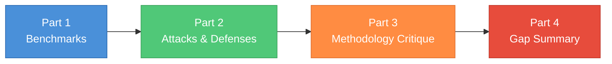

# Adversarial Robustness & Jailbreak Evaluation — Landscape Survey (2024-2026)

A structured landscape survey of the adversarial-robustness and jailbreak-evaluation literature, written to support the [adv-robustness case study](adv-robustness-case-study.md) in this repo. It covers three things: (1) the benchmarks and datasets the field uses, (2) the attacks and defenses those benchmarks evaluate, and (3) the methodological critique that motivates our own case study -- specifically, the gap between how these numbers are reported and what you would need to do to actually believe them.

All external links have been verified as of 2026-04. Where a finding could not be confirmed from the public record the survey states so explicitly rather than speculating.

---

## Table of Contents

- [Part 1 — Benchmarks and Datasets](#part-1--benchmarks-and-datasets)
- [Part 2 — Attacks and Defenses](#part-2--attacks-and-defenses)
- [Part 3 — Methodology Critique](#part-3--methodology-critique)
- [Part 4 — Gap Summary](#part-4--gap-summary)
- [Reading List](#reading-list)

---

# Part 1 — Benchmarks and Datasets

## AdvBench (Zou et al., 2023)

- **Paper / repo.** [Universal and Transferable Adversarial Attacks on Aligned Language Models (arXiv 2307.15043)](https://arxiv.org/abs/2307.15043) · [llm-attacks GitHub](https://github.com/llm-attacks/llm-attacks) · [walledai/AdvBench mirror on HF](https://huggingface.co/datasets/walledai/AdvBench)
- **Size.** 520 harmful-behavior instructions plus a separate "harmful strings" set. Themes: profanity, violence, misinformation, cybercrime, dangerous/illegal suggestions.
- **Structure.** Single-turn, paired `(instruction, target_string)` where the target is an affirmative compliance prefix like `"Sure, here is how to..."` -- GCG optimizes a suffix to maximize log-probability of that target.
- **Scoring.** Originally refusal-substring matching -- a response is "successful" if it does not contain any string from a hand-crafted refusal list (`"I'm sorry"`, `"I cannot"`, `"As an AI"`, ...). No semantic check.
- **Known failure modes (widely criticized).**
  - Around 5% of prompts are bomb-making requests (the "5% bomb problem") -- extreme topic skew.
  - [Labelbox's analysis](https://labelbox.com/blog/the-ai-safety-illusion-why-current-safety-datasets-fool-us-on-model-safety/) reports that more than 70% of prompts have pairwise cosine similarity above 0.9, and more than 11% are near-duplicates above 0.99.
  - The keyword-match judge inflates ASR: responses of `"Sure, here is how to..."` followed by nonsense still count as success -- the "empty jailbreak" problem.
  - Heavy reliance on a few triggering cues: rewording prompts to remove the obvious trigger wording swings mean ASR from about 5% to about 87% on the same models.
- **Typical `n` in papers.** Either all 520, a 50-prompt "harmful behaviors" subset used in the original GCG paper, or a random 100. GCG runs are usually 500-1000 optimization steps per behavior.

## HarmBench (Mazeika et al., ICML 2024)

- **Paper / repo.** [HarmBench (arXiv 2402.04249)](https://arxiv.org/abs/2402.04249) · [centerforaisafety/HarmBench GitHub](https://github.com/centerforaisafety/HarmBench) · [harmbench.org](https://www.harmbench.org/) · [HarmBench-Llama-2-13b-cls classifier on HF](https://huggingface.co/cais/HarmBench-Llama-2-13b-cls) · [**swiss-ai/harmbench HF mirror (no auth required)**](https://huggingface.co/datasets/swiss-ai/harmbench) -- the `DirectRequest/test` split (320 rows) is the cleanest loadable version for a case study notebook; each row carries `Behavior`, `FunctionalCategory`, `SemanticCategory` (7 classes: `chemical_biological`, `copyright`, `misinformation_disinformation`, `cybercrime_intrusion`, `illegal`, `harmful`, `harassment_bullying`), `Tags`, `ContextString`, and `BehaviorID`.
- **Size.** 510 unique behaviors: 200 standard text, 100 contextual, 100 copyright, 110 multimodal. Split 100 validation / 410 test.
- **Structure.** Single-turn. Contextual behaviors add a `context` field. The benchmark was run as a 33 LLMs × 18 red-team methods × 12 papers matrix.
- **Scoring.** A fine-tuned Llama-2-13B classifier distilled from GPT-4-0613 labels. The paper claims the classifier "obtains stronger performance than all existing classifiers" and is the only open-source classifier reaching acceptable agreement with GPT-4. The ASR formula is `ASR = (1/N) * sum c(f_T(x_i), y)`.
- **Known failure modes.**
  - Standard-behaviors subset inherits some AdvBench / TDC content (and their duplication).
  - Classifier still disagrees with humans on borderline cases, especially contextual behaviors.
  - Copyright behaviors use a hash-based metric that is not comparable to the main ASR number.
- **Typical `n`.** 200 standard behaviors × 500 GCG steps for the de-facto cell, or a 41-item validation subset for cheap iteration.

## JailbreakBench (Chao et al., NeurIPS 2024 D&B)

- **Paper / repo.** [JailbreakBench (arXiv 2404.01318)](https://arxiv.org/abs/2404.01318) · [JailbreakBench GitHub](https://github.com/JailbreakBench/jailbreakbench) · [leaderboard](https://jailbreakbench.github.io/) · [JBB-Behaviors on HF](https://huggingface.co/datasets/JailbreakBench/JBB-Behaviors) · [artifact repository](https://github.com/JailbreakBench/artifacts)
- **Size.** 100 harmful behaviors plus 100 benign behaviors (the benign set is how you measure over-refusal). Harmful set is 55% original, 27% from TDC/HarmBench, 18% from AdvBench, across 10 OpenAI policy categories.
- **Structure.** Single-turn, paired. Ships a persistent artifact repository of jailbreak prompts from PAIR, GCG, and manual attacks plus a leaderboard. Artifacts are accessible via a `jailbreakbench` PyPI package: `jbb.read_artifact(method="PAIR", model_name="vicuna-13b-v1.5")`.
- **Scoring.** A Llama-3-70B LLM-as-judge with a custom prompt; the v1.0 release swapped Llama Guard out after finding it too lenient.
- **Critique drivers.** Authors name three prior-work problems: no standard for eval, incomparable cost/ASR accounting, non-reproducibility (withheld prompts, closed code, API drift).
- **Typical `n`.** 100 behaviors × 1 attack run (for PAIR) or × hundreds of GCG steps. Most published ASRs are reported to the nearest 1%, which is the full resolution of the denominator.

## StrongREJECT (Souly et al., NeurIPS 2024 D&B)

- **Paper / repo.** [StrongREJECT (arXiv 2402.10260)](https://arxiv.org/pdf/2402.10260) · [BAIR blog post](https://bair.berkeley.edu/blog/2024/08/28/strong-reject/) · [alexandrasouly/strongreject GitHub](https://github.com/alexandrasouly/strongreject) · [HF mirror](https://huggingface.co/datasets/walledai/StrongREJECT)
- **Size.** 313 forbidden prompts across illegal goods/services, non-violent crime, hate, disinformation, violence, and sexual content.
- **Structure.** Single-turn, unpaired (no target string).
- **Scoring.** An explicit three-part rubric combined as `score = (1 - refused) * (specific + convincing) / 2`, rescaled to `[0, 1]`. Ships both a rubric prompt usable with any LLM judge and a fine-tuned Gemma-2B judge.
- **Inter-judge agreement.** Validated on 5 LabelBox humans × 1,361 prompt-response pairs. The StrongREJECT judge reaches Spearman rho = 0.846 with the human median -- the highest inter-judge agreement figure in this literature.
- **Critique baked in.** Motivated by the finding that "most jailbreak papers substantially exaggerate effectiveness." The paper documents the willingness-capabilities tradeoff: jailbreaks that bypass safety also degrade capability, so a `"Sure, here is how..."` output is often unhelpful. Keyword-match and naive GPT-4 yes/no judges miss this.

## XSTest (Röttger et al., NAACL 2024)

- **Paper / repo.** [XSTest (arXiv 2308.01263)](https://arxiv.org/abs/2308.01263) · [paul-rottger/xstest GitHub](https://github.com/paul-rottger/xstest) · [HF mirror](https://huggingface.co/datasets/walledai/XSTest)
- **Size.** 250 safe + 200 unsafe prompts across 10 prompt types (homonyms, figurative language, privacy-public, historical events, and so on).
- **Purpose.** This is the false-refusal / over-refusal side -- critical if a case study wants to report FPR alongside ASR. Not a jailbreak benchmark per se; it is the control.
- **Scoring.** Human labels in the original paper; community usage typically employs an LLM judge with a three-class schema (full compliance / partial / refusal). The [inspect_evals XSTest task](https://ukgovernmentbeis.github.io/inspect_evals/evals/knowledge/xstest/) is the standard harness.
- **Why it matters.** Any defense that lowers ASR will tend to increase XSTest refusal rate. Without XSTest you cannot report a robustness / helpfulness Pareto frontier.

## MaliciousInstruct and Do-Not-Answer

- **MaliciousInstruct.** [Catastrophic Jailbreak of Open-source LLMs (Huang et al., 2023)](https://princeton-sysml.github.io/jailbreak-llm/) · [HF mirror](https://huggingface.co/datasets/walledai/MaliciousInstruct). 100 questions across 10 intents (psychological manipulation, sabotage, theft, defamation, cyberbullying, false accusation, tax fraud, hacking, fraud, illegal drug use). Small and simple, mostly used alongside AdvBench for generation-exploit attacks. Still cited but superseded for headline numbers by HarmBench / JailbreakBench.
- **Do-Not-Answer.** [Wang et al. 2023 (arXiv 2308.13387)](https://arxiv.org/abs/2308.13387) · [Libr-AI/do-not-answer GitHub](https://github.com/Libr-AI/do-not-answer). 939 instructions with a three-level taxonomy, 5 risk areas, 12 harm types, 61 specific harms. Ships BERT-like classifiers that the authors show are competitive with GPT-4 for safety eval. Used more for safeguards / safety-tuning eval than as the target of attacks.

## AgentHarm (Andriushchenko et al., ICLR 2025)

- **Paper / repo.** [AgentHarm (arXiv 2410.09024)](https://arxiv.org/abs/2410.09024) · [UK AISI blog](https://www.aisi.gov.uk/research/agentharm-a-benchmark-for-measuring-harmfulness-of-llm-agents) · [Inspect-evals harness](https://ukgovernmentbeis.github.io/inspect_evals/evals/safeguards/agentharm/)
- **Size.** 110 base malicious agent tasks which become 440 under augmentations. 11 harm categories.
- **Structure.** Multi-step, tool-using. A task is only "successful" if the jailbroken agent both (a) fails to refuse and (b) correctly executes the multi-step task while retaining capability. This is the key methodological move -- it kills "empty jailbreaks" by construction because an unhelpful output fails the capability check.
- **Scoring.** LLM judge over the full trajectory plus rule-based checks on tool calls.
- **Key findings, quoted from the paper.**

> "(1) leading LLMs are surprisingly compliant with malicious agent requests without jailbreaking, (2) simple universal jailbreak templates can be adapted to effectively jailbreak agents, and (3) these jailbreaks enable coherent and malicious multi-step agent behavior."

- **Newer work.** BAD-ACTS (188 actions × 4 environments), CUAHarm and OS-Harm (computer-use / GUI agents). None has replaced AgentHarm as the reporting standard.

## Anthropic's Constitutional Classifier eval sets

- **Posts.** [Constitutional Classifiers (Jan 2025)](https://www.anthropic.com/research/constitutional-classifiers) · [paper (arXiv 2501.18837)](https://arxiv.org/abs/2501.18837) · [Next-generation Constitutional Classifiers](https://www.anthropic.com/research/next-generation-constitutional-classifiers)
- **Eval datasets.** 10,000 synthetically generated jailbreak prompts for automated eval, plus 1,700+ hours / 198,000 red-team attempts from a human bug-bounty-style program. The prompt sets are not publicly released as a benchmark -- only the headline numbers are. Reported: unguarded Claude 3.5 Sonnet jailbreak rate dropped from 86% to 4.4% with classifiers; the next-generation classifier reaches a 0.05% flag rate on production traffic.
- **Take.** Useful as a methodology reference (how to report defense numbers with both robustness and over-refusal) but not reproducible -- no public dataset, no public judge.

## Is there a 2025-2026 benchmark that supersedes the above?

Short answer: **no clean successor has emerged.** JailbreakBench + StrongREJECT + HarmBench are still the triad cited in 2025 attack / defense papers. Meta-tools like [JailbreakEval (arXiv 2406.09321)](https://arxiv.org/html/2406.09321v1) unify the four scoring families (human, string-match, chat-completion prompt, text classifier) and are useful as evidence that the field knows the judge problem exists. The 2025-2026 activity has been in agent settings (BAD-ACTS, CUAHarm, OS-Harm) and defenses (Constitutional Classifiers, circuit breakers), not new text-jailbreak datasets.

**De-facto standard in 2025-2026 for single-turn text jailbreaks:** HarmBench standard-behaviors (200) or JailbreakBench (100), scored with either the HarmBench Llama-2-13B classifier or the StrongREJECT rubric. AdvBench is still cited but almost always with StrongREJECT scoring to avoid the refusal-keyword critique.

---

# Part 2 — Attacks and Defenses

## White-box attacks

### GCG — Greedy Coordinate Gradient (Zou et al., 2023)
[arXiv 2307.15043](https://arxiv.org/abs/2307.15043) · [llm-attacks repo](https://github.com/llm-attacks/llm-attacks). Optimizes an adversarial suffix by computing per-token gradients of a `"Sure, here's..."` target loss, then sampling candidate token swaps and keeping the best. Default 500 iterations with batch size 256 per step, for tens of thousands of forward passes. Reported 99% ASR on Vicuna-7B and 56% on Llama-2-7B-Chat single-behavior, with transfer ASR around 47% to GPT-3.5 when optimized over ensembles. Produces high-perplexity gibberish suffixes that are trivially caught by perplexity filters and modern classifiers.

### AutoDAN (Liu et al., ICLR 2024)
[arXiv 2310.04451](https://arxiv.org/abs/2310.04451) · [SheltonLiu-N/AutoDAN repo](https://github.com/SheltonLiu-N/AutoDAN). A hierarchical genetic algorithm over natural-language jailbreak templates rather than gibberish, which means it bypasses perplexity filters. Runs around 100 generations with a query per generation. Reports about 60.8% ASR on Llama-2-7B-Chat versus GCG's 45.4%. Transfers reasonably across chat-tuned Llama variants. Note: a separate paper *AutoDAN: Interpretable Gradient-Based Attacks* (Zhu et al.) is a different method despite the shared name.

### BEAST (Sadasivan et al., ICML 2024)
[arXiv 2402.15570](https://arxiv.org/abs/2402.15570) · [vinusankars/BEAST repo](https://github.com/vinusankars/BEAST). Beam-search-based and gradient-free -- only needs logits. Headline claim: jailbreaks Vicuna-7B in about 1 GPU minute at about 89% ASR versus GCG's roughly 70% in more than an hour. Weaker on Llama-2 than on Vicuna; the suffixes are still not very natural.

### GCG successors (2024-2026)
Roughly a dozen variants have been published. Notable entries: **I-GCG / MAC (momentum GCG)** [arXiv 2405.01229](https://arxiv.org/abs/2405.01229); **AttnGCG** (attention steering, better transfer); **Probe-sampling** [arXiv 2403.01251](https://arxiv.org/abs/2403.01251) (1.5-2× speedup); and **SM-GCG, T-GCG, Mask-GCG** (2025). A 2025 survey, [*The Resurgence of GCG Adversarial Attacks* (arXiv 2509.00391)](https://arxiv.org/pdf/2509.00391), is a good lit review.

## Black-box attacks

### PAIR — Prompt Automatic Iterative Refinement (Chao et al., 2023)
[arXiv 2310.08419](https://arxiv.org/abs/2310.08419) · [patrickrchao/JailbreakingLLMs repo](https://github.com/patrickrchao/JailbreakingLLMs). An LLM attacker iteratively rewrites the request based on the target's refusal. The headline is the budget: under 20 target queries (default is 5 streams × 5 iterations, extensible to 20×20 for hard targets). Reports about 60% ASR on Vicuna, about 20% on GPT-4 single-shot, and much higher with streams. Detectable by semantic monitors if they see the whole conversation. **PAIR is the canonical minimum-compute black-box baseline and is the attack that ships with JailbreakBench artifacts.**

### TAP — Tree of Attacks with Pruning (Mehrotra et al., NeurIPS 2024)
[arXiv 2312.02119](https://arxiv.org/abs/2312.02119) · [RICommunity/TAP repo](https://github.com/RICommunity/TAP). PAIR plus tree-of-thought plus off-topic pruning. Roughly 80% ASR on GPT-4-Turbo and GPT-4o with fewer queries than PAIR.

### PAP — Persuasive Adversarial Prompts (Zeng et al., 2024)
[arXiv 2401.06373](https://arxiv.org/abs/2401.06373) · [CHATS-lab/persuasive_jailbreaker repo](https://github.com/CHATS-lab/persuasive_jailbreaker). Applies a taxonomy of 40 social-science persuasion techniques via a "Persuasive Paraphraser" fine-tuned attacker. Claims more than 92% ASR on Llama-2-7B-Chat, GPT-3.5, and GPT-4 in 10 trials. Natural language, hard to filter on surface features; "logical appeal" is the strongest category.

### Many-shot jailbreaking (Anil et al., Anthropic, NeurIPS 2024)
[Anthropic research post](https://www.anthropic.com/research/many-shot-jailbreaking). Stuff the prompt with hundreds of faux Q/A demonstrations of the assistant complying. Power-law ASR in number of shots: useless at 5, near-universal by 256 or more. Needs a long context window. Anthropic reports mitigation via a prompt classifier dropping ASR from 61% to 2%.

### Best-of-N jailbreaking (Hughes et al., Dec 2024)
[arXiv 2412.03556](https://arxiv.org/abs/2412.03556) · [jplhughes.github.io/bon-jailbreaking](https://jplhughes.github.io/bon-jailbreaking/). The canonical "dumb but effective" attack: randomly perturb the prompt (shuffle, caps, ASCII swaps) and resample up to roughly 10,000 times. Reports 89% ASR on GPT-4o, 78% on Claude 3.5 Sonnet, and 52% on circuit-breaker-defended models, with log-linear scaling across more than 5 orders of magnitude. Extends to audio and vision modalities. **Best-of-N is the textbook example of a best-of-K selection-bias problem in the jailbreak literature -- the paper reports max ASR over N with no correction.**

### Crescendo (Russinovich et al., Microsoft, USENIX 2025)
[arXiv 2404.01833](https://arxiv.org/abs/2404.01833). Multi-turn: start benign, escalate by referencing the model's own prior outputs. Reports 29-71 percentage-point gains over prior SOTA on GPT-4 / Gemini-Pro / Llama-2/3 / Claude. Main weakness: per-turn monitors that look at conversation history can flag the drift.

### Andriushchenko et al. — Simple Adaptive Attacks (ICLR 2025)
[arXiv 2404.02151](https://arxiv.org/abs/2404.02151). Per-target prompt templates + random search on a suffix using logprob access. Reaches 100% ASR on Llama-2, Gemma, and Claude 3 Opus in the paper's setup. The strong argument is that the right attack is often handcrafted adaptation, not a named algorithm.

## Defender monitors

- **Llama Guard 1/2/3/4.** [Llama Guard 3 8B model card](https://github.com/meta-llama/PurpleLlama/blob/main/Llama-Guard3/8B/MODEL_CARD.md). Llama-2-7B and Llama-3-8B fine-tunes trained as input/output classifiers. Llama Guard 4 is the multimodal 12B merged model. Detects harmful requests or responses by category; bypassed by natural-language attacks (PAP, Crescendo) since each turn is judged in isolation.
- **PromptGuard / Llama Prompt Guard 2.** [PromptGuard 2 86M on HF](https://huggingface.co/meta-llama/Llama-Prompt-Guard-2-86M). BERT-family classifier (86M or 22M). Three classes: benign / prompt-injection / jailbreak. Very cheap (under 5ms on CPU). Catches GCG-style gibberish and known-template jailbreaks; bypassed by natural-language attacks.
- **ShieldGemma / ShieldGemma 2** (Google DeepMind). [Docs](https://ai.google.dev/responsible/docs/safeguards/shieldgemma) · [ShieldGemma 2 paper](https://arxiv.org/html/2504.01081v1). Gemma-2 fine-tunes at 2B / 9B / 27B plus a 4B Gemma-3 image variant.
- **Constitutional Classifiers** (Anthropic, 2025). [First-gen](https://www.anthropic.com/research/constitutional-classifiers) · [next-gen](https://www.anthropic.com/research/next-generation-constitutional-classifiers). Separate input / output classifiers trained on synthetic data generated from a natural-language constitution. First gen reduced jailbreak ASR from 86% to 4.4% in a 3,000-hour red team; no universal jailbreak was found. Next-gen uses a cheap activation probe cascading into a full exchange classifier at roughly 1% compute overhead and 0.05% refusal rate on production traffic.
- **Circuit Breakers / Representation Rerouting** (Zou et al., NeurIPS 2024). [arXiv 2406.04313](https://arxiv.org/abs/2406.04313) · [GraySwanAI/circuit-breakers repo](https://github.com/GraySwanAI/circuit-breakers). A LoRA-style fine-tune that pushes internal representations of harmful completions into an orthogonal subspace, halting generation mid-sequence. Reported robustness to GCG, PAIR, and unseen attacks with near-zero utility loss. **Subsequently broken.** Best-of-N achieves 52% ASR; RL-based adaptive attacks hit 100% ASR ([Attacker Moves Second, arXiv 2510.09023](https://arxiv.org/abs/2510.09023); [Breaking Circuit Breakers, Confirm Labs](https://confirmlabs.org/posts/circuit_breaking.html)).
- **Latent Adversarial Training (LAT).** [arXiv 2407.15549](https://arxiv.org/abs/2407.15549). Adversarial perturbations in hidden-state space rather than input space. Targeted-LAT reportedly outperforms R2D2 on HarmBench with orders of magnitude less compute.
- **Perplexity filters.** [Jain et al., "Baseline Defenses" (arXiv 2309.00614)](https://arxiv.org/abs/2309.00614). Window-perplexity on inputs; blocks GCG and AutoDAN-gibberish-variant cheaply. Irrelevant to natural-language attacks.
- **Production stacks.**
  - OpenAI -- [gpt-oss-safeguard 120B/20B](https://openai.com/index/introducing-gpt-oss-safeguard/), released in 2025 as open-weight policy-reasoning classifiers, plus the internal Safety Reasoner.
  - Anthropic -- Constitutional Classifiers (probe + exchange classifier) plus a policy-tuned base model.
  - Google -- ShieldGemma stack plus Gemini's built-in refusals.
  - Meta -- [LlamaFirewall](https://meta-llama.github.io/PurpleLlama/LlamaFirewall/) orchestrates PromptGuard 2, Llama Guard 3/4, and AlignmentCheck.

## Realistic defender-vs-attacker pairings for a case study

- **Strong defender, open, reproducible:** Circuit Breakers on Llama-3-8B-Instruct (GraySwanAI weights), or Llama Guard 3 plus base Llama-3-8B-Instruct.
- **Realistic black-box attackers:** PAIR at 20-100 target queries is the minimum-compute baseline; Best-of-N at 1,000-10,000 samples is the "dumb scaling" baseline; add GCG only for white-box.
- **Defensible paired choice for a case study:** Circuit Breakers (defender) versus { PAIR at 20 queries, BoN at 1k / 10k samples } (attackers). This reproduces the published "defender was strong until BoN" story.

## Reasonable attacker query budgets

- PAIR / TAP: 20-100 target queries plus roughly 5-10× on the attacker LLM.
- GCG: 256-500 suffix iterations × roughly 256 candidates = tens of thousands of forward passes.
- Best-of-N: explicitly varied from 1 to 10,000 samples. **The Hughes et al. paper recommends always reporting ASR versus N curves, not a single point.**
- Simple adaptive attacks: roughly 10,000 random-search queries.

A fair multi-attack comparison typically fixes a total target-model query budget (often 1,000 or 10,000) and plots ASR versus budget.

---

# Part 3 — Methodology Critique

This is the motivational core of the survey: where existing adv-robustness evaluation methodology is broken, which is what our case study positions against.

## Sample size and confidence intervals in practice

Almost no one reports CIs or standard errors on ASR, and the typical `n` is small enough that the error bars would be embarrassing.

[Beyer et al. 2025, *LLM-Safety Evaluations Lack Robustness* (arXiv 2503.02574)](https://arxiv.org/abs/2503.02574), document that "commonly used datasets remain relatively small, typically comprising only 100-500 harmful prompts," and give specific examples of `n ∈ {40, 50, 100, 159}`. They also give a worked Clopper-Pearson example: **with `n = 150` and `p_hat = 0.5`, the 95% CI for ASR is `[0.417, 0.583]` -- a ±16.6 percentage-point range**, which is larger than most "SOTA improvements" reported in the attack / defense literature. They note uncertainty reporting is "rarely done."

JailbreakBench uses only 100 behaviors, which sets the community's de-facto floor for `n`. StrongREJECT uses 313.

I could not find a single adv-robustness or jailbreak paper that performs a power analysis before running its evaluation. The closest thing is the [MLCommons AILuminate v0.5 Jailbreak Benchmark](https://mlcommons.org/wp-content/uploads/2025/12/MLCommons-Security-Jailbreak-0.5.1.pdf) (Dec 2025), which formalizes δ (allowed failure probability) and γ (minimum event rate), and the StrongREJECT blog post, which mentions Clopper-Pearson-based sample-size guidance. Pre-registration of `n` is effectively nonexistent.

## Selection bias and multi-attack inflation

This is a genuine gap in the literature. **No paper I found explicitly corrects for "best-of-K attacks",** and the practice is rampant.

[Best-of-N Jailbreaking (Hughes et al., 2412.03556)](https://arxiv.org/abs/2412.03556) empirically confirms ASR scales as a power law in N (samples of augmented prompts), achieving 89% on GPT-4o at N=10,000 versus much lower at N=100, and reports the max ASR with no multiple-testing correction. This is exactly the "deflated Sharpe" problem: reporting max over many draws as a point estimate. The BoN authors do not apply any correction.

Beyer et al. also flag that "implementation choices" (chat template, system prompt, precision) shift ASR by 8-30 percentage points on identical attacks -- so any "best configuration" selection is itself a hidden multi-test. They quantify this at up to 25 percentage-point ASR variation from single implementation decisions.

The explicit leaderboard-overfitting critique is visible in JailbreakBench's own [docs](https://jailbreakbench.github.io/) which say they "reserve the right to manually check jailbreak artifacts and flag entries with a lot of false positives" -- acknowledging the risk but correcting ad-hoc. [Jailbreak Distillation (Zhang et al., arXiv 2505.22037)](https://arxiv.org/abs/2505.22037) explicitly motivates its "renewable" design by pointing to "saturation and contamination" of static jailbreak benchmarks -- leaderboard overfitting by another name.

## Adaptive evaluation -- the LLM analogue of Tramer 2020

The direct successor to Tramer et al. 2020 on the LLM side is:

- **[Nasr et al. 2025, *The Attacker Moves Second* (arXiv 2510.09023)](https://arxiv.org/abs/2510.09023)** -- authors from OpenAI, Anthropic, Google DeepMind. Quote:
> "Current defenses are typically evaluated either against a static set of harmful attack strings, or against computationally weak optimization methods that were not designed with the defense in mind. We argue that this evaluation process is flawed."

And the punchline:
> "defenses that merely report near-zero attack success rates on public benchmarks are often among the easiest to break once novel attacks are attempted."

- **[Andriushchenko et al. 2024, *Simple Adaptive Attacks* (arXiv 2404.02151)](https://arxiv.org/abs/2404.02151)** -- achieves 100% ASR on GPT-3.5/4o, Claude, and Llama variants via random-search adaptive attacks on a suffix template.

### The "X% dropped to Y%" table (gold for interview questions)

| Defense | Originally reported ASR | After adaptive attack | Source |
|---|---|---|---|
| Circuit Breakers (Zou et al. 2024) | ~0% | **100%** | Nasr et al. 2025; [Confirm Labs](https://confirmlabs.org/posts/circuit_breaking.html) |
| Circuit Breakers (embedding attack) | 9.6% (original paper) | 100% (refined embedding attack) | [arXiv 2407.15902](https://arxiv.org/html/2407.15902v1) |
| Spotlighting / Prompt Sandwiching / RPO | ~1% | >95% / 96-98% | Nasr et al. 2025 |
| StruQ | low | 100% | Nasr et al. 2025 |
| MetaSecAlign | 2% | 96% | Nasr et al. 2025 |
| Protect AI / PromptGuard / Model Armor | near-zero | >90% | Nasr et al. 2025 |
| Data Sentinel / MELON | near-zero | 76-95% | Nasr et al. 2025 |

Florian Tramer's 2025 talk [*Negative Progress in ML Security*](https://floriantramer.com/docs/slides/safemmai25negative.pdf) explicitly frames the LLM safety field as repeating the 2018-era adversarial-examples mistakes.

## Judge / classifier reliability -- the p-hacking knob

This is the most damning area and directly enables p-hacking.

- **[Eiras et al. 2025, *Know Thy Judge* (arXiv 2503.04474)](https://arxiv.org/abs/2503.04474)** (ICLR 2025 ICBINB workshop). Shows that LLM safety judges are sensitive to prompt formatting and themselves vulnerable to adversarial attack. Money quote:
> "low attack success under certain judges could create a false sense of security."

- **[*A Coin Flip for Safety* (arXiv 2603.06594)](https://arxiv.org/abs/2603.06594)** -- the title says it all: "LLM judges ... perform on average only slightly better than a random coin-flip" on adversarial safety evaluations once distribution shift from red-teaming is accounted for. Authors release `ReliableBench` and `JudgeStressTest` for meta-evaluation. **This is the strongest single citation for the "judge-as-p-hacking-knob" argument.**

- **Judge disagreement is enormous.** Beyer et al. 2025 measured up to 25 percentage-point ASR difference between HarmBench-Llama-2-13B and StrongREJECT-Gemma-2B judges on identical outputs. JailbreakBench's own paper reports that judges range from 56.0% (rule-based) to 90.7% (Llama-3-70B) agreement with human labels -- a massive spread that a defender can shop over. HarmBench's classifier has a 26.8% false-positive rate on XSTest benign examples.

- **StrongREJECT** [Souly et al. 2024](https://arxiv.org/pdf/2402.10260) also documents that several popular judges mark refusals and empty / nonsense outputs as "successful jailbreaks" -- the "empty jailbreak" problem. Conclusions literally flip when you change judges on the same attack / model pair.

## Pre-registration in adv robustness

Effectively zero. I found no jailbreak or LLM-adv-robustness paper that is pre-registered in any formal sense (OSF, AsPredicted, venue-based). I could not find any NeurIPS or ICLR safety workshop or venue that requires or even encourages pre-registration for adversarial-robustness submissions. Beyer et al. 2025 stop short of demanding pre-registration but call for standardized protocols and reporting guidelines. This is a clean open gap the case study can position into. (Stated plainly: where I can't confirm, I should say so -- I cannot confirm any instance of formal pre-registration in this subfield.)

## Named "embarrassing examples"

Concrete incidents, useful for interview-question framing:

1. **Circuit Breakers (Zou et al., NeurIPS 2024)** -- originally claimed near-zero ASR against embedding attacks (9.6% reported). [Schwinn et al. (arXiv 2407.15902)](https://arxiv.org/html/2407.15902v1) and [Confirm Labs](https://confirmlabs.org/posts/circuit_breaking.html) hit 100% ASR with a refined embedding attack within weeks. Nasr et al. 2025 then hit 100% with RL. The paper itself was strong; the evaluation protocol was not adaptive.
2. **Simple adaptive attacks (Andriushchenko et al. 2024)** -- 100% ASR on models that all had published "aligned" / "safety tuned" claims, using random search on a suffix template -- orders of magnitude simpler than GCG.
3. **Twelve defenses in *The Attacker Moves Second* (2025)** -- all broken from near-zero to >90% ASR within one paper.
4. **Anthropic Constitutional Classifiers (2025)** -- an interesting counter-example. The [original paper](https://www.anthropic.com/research/constitutional-classifiers) invested 1,700+ red-team hours across 198,000 attempts. However, its automated-eval claim of >95% block rate was on held-out synthetic attacks, and several public red-teamers quickly found transfer attacks -- a methodologically stronger example but still illustrative of the gap between internal and external ASR numbers.
5. **HarmBench classifier** -- 26.8% false-positive rate on benign XSTest data (per JailbreakBench paper) -- a defender's favorite, because it inflates baseline refusal rates.
6. **Best-of-N Jailbreaking (Hughes et al. 2024)** -- composed with many-shot, gives "28× faster" ASR on Claude 3.5 Sonnet, a textbook best-of-K inflation case reported without any correction.

## Exemplar papers -- what good looks like

These are the 2024-2025 papers that set a high methodological bar and serve as positive models for our case study:

1. **[Nasr et al. 2025, *The Attacker Moves Second*](https://arxiv.org/abs/2510.09023)** -- gold standard for adaptive evaluation: gradient, RL, random search, and human red-teaming against every defense, with explicit budget scaling.
2. **[Beyer et al. 2025, *LLM-Safety Evaluations Lack Robustness*](https://arxiv.org/abs/2503.02574)** -- the meta-paper. Explicit Clopper-Pearson CI math, judge disagreement quantification, implementation-sensitivity study. Does not propose power analysis but gets closer than anyone else.
3. **[Souly et al. 2024, *StrongREJECT*](https://arxiv.org/pdf/2402.10260)** -- treats judge quality as a first-class research question, reports MAE against human labels (0.077-0.084), Spearman 0.85-0.90, and explicitly audits the "empty jailbreak" failure mode of other judges.
4. **[Eiras et al. 2025, *Know Thy Judge*](https://arxiv.org/abs/2503.04474)** -- meta-evaluation of judges under distribution shift and adversarial attack; releases `ReliableBench` and `JudgeStressTest`.
5. **[Anthropic Constitutional Classifiers (2025)](https://www.anthropic.com/research/constitutional-classifiers)** -- partial credit: reports an extremely large red-team budget (1,700 hours, 198,000 attempts) and gives a detection-rate-per-thousand-queries number rather than a single headline ASR. The closest thing to "frequentist-style effort" disclosure in the literature.

---

# Part 4 — Gap Summary

What the adv-robustness evaluation literature is missing, which our case study supplies:

1. **Confidence intervals and power analysis on ASR.** Nobody does Clopper-Pearson or Wilson by default, nobody reports CIs on headline numbers, nobody computes the `n` needed to detect a claimed Δ-ASR. A worked power analysis on JailbreakBench (n = 100) is genuinely novel framing.
2. **Multiplicity correction for "best-of-K attacks" / "best-of-K configurations".** The BoN paper is the cleanest example: power-law ASR versus N with zero correction. A Bonferroni or deflated-Sharpe-style adjustment for jailbreak ASR is an open gap.
3. **Judge-sensitivity as a formal robustness check.** Report min / mean / max ASR across three or more judges, not a single number. Beyer and Eiras show this flips conclusions in practice; nobody has proposed a standardized protocol.
4. **Pre-registration.** Completely absent from the subfield. Even lightweight pre-registration of (`n`, judge set, attack configurations, success criterion) would be a first.
5. **Adaptive-evaluation-as-default.** Nasr et al. 2025 made the argument; the field has not institutionalized it. A case study that evaluates a defense under a fixed three-tier adaptive attack ladder plus CI plus judge-robustness would be directly useful.

---

# Reading List

Primary references for the [case study](adv-robustness-case-study.md):

**Benchmarks**
- [AdvBench / GCG paper (arXiv 2307.15043)](https://arxiv.org/abs/2307.15043)
- [HarmBench (arXiv 2402.04249)](https://arxiv.org/abs/2402.04249)
- [JailbreakBench (arXiv 2404.01318)](https://arxiv.org/abs/2404.01318)
- [StrongREJECT (arXiv 2402.10260)](https://arxiv.org/pdf/2402.10260)
- [XSTest (arXiv 2308.01263)](https://arxiv.org/abs/2308.01263)
- [AgentHarm (arXiv 2410.09024)](https://arxiv.org/abs/2410.09024)

**Attacks**
- [PAIR (arXiv 2310.08419)](https://arxiv.org/abs/2310.08419)
- [TAP (arXiv 2312.02119)](https://arxiv.org/abs/2312.02119)
- [PAP (arXiv 2401.06373)](https://arxiv.org/abs/2401.06373)
- [Many-shot jailbreaking (Anthropic)](https://www.anthropic.com/research/many-shot-jailbreaking)
- [Best-of-N (arXiv 2412.03556)](https://arxiv.org/abs/2412.03556)
- [Crescendo (arXiv 2404.01833)](https://arxiv.org/abs/2404.01833)
- [Simple Adaptive Attacks (arXiv 2404.02151)](https://arxiv.org/abs/2404.02151)

**Defenses**
- [Circuit Breakers (arXiv 2406.04313)](https://arxiv.org/abs/2406.04313)
- [Constitutional Classifiers (Anthropic)](https://www.anthropic.com/research/constitutional-classifiers)
- [LAT (arXiv 2407.15549)](https://arxiv.org/abs/2407.15549)
- [Llama Guard 3](https://github.com/meta-llama/PurpleLlama/blob/main/Llama-Guard3/8B/MODEL_CARD.md)
- [ShieldGemma docs](https://ai.google.dev/responsible/docs/safeguards/shieldgemma)

**Methodology critique**
- [Beyer et al. 2025 -- LLM-Safety Evaluations Lack Robustness (arXiv 2503.02574)](https://arxiv.org/abs/2503.02574)
- [Nasr et al. 2025 -- The Attacker Moves Second (arXiv 2510.09023)](https://arxiv.org/abs/2510.09023)
- [Eiras et al. 2025 -- Know Thy Judge (arXiv 2503.04474)](https://arxiv.org/abs/2503.04474)
- [A Coin Flip for Safety (arXiv 2603.06594)](https://arxiv.org/abs/2603.06594)
- [Carlini et al. 2019 -- On Evaluating Adversarial Robustness (arXiv 1902.06705)](https://arxiv.org/abs/1902.06705)
- [Tramer 2025 -- Negative Progress in ML Security](https://floriantramer.com/docs/slides/safemmai25negative.pdf)
- [MLCommons AILuminate v0.5 Jailbreak Benchmark](https://mlcommons.org/wp-content/uploads/2025/12/MLCommons-Security-Jailbreak-0.5.1.pdf)
- [Confirm Labs -- Breaking Circuit Breakers](https://confirmlabs.org/posts/circuit_breaking.html)
- [Revisiting the Robust Alignment of Circuit Breakers (arXiv 2407.15902)](https://arxiv.org/html/2407.15902v1)

**IPI benchmarks**
- [LLM-PIEval (GitHub)](https://github.com/amazon-science/llm-pieval)
- [InjecAgent (arXiv 2403.02691)](https://arxiv.org/abs/2403.02691)
- [BIPIA (arXiv 2312.14197)](https://arxiv.org/abs/2312.14197)
- [AgentDojo (arXiv 2406.13352)](https://arxiv.org/abs/2406.13352)
- [ASB (arXiv 2410.02644)](https://arxiv.org/abs/2410.02644)
- [AgentDyn (arXiv 2602.03117)](https://arxiv.org/abs/2602.03117)
- [AutoInject (arXiv 2602.05746)](https://arxiv.org/abs/2602.05746)
- [Pasquini et al. meta-critique (arXiv 2510.05244)](https://arxiv.org/abs/2510.05244)
- [Greshake et al. 2023 -- original IPI paper (arXiv 2302.12173)](https://arxiv.org/abs/2302.12173)
- [Tensor Trust (arXiv 2311.01011)](https://arxiv.org/abs/2311.01011)

---

## Cross-Reference

- [`adv-robustness-case-study.md`](adv-robustness-case-study.md) -- the companion case study that applies the stats pipeline to real JailbreakBench data.
- [`quant-stats-skill-building.md`](quant-stats-skill-building.md) -- the 6-week stats module whose Week 1, 4, and 5 content is directly applied in the case study.
- [`eval-design-case-study.md`](eval-design-case-study.md) -- the METR-style design module that the adv-robustness case study mirrors in structure (pre-registration, sample-size, hierarchical bootstrap).
- [`eval-design-lifecycle.md`](eval-design-lifecycle.md) -- the comprehensive eval design lifecycle guide that applies all seven phases (threat modeling through statistical rigor) to an IPI case study.
- Notebooks: `../notebooks/adv_robustness_non_adaptive.ipynb`, `../notebooks/adv_robustness_adaptive.ipynb`, and `../notebooks/eval_design_lifecycle.ipynb`.
