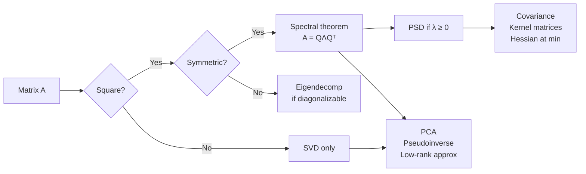
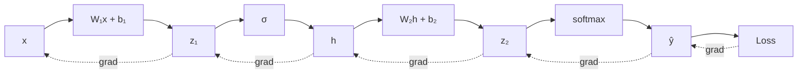
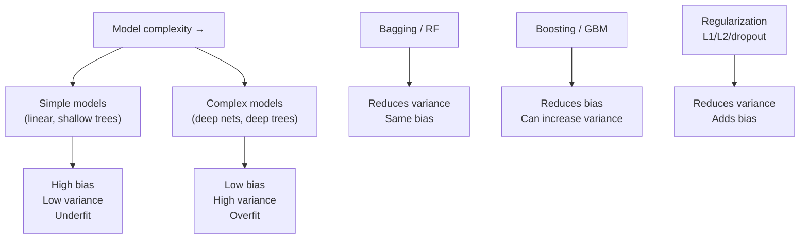
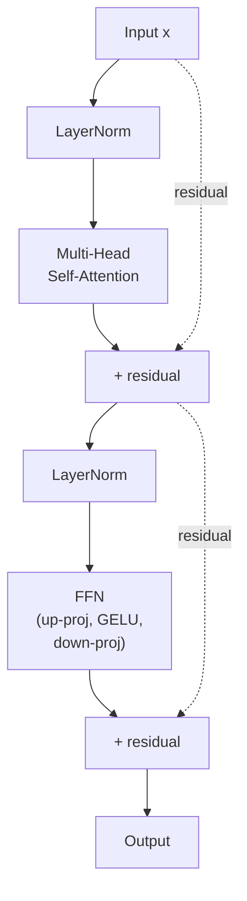
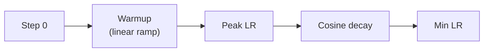
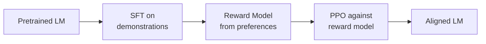
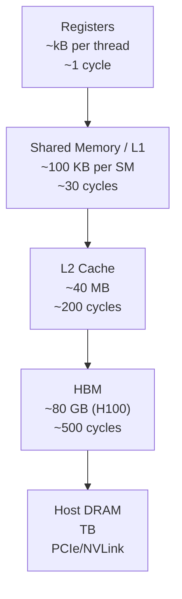
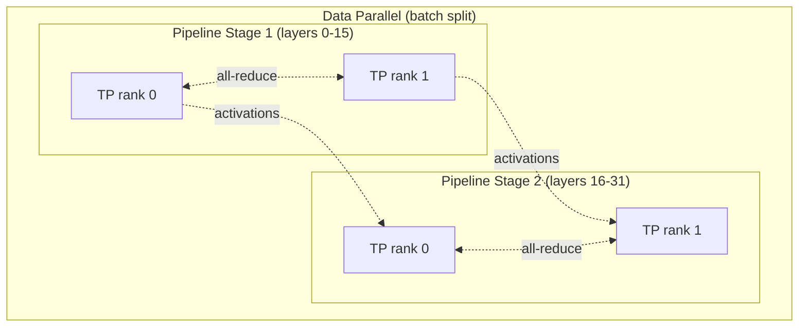
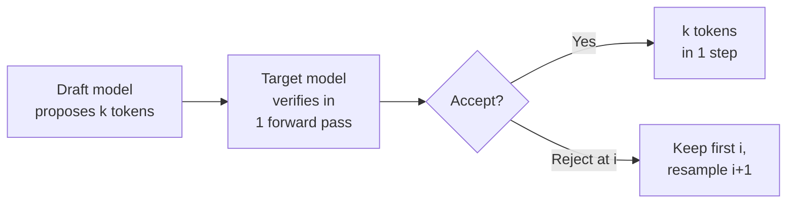

# ML Theory Interview — All-In-One Study Guide

A structured reference for ML theory interview rounds. Organized around three core pillars: **Core Fundamentals**, **Deep Learning & RL**, and **Systems & Infrastructure**. Each section has the key concepts, derivations you should be able to produce on a whiteboard, and likely probe questions.

> For deeper coverage of the math foundations, see the detailed guides on [Linear Algebra](guides/linear-algebra.md), [Calculus](guides/calculus.md), and [Statistics](guides/statistics.md).

---

## Table of Contents

1. [Core Fundamentals](#1-core-fundamentals)
   - [Linear Algebra](#11-linear-algebra)
   - [Calculus & Optimization](#12-calculus--optimization)
   - [Classical Machine Learning](#13-classical-machine-learning)
2. [Deep Learning & RL](#2-deep-learning--rl)
   - [Transformer Architecture](#21-transformer-architecture)
   - [Training Dynamics](#22-training-dynamics)
   - [Reinforcement Learning](#23-reinforcement-learning)
3. [Systems & Infrastructure](#3-systems--infrastructure)
   - [GPU Hardware & Kernels](#31-gpu-hardware--kernels)
   - [Distributed Training](#32-distributed-training)
   - [Inference Systems](#33-inference-systems)
   - [ML System Design](#34-ml-system-design)
4. [Interview Day Tactics](#4-interview-day-tactics)

---

## 1. Core Fundamentals

### 1.1 Linear Algebra

#### The absolute basics

- **Scalar, vector, matrix, tensor.** A scalar is a number. A vector is an ordered list of numbers (a point in `ℝⁿ`). A matrix is a 2D grid (`ℝ^(m×n)`). A tensor generalizes to arbitrary dimensions.
- **Dot product** `a · b = Σ aᵢbᵢ = ‖a‖‖b‖cos θ`. Measures alignment: positive if vectors point the same way, zero if orthogonal, negative if opposing. This is the atomic operation of deep learning — every neuron computes a dot product.
- **Matrix-vector product** `Ax` is a linear combination of `A`'s columns, weighted by entries of `x`. Equivalently, each entry of the output is a dot product of a row of `A` with `x`.
- **Matrix-matrix product** `AB`: entry `(i,j)` is the dot product of row `i` of `A` with column `j` of `B`. Not commutative: `AB ≠ BA` in general.
- **Transpose** `Aᵀ` flips rows and columns. `(AB)ᵀ = BᵀAᵀ`.
- **Identity** `I` satisfies `IA = AI = A`. **Inverse** `A⁻¹` satisfies `AA⁻¹ = I` (only exists for square, full-rank matrices).
- **Linear independence.** Vectors `v₁,...,vₖ` are independent if no one is a combination of the others. Rank = size of the largest independent subset of columns.
- **Orthogonal matrix.** `QᵀQ = I`. Preserves lengths and angles — a rotation or reflection. Its inverse is just its transpose (cheap!).
- **Norms.** `‖x‖₂ = √(Σxᵢ²)` (Euclidean). `‖x‖₁ = Σ|xᵢ|` (Manhattan, induces sparsity). `‖x‖∞ = max|xᵢ|`.
- **Trace** `tr(A) = Σ Aᵢᵢ` = sum of eigenvalues. Cyclic: `tr(ABC) = tr(BCA) = tr(CAB)`.
- **Determinant.** Scales volume under the linear map. Zero iff the matrix is singular (rank-deficient).

#### Concepts to own cold

- **Vector spaces, rank, null space, column space.** Rank = dimension of column space = number of linearly independent directions the matrix spans.
- **Eigendecomposition** `A = QΛQ⁻¹` — only for square matrices, and only diagonalizable if it has a full set of eigenvectors. For symmetric matrices, `Q` is orthogonal (`A = QΛQᵀ`) — this is the spectral theorem.
- **SVD** `A = UΣVᵀ` — works for *any* matrix (rectangular, rank-deficient, anything). `U` and `V` are orthonormal, `Σ` is diagonal with non-negative singular values. This is the workhorse.
- **Positive (semi-)definiteness.** `A` is PSD iff `xᵀAx ≥ 0` for all `x`, iff all eigenvalues are ≥ 0. Covariance matrices are always PSD (they're `E[(x-μ)(x-μ)ᵀ]`). Hessians at a local minimum of a smooth loss are PSD.
- **Condition number** `κ(A) = σ_max / σ_min`. Controls numerical stability and gradient descent convergence rate.

#### Derivation you must know: PCA from first principles

Given zero-mean data `X ∈ ℝ^(n×d)`, find the unit vector `w` that maximizes the variance of the projection `Xw`:

```
maximize   wᵀ (XᵀX / n) w = wᵀ Σ w
subject to wᵀw = 1
```

Lagrangian: `L = wᵀΣw - λ(wᵀw - 1)`. Setting `∂L/∂w = 0` gives `Σw = λw` — so the optimal `w` is an **eigenvector of the covariance matrix**, and the variance captured is the corresponding eigenvalue. The top-`k` principal components are the top-`k` eigenvectors. Equivalently, they are the top-`k` right singular vectors of `X`.

#### Likely questions

- "Why SVD instead of eigendecomposition for PCA?" — Numerical stability (forming `XᵀX` squares the condition number), and SVD works even when `X` is rank-deficient.
- "Why is the covariance matrix PSD?" — It's a sum of outer products `(xᵢ-μ)(xᵢ-μ)ᵀ`, each of which is PSD.
- "When does gradient descent on a quadratic converge slowly?" — When the Hessian is ill-conditioned; convergence rate depends on `(κ-1)/(κ+1)`.

#### Linear algebra concept map



---

### 1.2 Calculus & Optimization

#### The absolute basics

- **Derivative.** `f'(x) = lim_{h→0} (f(x+h) - f(x))/h`. Slope of `f` at `x`. Tells you how `f` changes per unit change in `x`.
- **Partial derivative.** `∂f/∂xᵢ` = derivative holding all other variables fixed. For `f(x,y) = x²y`, `∂f/∂x = 2xy` and `∂f/∂y = x²`.
- **Gradient** `∇f = (∂f/∂x₁, ..., ∂f/∂xₙ)`. Vector of partials. Points in the direction of steepest ascent; its magnitude is the slope in that direction.
- **Chain rule (scalar).** `(f∘g)'(x) = f'(g(x)) · g'(x)`. The rule that makes backprop possible.
- **Product rule.** `(fg)' = f'g + fg'`. **Quotient rule.** `(f/g)' = (f'g - fg')/g²`.
- **Common derivatives.** `d/dx[eˣ] = eˣ`, `d/dx[log x] = 1/x`, `d/dx[xⁿ] = nxⁿ⁻¹`, `d/dx[σ(x)] = σ(x)(1-σ(x))`, `d/dx[tanh x] = 1 - tanh²x`.
- **Critical points.** Where `∇f = 0`. Could be min, max, or saddle. Second derivative test: positive second derivative = min, negative = max, zero = inconclusive.
- **Gradient descent.** `w ← w - η∇L(w)`. Step opposite the gradient to decrease the loss. `η` is the learning rate.
- **Local vs global minima.** Gradient descent finds local minima. For convex functions, all local minima are global. For neural nets, we rely on the empirical fact that most local minima of large nets are "good enough."

#### Concepts to own cold

- **Gradient** `∇f` points in direction of steepest ascent. **Jacobian** generalizes to vector-valued functions. **Hessian** is the matrix of second partials; its spectrum describes local curvature.
- **Chain rule for vectors.** For `y = f(g(x))`, `∂y/∂x = (∂y/∂g)(∂g/∂x)`. Backprop is nothing more than applying this right-to-left.
- **Convexity.** A function is convex iff its Hessian is PSD everywhere. Convex problems have no local minima that aren't global. Logistic regression loss is convex; neural net loss is not.
- **Lipschitz smoothness.** `‖∇f(x) - ∇f(y)‖ ≤ L‖x-y‖`. Gradient descent with step size `1/L` is guaranteed to decrease the loss.
- **Second-order methods** (Newton, Gauss-Newton, natural gradient) converge faster near optima but are rarely used at scale because the Hessian is `O(d²)` to store and `O(d³)` to invert.

#### Derivation you must know: backprop on a 2-layer MLP

Forward pass:
```
z₁ = W₁x + b₁
h  = σ(z₁)
z₂ = W₂h + b₂
ŷ  = softmax(z₂)
L  = -Σ yᵢ log ŷᵢ   (cross-entropy)
```

Backward pass (the key insight: `∂L/∂z₂ = ŷ - y` when you combine softmax + cross-entropy):
```
∂L/∂z₂ = ŷ - y
∂L/∂W₂ = (∂L/∂z₂) hᵀ
∂L/∂b₂ = ∂L/∂z₂
∂L/∂h  = W₂ᵀ (∂L/∂z₂)
∂L/∂z₁ = (∂L/∂h) ⊙ σ'(z₁)
∂L/∂W₁ = (∂L/∂z₁) xᵀ
∂L/∂b₁ = ∂L/∂z₁
```

Practice drawing this until the dimensions fall out automatically.

#### Backprop as computational graph



#### Likely questions

- "Derive backprop for a 2-layer net." — Do it on the board.
- "Why doesn't second-order optimization scale?" — Hessian is `d × d`; for a 70B model that's `4.9×10²¹` entries.
- "What's the difference between a Jacobian and a Hessian?" — Jacobian is first-order derivatives of a vector field; Hessian is second-order derivatives of a scalar field.

---

### 1.3 Classical Machine Learning

#### The absolute basics

- **Supervised vs unsupervised vs RL.** Supervised: you have `(x, y)` pairs and learn `f: x→y`. Unsupervised: only `x`, find structure (clustering, density, dimensionality reduction). RL: an agent takes actions in an environment and learns from rewards.
- **Classification vs regression.** Classification: `y` is a category (spam/not-spam). Regression: `y` is a continuous number (house price).
- **Train / validation / test split.** Train to fit parameters; validation to tune hyperparameters and pick models; test for a final unbiased estimate of generalization. Never touch the test set during development.
- **Overfitting vs underfitting.** Overfit: low train error, high test error (memorized noise). Underfit: high train error (model too weak).
- **Cross-validation.** k-fold: split train into k pieces, rotate which piece is the held-out validation set, average performance. Better estimate when data is limited.
- **Loss functions.** MSE `(y - ŷ)²` for regression. Cross-entropy `-Σy log ŷ` for classification. Hinge loss for SVMs.
- **Regularization.** Adds a penalty to the loss to discourage complex models. **L2** (`λ‖w‖²`) shrinks weights smoothly. **L1** (`λ‖w‖₁`) drives weights to exactly zero (sparsity). **Dropout** randomly zeros activations during training. **Early stopping** halts training when validation loss stops improving.
- **Linear regression.** `ŷ = wᵀx + b`, fit by minimizing MSE. Closed-form solution: `w = (XᵀX)⁻¹Xᵀy`.
- **Logistic regression.** `ŷ = σ(wᵀx + b)`, fit by minimizing cross-entropy. No closed form — use gradient descent. Linear decision boundary.
- **k-NN.** Predict based on the `k` nearest training points. No training, expensive inference. Suffers in high dimensions (curse of dimensionality).
- **Decision trees.** Recursively split features to maximize information gain / minimize Gini. Interpretable but high variance alone.
- **Ensemble methods.** **Bagging**: train many models on bootstrap samples, average (e.g., Random Forests). **Boosting**: sequentially train models to correct previous errors (e.g., XGBoost, LightGBM).
- **SVM.** Find the hyperplane that maximizes margin between classes. Kernelizable to handle nonlinear boundaries.
- **Evaluation metrics.** Accuracy is misleading under class imbalance. Use **precision** (of those predicted positive, how many are correct), **recall** (of actual positives, how many did we catch), **F1** (harmonic mean), **AUC-ROC** (threshold-independent ranking quality).

#### Bias–variance decomposition (derive it)

For squared loss and a target `y = f(x) + ε` with `E[ε]=0`, `Var[ε]=σ²`:

```
E[(y - ĥ(x))²] = (E[ĥ(x)] - f(x))²   ← bias²
               + E[(ĥ(x) - E[ĥ(x)])²] ← variance
               + σ²                    ← irreducible noise
```

High bias = underfitting (model too simple). High variance = overfitting (model too sensitive to training sample). Regularization trades variance for bias.

#### Ridge regression ≡ MAP with Gaussian prior

```
Likelihood:  y | X, w  ~  N(Xw, σ²I)
Prior:       w          ~  N(0, τ²I)
Posterior ∝ likelihood × prior
```

Taking `-log` of the posterior:
```
-log p(w|X,y) ∝ (1/2σ²) ‖y - Xw‖² + (1/2τ²) ‖w‖²
             = ‖y - Xw‖² + λ‖w‖²   where λ = σ²/τ²
```

So ridge = MAP under a Gaussian prior. Similarly, **L1 = MAP under a Laplace prior**.

#### Kernel trick & RKHS

A kernel `K(x, x') = ⟨φ(x), φ(x')⟩` lets you work in a high-dimensional feature space without ever computing `φ` explicitly. For RBF:
```
K(x, x') = exp(-‖x - x'‖² / 2σ²)
```
This corresponds to an *infinite-dimensional* feature space. An SVM with RBF kernel learns a decision boundary that is linear in this infinite feature space but nonlinear in the input space.

#### Bias–variance across model families



#### Likely questions

- "Derive the bias-variance decomposition."
- "Why is logistic regression convex but neural net loss is not?" — LR's loss is a log-sum-exp of linear functions (convex); NNs compose nonlinearities, breaking convexity.
- "Bagging vs boosting — which reduces bias, which reduces variance, and why?"
- "What does VC dimension tell you?" — A capacity measure; generalization bound scales with `√(VC/n)`.

---

## 2. Deep Learning & RL

### 2.1 Transformer Architecture

#### The absolute basics of deep learning

- **Neuron.** Computes `y = σ(wᵀx + b)` — a dot product plus a nonlinearity. Weights `w` and bias `b` are learned.
- **Activation functions.** **ReLU** `max(0, x)` — simple, cheap, doesn't saturate for positive inputs. **GELU** — smooth ReLU, used in transformers. **Sigmoid** `1/(1+e⁻ˣ)` — squashes to (0,1), saturates. **Tanh** — squashes to (-1,1). **Softmax** — turns a vector into a probability distribution.
- **Feedforward network (MLP).** Stack of linear layers with nonlinearities between them. Universal function approximator in theory.
- **Why deep?** Depth lets the network build hierarchical features — edges → textures → parts → objects in vision; tokens → syntax → semantics → discourse in language.
- **CNNs.** Use convolutions (local, weight-shared filters) for spatial data. Translation-equivariant. Dominant in vision until transformers.
- **RNNs (LSTM, GRU).** Process sequences one step at a time, maintaining a hidden state. Dominant in NLP until transformers. Problems: sequential (slow to train), vanishing gradients on long sequences.
- **Why transformers replaced RNNs.** Attention is **parallel** across sequence positions (faster training on GPUs) and has **direct connections** between any two positions (no vanishing gradient across long distances).
- **Embeddings.** Discrete tokens (words, subwords) get mapped to dense vectors via a lookup table. The embedding matrix is learned jointly with the rest of the model.
- **Tokenization.** Text → integers. Modern LLMs use subword tokenizers (BPE, SentencePiece) that handle rare words by breaking them into pieces.
- **Autoregressive vs bidirectional.** GPT-style: predict next token from left context only (causal mask). BERT-style: see full context, predict masked tokens. GPT-style dominates generation; BERT-style is better for understanding tasks.

#### Attention intuition (before the math)

Attention answers: *"for each token, which other tokens should I look at, and how much?"* It produces a weighted sum of value vectors, where the weights come from comparing queries to keys. If "the cat sat on the mat, it was soft" needs to resolve "it" → "mat," attention learns that "it" 's query vector aligns with "mat" 's key vector.

#### Scaled dot-product attention (derive it)

Given queries `Q ∈ ℝ^(n×d_k)`, keys `K ∈ ℝ^(n×d_k)`, values `V ∈ ℝ^(n×d_v)`:

```
Attention(Q, K, V) = softmax(QKᵀ / √d_k) V
```

**Why the `√d_k` scaling?** If `Q` and `K` entries are independent with variance 1, then `QKᵀ` entries have variance `d_k`. Without scaling, softmax saturates for large `d_k` (one entry dominates, gradients vanish). Dividing by `√d_k` keeps the pre-softmax logits at unit variance.

**Multi-head attention.** Instead of one `d_model`-dimensional attention, split into `h` heads of dimension `d_model/h`, attend in each, concatenate. Intuition: different heads learn different relation types (syntactic, positional, coreference). Parameter count is unchanged.

#### Transformer block anatomy



Note: this is **pre-norm** (LN before the sublayer), which is what modern transformers (GPT-2+, LLaMA, Gemma) use. The original "Attention Is All You Need" paper used post-norm, which is harder to train at depth.

#### Why LayerNorm, not BatchNorm?

- BN normalizes across the batch dimension per feature — breaks with variable sequence lengths and small batches, and creates train/inference mismatch.
- LN normalizes across the feature dimension per token — batch-independent, works identically at train and inference, and handles variable sequence length naturally.
- RMSNorm (LLaMA, Gemma) drops the mean-centering for a small speedup with no quality loss.

#### Positional encodings tradeoffs

| Scheme | Mechanism | Extrapolation | Used in |
|---|---|---|---|
| Sinusoidal | Additive fixed | Poor | Original transformer |
| Learned absolute | Additive learned | None | GPT-2, BERT |
| RoPE | Rotates Q/K by position | OK with tricks | LLaMA, Gemma, Qwen |
| ALiBi | Adds linear bias to attn logits | Good | BLOOM, some Mosaic |

RoPE is dominant now because it encodes *relative* position via a rotation, is multiplicative (composes cleanly with attention), and supports long-context tricks like YaRN and position interpolation.

#### Complexity

- Attention is **O(n² d)** in both compute and memory.
- FFN is **O(n d²)**, and since `d >> n` in small contexts, FFN dominates; for long contexts attention dominates.
- **FlashAttention** reduces attention to **O(n²)** compute but **O(n)** HBM memory by tiling and recomputing softmax — the speedup is from fewer HBM reads, not fewer FLOPs.

#### Likely questions

- "Derive scaled dot-product attention and justify the scaling."
- "Walk through a transformer block." — Pre-norm, residual stream, MHA, FFN.
- "Why is the residual stream important?" — Features are additively written/read across layers; this enables techniques like logit lens, probes, and activation patching for interpretability.
- "What's O(n²) about attention and what has the community done about it?"

---

### 2.2 Training Dynamics

#### The absolute basics

- **The training loop.** For each batch: (1) forward pass to compute loss, (2) backward pass to compute gradients, (3) optimizer step to update weights, (4) zero gradients. Repeat for many epochs.
- **Epoch vs step vs batch.** A **batch** is a group of examples processed together. A **step** is one optimizer update (one batch). An **epoch** is one full pass through the training set.
- **Batch size tradeoffs.** Larger batches = more stable gradients, better GPU utilization, but worse generalization (flatter minima preference is weaker) and more memory. Smaller batches = noisier gradients (can help escape saddle points) but slower wall-clock.
- **Learning rate.** The single most important hyperparameter. Too high: loss diverges or oscillates. Too low: training is slow or gets stuck. Must be tuned.
- **Vanishing / exploding gradients.** In deep nets, gradients can shrink to zero or blow up as they propagate back through layers. Fixes: good initialization (Xavier, He), normalization (BN, LN), residual connections, gradient clipping, ReLU-family activations.
- **Weight initialization.** Can't start at zero (symmetry — all neurons learn the same thing). **Xavier/Glorot** for tanh: variance `2/(n_in + n_out)`. **He/Kaiming** for ReLU: variance `2/n_in`. Scaled so activations don't vanish or explode at init.
- **Normalization layers.** Rescale activations to have stable statistics. **BatchNorm** normalizes across the batch; **LayerNorm** across features; **RMSNorm** is LayerNorm without the mean-centering. Helps optimization and acts as a mild regularizer.
- **Regularization in deep learning.** Dropout (zero random activations), weight decay (L2 on weights), data augmentation, early stopping, label smoothing (soften targets from 1.0 to 0.9).
- **Hyperparameters you'll tune.** Learning rate, batch size, weight decay, warmup length, dropout rate, model width/depth.

#### Optimizers

- **SGD with momentum.** `v ← βv + ∇L; w ← w - ηv`. Momentum averages past gradients, accelerates along consistent directions, dampens oscillation in ill-conditioned valleys.
- **Adam.** Maintains per-parameter first moment (momentum) and second moment (squared gradient). Per-parameter adaptive learning rate. Works well out of the box; can generalize worse than SGD on vision tasks.
- **AdamW.** Decouples weight decay from the gradient update — fixes a subtle bug in Adam where L2 regularization interacts with the adaptive learning rate and is effectively disabled.
- **Muon** (newer). Orthogonalizes the momentum via Newton-Schulz before applying. Being used in recent frontier training runs for hidden layers.

#### Learning rate schedules



**Why warmup?** At init, Adam's second-moment estimate is noisy and gradient scales are unstable; large LR early causes divergence. Transformers in particular seem to need warmup because attention softmax can saturate pathologically before representations settle.

**Why cosine?** Empirically smoother than step decay, and the slow tail gives the model time to fine-tune into a flatter minimum.

#### Numerical precision

| Dtype | Range | Precision | Use |
|---|---|---|---|
| fp32 | ±3.4e38 | ~7 digits | Master weights, reductions |
| fp16 | ±6.5e4 | ~3 digits | Older mixed precision; range is tight → needs loss scaling |
| bf16 | ±3.4e38 | ~2 digits | Modern default; same range as fp32, lower precision — usually fine |
| fp8 | small | ~1 digit | Hopper+ training; needs per-tensor scaling |

Mixed precision = compute in fp16/bf16, keep a fp32 master copy of weights for the optimizer state.

#### Likely questions

- "Why does Adam need warmup on transformers?"
- "What's the difference between L2 regularization in Adam vs AdamW?"
- "When would you pick SGD over Adam?" — Vision tasks where SGD+momentum generalizes slightly better; also when memory is tight (Adam stores 2× the params in optimizer state).
- "Why bf16 over fp16?" — Same exponent range as fp32, so no loss scaling needed.

---

### 2.3 Reinforcement Learning

#### The absolute basics

- **Agent, environment, state, action, reward.** The agent observes a **state** `s`, picks an **action** `a`, the environment returns a new state `s'` and a **reward** `r`. Repeat.
- **Policy** `π(a|s)`. The agent's strategy — a (possibly stochastic) mapping from states to actions. We want to learn a good policy.
- **Return** `G = r₀ + γr₁ + γ²r₂ + ...`. The total discounted reward. `γ ∈ [0,1)` is the discount factor — future rewards count less than immediate ones.
- **Value function** `V^π(s) = E[G | s₀=s, π]`. Expected return starting from state `s` under policy `π`. Answers "how good is this state?"
- **Q-function** `Q^π(s,a) = E[G | s₀=s, a₀=a, π]`. Expected return after taking action `a` in state `s`, then following `π`. Answers "how good is this action here?"
- **Advantage** `A(s,a) = Q(s,a) - V(s)`. How much better is `a` than the policy's average action? This is what policy gradient methods want to push up.
- **Markov Decision Process (MDP).** The formalism: `(S, A, P, R, γ)` — states, actions, transition probabilities, reward function, discount. "Markov" means the next state depends only on the current state and action, not history.
- **Exploration vs exploitation.** Exploit = take the action you currently think is best. Explore = try something else to learn. ε-greedy, softmax, UCB, entropy bonuses all address this.
- **On-policy vs off-policy.** On-policy (PPO, REINFORCE): learn from data collected by the current policy. Off-policy (Q-learning, DQN): can learn from data collected by any policy (replay buffers).
- **Model-free vs model-based.** Model-free: learn the policy or value function directly from experience. Model-based: learn a model of the environment and plan with it.
- **Two main families.** **Value-based** (Q-learning, DQN): learn `Q`, act greedily. **Policy-based** (REINFORCE, PPO): directly learn `π`. **Actor-critic**: learn both.

#### Policy gradient (derive REINFORCE)

Objective: maximize expected return `J(θ) = E_{τ~π_θ}[R(τ)]`. The log-derivative trick:

```
∇_θ J(θ) = ∇_θ ∫ π_θ(τ) R(τ) dτ
         = ∫ π_θ(τ) ∇_θ log π_θ(τ) R(τ) dτ
         = E_{τ~π_θ}[∇_θ log π_θ(τ) · R(τ)]
```

This is unbiased but **high variance**. We reduce variance by subtracting a baseline `b(s)` (e.g., a value function), which doesn't change the expectation but reduces variance:

```
∇_θ J(θ) = E[∇_θ log π_θ(a|s) · (R - b(s))]
```

`R - b(s)` is the **advantage** — how much better is this action than average. GAE (generalized advantage estimation) gives a bias-variance-controlled estimator via a `λ` parameter.

#### PPO — clipped surrogate objective

```
r_t(θ) = π_θ(a_t|s_t) / π_θ_old(a_t|s_t)
L_clip = E[ min(r_t A_t, clip(r_t, 1-ε, 1+ε) A_t) ]
```

**Why clipping?** Trust region intuition: large policy updates can collapse the policy. TRPO enforced this with a KL constraint and second-order optimization — expensive. PPO approximates it with a simple clip that prevents any single step from pushing `π_θ/π_old` too far from 1.

#### DPO — RLHF without the RL

RLHF pipeline:


DPO's insight: the optimal policy under a KL-constrained reward objective has a closed-form relationship with the reward model. You can reparameterize so the *policy itself implicitly defines the reward*, then train directly on preference pairs with a simple classification-style loss:

```
L_DPO = -E[log σ( β log (π_θ(y_w|x)/π_ref(y_w|x)) - β log (π_θ(y_l|x)/π_ref(y_l|x)) )]
```

where `y_w` is the preferred response and `y_l` is the dispreferred one. No explicit reward model, no sampling, no PPO — a supervised-style loss. Tradeoff: DPO is sensitive to the coverage of the preference dataset and can over-optimize.

#### Safety-relevant failure modes (lean into these)

- **Reward hacking** — policy exploits imperfections in the reward model rather than learning the intended behavior.
- **Specification gaming** — the objective is technically satisfied but not in the intended way.
- **Goodhart's law under RL** — when a proxy metric becomes the target, it ceases to be a good measure.
- **Sycophancy** — RLHF models learn to tell humans what they want to hear, because that's what's rewarded.

#### Likely questions

- "Derive REINFORCE from the log-derivative trick."
- "Why do we need a baseline in policy gradient?"
- "Why does PPO clip? What problem is it solving?"
- "What's DPO and why was it a big deal?"
- "What are the alignment-relevant failure modes of RLHF?"

---

## 3. Systems & Infrastructure

### 3.1 GPU Hardware & Kernels

#### The absolute basics

- **CPU vs GPU.** CPUs have few (~10s) powerful cores optimized for sequential, branchy code. GPUs have thousands of simpler cores optimized for doing the same operation on lots of data in parallel (SIMT: single-instruction, multiple-thread).
- **What GPUs are good at.** Dense linear algebra — matmul, convolutions, elementwise ops on huge tensors. Deep learning is ~90% matmul.
- **SM (Streaming Multiprocessor).** The basic compute unit of a GPU. H100 has 132 SMs. Each SM has its own registers, shared memory, warp schedulers, and tensor cores.
- **Warp.** 32 threads that execute the same instruction in lockstep. Branching that splits a warp (some threads take the `if`, others the `else`) causes "warp divergence" and serializes execution.
- **Kernel.** A function that runs on the GPU. Launched from the CPU, executed by thousands of threads in parallel.
- **FLOPS vs bandwidth.** FLOPS = floating point operations per second (compute capacity). Bandwidth = bytes per second you can move between memory levels. Most DL kernels are bottlenecked by one or the other.
- **HBM (High Bandwidth Memory).** The main GPU memory. H100 has 80 GB at ~3 TB/s. Large but (relatively) slow. This is where weights and activations live between kernel launches.
- **SRAM / shared memory.** Small (~256 KB per SM) but very fast on-chip memory. Kernels stage data here for reuse.
- **CUDA.** NVIDIA's programming model for GPUs. PyTorch dispatches to CUDA kernels under the hood. You rarely write CUDA directly; you use libraries (cuBLAS, cuDNN) or compilers (Triton, torch.compile).

#### Memory hierarchy



Key lesson: HBM bandwidth (~3 TB/s on H100) is 10-100× slower than on-chip SRAM. Most "slow" kernels are slow because they're **memory-bound**, not compute-bound.

#### Arithmetic intensity & the roofline model

```
Arithmetic intensity = FLOPs / Bytes moved
```

If intensity is low, you're HBM-bandwidth-limited (roofline's slanted part). If intensity is high, you're compute-limited (roofline's flat part, determined by TFLOPS). The boundary is the "ridge point."

- GEMMs (matmul) are high-intensity — compute-bound. Great for tensor cores.
- Element-wise ops, norms, softmax — low-intensity — memory-bound.
- **This is why FlashAttention wins**: standard attention writes the `n × n` attention matrix to HBM, then reads it back for the softmax and the `V` multiply — it's memory-bound. FlashAttention tiles so that the attention matrix never leaves SRAM. Same FLOPs, far fewer HBM reads → 2-4× faster.

#### Tensor cores

Specialized matrix-multiply units on Volta+ GPUs. On H100, a single tensor core can do a `16×16 × 16×16` matmul per cycle in fp16/bf16/fp8. Using them requires contiguous tensors with the right dtype and dimensions divisible by 8 or 16.

---

### 3.2 Distributed Training

#### The absolute basics

- **Why distribute?** Models don't fit on one GPU (a 70B model in bf16 is 140 GB of weights alone, before optimizer state and activations). Even if they fit, training on one GPU is too slow.
- **Memory budget per GPU.** You need to fit: model weights + gradients (same size as weights) + optimizer state (for AdamW: 2× weights for momentum and variance) + activations (depends on batch × seqlen × depth). For a 7B model in mixed precision with AdamW: ~14 GB weights + 14 GB grads + 28 GB optimizer = 56 GB before activations. That's already tight on an 80 GB H100.
- **Collective communication primitives.** The building blocks of distributed training:
  - **All-reduce**: every rank contributes a tensor; every rank receives the sum. Used for gradient averaging in data parallel.
  - **All-gather**: every rank has a shard; every rank collects all shards. Used in ZeRO-3 to materialize full params.
  - **Reduce-scatter**: inverse of all-gather — reduce across ranks and shard the result.
  - **Broadcast**: one rank sends to all.
  - **All-to-all**: every rank sends a different piece to every other rank. Used in expert parallel MoE routing.
- **Interconnects.** Within a node: **NVLink** (~900 GB/s on H100) connects GPUs directly. Between nodes: **InfiniBand** or **RoCE** (~400 Gbps). The speed gap matters — strategies that require heavy comms (TP) need to stay inside a node.
- **Bandwidth vs latency.** All-reduce of a large tensor is bandwidth-bound. Many small all-reduces are latency-bound. This is why you fuse gradient comms into large buckets.
- **Synchronous vs asynchronous.** Modern training is almost always synchronous (all workers wait for each other at every step) — simpler, more reproducible, and fine on fast interconnects.

#### The frontier stack

The frontier training stack is "3D parallelism" plus ZeRO. Know each.

| Strategy | What's split | Communication | Best for |
|---|---|---|---|
| **Data Parallel (DP)** | Batch across devices; full model replicated | All-reduce of gradients per step | Small/medium models |
| **ZeRO-1 / 2 / 3** | Optimizer state / +gradients / +parameters | All-gather params on use | Memory-constrained DP |
| **Tensor Parallel (TP)** | Individual matmuls split across devices | All-reduce inside each layer | Large hidden dim, fast interconnect |
| **Pipeline Parallel (PP)** | Layers split across devices | Point-to-point activations | Very deep models |
| **Expert Parallel (EP)** | MoE experts across devices | All-to-all of tokens | MoE models |

#### 3D parallelism diagram



#### ZeRO stages

- **Stage 1**: shard optimizer states (Adam's `m`, `v` — the biggest memory hog for AdamW). ~4× memory saving.
- **Stage 2**: additionally shard gradients. ~8× saving.
- **Stage 3**: additionally shard parameters. Parameters gathered just-in-time per layer → more comms but fits huge models. This is FSDP in PyTorch.

#### Activation checkpointing

Don't store activations for backprop; recompute them during the backward pass. Classical compute-memory tradeoff: ~33% more compute for ~√L × memory savings (where L is layer count).

#### Likely questions

- "Walk through how you'd train a 70B model on 512 H100s."
- "What's the difference between TP and PP and when do you use each?"
- "How does ZeRO-3 differ from tensor parallelism?" — ZeRO-3 shards params but still does full replicated compute (after gather); TP shards the compute itself.
- "What limits scaling — compute, memory, or network?"

---

### 3.3 Inference Systems

#### The absolute basics

- **Training vs inference.** Training: forward + backward + optimizer step, huge batches, throughput-oriented. Inference: forward only, smaller/streaming batches, often latency-sensitive. Completely different optimization problems.
- **Autoregressive generation.** LLMs generate one token at a time. Each new token is conditioned on all previous tokens. You sample from the output distribution, append, repeat until EOS or max length.
- **Sampling strategies.** **Greedy** (pick argmax) — deterministic, often repetitive. **Temperature** scales logits before softmax (`logits/T`) — higher T = more random. **Top-k** keeps only the k highest-probability tokens. **Top-p / nucleus** keeps the smallest set whose cumulative probability exceeds p.
- **Latency metrics.** **TTFT** (time to first token) — how long before the user sees anything; dominated by prefill. **TPOT** (time per output token) — how fast do tokens stream after that; dominated by decode. **End-to-end latency** — total time for the full response.
- **Throughput metrics.** Tokens/sec/GPU, requests/sec, concurrent users supported. Production serving optimizes throughput per dollar subject to latency SLAs.
- **Batching.** Running multiple requests through the model together amortizes the cost of reading weights from HBM. Essential for throughput, tricky because requests have different lengths and finish at different times.
- **Where the time goes in decode.** You read the full model weights once per token generated. For a 70B model in bf16, that's 140 GB read per token. At 3 TB/s HBM bandwidth, that's ~47ms per token as a physical floor — before any compute or KV cache reads.

#### Prefill vs decode

LLM inference has two phases with **totally different bottlenecks**:

| Phase | What happens | Bottleneck | Strategy |
|---|---|---|---|
| **Prefill** | Process the prompt; populate KV cache | **Compute-bound** (big GEMMs across all prompt tokens at once) | Batch large; use tensor cores efficiently |
| **Decode** | Generate tokens one at a time | **Memory-bound** (each step reads the full KV cache and weights for 1 token) | Batch across requests; shrink KV cache |

The arithmetic intensity of decode is ~1 — you're reading GBs of weights to do a few million FLOPs per token.

#### KV cache

At each decode step, attention needs keys and values for all previous tokens. We cache them to avoid recomputing. Size:

```
KV cache = 2 (K and V) × n_layers × n_heads × d_head × seq_len × batch × dtype_size
```

For a 70B model at 8K context, the KV cache can exceed the model weights themselves. This is why long context is so expensive and why PagedAttention (vLLM) matters — it manages the KV cache like virtual memory, enabling efficient batching of requests with different lengths.

#### Continuous batching

Static batching wastes GPU time waiting for the longest sequence in the batch. Continuous batching evicts finished sequences and inserts new ones at token boundaries — 10×+ throughput improvement for production serving.

#### Speculative decoding

A small "draft" model proposes `k` tokens; the big target model verifies them in a single forward pass. Accepted tokens come for free; on rejection, you fall back to the target model's prediction. Correctness is exact (not an approximation). Typically 2-3× speedup for coding/math where draft models agree often.



#### Quantization

- **Weight-only** (GPTQ, AWQ) — int4/int8 weights, fp16 activations. Memory-bound decode benefits directly since you read fewer bytes per token.
- **Weight + activation** (SmoothQuant, fp8) — both sides quantized. Faster but more delicate.
- **KV cache quantization** — int8/fp8 KV cache shrinks the dominant memory cost at long context.

---

### 3.4 ML System Design

#### The absolute basics

- **What "system design" means in ML.** Unlike classic systems design (design Twitter, design a URL shortener), ML system design adds: data pipelines, model training/retraining, model serving, experimentation/A-B testing, monitoring for drift, and evaluation.
- **The ML lifecycle.** Data collection → cleaning → feature engineering → training → evaluation → deployment → monitoring → retraining. Interview prompts can target any stage.
- **Functional vs non-functional requirements.** Functional: what the system does (recommend items, classify text). Non-functional: latency, throughput, cost, reliability, freshness, privacy.
- **Offline vs online.** Offline: batch jobs, training, precomputed features. Online: real-time serving, streaming features. Many systems blend both (e.g., nightly retrain + live inference).
- **Latency budget.** Work backward from a user-facing SLA. If total is 500ms and network round-trip is 100ms, model has 400ms. If the model has multiple stages (retrieval + rerank + generation), divide further.
- **Cost drivers.** GPU-hours for training and serving, storage for data and checkpoints, bandwidth for distribution. For LLM serving, GPU cost typically dwarfs everything else.
- **Monitoring.** Model health: latency percentiles, error rate, throughput. Model quality: eval scores, user feedback, drift detection (are inputs different from training distribution?), regression on gold set.
- **Failure modes to anticipate.** Cold starts (model load time), thundering herd on cache miss, distribution shift, silent quality regressions, GPU OOM on long inputs, cascading failures across microservices.

#### The system design template

Treat this like a systems design interview. A reusable template:

1. **Clarify requirements.** Latency target? Throughput (QPS)? Model size? Context length? Cost budget? Availability/SLA?
2. **High-level architecture.** Sketch the request path: load balancer → router → inference workers → response. Where does the KV cache live? Is there a cache for common prompts?
3. **Identify bottlenecks.** Usually: GPU memory (KV cache at long context), HBM bandwidth (decode), network (distributed serving), cold start (model load time).
4. **Make tradeoffs explicit.** E.g., "We could shrink KV cache with int8 quantization, trading a small quality hit for 2× throughput."
5. **Evaluation & monitoring.** How do you know if a deploy regressed? What metrics? (Latency percentiles, acceptance rate for speculative decoding, eval suite scores.)

#### Practice prompts

- *"Design a system to serve a 70B model at 10K QPS with <500ms p50 latency."*
- *"Design an eval harness for a frontier model — continuously run safety evals on every checkpoint."*
- *"Design a system to detect when a deployed model's monitor is being actively evaded."*

---

## 4. Interview Day Tactics

- **Think out loud.** They're evaluating reasoning, not just answers. Narrate the derivation even when it's "obvious."
- **Draw.** Transformers, backprop graphs, roofline, 3D parallelism — draw them. Interviewers remember candidates who sketch.
- **When stuck, reduce to a simpler case.** Can't remember PPO? Start with REINFORCE and add the clip. Can't derive attention? Start with a single query.
- **Tie back to your experience.** Connect abstract concepts to projects you've worked on. Shows depth beyond textbook knowledge.
- **Be honest about unknowns.** "I haven't worked with expert parallelism directly but my understanding is…" is much better than bluffing.
- **Have 2-3 questions ready for them.** What's the team's current research focus? What does the first 90 days look like? What's the biggest technical challenge right now?

---

### Quick self-test before the interview

You should be able to do all of these from a blank page in under 5 minutes each:

- [ ] Derive PCA from max-variance principle
- [ ] Backprop through a 2-layer MLP with cross-entropy loss
- [ ] Bias–variance decomposition
- [ ] Ridge = MAP with Gaussian prior
- [ ] Scaled dot-product attention + justify `√d_k`
- [ ] Draw a pre-norm transformer block
- [ ] REINFORCE from the log-derivative trick
- [ ] PPO clipped objective and what it's approximating
- [ ] DPO loss and why it eliminates the reward model
- [ ] Draw the roofline model and place attention / matmul on it
- [ ] Sketch 3D parallelism (DP × TP × PP) on 8 GPUs
- [ ] Explain prefill vs decode bottlenecks

Good luck — you know more of this than you think.
