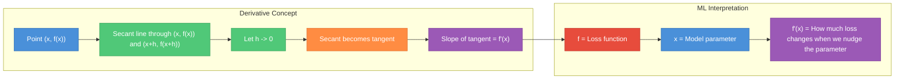
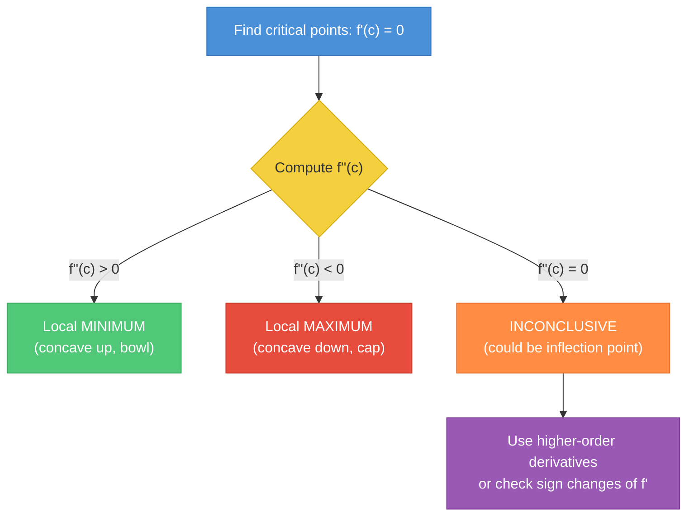
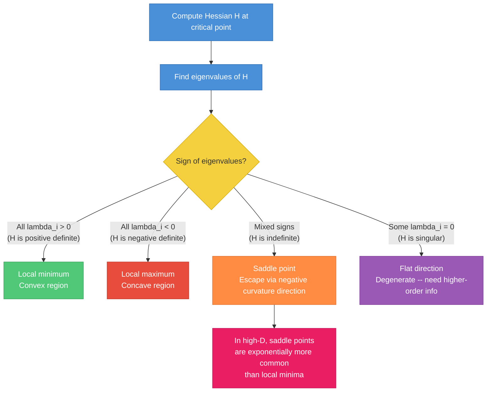
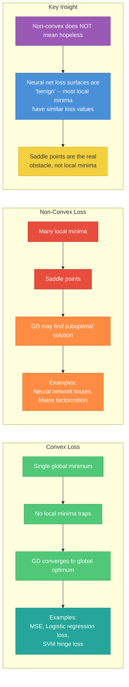
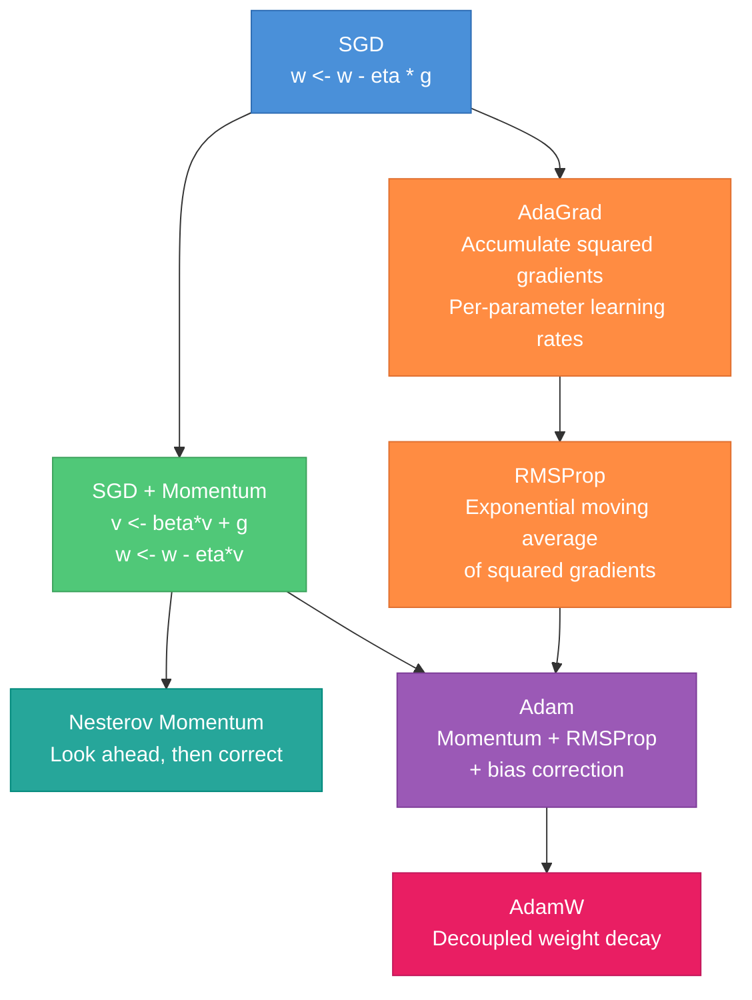
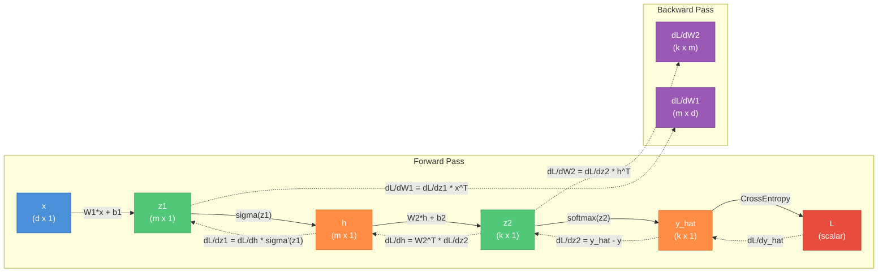
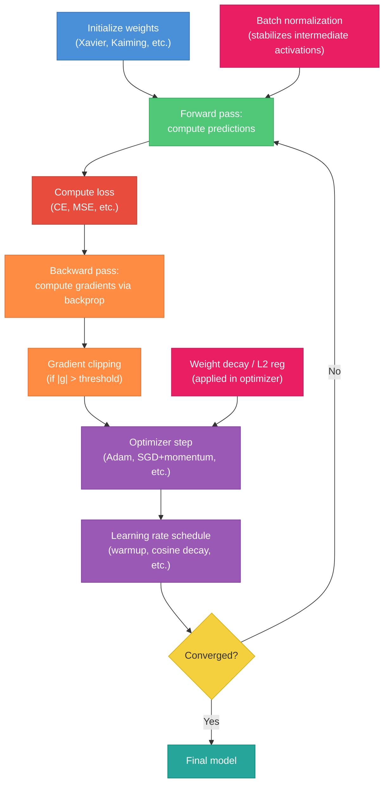

# Calculus and Optimization for ML Interviews

A practical study guide covering the calculus and optimization concepts tested in ML engineer interviews. Part 1 builds foundations; Part 2 applies them to machine learning.

---

## Part 1 -- Foundations

---

### 1. Limits and Continuity

**Why this matters:** Derivatives are defined as limits. You rarely compute limits directly in ML interviews, but you need the concept to understand what a derivative actually is.

**Limit -- intuitive definition:**

The limit of `f(x)` as `x` approaches `a` is the value `f(x)` gets arbitrarily close to as `x` gets close to `a`, regardless of whether `f(a)` itself is defined.

```
lim_{x->a} f(x) = L
```

This means: for every `epsilon > 0`, there exists `delta > 0` such that `|f(x) - L| < epsilon` whenever `0 < |x - a| < delta`.

**Continuity:**

A function `f` is continuous at `a` if:
1. `f(a)` is defined
2. `lim_{x->a} f(x)` exists
3. `lim_{x->a} f(x) = f(a)`

No jumps, no holes, no vertical asymptotes.

**ML relevance:**
- ReLU is continuous everywhere but not differentiable at `x = 0` (we use a subgradient there)
- Sigmoid and tanh are continuous and smooth everywhere -- nice for gradient-based optimization
- Step functions are discontinuous -- one reason we use smooth approximations like sigmoid

**Example:** The function `f(x) = |x|` is continuous everywhere but not differentiable at `x = 0`. The left-hand derivative is `-1` and the right-hand derivative is `+1` -- they disagree.

---

### 2. Derivatives -- The Core Idea

**Definition:**

```
f'(x) = lim_{h->0} [f(x + h) - f(x)] / h
```

This is the slope of the tangent line to `f` at point `x`.

**Two interpretations:**
- **Geometric:** slope of the line tangent to the curve at `x`
- **Physical:** instantaneous rate of change of `f` with respect to `x`



**Example:** For `f(x) = x^2`:
```
f'(x) = lim_{h->0} [(x+h)^2 - x^2] / h
       = lim_{h->0} [2xh + h^2] / h
       = lim_{h->0} (2x + h)
       = 2x
```

**Why it matters for ML:** Every gradient-based optimizer computes derivatives. When you call `loss.backward()` in PyTorch, the engine computes `dL/dw` for every parameter `w` using exactly this concept applied via the chain rule.

#### Likely Interview Questions
- What does the derivative of a loss function represent?
- Why is the derivative of ReLU undefined at 0, and how do frameworks handle it?
- If `f'(a) = 0`, what do we know about `a`?

---

### 3. Differentiation Rules

These are mechanical rules you should know cold. Interviewers expect you to differentiate common functions on a whiteboard without hesitation.

| Rule | Formula | Example |
|------|---------|---------|
| Constant | `d/dx[c] = 0` | `d/dx[5] = 0` |
| Power | `d/dx[x^n] = n * x^(n-1)` | `d/dx[x^3] = 3x^2` |
| Constant Multiple | `d/dx[c * f(x)] = c * f'(x)` | `d/dx[3x^2] = 6x` |
| Sum | `d/dx[f + g] = f' + g'` | `d/dx[x^2 + x] = 2x + 1` |
| Product | `(fg)' = f'g + fg'` | `d/dx[x * sin(x)] = sin(x) + x*cos(x)` |
| Quotient | `(f/g)' = (f'g - fg') / g^2` | `d/dx[x / e^x] = (e^x - x*e^x) / e^(2x)` |
| Chain | `d/dx[f(g(x))] = f'(g(x)) * g'(x)` | `d/dx[sin(x^2)] = cos(x^2) * 2x` |

The **chain rule** is the single most important rule for ML. Backpropagation is just the chain rule applied systematically.

**Common derivatives you must memorize:**

| Function | Derivative | Notes |
|----------|------------|-------|
| `e^x` | `e^x` | Only function equal to its own derivative |
| `ln(x)` | `1/x` | Shows up in log-likelihood |
| `sin(x)` | `cos(x)` | Rarely tested in ML interviews |
| `cos(x)` | `-sin(x)` | Rarely tested in ML interviews |
| `sigmoid(x) = 1/(1 + e^(-x))` | `sigmoid(x) * (1 - sigmoid(x))` | Derive this -- it is asked |
| `tanh(x)` | `1 - tanh(x)^2` | Used in LSTMs, older architectures |
| `ReLU(x) = max(0, x)` | `0 if x < 0, 1 if x > 0` | Undefined at 0, convention: 0 or 1 |
| `softmax(x)_i` | `softmax(x)_i * (delta_{ij} - softmax(x)_j)` | Jacobian, not a simple derivative |

**Derivation: Sigmoid derivative (whiteboard favorite)**

```
sigma(x) = 1 / (1 + e^(-x))

sigma'(x) = d/dx [(1 + e^(-x))^(-1)]
           = -1 * (1 + e^(-x))^(-2) * (-e^(-x))       [chain rule]
           = e^(-x) / (1 + e^(-x))^2
           = [1 / (1 + e^(-x))] * [e^(-x) / (1 + e^(-x))]
           = sigma(x) * [1 - 1/(1 + e^(-x))]
           = sigma(x) * (1 - sigma(x))
```

This is elegant: the derivative is expressed purely in terms of the function itself. Maximum value is `0.25` at `x = 0`, which contributes to the vanishing gradient problem in deep networks.

#### Likely Interview Questions
- Derive the sigmoid derivative from scratch
- What is `d/dx[log(sigmoid(x))]`? (Shows up in binary cross-entropy)
- Why does ReLU largely solve the vanishing gradient problem?

---

### 4. Partial Derivatives

When `f` depends on multiple variables, a partial derivative measures how `f` changes when you vary one variable while holding all others fixed.

**Definition:**

```
df/dx_i = lim_{h->0} [f(x_1, ..., x_i + h, ..., x_n) - f(x_1, ..., x_i, ..., x_n)] / h
```

**Notation:** `df/dx` (curly d, partial) vs `df/dx` (straight d, total). In practice, `df/dx_i` means "differentiate with respect to `x_i`, treat everything else as constant."

**Example:** Let `f(x, y) = x^2 * y + 3y^2`

```
df/dx = 2xy          (treat y as constant)
df/dy = x^2 + 6y     (treat x as constant)
```

**Example -- MSE loss:** Let `L = (1/n) * sum_{i=1}^{n} (y_i - w*x_i - b)^2`

```
dL/dw = (1/n) * sum_{i=1}^{n} 2(y_i - w*x_i - b)(-x_i)
      = -(2/n) * sum_{i=1}^{n} x_i * (y_i - w*x_i - b)

dL/db = (1/n) * sum_{i=1}^{n} 2(y_i - w*x_i - b)(-1)
      = -(2/n) * sum_{i=1}^{n} (y_i - w*x_i - b)
```

These are exactly the gradients used to update `w` and `b` in linear regression.

#### Likely Interview Questions
- Compute the partial derivatives of the MSE loss for linear regression
- Given `f(x, y) = x*e^(xy)`, find `df/dx` and `df/dy`

---

### 5. The Gradient

The gradient collects all partial derivatives into a single vector.

**Definition:** For `f: R^n -> R`:

```
nabla f = (df/dx_1, df/dx_2, ..., df/dx_n)
```

**Key properties:**
- Points in the direction of steepest ascent (negative gradient = steepest descent)
- Magnitude `|nabla f|` = rate of steepest ascent
- Perpendicular to level curves / contour lines


**Directional derivative:** The rate of change of `f` in direction `u` (unit vector):

```
D_u f = nabla f . u = |nabla f| * cos(theta)
```

where `theta` is the angle between `nabla f` and `u`. This is maximized when `u` points in the same direction as `nabla f`.

**Example:** Let `f(x, y) = x^2 + 4y^2` (an elliptical paraboloid).

```
nabla f = (2x, 8y)

At point (1, 1):
nabla f = (2, 8)
|nabla f| = sqrt(4 + 64) = sqrt(68) ~ 8.25
Direction of steepest ascent: (2, 8) / sqrt(68)
```

The contours are ellipses. The gradient is longer in the `y` direction because the function is steeper there (coefficient 4 vs 1). This anisotropy is exactly why vanilla gradient descent oscillates on ill-conditioned problems and why adaptive methods like Adam help.

#### Likely Interview Questions
- What does the gradient of a loss function represent geometrically?
- Why does gradient descent move in the direction of the negative gradient?
- What happens when the gradient is zero?

---

### 6. Higher-Order Derivatives

**Second derivative:** `f''(x) = d/dx[f'(x)]` measures how the slope itself is changing -- the **curvature**.

```
f''(x) > 0  =>  f is concave up (bowl shape)    =>  local minimum possible
f''(x) < 0  =>  f is concave down (cap shape)    =>  local maximum possible
f''(x) = 0  =>  inflection point or inconclusive  =>  need further analysis
```

**Second derivative test** (single variable):
If `f'(c) = 0`:
- `f''(c) > 0` => `c` is a local minimum
- `f''(c) < 0` => `c` is a local maximum
- `f''(c) = 0` => test is inconclusive



**Multivariable extension:** For `f: R^n -> R`, the second derivative generalizes to the Hessian matrix (covered in Section 10).

**Example:** `f(x) = x^3 - 3x`

```
f'(x) = 3x^2 - 3 = 0  =>  x = +/-1
f''(x) = 6x

f''(1) = 6 > 0   =>  x = 1 is a local minimum, f(1) = -2
f''(-1) = -6 < 0  =>  x = -1 is a local maximum, f(-1) = 2
```

---

### 7. The Chain Rule in Depth

The chain rule is the mathematical foundation of backpropagation. If you understand the chain rule deeply, you understand how neural networks learn.

**Scalar chain rule:**

```
d/dx[f(g(x))] = f'(g(x)) * g'(x)
```

Read as: "derivative of the outer function evaluated at the inner function, times derivative of the inner function."

**Example:** `d/dx[e^(x^2)] = e^(x^2) * 2x`

**Multivariable chain rule:** If `z = f(u, v)` where `u = u(x, y)` and `v = v(x, y)`:

```
dz/dx = (df/du)(du/dx) + (df/dv)(dv/dx)
```

**The key insight for backpropagation:** In a computation graph, the gradient of the loss with respect to any intermediate variable is the sum over all paths from that variable to the loss, where each path contributes a product of local derivatives.

```mermaid
flowchart LR
    x["x"]:::blue -->|"dz1/dx"| z1["z1 = W1*x + b1"]:::green
    z1 -->|"dh/dz1"| h["h = sigma(z1)"]:::orange
    h -->|"dz2/dh"| z2["z2 = W2*h + b2"]:::green
    z2 -->|"dy_hat/dz2"| y_hat["y_hat = softmax(z2)"]:::orange
    y_hat -->|"dL/dy_hat"| L["L = CrossEntropy(y_hat, y)"]:::red

    L -.->|"dL/dy_hat"| y_hat
    y_hat -.->|"dL/dz2 = dL/dy_hat * dy_hat/dz2"| z2
    z2 -.->|"dL/dh = dL/dz2 * dz2/dh"| h
    h -.->|"dL/dz1 = dL/dh * dh/dz1"| z1
    z1 -.->|"dL/dx = dL/dz1 * dz1/dx"| x

    classDef blue fill:#4A90D9,stroke:#2E6DB4,color:#fff
    classDef green fill:#50C878,stroke:#3DA35D,color:#fff
    classDef orange fill:#FF8C42,stroke:#E07030,color:#fff
    classDef red fill:#E74C3C,stroke:#C0392B,color:#fff
```



Solid arrows = forward pass. Dashed arrows = backward pass. Each backward arrow multiplies the incoming gradient by the local derivative.

**Why "chain"?** The derivatives multiply in a chain:

```
dL/dx = (dL/dy_hat) * (dy_hat/dz2) * (dz2/dh) * (dh/dz1) * (dz1/dx)
```

**Concrete example -- chain rule through sigmoid:**

```
L = (y - sigma(w*x + b))^2

dL/dw = 2(y - sigma(w*x + b)) * (-1) * sigma'(w*x + b) * x
       = -2(y - sigma(w*x + b)) * sigma(w*x + b)(1 - sigma(w*x + b)) * x
```

Notice three applications of the chain rule: through the square, through the sigmoid, and through the linear function.

#### Likely Interview Questions
- Walk through the chain rule on a simple computation graph
- Why is the chain rule essential for training neural networks?
- What happens to the gradient when many chain rule factors are less than 1? (vanishing gradients)
- What happens when they are greater than 1? (exploding gradients)

---

### 8. Integration (Brief, ML-Relevant)

Integration is not heavily tested in MLE interviews, but several core ML concepts rely on it.

**Definite integral as area:**

```
integral from a to b of f(x) dx = area under f(x) between a and b
```

**Where integrals appear in ML:**

| Concept | Integral Form |
|---------|--------------|
| PDF normalization | `integral from -inf to inf of p(x) dx = 1` |
| Expected value | `E[X] = integral of x * p(x) dx` |
| Variance | `Var[X] = integral of (x - mu)^2 * p(x) dx` |
| KL divergence | `KL(p \|\| q) = integral of p(x) * log(p(x)/q(x)) dx` |
| Marginal likelihood | `p(x) = integral of p(x|z) * p(z) dz` |
| ELBO (in VAEs) | `log p(x) >= E_q[log p(x|z)] - KL(q(z|x) \|\| p(z))` |

**Monte Carlo estimation:** When integrals are intractable (which is most of the time in ML), we approximate:

```
E[f(X)] = integral of f(x) * p(x) dx ~ (1/N) * sum_{i=1}^{N} f(x_i),  x_i ~ p(x)
```

Draw `N` samples from `p(x)` and average `f(x_i)`. This is why sampling is central to modern ML: variational inference, reinforcement learning (policy gradient), GANs, diffusion models.

**Example:** To estimate `E[X^2]` where `X ~ N(0, 1)`:

```python
import numpy as np
samples = np.random.randn(10000)
estimate = np.mean(samples**2)  # Should be close to 1.0 (true variance)
```

#### Likely Interview Questions
- How does Monte Carlo estimation work?
- Why must a PDF integrate to 1?
- What is the relationship between the integral and the expected value?

---

## Part 2 -- Advanced Topics & ML Applications

---

### 9. The Jacobian Matrix

The Jacobian generalizes the derivative to vector-valued functions.

**Definition:** For `f: R^n -> R^m`, the Jacobian `J` is the `m x n` matrix:

```
J[i, j] = df_i / dx_j
```

Row `i` is the gradient of the i-th output. Column `j` shows how all outputs change when `x_j` changes.

**Shape rule:** If `f` maps `R^n -> R^m`, then `J` is `m x n`.

| Function | Input dim | Output dim | Jacobian shape |
|----------|-----------|------------|---------------|
| Scalar loss `L(w)` | n | 1 | 1 x n (gradient is transpose) |
| Linear layer `Wx` | n | m | m x n (the weight matrix itself!) |
| Softmax on `R^k` | k | k | k x k |
| Entire network | n | m | m x n |

**Chain rule with Jacobians:** If `y = f(g(x))`:

```
J_{y,x} = J_{f,g} * J_{g,x}
```

Matrix multiplication of Jacobians. This is exactly what backpropagation computes, but it does so efficiently by propagating **vectors** (not full matrices) using vector-Jacobian products (VJPs).

**Example -- Jacobian of softmax:**

For `s_i = e^(z_i) / sum_k e^(z_k)`:

```
ds_i / dz_j = s_i * (delta_{ij} - s_j)
```

where `delta_{ij}` is the Kronecker delta. This gives a `k x k` Jacobian.

**Why VJPs matter:** Computing the full Jacobian for a neural network would be prohibitively expensive. Instead, backpropagation computes the product `v^T * J` (vector-Jacobian product) for a specific vector `v` -- this is `O(n)` instead of `O(mn)`.

#### Likely Interview Questions
- What is the shape of the Jacobian of a layer with 512 inputs and 256 outputs?
- What is the difference between a Jacobian-vector product (JVP) and a vector-Jacobian product (VJP)?
- Why does backpropagation use VJPs rather than computing full Jacobians?

---

### 10. The Hessian Matrix

The Hessian is the matrix of second-order partial derivatives of a scalar function.

**Definition:** For `f: R^n -> R`:

```
H[i, j] = d^2 f / (dx_i dx_j)
```

**Properties:**
- Shape: `n x n` for a function of `n` variables
- Symmetric: `H[i,j] = H[j,i]` (for smooth functions, by Schwarz's theorem)
- Eigenvalues encode curvature in each eigenvector direction

**Eigenvalue interpretation:**

| Eigenvalues of H | Geometry | Optimization |
|-------------------|----------|-------------|
| All positive | Bowl (convex) | Local minimum |
| All negative | Cap (concave) | Local maximum |
| Mixed signs | Saddle point | Neither min nor max |
| Some zero | Flat direction | Degenerate critical point |



**Condition number:** `kappa(H) = lambda_max / lambda_min`. A large condition number means the loss surface is elongated (steep in some directions, flat in others). This makes gradient descent oscillate. Adaptive optimizers like Adam implicitly handle this.

**Why the Hessian doesn't scale:** For a model with `d` parameters, the Hessian is `d x d`. Modern networks have `d ~ 10^8` to `10^12`. Storing the Hessian requires `O(d^2)` memory -- completely infeasible. This is why second-order methods use approximations (L-BFGS, Kronecker-factored, diagonal).

#### Likely Interview Questions
- What does the Hessian tell you about a critical point?
- How does the condition number of the Hessian relate to optimization difficulty?
- Why can't we use exact second-order methods for deep learning?

---

### 11. Taylor Series and Approximation

Taylor expansion lets you approximate a function locally using its derivatives.

**Taylor expansion around `x`:**

```
f(x + delta) ~ f(x) + f'(x) * delta + (1/2) * f''(x) * delta^2 + ...
```

**Multivariate version:**

```
f(x + delta) ~ f(x) + (nabla f)^T * delta + (1/2) * delta^T * H * delta + ...
```

**Connection to optimization:**

| Approximation order | What it captures | Optimization method |
|---------------------|-----------------|---------------------|
| 0th order | Function value only | Random search |
| 1st order (linear) | Gradient | Gradient descent |
| 2nd order (quadratic) | Gradient + curvature | Newton's method |

**Why gradient descent uses a first-order approximation:**

GD minimizes the linear approximation within a trust region of radius `eta` (the learning rate):

```
w_{t+1} = argmin_{w : |w - w_t| <= eta} [f(w_t) + nabla f(w_t)^T (w - w_t)]
```

The solution is `w_{t+1} = w_t - eta * nabla f(w_t)`.

**Example:** Approximate `e^x` near `x = 0`:

```
e^x ~ 1 + x + x^2/2 + x^3/6 + ...

e^(0.1) ~ 1 + 0.1 + 0.005 + 0.000167 = 1.10517  (actual: 1.10517...)
```

---

### 12. Convexity

Convexity is the single most important structural property in optimization. When a problem is convex, every local minimum is a global minimum.

**Definition:** A function `f` is convex if for all `x, y` and `lambda in [0, 1]`:

```
f(lambda * x + (1 - lambda) * y) <= lambda * f(x) + (1 - lambda) * f(y)
```

Geometrically: the line segment between any two points on the graph lies above (or on) the graph.

**Equivalent conditions:**
- `f` is convex iff `H(x)` is positive semi-definite (PSD) for all `x`
- `f` is strictly convex iff `H(x)` is positive definite for all `x`
- `f` is strongly convex with parameter `mu` iff `H(x) - mu * I` is PSD for all `x`



**Convexity in ML -- what is and what isn't:**

| Model/Loss | Convex? | Why |
|-----------|---------|-----|
| Linear regression + MSE | Yes | Quadratic in parameters |
| Logistic regression + log-loss | Yes | Composition of affine + convex |
| SVM (hinge loss) | Yes | Max of affine functions |
| Neural net (any loss) | No | Nonlinear activations + composition |
| Ridge / Lasso penalty | Yes | But total loss convex only if base loss is |
| k-means | No | Discrete assignment step |

**Strongly convex => fast convergence:**
- Convex: GD converges at `O(1/T)` rate
- Strongly convex: GD converges at `O(exp(-T))` rate (linear convergence)
- Adding L2 regularization makes the loss strongly convex (adds `mu * I` to the Hessian)

#### Likely Interview Questions
- Is the loss function of a neural network convex? Why or why not?
- Why does L2 regularization improve optimization?
- What is the difference between convex and strongly convex?

---

### 13. Gradient Descent

The workhorse of ML optimization.

**Update rule:**

```
w <- w - eta * nabla L(w)
```

where `eta` is the learning rate and `nabla L(w)` is the gradient of the loss.

**Why it works:** Moving in the direction `-nabla L` decreases the loss (locally), because the directional derivative in direction `-nabla L` is `-|nabla L|^2 < 0`.

**Stochastic Gradient Descent (SGD):**

Instead of computing the gradient over the full dataset, use a mini-batch `B`:

```
nabla L(w) ~ (1/|B|) * sum_{i in B} nabla L_i(w)
```

This is an unbiased estimate: `E[nabla L_B] = nabla L`.

**SGD properties:**
- Variance decreases as batch size increases
- Noise acts as implicit regularization (helps generalization)
- Noise helps escape sharp minima and saddle points
- Convergence: `O(1/sqrt(T))` for convex, `O(1/T)` for strongly convex with decaying LR



**Learning rate -- the most important hyperparameter:**

| Learning rate | Behavior |
|--------------|----------|
| Too high | Loss oscillates or diverges |
| Too low | Convergence is painfully slow |
| Just right | Smooth convergence to (near) optimum |

**Rule of thumb:** Start with `eta = 3e-4` for Adam, `eta = 0.1` for SGD with momentum. Do a learning rate sweep over `[1e-5, 1e-1]` on a log scale.

#### Likely Interview Questions
- What is the difference between gradient descent and stochastic gradient descent?
- How does batch size affect training?
- What are the convergence guarantees of GD for convex vs non-convex functions?
- Why does SGD generalize better than full-batch GD?

---

### 14. Momentum and Adaptive Methods

**SGD with Momentum:**

```
v_t = beta * v_{t-1} + nabla L(w_t)
w_{t+1} = w_t - eta * v_t
```

`beta` is typically `0.9`. Momentum accumulates past gradients, which smooths out oscillations and accelerates movement along consistent gradient directions.

**Nesterov Accelerated Gradient (NAG):**

```
v_t = beta * v_{t-1} + nabla L(w_t - eta * beta * v_{t-1})
w_{t+1} = w_t - eta * v_t
```

Evaluates the gradient at the "look-ahead" position. Converges faster for convex functions: `O(1/T^2)` vs `O(1/T)`.

**AdaGrad:**

```
G_t = G_{t-1} + g_t^2          (element-wise, accumulate squared gradients)
w_{t+1} = w_t - eta / sqrt(G_t + epsilon) * g_t
```

Per-parameter learning rates: parameters with large historical gradients get smaller updates. Good for sparse features. Problem: `G_t` only grows, so learning rate monotonically decreases to zero.

**RMSProp:** Fixes AdaGrad's diminishing learning rate with exponential moving average:

```
v_t = rho * v_{t-1} + (1 - rho) * g_t^2
w_{t+1} = w_t - eta / sqrt(v_t + epsilon) * g_t
```

`rho = 0.9` typically.

**Adam (Adaptive Moment Estimation):**

```
m_t = beta_1 * m_{t-1} + (1 - beta_1) * g_t       (1st moment, mean)
v_t = beta_2 * v_{t-1} + (1 - beta_2) * g_t^2     (2nd moment, variance)

m_hat = m_t / (1 - beta_1^t)                        (bias correction)
v_hat = v_t / (1 - beta_2^t)                        (bias correction)

w_{t+1} = w_t - eta * m_hat / (sqrt(v_hat) + epsilon)
```

Default hyperparameters: `beta_1 = 0.9, beta_2 = 0.999, epsilon = 1e-8`.

**AdamW (Decoupled Weight Decay):**

```
w_{t+1} = w_t - eta * (m_hat / (sqrt(v_hat) + epsilon) + lambda * w_t)
```

In standard Adam, L2 regularization interacts with the adaptive learning rate. AdamW decouples them: weight decay is applied directly to `w`, not through the gradient. This is the standard optimizer for training transformers.

**Optimizer comparison table:**

| Optimizer | Momentum | Adaptive LR | Bias Correct | Best For |
|-----------|----------|-------------|-------------|----------|
| SGD | No | No | N/A | Baselines, convex |
| SGD+Momentum | Yes | No | N/A | CNNs, well-tuned |
| AdaGrad | No | Yes | No | Sparse problems, NLP embeddings |
| RMSProp | No | Yes | No | RNNs (historical) |
| Adam | Yes | Yes | Yes | General default |
| AdamW | Yes | Yes | Yes | Transformers, modern default |

#### Likely Interview Questions
- Explain how Adam combines momentum and adaptive learning rates
- What problem does bias correction solve in Adam?
- Why is AdamW preferred over Adam with L2 regularization?
- When might SGD with momentum outperform Adam?

---

### 15. Constrained Optimization and Lagrange Multipliers

**Problem:** Minimize `f(x)` subject to `g(x) = 0`.

You cannot just take the gradient and set it to zero because the solution must lie on the constraint surface.

**Lagrangian method:**

Construct the Lagrangian:

```
L(x, lambda) = f(x) + lambda * g(x)
```

At the optimum, `nabla_x L = 0` and `g(x) = 0`. This gives:

```
nabla f(x) = -lambda * nabla g(x)
```

The gradient of the objective must be parallel to the gradient of the constraint.

**Inequality constraints -- KKT conditions:**

For: minimize `f(x)` subject to `g_i(x) <= 0`, `h_j(x) = 0`:

1. **Stationarity:** `nabla f + sum_i mu_i * nabla g_i + sum_j lambda_j * nabla h_j = 0`
2. **Primal feasibility:** `g_i(x) <= 0`, `h_j(x) = 0`
3. **Dual feasibility:** `mu_i >= 0`
4. **Complementary slackness:** `mu_i * g_i(x) = 0` (either constraint is active or multiplier is zero)

**Where Lagrange multipliers appear in ML:**

| Application | Objective | Constraint |
|------------|-----------|-----------|
| PCA | Maximize `w^T * Sigma * w` (variance) | `\|w\| = 1` (unit vector) |
| SVM (dual) | Maximize margin | Classification constraints |
| Maximum entropy | Maximize entropy | Moment constraints |
| Rate-distortion | Minimize distortion | Rate constraint |
| Constrained RL | Maximize reward | Safety constraints |

**Derivation: PCA via Lagrange multiplier**

Maximize `w^T * Sigma * w` subject to `w^T * w = 1`:

```
L(w, lambda) = w^T * Sigma * w - lambda * (w^T * w - 1)

nabla_w L = 2 * Sigma * w - 2 * lambda * w = 0
=> Sigma * w = lambda * w
```

This is an eigenvalue equation. The optimal `w` is the eigenvector of `Sigma` with the largest eigenvalue `lambda`, and `lambda` equals the variance captured.

#### Likely Interview Questions
- Derive PCA using Lagrange multipliers
- What are the KKT conditions and when do they apply?
- How does the SVM dual problem arise from Lagrangian duality?
- What is the geometric meaning of the Lagrange multiplier?

---

### 16. Backpropagation -- Full Derivation

Backpropagation is the chain rule applied to a computation graph, with smart reuse of intermediate values. This derivation is a common whiteboard exercise.

**Setup: 2-layer MLP for classification**

```
Architecture:
  Input:   x    (d x 1)
  Layer 1: z1 = W1 * x + b1,  h = sigma(z1)     (W1 is m x d, h is m x 1)
  Layer 2: z2 = W2 * h + b2,  y_hat = softmax(z2) (W2 is k x m, y_hat is k x 1)
  Loss:    L = -sum_j y_j * log(y_hat_j)          (cross-entropy)
```

**Forward pass** computes `x -> z1 -> h -> z2 -> y_hat -> L`.

**Backward pass** computes gradients in reverse order.



**Step-by-step derivation:**

**Step 1: Gradient of loss w.r.t. output logits**

For cross-entropy loss with softmax, the gradient has a beautifully simple form:

```
dL/dz2 = y_hat - y
```

where `y` is the one-hot target. This is `(k x 1)`.

**Derivation:**

```
L = -sum_j y_j * log(y_hat_j)
  = -sum_j y_j * log(softmax(z2)_j)
  = -sum_j y_j * (z2_j - log(sum_k exp(z2_k)))
  = -z2_c + log(sum_k exp(z2_k))       (where c is the true class)

dL/dz2_i = -delta_{ic} + exp(z2_i) / sum_k exp(z2_k)
          = -y_i + y_hat_i
          = y_hat_i - y_i
```

**Step 2: Gradient w.r.t. W2 and b2**

```
z2 = W2 * h + b2

dL/dW2 = (dL/dz2) * h^T          shape: (k x 1)(1 x m) = (k x m), same as W2
dL/db2 = dL/dz2                   shape: (k x 1), same as b2
```

**Step 3: Gradient w.r.t. hidden layer h**

```
dL/dh = W2^T * (dL/dz2)           shape: (m x k)(k x 1) = (m x 1), same as h
```

**Step 4: Gradient w.r.t. pre-activation z1**

```
h = sigma(z1)

dL/dz1 = (dL/dh) .* sigma'(z1)    shape: (m x 1), element-wise multiply
```

For sigmoid: `sigma'(z1) = sigma(z1) .* (1 - sigma(z1)) = h .* (1 - h)`.
For ReLU: `sigma'(z1) = (z1 > 0)` (indicator function).

**Step 5: Gradient w.r.t. W1 and b1**

```
dL/dW1 = (dL/dz1) * x^T           shape: (m x 1)(1 x d) = (m x d), same as W1
dL/db1 = dL/dz1                   shape: (m x 1), same as b1
```

**Summary of all gradients:**

```
dL/dz2 = y_hat - y                              (k x 1)
dL/dW2 = (dL/dz2) * h^T                         (k x m)
dL/db2 = dL/dz2                                  (k x 1)
dL/dh  = W2^T * (dL/dz2)                         (m x 1)
dL/dz1 = (dL/dh) .* sigma'(z1)                   (m x 1)
dL/dW1 = (dL/dz1) * x^T                          (m x d)
dL/db1 = dL/dz1                                  (m x 1)
```

**Why backward (right-to-left) is efficient:**

Computing `dL/dx = (dL/dz2)(dz2/dh)(dh/dz1)(dz1/dx)` left-to-right would first multiply two matrices `(dz1/dx)(dh/dz1)`, producing a large matrix. Right-to-left starts with the scalar loss gradient and multiplies by one Jacobian at a time, always producing a vector. Cost: `O(n)` per layer instead of `O(n^2)`.

#### Likely Interview Questions
- Derive backpropagation for a 2-layer MLP from scratch
- Why is `dL/dz = y_hat - y` for softmax + cross-entropy?
- What is the computational complexity of forward pass vs backward pass?
- How do you handle the non-differentiable point of ReLU during backprop?

---

### 17. Second-Order Optimization

**Newton's method:**

```
w_{t+1} = w_t - H^(-1) * nabla L(w_t)
```

Uses curvature information to take optimal-sized steps.

**Comparison with gradient descent:**

| Property | Gradient Descent | Newton's Method |
|----------|-----------------|-----------------|
| Update | `w - eta * g` | `w - H^(-1) * g` |
| Convergence | Linear for strongly convex | Quadratic near optimum |
| Per-step cost | `O(d)` | `O(d^3)` for inverse |
| Memory | `O(d)` | `O(d^2)` for Hessian |
| Hyperparameters | Learning rate `eta` | None (but damping in practice) |

**Why Newton's method doesn't scale:**
- For `d = 10^8` parameters: Hessian has `10^16` entries (petabytes)
- Inverting is `O(d^3)` -- completely infeasible
- Even storing it is impossible

**Practical approximations:**

**L-BFGS:** Stores the last `m` gradient differences to implicitly approximate `H^(-1)`. Memory: `O(md)`. Works well for small-to-medium problems (< millions of parameters). Used in classical ML (logistic regression, CRFs).

**Natural gradient:** Uses the Fisher Information Matrix `F` instead of the Hessian:

```
w_{t+1} = w_t - eta * F^(-1) * nabla L(w_t)
```

`F = E[nabla log p(y|x,w) * nabla log p(y|x,w)^T]`

The Fisher defines a Riemannian metric on parameter space that accounts for the geometry of the probability distribution. Steps are measured in KL divergence rather than Euclidean distance.

**Gauss-Newton approximation:** For least-squares problems `L = (1/2)|r(w)|^2`:

```
H ~ J_r^T * J_r
```

where `J_r` is the Jacobian of the residual. This is always PSD (unlike the true Hessian), which avoids saddle point issues. The Gauss-Newton matrix is related to the Fisher information matrix -- they are equivalent for exponential family models.

**K-FAC (Kronecker-Factored Approximate Curvature):** Approximates the Fisher as Kronecker products of smaller matrices, one per layer. Reduces cost from `O(d^2)` to `O(sum_l d_l^2)`.

#### Likely Interview Questions
- Why does Newton's method converge faster than gradient descent?
- Why can't we use Newton's method for deep learning?
- What is the relationship between the Fisher information matrix and the Hessian?

---

### 18. Applications in ML

**Why loss landscapes of neural nets are non-convex but "benign":**

Research has shown that for overparameterized networks:
- Most local minima have loss values close to the global minimum
- The main obstacle is saddle points, not local minima
- SGD noise helps escape saddle points
- Wider networks have better-connected low-loss regions

**Learning rate schedules:**

| Schedule | Formula | When to use |
|----------|---------|-------------|
| Constant | `eta_t = eta_0` | Baselines, debugging |
| Step decay | `eta_t = eta_0 * gamma^(floor(t/s))` | Classic CNNs |
| Cosine decay | `eta_t = eta_min + 0.5*(eta_0 - eta_min)*(1 + cos(pi*t/T))` | Modern default |
| Linear warmup | `eta_t = eta_0 * t/T_warmup for t < T_warmup` | Transformers (first ~1-5% of steps) |
| Warmup + cosine | Linear ramp then cosine decay | LLM pretraining standard |
| One-cycle | Rise to peak then decay, with momentum mirroring | Fast convergence (Smith, 2018) |

**Gradient clipping:**

When gradients explode (common in RNNs, early transformer training):

```
if |nabla L| > threshold:
    nabla L = threshold * nabla L / |nabla L|
```

This rescales the gradient to have norm at most `threshold` (typically 1.0). Does not change direction, only magnitude.

**The full optimization pipeline in deep learning:**



**Weight initialization matters:**

- Random init too large: activations explode, gradients explode
- Random init too small: activations vanish, gradients vanish
- Xavier/Glorot: `Var(w) = 2 / (fan_in + fan_out)` -- designed for tanh/sigmoid
- Kaiming/He: `Var(w) = 2 / fan_in` -- designed for ReLU
- These ensure the variance of activations stays approximately constant across layers

**Practical tips:**
- Always start with Adam/AdamW and cosine schedule with warmup
- Use gradient clipping (max norm 1.0) for transformer training
- Learning rate is the most important hyperparameter -- always tune it
- Batch size affects generalization: smaller batches often generalize better
- Gradient accumulation lets you simulate large batches on limited GPU memory

#### Likely Interview Questions
- Why do we need learning rate warmup for transformers?
- How does gradient clipping prevent training instability?
- Why does weight initialization matter?
- What is the difference between gradient accumulation and increasing batch size?

---

### 19. Interview Questions Checklist

**Foundational questions:**

1. **What is the derivative of the sigmoid function?** Derive it.
   Answer: `sigma(x) * (1 - sigma(x))`. Full derivation in Section 3.

2. **Why is the chain rule important for deep learning?**
   Answer: Backpropagation IS the chain rule applied to a computation graph. Without it, we cannot compute gradients of the loss w.r.t. parameters in hidden layers.

3. **What does the gradient of a loss function represent?**
   Answer: A vector pointing in the direction of steepest increase of the loss. Its magnitude is the rate of increase. We move in the negative gradient direction to decrease the loss.

4. **What is the Hessian and why does it matter?**
   Answer: Matrix of second partial derivatives. Eigenvalues describe curvature, which determines convergence speed and whether a critical point is a minimum, maximum, or saddle.

5. **Is the loss function of a neural network convex?**
   Answer: No. Nonlinear activations and composition make it non-convex. However, overparameterized networks have "benign" loss landscapes where most local minima are near-global.

**Optimization questions:**

6. **Explain the difference between SGD, momentum, and Adam.**
   Answer: SGD uses raw gradient. Momentum adds exponential moving average of gradients (velocity). Adam adds per-parameter adaptive learning rates using second moment estimates plus bias correction.

7. **Why does Adam have bias correction terms?**
   Answer: The running averages `m_t` and `v_t` are initialized to zero. In early steps, they are biased toward zero. Dividing by `(1 - beta^t)` corrects this, giving unbiased estimates.

8. **What is the vanishing gradient problem?**
   Answer: When gradients are multiplied through many layers (chain rule), if each factor is < 1, the product shrinks exponentially. Gradients become negligibly small for early layers. ReLU, skip connections (ResNet), and normalization layers mitigate this.

9. **Derive backpropagation for a 2-layer MLP.**
   Answer: Full derivation in Section 16. Key result: `dL/dz2 = y_hat - y`, then propagate backward multiplying by weight matrices and activation derivatives.

10. **Why can't we use Newton's method for deep learning?**
    Answer: The Hessian is `d x d` where `d` can be billions. Storing it requires `O(d^2)` memory and inverting it costs `O(d^3)` time -- both completely infeasible.

**Applied questions:**

11. **What is the effect of learning rate on training?**
    Answer: Too high causes divergence or oscillation. Too low causes slow convergence and getting stuck. Learning rate schedules (warmup + decay) address this by starting cautious, ramping up, then annealing.

12. **How does gradient clipping work and when is it needed?**
    Answer: Rescales gradient to have norm at most some threshold. Needed when gradients explode (RNNs, transformer pretraining). Preserves gradient direction, only limits magnitude.

13. **Derive the gradient of the MSE loss for linear regression.**
    Answer: `dL/dw = -(2/n) * X^T * (y - Xw)`. Setting to zero gives the normal equation `w = (X^T X)^(-1) X^T y`.

14. **What are KKT conditions and where do they appear in ML?**
    Answer: Necessary conditions for constrained optimization with inequality constraints. Central to the SVM dual derivation: stationarity, primal feasibility, dual feasibility, complementary slackness.

15. **Why does SGD generalize better than full-batch gradient descent?**
    Answer: The noise in mini-batch gradients acts as implicit regularization, pushing the optimizer toward flatter minima that generalize better. Full-batch GD can converge to sharper minima that overfit.

**Key derivations to practice on a whiteboard:**
- Sigmoid derivative
- Softmax + cross-entropy gradient (`y_hat - y`)
- Backpropagation through a 2-layer MLP (with dimensions)
- PCA via Lagrange multiplier
- Gradient of MSE loss for linear regression
- Adam update rule (with bias correction)
- KL divergence gradient (for VAEs)

---

**End of guide.** Master Part 1 before moving to Part 2 -- interviewers test foundations more than advanced topics for MLE roles.
