# Deep Learning Architectures for ML Interviews

A practical study guide covering deep learning architectures from fundamental building blocks to modern transformer variants and generative models. Part 1 builds foundational understanding of neurons, CNNs, RNNs, and training techniques. Part 2 covers transformers in depth, efficient attention, generative models, multi-modal architectures, and design principles that come up in senior ML interviews.

---

## Part 1 -- Foundations

---

### 1. Building Blocks of Neural Networks

The fundamental unit of a neural network is the **neuron** (or perceptron). It computes a weighted sum of its inputs, adds a bias, and applies a nonlinear activation function:

```
y = sigma(w^T x + b)
```

where `w` is the weight vector, `x` is the input, `b` is the bias, and `sigma` is the activation function. This simple operation, composed across layers and neurons, is what gives neural networks their power.

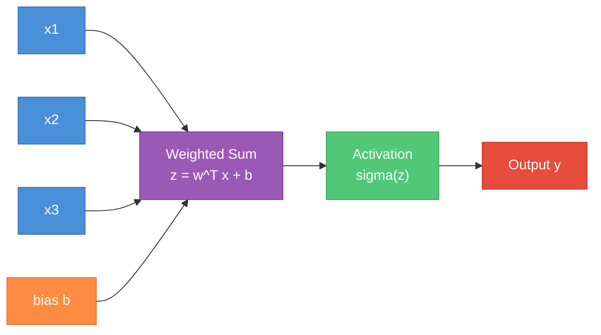

**Activation functions** introduce nonlinearity. Without them, any composition of linear layers collapses to a single linear transformation -- no matter how many layers you stack, `W2(W1 x + b1) + b2 = W' x + b'`. This is why nonlinearity is necessary: it allows networks to approximate complex, nonlinear decision boundaries.

| Activation | Formula | Range | Pros | Cons | Typical Use |
|---|---|---|---|---|---|
| Sigmoid | `1 / (1 + e^(-x))` | (0, 1) | Smooth, probabilistic output | Saturates, vanishing gradients, not zero-centered | Binary output layers |
| Tanh | `(e^x - e^(-x)) / (e^x + e^(-x))` | (-1, 1) | Zero-centered | Saturates at extremes | RNN hidden states (legacy) |
| ReLU | `max(0, x)` | [0, inf) | No saturation for positive x, fast to compute, sparse activations | Dead neuron problem (gradient = 0 for x < 0) | Default for CNNs, MLPs |
| Leaky ReLU | `max(0.01x, x)` | (-inf, inf) | Fixes dead neurons | Small negative slope is a hyperparameter | When dead neurons are a concern |
| GELU | `x * Phi(x)` (Phi = Gaussian CDF) | approx (-0.17, inf) | Smooth approximation of ReLU, probabilistic gating | Slightly more expensive | Transformers (BERT, GPT) |
| Swish/SiLU | `x * sigmoid(x)` | approx (-0.28, inf) | Smooth, self-gated, outperforms ReLU in deeper nets | Slightly more expensive | Modern architectures (EfficientNet, LLaMA) |
| Softmax | `e^(x_i) / sum(e^(x_j))` | (0, 1), sums to 1 | Produces valid probability distribution | Not an elementwise function, overflow-sensitive | Multi-class output layer |

**Universal approximation theorem** (brief): A feedforward network with a single hidden layer of sufficient width can approximate any continuous function on a compact set to arbitrary accuracy. This is an existence result -- it says nothing about learnability, required width, or generalization. In practice, depth is far more parameter-efficient than width.

---

### 2. Feedforward Networks (MLPs)

A multilayer perceptron (MLP) stacks linear layers with nonlinear activations:

```
h1 = sigma(W1 x + b1)
h2 = sigma(W2 h1 + b2)
y  = W3 h2 + b3
```

**Forward pass**: Input flows through each layer sequentially. Each layer applies a linear transformation followed by an activation. The final layer typically has no activation (regression) or softmax (classification).

**Capacity and depth**: Deeper networks can represent more complex functions with fewer parameters than shallow-but-wide networks. A 2-layer network might need exponentially many neurons to represent what a deeper network handles with polynomial width. Depth creates hierarchical feature representations.

**When MLPs are sufficient**:
- Tabular data (structured features)
- Simple classification or regression tasks
- As sub-components within larger architectures (e.g., the FFN in transformers)

**Limitations**:
- No parameter sharing -- every weight is unique, so parameter count grows with input size
- No awareness of spatial structure (images) or sequential structure (text)
- Not translation-equivariant: shifting an input pattern requires relearning the same pattern at a different position

---

### 3. Loss Functions Deep Dive

The loss function defines what the network optimizes. Choosing the right loss is critical -- it encodes your problem's assumptions.

**Regression losses**:

- **MSE (Mean Squared Error)**: `L = (1/n) * sum((y - y_hat)^2)`. Gradient: `2(y_hat - y)`. Penalizes large errors heavily (quadratic). Sensitive to outliers.
- **MAE (Mean Absolute Error)**: `L = (1/n) * sum(|y - y_hat|)`. More robust to outliers but has non-smooth gradient at zero.
- **Huber loss**: MSE when error is small, MAE when large. Best of both worlds with tunable threshold delta.

**Classification losses**:

- **Cross-entropy**: `L = -sum(y_i * log(y_hat_i))` for multi-class with one-hot labels. This simplifies to `-log(y_hat_c)` where c is the correct class.
- **Binary cross-entropy (BCE)**: `L = -[y * log(y_hat) + (1-y) * log(1-y_hat)]`. Used for binary classification or multi-label problems.

**Why cross-entropy + softmax instead of MSE for classification**: MSE gradients for softmax outputs become very small when the output is confident but wrong (saturated sigmoid/softmax region). Cross-entropy produces a gradient of `(y_hat - y)` when combined with softmax -- linear in the error, so learning is fast even when the model is very wrong. MSE would produce near-zero gradients in that regime.

**Embedding losses**:
- **Contrastive loss**: Pulls similar pairs together, pushes dissimilar pairs apart by at least a margin.
- **Triplet loss**: `L = max(0, d(anchor, positive) - d(anchor, negative) + margin)`. Requires careful mining of hard negatives.

**Specialized losses**:
- **Hinge loss**: `L = max(0, 1 - y * y_hat)`. Used in SVMs. Margin-based -- only penalizes when not confident enough.
- **Focal loss**: `L = -alpha * (1 - y_hat)^gamma * log(y_hat)`. Down-weights easy examples, focuses on hard ones. Designed for extreme class imbalance (e.g., object detection where background dominates).
- **Label smoothing loss**: Replace hard targets [0, 1] with soft targets [epsilon/(K-1), 1-epsilon]. Prevents overconfident predictions, acts as regularizer.

| Problem | Loss Function | When to Use |
|---|---|---|
| Regression | MSE | Default for regression, assumes Gaussian noise |
| Regression (outliers) | Huber / MAE | Robust to outliers |
| Binary classification | BCE | Two classes or multi-label |
| Multi-class | Cross-entropy | Mutually exclusive classes |
| Ranking / retrieval | Triplet / Contrastive | Learning embeddings |
| Class imbalance | Focal loss | Heavily skewed class distribution |
| Calibration | Label smoothing CE | Want less overconfident predictions |

---

### 4. Weight Initialization

**Why zero initialization fails**: If all weights are identical, every neuron in a layer computes the same function, receives the same gradient, and updates identically. The network has no way to break this symmetry -- it effectively has one neuron per layer regardless of width.

**Random initialization**: We initialize weights randomly, but the scale matters enormously. Too large and activations explode; too small and they vanish to zero.

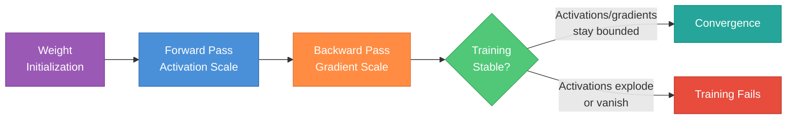

**Xavier/Glorot initialization**: `Var(w) = 2 / (n_in + n_out)`. Designed to keep variance of activations and gradients stable across layers when using sigmoid or tanh activations. Derived by requiring `Var(output) = Var(input)` for each layer.

**He/Kaiming initialization**: `Var(w) = 2 / n_in`. Accounts for the fact that ReLU zeros out half the activations (halving the variance), so we need double the initial variance compared to Xavier. Use this for ReLU/Leaky ReLU networks.

**Why initialization matters in practice**: Even with modern normalization layers (BatchNorm, LayerNorm), poor initialization can cause initial training instability, slow convergence, or loss spikes. Good initialization gives the optimizer a healthy starting point.

| Initialization | Formula | Best For |
|---|---|---|
| Xavier/Glorot (uniform) | `U(-sqrt(6/(n_in+n_out)), sqrt(6/(n_in+n_out)))` | Sigmoid, Tanh |
| Xavier/Glorot (normal) | `N(0, 2/(n_in+n_out))` | Sigmoid, Tanh |
| He/Kaiming (normal) | `N(0, 2/n_in)` | ReLU, Leaky ReLU |
| He/Kaiming (uniform) | `U(-sqrt(6/n_in), sqrt(6/n_in))` | ReLU, Leaky ReLU |

---

### 5. Normalization Techniques

Normalization layers stabilize training by controlling the distribution of activations. They are one of the most impactful architectural choices.

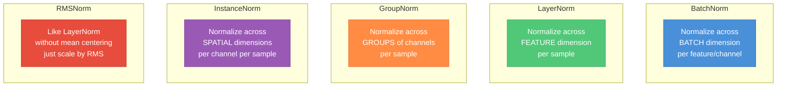

**BatchNorm**: Normalizes across the batch dimension for each feature. For a batch of activations, compute mean and variance across all samples for each channel, then normalize, scale, and shift:

```
x_hat = (x - mu_batch) / sqrt(sigma_batch^2 + epsilon)
y = gamma * x_hat + beta     (learnable scale and shift)
```

- **Training**: uses batch statistics (mean, variance of current mini-batch)
- **Inference**: uses exponentially smoothed running statistics accumulated during training
- **Pros**: faster convergence, mild regularization effect (noise from batch statistics), allows higher learning rates
- **Cons**: behavior depends on batch size (degrades for small batches), problematic for variable-length sequences, introduces train/test discrepancy

**LayerNorm**: Normalizes across the feature dimension for each individual sample. Batch-independent -- each sample is normalized on its own.

- Used universally in transformers because sequences have variable length and batch statistics are unreliable
- No running statistics needed; identical behavior at train and test time

**RMSNorm**: Simplification of LayerNorm that skips mean centering and normalizes only by the root mean square: `x_hat = x / RMS(x)`, where `RMS(x) = sqrt((1/n) * sum(x_i^2))`. About 10-15% faster than LayerNorm. Used in LLaMA, Gemma, and most modern LLMs.

**GroupNorm**: Divides channels into groups and normalizes within each group per sample. A middle ground: more stable than BatchNorm for small batches, more expressive than LayerNorm for vision tasks.

**InstanceNorm**: Normalizes each channel of each sample independently across spatial dimensions. Used primarily in style transfer (removes style information from feature statistics).

| Method | Normalizes Over | Batch-Dependent | Primary Use |
|---|---|---|---|
| BatchNorm | Batch + Spatial, per channel | Yes | CNNs (large batch) |
| LayerNorm | Features, per sample | No | Transformers, RNNs |
| RMSNorm | Features (RMS only), per sample | No | Modern LLMs (LLaMA, Gemma) |
| GroupNorm | Groups of channels, per sample | No | CNNs (small batch), detection |
| InstanceNorm | Spatial, per channel per sample | No | Style transfer |

---

### 6. Regularization Techniques

Regularization prevents overfitting -- when the model memorizes training data but fails to generalize. There are many complementary strategies.

**L1 and L2 regularization (weight decay)**:
- **L2**: Add `lambda * sum(w_i^2)` to loss. Equivalent to weight decay in SGD (but not exactly in Adam -- use decoupled weight decay / AdamW). Pushes weights toward zero but rarely to exactly zero.
- **L1**: Add `lambda * sum(|w_i|)` to loss. Promotes sparsity -- some weights become exactly zero. Used for feature selection.

**Dropout**: During training, randomly zero out each activation with probability `p` (typically 0.1-0.5).
- Forces the network to not rely on any single neuron -- builds redundancy
- At inference: no dropout, but activations are scaled by `(1-p)` to compensate for the missing neurons. In practice, **inverted dropout** is used: scale activations by `1/(1-p)` during training so no change is needed at inference.
- **Spatial dropout** (for CNNs): drops entire feature maps instead of individual activations
- **Dropout in attention**: applied to attention weights (attention dropout) and to the output of sublayers

**Data augmentation**:
- Images: random crop, horizontal flip, color jitter, rotation, cutout, RandAugment
- Text: back-translation, synonym replacement, random insertion/deletion
- Creates "virtual" training examples without collecting new data

**Label smoothing**: Replace hard targets `[0, 0, 1, 0]` with smoothed `[eps/K, eps/K, 1-eps+eps/K, eps/K]` where `eps` is typically 0.1. Prevents the model from becoming overconfident and improves calibration.

**Early stopping**: Monitor validation loss and stop training when it starts increasing. Simple but effective -- the implicit regularization of stopping before convergence.

**Mixup and CutMix**:
- **Mixup**: blend two training samples and their labels: `x = lambda*x1 + (1-lambda)*x2`, `y = lambda*y1 + (1-lambda)*y2`
- **CutMix**: cut a patch from one image and paste onto another, blend labels proportionally

**Stochastic depth**: Randomly drop entire residual blocks during training (identity shortcut remains). Used in training very deep ResNets and Vision Transformers. Reduces training time and acts as regularization.

---

### 7. Convolutional Neural Networks (CNNs)

CNNs exploit the spatial structure of images through three key ideas: **local connectivity** (each neuron sees only a small region), **parameter sharing** (the same filter is applied everywhere), and **translation equivariance** (the same pattern is detected regardless of position).

**Convolution operation**: A filter (kernel) of size `k x k` slides over the input. At each position, compute the dot product between the filter weights and the input patch. This produces a feature map.

**Key parameters**:
- **Kernel size**: typically 3x3 or 5x5. Larger kernels see more context but have more parameters
- **Stride**: step size of the sliding window. Stride 2 halves spatial dimensions (used instead of pooling in modern architectures)
- **Padding**: add zeros around input to control output size. "Same" padding preserves spatial dimensions
- **Dilation**: spacing between kernel elements. Dilation of 2 on a 3x3 kernel gives a 5x5 receptive field with only 9 parameters

**Receptive field**: The region of the original input that influences a given neuron's output. Grows with depth: a stack of two 3x3 convolutions has a 5x5 receptive field, three 3x3 layers give 7x7 -- same as one 7x7 kernel but with far fewer parameters and more nonlinearity. This is why VGG used stacks of 3x3 filters.

**Pooling**: Reduces spatial dimensions. Max pooling selects the maximum in each window (captures "is the feature present?"). Average pooling takes the mean (captures "how much of the feature?"). Global average pooling over the entire spatial dimension replaces the final FC layer in modern architectures.

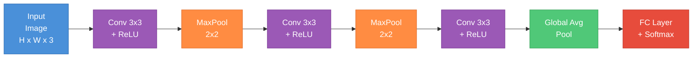

**Feature hierarchy**: Early layers learn low-level features (edges, gradients), middle layers combine them into textures and patterns, deeper layers capture high-level semantics (object parts, entire objects). This hierarchy emerges naturally from training.

**Classic architecture progression**:
- **LeNet (1998)**: 2 conv layers + 3 FC layers. Proved CNNs work for digit recognition.
- **AlexNet (2012)**: Deeper, used ReLU, dropout, GPU training. Won ImageNet and launched the deep learning era.
- **VGG (2014)**: Very deep (16-19 layers), all 3x3 convolutions. Showed depth matters.
- **ResNet (2015)**: 50-152+ layers with skip connections. Solved the degradation problem.

**1x1 convolutions**: A `1x1` kernel operates only on channels, not spatial dimensions. It mixes information across channels (like a per-pixel fully connected layer). Used to reduce/expand channel dimensions cheaply (Inception bottleneck, ResNet bottleneck).

**Depthwise separable convolutions** (MobileNets): Factor a standard convolution into two steps:
1. **Depthwise**: apply one filter per input channel (spatial filtering only)
2. **Pointwise**: 1x1 convolution to mix channels

A standard `k x k` conv on `C_in` to `C_out` channels costs `k^2 * C_in * C_out` parameters. Depthwise separable costs `k^2 * C_in + C_in * C_out` -- roughly `k^2` times cheaper. Critical for mobile and edge deployment.

---

### 8. Residual Connections

**The problem**: Naively stacking more layers should only help (the extra layers could learn identity if nothing else). But in practice, very deep plain networks (without skip connections) perform worse than shallower ones -- not due to overfitting, but due to optimization difficulty. Gradients vanish through many multiplicative layers.

**The ResNet insight**: Instead of learning the desired mapping `H(x)` directly, learn the residual `F(x) = H(x) - x`. The output is then:

```
y = F(x) + x
```

If the optimal transformation is close to identity (which it often is for deeper layers), learning a small residual `F(x) ~ 0` is much easier than learning `H(x) ~ x`.

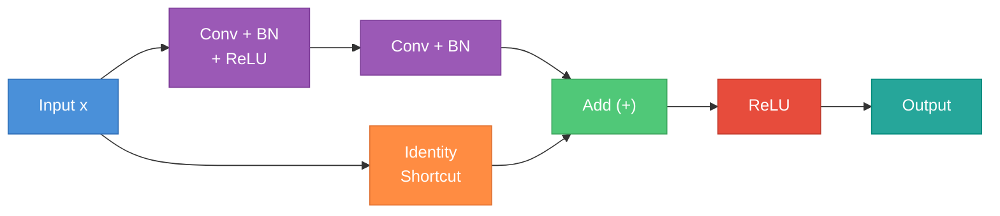

**Why it works**: During backpropagation, the gradient flows through the skip connection unimpeded (`d(x)/dx = 1`). Even if the gradient through the convolutional path vanishes, the identity path ensures gradients reach early layers. Mathematically, the gradient is `dL/dx = dL/dy * (dF/dx + 1)` -- the `+1` from the identity prevents vanishing.

**Pre-activation vs post-activation residual blocks**:
- **Post-activation** (original ResNet): Conv -> BN -> ReLU -> Conv -> BN -> Add -> ReLU
- **Pre-activation** (ResNet v2): BN -> ReLU -> Conv -> BN -> ReLU -> Conv -> Add

Pre-activation is theoretically cleaner (information flows through an identity path without modification) and performs slightly better for very deep networks.

**Residual connections are everywhere in modern DL**: Every transformer block uses them (around both attention and FFN sublayers). U-Nets use skip connections between encoder and decoder. DenseNets concatenate (rather than add) all previous features. The skip connection is arguably the single most important architectural innovation in deep learning.

---

### 9. Recurrent Neural Networks (RNNs)

RNNs process sequential data by maintaining a hidden state that is updated at each time step.

**Vanilla RNN**: At time step `t`:

```
h_t = tanh(W_hh * h_{t-1} + W_xh * x_t + b)
y_t = W_hy * h_t
```

The same weights `W_hh`, `W_xh` are shared across all time steps -- this is how RNNs handle variable-length sequences with a fixed number of parameters.

**Vanishing/exploding gradient problem**: When backpropagating through time (BPTT), gradients are multiplied by `W_hh` at each step. Over `T` steps, this becomes `W_hh^T`. If the largest eigenvalue of `W_hh` is > 1, gradients explode. If < 1, they vanish. This makes it nearly impossible for vanilla RNNs to learn long-range dependencies (beyond ~20 steps in practice).

**LSTM (Long Short-Term Memory)**: Introduces a cell state `c_t` (a "highway" for information) and three gates:

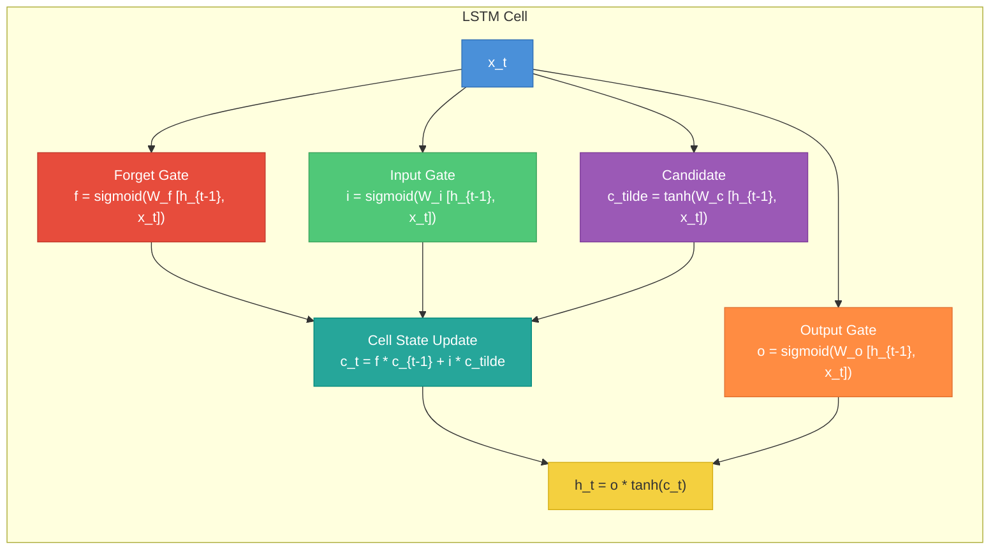

- **Forget gate** (`f`): decides what to discard from cell state
- **Input gate** (`i`): decides what new information to store
- **Output gate** (`o`): decides what to output from cell state

The cell state acts like a conveyor belt -- information can flow along it unchanged (when forget gate is 1 and input gate is 0), solving the vanishing gradient problem through additive (not multiplicative) updates.

**GRU (Gated Recurrent Unit)**: Simplifies LSTM by merging cell state and hidden state, using only two gates (reset and update). Fewer parameters, similar performance on many tasks:

```
z_t = sigmoid(W_z [h_{t-1}, x_t])          (update gate)
r_t = sigmoid(W_r [h_{t-1}, x_t])          (reset gate)
h_tilde = tanh(W [r_t * h_{t-1}, x_t])     (candidate)
h_t = (1 - z_t) * h_{t-1} + z_t * h_tilde  (output)
```

**Bidirectional RNNs**: Run two RNNs -- one forward, one backward -- and concatenate their hidden states. Each position has context from both past and future. Used when the full sequence is available (classification, not generation).

**Sequence-to-sequence with attention**: Encoder RNN produces hidden states for each input position. Decoder RNN attends to these states at each output step, computing a weighted combination based on relevance. This was the precursor to transformers.

**Why transformers replaced RNNs**:
1. **Parallelism**: RNNs process tokens sequentially (each step depends on the previous). Transformers process all positions in parallel.
2. **Long-range dependencies**: Self-attention connects any two positions with O(1) path length. RNNs require O(n) steps, and information degrades.
3. **Scalability**: Transformer training scales efficiently with hardware (GPU parallelism) and data.

---

## Part 2 -- Modern and Advanced Architectures

---

### 10. The Transformer -- In Depth

The transformer, introduced in "Attention Is All You Need" (2017), replaced recurrence with self-attention and became the foundation for virtually all modern NLP and increasingly all of deep learning.

**Architecture variants**:
- **Encoder-decoder** (original transformer, T5): encoder processes input bidirectionally, decoder generates output autoregressively with cross-attention to encoder
- **Decoder-only** (GPT family, LLaMA): autoregressive generation with causal masking. Dominates language modeling.
- **Encoder-only** (BERT): bidirectional encoding with masked language modeling. Used for understanding tasks (classification, NER, retrieval).

**Scaled dot-product attention**:

```
Attention(Q, K, V) = softmax(Q K^T / sqrt(d_k)) V
```

- `Q` (queries), `K` (keys), `V` (values) are linear projections of the input
- `Q K^T` computes similarity scores between all pairs of positions
- **Why `sqrt(d_k)` scaling**: Without it, when `d_k` is large, the dot products grow large in magnitude, pushing softmax into saturated regions where gradients are tiny. Dividing by `sqrt(d_k)` keeps the variance of the dot products at ~1 regardless of dimension.
- **Causal masking**: For autoregressive models, mask out (set to -inf before softmax) all positions where the query position is before the key position. This prevents the model from "seeing the future."

**Multi-head attention**: Instead of one attention function with `d_model`-dimensional keys/queries/values, use `h` parallel attention heads, each with dimension `d_k = d_model / h`:

```
MultiHead(Q, K, V) = Concat(head_1, ..., head_h) W_O
where head_i = Attention(Q W_Q_i, K W_K_i, V W_V_i)
```

Each head can attend to different aspects (syntactic, semantic, positional) at different scales.

**Position encodings**: Attention is permutation-equivariant -- without positional information, the model cannot distinguish "dog bites man" from "man bites dog."
- **Sinusoidal** (original): fixed, based on sine/cosine at different frequencies. Can theoretically generalize to unseen lengths.
- **Learned**: trainable embedding per position. Simple, effective, but limited to training-time max length.
- **RoPE (Rotary Position Embedding)**: encodes position by rotating query/key vectors. Naturally captures relative positions, extrapolates better. Used in LLaMA, Mistral, and most modern LLMs.
- **ALiBi**: adds a linear bias to attention scores based on distance. No position embeddings needed, good length generalization.

**Pre-norm vs post-norm**:
- **Post-norm** (original transformer): `x + Sublayer(LayerNorm(x))` -- no, actually: `LayerNorm(x + Sublayer(x))`. Norm is applied after the residual.
- **Pre-norm** (modern): `x + Sublayer(LayerNorm(x))`. Norm is applied before the sublayer.
- Pre-norm is more stable during training (gradients flow cleanly through the residual path) and does not need learning rate warmup as critically. Nearly all modern transformers use pre-norm.

**Feed-forward network (FFN)**: Each transformer block contains a position-wise FFN:

```
FFN(x) = W_2 * activation(W_1 * x + b_1) + b_2
```

Typically `W_1` projects from `d_model` to `4 * d_model` (up-projection), and `W_2` projects back down. Modern models use **SwiGLU**: `FFN(x) = W_2 * (Swish(W_gate * x) * (W_up * x))`, which uses a gated linear unit and has shown better performance. LLaMA, Gemma, and Mistral all use SwiGLU with expansion ratio ~8/3 instead of 4.

**The residual stream perspective**: Think of the transformer as maintaining a "residual stream" -- a vector per position that flows through the network. Each attention layer and FFN reads from this stream and writes an additive update back to it. This framing, from the "mathematical framework for transformer circuits" line of work, makes it clear that layers communicate through this shared medium rather than each layer receiving the "output" of the previous layer.

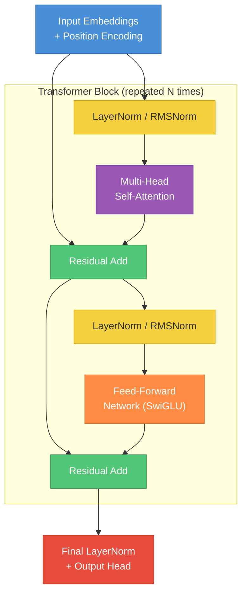

---

### 11. Transformer Variants and Modern LLM Architectures

**GPT family** (decoder-only): Autoregressive language modeling -- predict the next token given all previous tokens. Uses causal (masked) self-attention. Pre-trained on massive text corpora, then fine-tuned or prompted. GPT-2/3/4 showed that scaling decoder-only models yields emergent capabilities.

**BERT family** (encoder-only): Masked language modeling -- mask 15% of input tokens and predict them using bidirectional context. Produces rich contextual embeddings used for downstream tasks via fine-tuning. Variants: RoBERTa (better training recipe), DeBERTa (disentangled attention), ELECTRA (replaced token detection).

**T5 / encoder-decoder**: Frames every NLP task as text-to-text. Encoder processes input bidirectionally, decoder generates output autoregressively with cross-attention. Versatile but less popular for pure generation than decoder-only models.

**Modern efficiency improvements**:

- **Grouped Query Attention (GQA)**: Instead of independent K/V heads, share K/V projections across groups of query heads. LLaMA 2 (70B) uses 8 KV heads for 64 query heads. Dramatically reduces KV cache size during inference with minimal quality loss.

- **Multi-Query Attention (MQA)**: Extreme case -- all query heads share a single K/V head. Even cheaper inference but slightly lower quality. Used in PaLM, Falcon.

- **Sliding window attention** (Mistral): Each layer attends only to the previous `W` tokens (e.g., W=4096). With `L` layers, the effective receptive field is `L * W`. Reduces memory from O(n^2) to O(n * W).

- **FlashAttention**: Not an approximation -- computes exact standard attention but in a hardware-aware, tiled manner. Avoids materializing the full `n x n` attention matrix in HBM (GPU memory). Uses tiling and recomputation to achieve O(n) memory instead of O(n^2). Provides 2-4x speedup on typical sequence lengths.

- **Mixture of Experts (MoE)**: Replace the FFN with multiple "expert" FFN layers and a router that sends each token to a subset (typically top-2) of experts. Total parameters are large (e.g., 8x7B = 46.7B in Mixtral) but compute per token is much smaller (only 2 experts active = ~12.9B active). Enables scaling parameters without proportional compute increase.

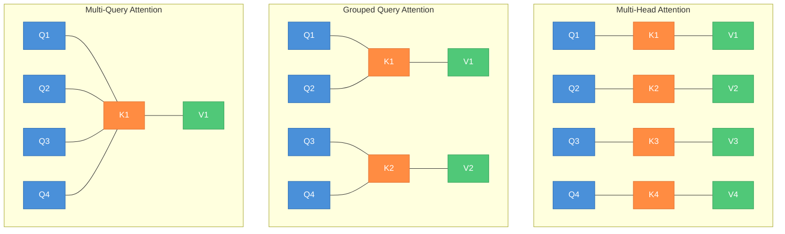

| Model Family | Type | Attention | Position Encoding | Norm | FFN | Notable Feature |
|---|---|---|---|---|---|---|
| GPT-2/3 | Decoder-only | MHA | Learned | Post-norm (GPT-2), Pre-norm (GPT-3) | Standard | Scaled up autoregressive LM |
| BERT | Encoder-only | MHA (bidirectional) | Learned | Post-norm | Standard | Masked language modeling |
| T5 | Encoder-decoder | MHA | Relative bias | Pre-norm | Standard | Text-to-text framework |
| LLaMA 1/2/3 | Decoder-only | GQA (2+) / MHA (1) | RoPE | Pre-RMSNorm | SwiGLU | Open-weight, efficient |
| Mistral | Decoder-only | GQA + Sliding window | RoPE | Pre-RMSNorm | SwiGLU | Sliding window attention |
| Mixtral | Decoder-only (MoE) | GQA + Sliding window | RoPE | Pre-RMSNorm | MoE (8 experts, top-2) | Sparse MoE for efficiency |
| Gemma | Decoder-only | MHA / GQA | RoPE | Pre-RMSNorm | GeGLU | Google's open model |

---

### 12. Generative Models

Generative models learn the data distribution `p(x)` and can generate new samples. There are four major families.

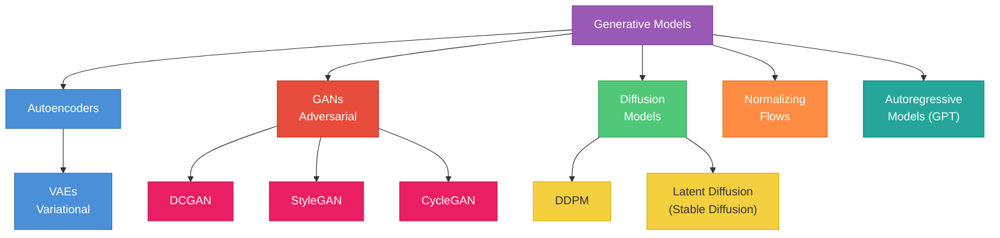

**Autoencoders**: Encoder maps input to a lower-dimensional latent code, decoder reconstructs the input. Trained to minimize reconstruction error. Not truly generative -- the latent space has no structured distribution to sample from.

**Variational Autoencoders (VAEs)**:
- Encoder outputs parameters of a distribution: `mu` and `log_sigma^2` (not a single point)
- Sample `z ~ N(mu, sigma^2)` from this distribution
- **Reparameterization trick**: To backpropagate through sampling, write `z = mu + sigma * epsilon` where `epsilon ~ N(0, 1)`. The randomness is factored out into `epsilon`, making `z` a deterministic, differentiable function of `mu` and `sigma`.
- Loss = **reconstruction loss** (how well the decoder recreates the input) + **KL divergence** (how close the encoder's distribution is to the prior `N(0, I)`)
- Generate new samples by sampling `z ~ N(0, I)` and decoding
- Tend to produce blurry outputs (MSE reconstruction encourages averaging)

**Generative Adversarial Networks (GANs)**:
- **Generator** `G`: maps random noise `z` to fake data `G(z)`
- **Discriminator** `D`: classifies inputs as real or fake
- **Minimax game**: `min_G max_D E[log D(x)] + E[log(1 - D(G(z)))]`
- Generator tries to fool the discriminator; discriminator tries to catch fakes
- **Training instability**: balancing G and D is notoriously difficult. If D becomes too strong, G gets no useful gradient. If G fools D too easily, no pressure to improve.
- **Mode collapse**: Generator learns to produce only a few outputs that fool the discriminator, ignoring the full data distribution
- **Key variants**: DCGAN (convolutional), StyleGAN (style-based, high-quality faces), CycleGAN (unpaired image-to-image translation), Wasserstein GAN (improved loss for stability)

**Diffusion Models**:
- **Forward process**: Gradually add Gaussian noise to data over `T` steps until it becomes pure noise. `x_t = sqrt(alpha_t) * x_0 + sqrt(1 - alpha_t) * epsilon`
- **Reverse process**: Train a neural network (typically a U-Net or transformer) to predict the noise `epsilon` added at each step, then iteratively denoise from pure noise to generate new data
- **DDPM (Denoising Diffusion Probabilistic Models)**: foundational paper. Each denoising step is a learned Gaussian transition.
- **Score matching**: Alternative formulation -- learn the score function (gradient of log probability) and use it to guide sampling via Langevin dynamics
- **Classifier-free guidance**: Jointly train conditional and unconditional models, then amplify the conditional signal at inference: `eps_guided = eps_uncond + w * (eps_cond - eps_uncond)`. Higher `w` means stronger adherence to the condition at the cost of diversity.
- **Latent diffusion (Stable Diffusion)**: Run the diffusion process in the latent space of a pre-trained VAE rather than pixel space. Dramatically more efficient -- an image might be 512x512x3 in pixel space but 64x64x4 in latent space.

---

### 13. Attention Variants and Efficient Transformers

Standard self-attention is `O(n^2)` in both time and memory (where `n` is sequence length), which becomes prohibitive for long sequences.

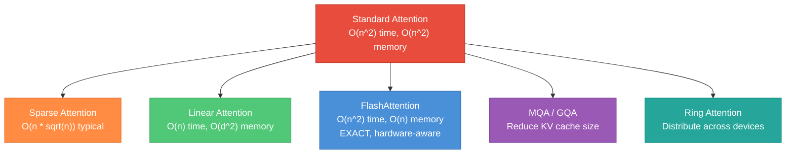

**Sparse attention**: Attend only to fixed patterns rather than all positions.
- **Local/sliding window**: attend only to nearby positions (Longformer, BigBird local component)
- **Strided**: attend to every k-th position (captures global patterns)
- **Combinations**: BigBird combines local + global + random attention patterns
- Typically O(n * sqrt(n)) or O(n * w) where w is window size

**Linear attention**: Replace `softmax(QK^T)V` with `phi(Q)(phi(K)^T V)`, where `phi` is a kernel feature map. By changing the order of multiplication -- computing `phi(K)^T V` first (a `d x d` matrix) then multiplying with `phi(Q)` -- the cost drops from O(n^2 d) to O(n d^2). Quality tradeoff: softmax attention is sharper and more expressive.

**FlashAttention**: Not an approximation. It computes exact standard attention but exploits the GPU memory hierarchy:
- Problem: the `n x n` attention matrix does not fit in fast SRAM (small but fast on-chip memory); storing it in HBM (large but slow) causes memory bandwidth bottleneck
- Solution: tile the computation -- process blocks of Q, K, V that fit in SRAM, accumulate results using the online softmax trick, never materialize the full attention matrix
- Result: O(n) memory (no n x n matrix), 2-4x faster wall-clock time, enables longer sequences
- FlashAttention-2 and FlashAttention-3 further optimize for newer GPU architectures

**Multi-query and grouped-query attention** (covered in Section 11): Primarily reduce the KV cache size during autoregressive inference. The KV cache stores the K and V tensors for all previously generated tokens. With 64 attention heads, MQA reduces KV cache by 64x; GQA with 8 KV groups reduces it by 8x.

**Ring attention**: For very long sequences that exceed single-device memory. Distribute the sequence across devices in a ring topology. Each device holds a block of Q and circulates K/V blocks around the ring, computing partial attention and accumulating. Enables million-token context windows.

---

### 14. Vision Architectures

**Vision Transformer (ViT)**: Applies the standard transformer to images by:
1. Split image into fixed-size patches (e.g., 16x16 pixels)
2. Linearly embed each patch (flatten + linear projection)
3. Add position embeddings
4. Prepend a learnable `[CLS]` token
5. Process through standard transformer encoder
6. Use `[CLS]` token representation for classification

ViT matches or exceeds CNNs when pre-trained on large datasets (JFT-300M, ImageNet-21k). On smaller datasets, CNNs' inductive biases (locality, translation equivariance) give them an advantage. DeiT showed that with better training recipes (augmentation, distillation), ViT can work well even on ImageNet-1k alone.

**DETR (Detection Transformer)**: Frames object detection as a set prediction problem. Uses a CNN backbone to extract features, then a transformer encoder-decoder with learned object queries. Bipartite matching loss assigns predictions to ground truth. Eliminates hand-designed components like anchor boxes and NMS.

**Segment Anything (SAM)**: Foundation model for image segmentation. Trained on 1B+ masks. Promptable -- given points, boxes, or text as input, produces segmentation masks. Uses a ViT encoder, prompt encoder, and lightweight mask decoder.

**CLIP (Contrastive Language-Image Pre-training)**: Trains an image encoder and text encoder jointly using contrastive learning on 400M image-text pairs. The image encoder (ViT or ResNet) and text encoder (transformer) are trained so that matching image-text pairs have high cosine similarity and mismatched pairs have low similarity. Enables zero-shot image classification by comparing image embeddings with text embeddings of class descriptions.

**CNN-Transformer hybrids**:
- **ConvNeXt**: A "modernized ResNet" that applies transformer-era design choices (larger kernel sizes, fewer activations, LayerNorm, inverted bottleneck) to a pure CNN architecture. Matches ViT performance, proving that many of ViT's gains came from training recipes and design choices, not self-attention itself.
- **Swin Transformer**: Hierarchical ViT with shifted windows. Builds multi-scale feature maps like CNNs, useful for detection and segmentation.

**U-Net**: Encoder-decoder with skip connections between corresponding encoder and decoder levels. The encoder downsamples (captures context), the decoder upsamples (enables precise localization), and skip connections pass high-resolution features from encoder to decoder. Originally for medical image segmentation, now the backbone architecture for diffusion model denoisers.

---

### 15. Multi-Modal Architectures

Multi-modal models process and relate information across different modalities (text, images, audio, video).

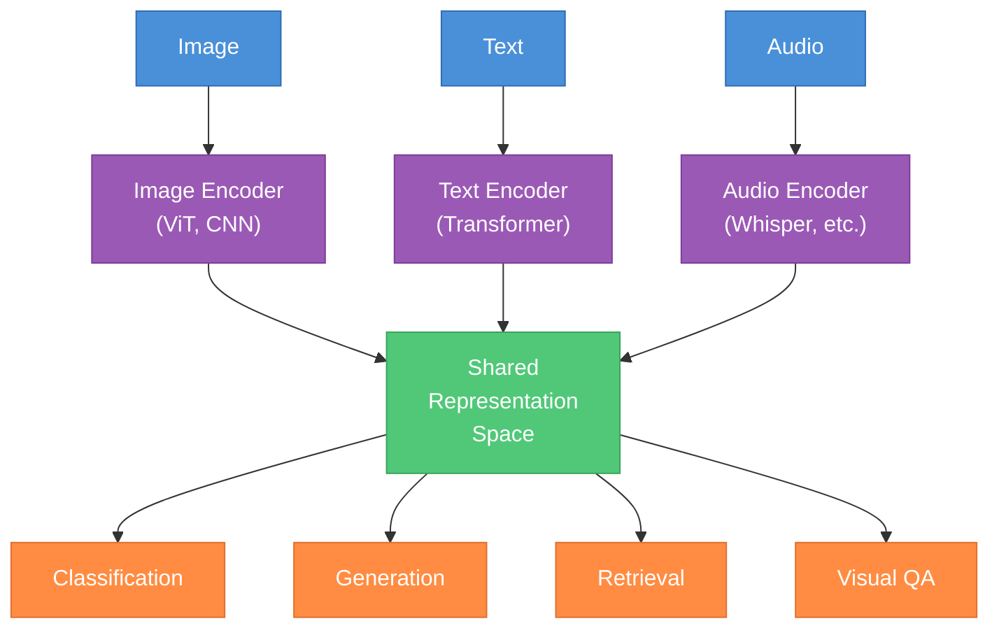

**The general pattern**: Modality-specific encoders produce embeddings in a shared representation space. A task-specific decoder or head operates on these joint representations. The key design choice is how to align the modalities.

**CLIP**: Contrastive pre-training aligns image and text in a shared embedding space. No generation -- purely discriminative. Enables zero-shot transfer to any classification task describable in text.

**Vision-Language Models (VLMs)**: Feed visual tokens directly into a language model.
- **LLaVA**: Use CLIP's vision encoder to produce image patch embeddings, project them into the LLM's embedding space via a linear layer, and prepend them to the text token sequence. The LLM then processes interleaved visual and text tokens.
- **GPT-4V / Gemini / Claude**: Commercial multi-modal models that natively process images alongside text. Architecture details are proprietary but follow similar principles.
- Key challenge: aligning the visual encoder's representation space with the LLM's embedding space. Common approaches include linear projection, cross-attention adapters (Flamingo), or Q-Former learnable queries (BLIP-2).

**Text-to-image**:
- **DALL-E 2**: CLIP text embedding -> diffusion prior -> image embedding -> diffusion decoder
- **Stable Diffusion**: Text -> CLIP text encoder -> cross-attention conditioning in a latent diffusion U-Net -> VAE decoder -> image
- **DALL-E 3**: Improved with better captions and direct text-to-image diffusion

---

### 16. Architecture Design Principles

Principles that recur across successful architectures:

**Depth vs width tradeoffs**: Deeper networks are more parameter-efficient for representing hierarchical features. But they are harder to train (gradient flow) and have higher latency (sequential computation). Width allows more parallelism. Modern practice: go as deep as you can with residual connections, then scale width. Scaling laws guide this tradeoff (see below).

**Skip connections everywhere**: The single most important enabler of depth. Used in ResNets, transformers (around every sublayer), U-Nets, DenseNets. Any time you stack more than ~5 layers, you need some form of skip connection.

**Normalization before nonlinearity (pre-norm)**: Pre-norm (normalize, then apply sublayer, then residual add) is more stable than post-norm. The residual stream stays un-normalized, and each sublayer receives normalized input. This is the standard in all modern transformers.

**Attention for global, convolution for local**: Attention captures long-range dependencies with O(1) path length but O(n^2) cost. Convolutions capture local patterns cheaply with strong inductive biases. Many effective architectures combine both (Swin Transformer, CoAtNet, early layers conv + later layers attention).

**Scaling laws**: Kaplan et al. (2020) and Hoffmann et al. (Chinchilla, 2022) showed that model performance (measured by loss) scales predictably as a power law with compute, data, and parameters. The **Chinchilla insight**: for a fixed compute budget, optimal performance comes from scaling model size and data proportionally. Many early LLMs (GPT-3, PaLM) were undertrained relative to their size -- Chinchilla (70B params, 1.4T tokens) matched Gopher (280B) by training on 4x more data. This shifted the field toward smaller, better-trained models.

**Architecture search (NAS)**: Automated search over architecture design choices (layer types, connections, channel sizes). EfficientNet used NAS to find an optimal base architecture, then scaled it with compound scaling (depth, width, resolution together). In practice, most state-of-the-art architectures are still human-designed with NAS providing marginal refinements.

---

### 17. Interview Questions Checklist

Organized by topic, with concise answers. Practice explaining each in 1-2 minutes.

**Foundations**

1. **Why is nonlinearity necessary in neural networks?**
   Without nonlinearity, any composition of linear layers is still a linear transformation. Nonlinear activations allow the network to approximate arbitrary nonlinear functions.

2. **What is the dead neuron problem in ReLU?**
   If a neuron's pre-activation is always negative (due to a large negative bias or unlucky initialization), its gradient is permanently zero and it never updates. Leaky ReLU, PReLU, and careful initialization mitigate this.

3. **Why does He initialization use `2/n_in` instead of `1/n_in`?**
   ReLU zeroes out approximately half the activations, halving the variance. Doubling the initial variance compensates for this.

4. **Explain BatchNorm vs LayerNorm. When do you use each?**
   BatchNorm normalizes across the batch per feature -- good for CNNs with large batches. LayerNorm normalizes across features per sample -- batch-independent, required for transformers where sequence lengths vary and batch statistics are unreliable.

5. **How does dropout work? What changes at inference?**
   During training, randomly zero out activations with probability p. At inference, use all neurons but scale by (1-p). With inverted dropout, scaling happens during training so inference is unchanged.

**CNNs**

6. **Why use multiple 3x3 convolutions instead of one 7x7?**
   Two 3x3 layers have receptive field 5x5 with 18 parameters; three give 7x7 with 27 parameters -- vs 49 for a single 7x7. More nonlinearity, fewer parameters, deeper representation.

7. **What are depthwise separable convolutions?**
   Factor a standard convolution into depthwise (one filter per channel, spatial only) and pointwise (1x1, channel mixing only). Reduces parameters and computation by roughly k^2x.

8. **Explain residual connections. Why do they help?**
   `y = F(x) + x`. The identity shortcut lets gradients flow directly to early layers (gradient includes a +1 term from the identity). The network only needs to learn a small perturbation (residual) rather than the full mapping.

**RNNs**

9. **Why do vanilla RNNs fail on long sequences?**
   Gradients are multiplied by the recurrent weight matrix at each step. Over many steps, they either vanish (eigenvalues < 1) or explode (eigenvalues > 1), preventing learning of long-range dependencies.

10. **How does LSTM solve the vanishing gradient problem?**
    The cell state provides an additive path for information flow (controlled by gates). Because the cell update is additive (`c_t = f*c_{t-1} + i*c_tilde`) rather than multiplicative, gradients can flow over many steps without vanishing.

**Transformers**

11. **Walk through a transformer block.**
    Input goes through LayerNorm (or RMSNorm), then multi-head self-attention, then a residual add. Then another LayerNorm, a feed-forward network (up-project, activation, down-project), and another residual add. This is one block; the model stacks N of them.

12. **Why scale attention scores by `sqrt(d_k)`?**
    The dot product of two d_k-dimensional vectors (with unit variance entries) has variance d_k. Large dot products push softmax into saturated regions with near-zero gradients. Dividing by sqrt(d_k) normalizes variance to 1.

13. **Why pre-norm over post-norm?**
    Pre-norm ensures the residual path is a clean identity (no normalization modifying it). This stabilizes training, especially for deep models, and reduces sensitivity to learning rate warmup.

14. **How does FlashAttention work?**
    It tiles Q, K, V into blocks that fit in GPU SRAM, computes partial attention within tiles using the online softmax algorithm, and never materializes the full n x n attention matrix in slow HBM. Result: exact attention with O(n) memory instead of O(n^2), plus 2-4x speedup from reduced memory reads.

15. **Compare MHA, GQA, and MQA.**
    MHA: each query head has its own K/V -- maximum expressiveness, largest KV cache. GQA: groups of query heads share K/V -- reduces KV cache proportionally. MQA: all heads share one K/V -- smallest cache, slight quality tradeoff. GQA is the modern sweet spot (used in LLaMA 2+).

16. **What is RoPE and why is it used?**
    Rotary Position Embedding encodes absolute position by rotating Q and K vectors. The dot product between rotated Q and K naturally depends on their relative position. Better length generalization than learned embeddings, and captures relative position without explicit relative attention.

**Generative Models**

17. **What is the reparameterization trick and why is it needed?**
    VAEs need to sample z from N(mu, sigma^2), but sampling is not differentiable. The trick: write z = mu + sigma * epsilon where epsilon ~ N(0,1). Now z is a differentiable function of mu and sigma, and gradients flow through to the encoder.

18. **Explain diffusion models at a high level.**
    Forward process gradually adds Gaussian noise to data until it becomes pure noise. A neural network is trained to reverse each step (predict the noise added). Generation starts from random noise and iteratively denoises. The model learns the data distribution implicitly through this denoising objective.

19. **What is classifier-free guidance?**
    Train the diffusion model both conditionally (with text prompt) and unconditionally (drop the prompt randomly). At inference, amplify the conditional signal: `eps = eps_uncond + w * (eps_cond - eps_uncond)`. Higher w gives outputs more aligned with the prompt but less diverse.

20. **Why latent diffusion over pixel-space diffusion?**
    Images are high-dimensional (e.g., 512x512x3 = 786K dimensions). A pre-trained VAE compresses them to latent space (e.g., 64x64x4 = 16K dimensions). Running diffusion in this lower-dimensional space is much faster while quality is preserved by the VAE.

**Architecture Design**

21. **Why does depth help?**
    Depth creates hierarchical representations -- each layer refines the previous one. Theoretical results show that deep networks can represent certain functions exponentially more efficiently than shallow ones. With residual connections, depth comes at low optimization cost.

22. **Explain the Chinchilla scaling law.**
    For a fixed compute budget, optimal performance comes from scaling model parameters and training tokens equally. Earlier models like GPT-3 (175B params, 300B tokens) were "over-parameterized and under-trained." Chinchilla (70B params, 1.4T tokens) matched them with 4x less parameters.

23. **How does Mixture of Experts scale model capacity?**
    MoE replaces the dense FFN with multiple expert FFNs and a router. Each token is routed to top-k experts (typically 2). Total parameters can be very large (all experts combined), but per-token compute is small (only active experts). This decouples parameter count from compute cost.

**Whiteboard drawings to practice**:
- A single transformer block with all components labeled (pre-norm, multi-head attention, residual adds, FFN)
- The LSTM cell with all four gates and the cell state update flow
- A U-Net showing encoder, decoder, and skip connections with dimension annotations
- The diffusion process: clean image -> noisy -> noise, and reverse
- MHA vs GQA vs MQA head arrangement
- A residual block with the skip connection and elementwise add
