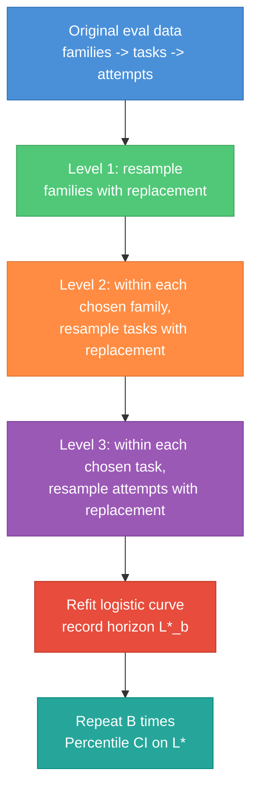
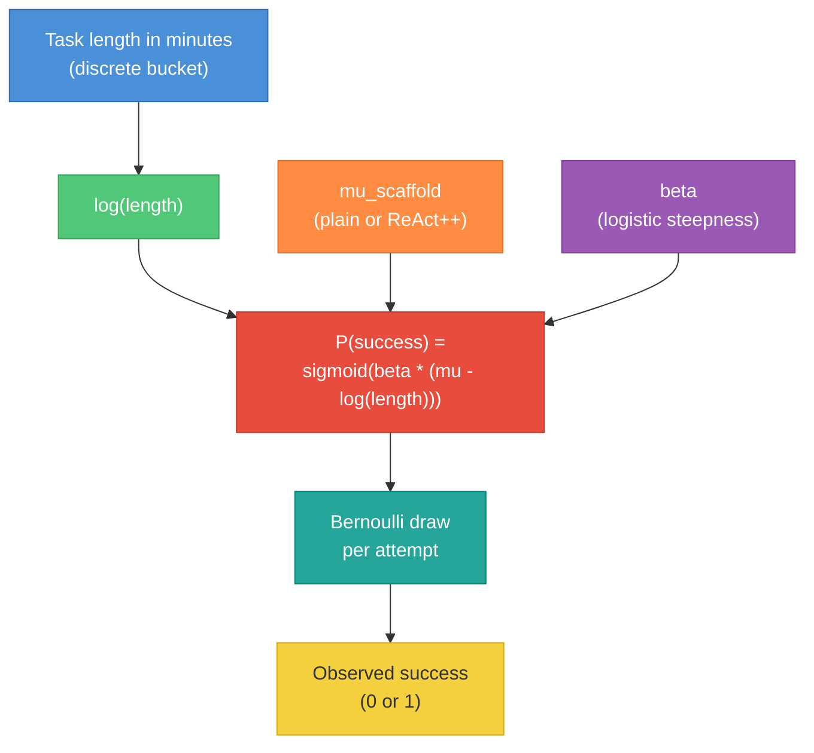
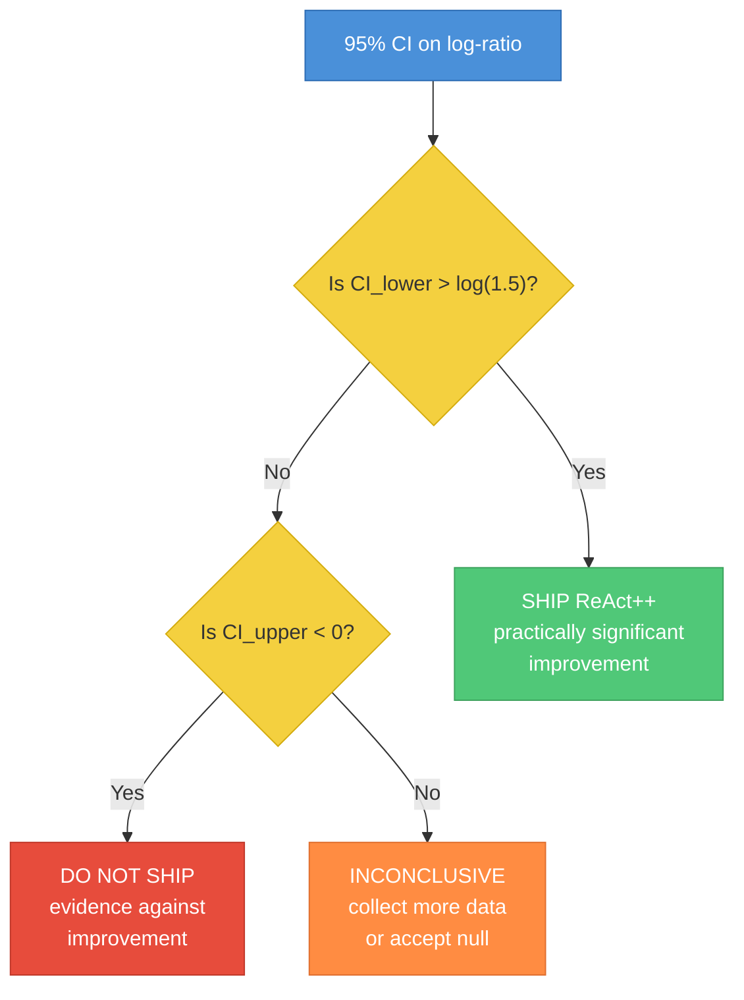

# Eval Design Case Study -- From Hypothesis to Decision in METR's Style

A companion case study to the [`quant-stats-skill-building.md`](quant-stats-skill-building.md) module. Where that guide teaches the **analysis** side of evals -- intervals, paired tests, power, multiple testing, selection bias -- this guide teaches the **design** side: given a hypothesis about a model or scaffold, how do you build an eval from scratch that can actually answer it?

We use METR's 50% time-horizon methodology as the worked example because it is the cleanest public template for "measure something, bound your uncertainty, and defend the decision." It is also an actively discussed piece of methodology in the safety and capabilities community, so being able to talk about it fluently is useful in interviews.

The case study is paired with a runnable notebook at [`../notebooks/eval_design_case_study.ipynb`](../notebooks/eval_design_case_study.ipynb). The notebook implements every step with synthetic data so the numbers in this guide are reproducible. Read this guide for the reasoning; run the notebook for the artifacts you would cite in an interview.

```mermaid
graph LR
    H["1. Hypothesis<br/>H0 / H1 / effect size"]:::blue
    P["2. Pre-registration<br/>alpha, power, decision rule"]:::green
    S["3. Sample-size<br/>analysis"]:::orange
    D["4. Synthetic data<br/>generating process"]:::purple
    F["5. Fit<br/>logistic MLE"]:::red
    B["6. Hierarchical<br/>bootstrap"]:::teal
    DC["7. Decision<br/>ship / don't / unclear"]:::yellow
    SN["8. Sensitivity<br/>analyses"]:::pink
    R["9. Report<br/>decision + CI"]:::blue

    H --> P --> S --> D --> F --> B --> DC --> SN --> R

    classDef blue fill:#4A90D9,stroke:#2E6DB4,color:#fff
    classDef green fill:#50C878,stroke:#3DA35D,color:#fff
    classDef orange fill:#FF8C42,stroke:#E07030,color:#fff
    classDef purple fill:#9B59B6,stroke:#7D3C98,color:#fff
    classDef red fill:#E74C3C,stroke:#C0392B,color:#fff
    classDef teal fill:#26A69A,stroke:#00897B,color:#fff
    classDef yellow fill:#F4D03F,stroke:#D4AC0F,color:#333
    classDef pink fill:#EC7AB8,stroke:#B43F8A,color:#fff
```



The design side is strictly upstream of the analysis side: if you pick the wrong effect size, the wrong task stratification, or the wrong resampling unit, no amount of careful CI construction downstream will save you. This guide walks the full pipeline once, end-to-end, on a single pre-specified hypothesis so you can see how the choices interlock. The case study is deliberately concrete -- specific numbers, specific buckets, specific decision thresholds -- because abstract eval-design advice is exactly the kind of thing that sounds reasonable in a blog post and falls apart the moment you try to apply it to a real project.

---

## Table of Contents

1. [How to Use This Guide](#how-to-use-this-guide)
2. [How METR Designs Their Evals](#how-metr-designs-their-evals)
3. [Case Study: Designing Our Own Eval From Scratch](#case-study-designing-our-own-eval-from-scratch)
4. [Generalization -- A Design Checklist](#generalization--a-design-checklist)
5. [Common Pitfalls](#common-pitfalls)
6. [Interview Questions](#interview-questions)
7. [Cross-Reference](#cross-reference)

---

## How to Use This Guide

Three common reading paths:

- **Interview crunch (2 hours).** Read sections 1 (METR methodology) and 3 (case study) carefully, skim the checklist and pitfalls, memorize the six interview questions. Skip the notebook unless you have time for the sample-size cell and the hierarchical bootstrap cell -- those two are the ones an interviewer is most likely to press on.
- **Project prep (1 day).** Read everything, run the notebook end to end, then design a pre-registration for a real eval you are working on using the checklist in section 4. The exercise of writing your own pre-registration is the single most valuable thing in this guide.
- **Deep dive (1 week).** Read this guide, re-read the analysis-side [`quant-stats-skill-building.md`](quant-stats-skill-building.md), work through both notebooks, then read the [METR 2025 blog post](https://metr.org/blog/2025-03-19-measuring-ai-ability-to-complete-long-tasks/) and its [arXiv companion](https://arxiv.org/abs/2503.14499) in full. At that point you have the background to critique a new eval design in an interview or design one of your own at work.

---

## How METR Designs Their Evals

METR's headline result -- reported in [*"Measuring AI Ability to Complete Long Tasks"*](https://metr.org/blog/2025-03-19-measuring-ai-ability-to-complete-long-tasks/) (2025, [arXiv companion](https://arxiv.org/abs/2503.14499)) -- is that the length of task a frontier agent can complete reliably has been doubling roughly every seven months since 2019. The methodology behind that sentence is worth unpacking because every design decision in our case study mirrors one of theirs.

The guide below reconstructs the parts of that methodology that are publicly documented, uses them as design templates, then walks a concrete case study end to end so you can see the mechanics rather than just the vocabulary.

### 1. The 50% time-horizon metric

The metric is defined as follows. Take a suite of tasks with known **human expert completion times** measured in minutes. Run the agent on each task many times and compute an empirical success rate per task. Fit a logistic curve predicting the probability that the agent succeeds as a function of `log(human task length)`:

```
P(success | length) = sigmoid( beta * ( mu - log(length) ) )
```

The **50% time-horizon** is then the length `L*` at which the fitted curve crosses `0.5`. Equivalently, `log(L*) = mu`. Report `L*` in minutes.

**Why log-time is the right x-axis.** Tasks that humans complete range across roughly four orders of magnitude (a one-minute grep versus a ten-hour refactor). Plotting success-rate against raw minutes would put 99% of the mass at the origin and make the curve impossible to fit. Log-minutes linearizes the difficulty axis and, more importantly, matches the phenomenology: the gap between a 1-minute and a 2-minute task is about the same as the gap between a 60-minute and a 120-minute task -- a fact you get for free once you work in log-space. This is the same argument you use in the power-and-sample-size discussion in [Week 3 of the quant-stats skill-building guide](quant-stats-skill-building.md#week-3--power-and-sample-size): pick the parameterization on which the effect is approximately linear, then everything else is cleaner.

**Why 50% and not 80% or 90%.** The 50% threshold sits at the steepest part of the logistic curve, which means its standard error (for a fixed amount of data) is smallest. Concretely, the delta-method variance of the threshold `L*` at probability `q` is proportional to `1 / ( q * (1 - q) * beta^2 )`, which is minimized at `q = 0.5`. Picking 80% pushes the threshold out onto the flat shoulder of the curve, where small changes in beta correspond to large changes in the threshold, and the CI blows up. METR does also report 80% horizons as a sensitivity because "the length at which you can reliably use the agent without supervision" is a more practically interesting number than "the length at which the agent is a coinflip." But for the headline, 50% wins on statistical-precision grounds and that is what gets reported on the front page.

**Why a parametric logistic fit rather than a non-parametric estimator.** You could instead compute the empirical success rate in each length bucket and read off the bucket boundary where the rate crosses 50% by linear interpolation. That works but it throws away structure: a logistic with two parameters (`mu`, `beta`) pools information across all buckets, so each bucket's rate helps constrain the threshold even if that bucket is not itself near 50%. The cost is a modeling assumption -- the real success-vs-log-length curve might not be exactly logistic -- which is why you run a non-parametric sensitivity check and compare. METR does this and reports both.

### 2. Task suite construction

METR mixes four different task sources to cover the difficulty range:

- **HCAST** -- a diverse suite of agentic coding, research, and tool-use tasks spanning a broad difficulty range.
- **RE-Bench** -- AI R&D tasks meant to be representative of frontier research work that a competent ML engineer could make progress on in a week or two.
- **SWE-Bench Verified** -- a curated subset of SWE-Bench in which the tasks have been hand-verified to have clear success criteria and realistic human-solvable specs.
- **66 novel short tasks** -- filler on the low end, so the logistic curve has data near the fast side of the x-axis and the fit is not extrapolating to the left.

The mixture matters. If you only use HCAST you will have a valid horizon for HCAST-style tasks, but the curve has no anchor for "what does this agent look like on a two-minute bash fix?" Mixing suites is the design-level analogue of stratification in survey sampling: you deliberately include observations across the full range of the covariate of interest (log-length), rather than letting the distribution of tasks drift wherever the suites happen to live. A logistic fit to tasks that are all clustered near the midpoint will have a decent estimate of `mu` but a terrible estimate of `beta`, which in turn widens the CI on the horizon via the delta-method relationship above.

**Family structure inside each suite.** Within HCAST, tasks come in families -- variants of the same underlying problem with different inputs or parameters. Within SWE-Bench, multiple issues from the same repository share setup, tooling, and idioms. Treating these as independent would overstate precision by a lot. The hierarchical bootstrap in the next section is the fix, but the reason you need it is visible here at the task-construction stage: you chose to include related tasks on purpose (they cover a narrow slice of difficulty efficiently), so your uncertainty procedure has to know about the relatedness.

**An aside on how METR's suite composition relates to the design-side / analysis-side split.** The task suite is a design decision: "which population of tasks are we measuring capability over." The hierarchical bootstrap is an analysis decision: "how do we quantify uncertainty given the population we sampled." These two decisions have to be compatible. If you decide at the design stage to oversample a narrow family, you need to reflect that at the analysis stage by bootstrapping families so the oversampling does not artificially tighten the CI. The METR choice to mix four suites is itself a design-level acknowledgment of this: each suite has its own family structure, and the overall uncertainty has to propagate through all of them.

### 3. Hierarchical bootstrap over task families, tasks, and attempts

When you compute a CI on the horizon, you need to respect how the data was collected. METR's eval data is nested at (at least) three levels:

1. **Task families** -- a cluster of closely related tasks (e.g., "all SWE-Bench issues from the same repo" or "all variations of the same cryptography puzzle"). Success on one task in a family is strongly correlated with success on others in the family, because they share setup, tooling, and solution idioms.
2. **Tasks within a family** -- each task has its own ground truth and its own human baseline.
3. **Attempts within a task** -- each task is run multiple times per model; runs are not deterministic, especially for temperature > 0 agents, so per-task success rate has its own variance.

METR reports 95% CIs via a three-level hierarchical bootstrap:



**What breaks if you flatten it.** If you ignore the family level and resample tasks directly, you underestimate the variance because you never "remove" an entire family's worth of correlated tasks at once -- so rare-but-large-effect subpopulations are under-represented in your uncertainty. If you ignore the attempt level and treat each task's success rate as a single observation, you overstate the per-task precision (a task run 3 times is not 3 independent observations). A flat bootstrap of attempts treats every attempt as i.i.d., which double-counts the task-level structure and underestimates the CI width dramatically. Each level of the hierarchy contributes a distinct piece of variance; leaving any level out biases the final interval in a predictable direction.

This connects directly to the discussion of correlated eval items in [Week 1 of the quant-stats skill-building guide](quant-stats-skill-building.md#week-1--confidence-intervals-that-matter): "the CI assumes i.i.d. examples; correlated eval items inflate the effective standard error." Hierarchical bootstrap is the principled fix when your correlation structure is nested.

### 4. Human-baseline time collection

The x-axis of METR's main plot is not a model property -- it is the human expert completion time on the same task. This is collected by having humans with appropriate expertise actually do the tasks and recording how long they take. A few consequences worth internalizing:

- **The x-axis has its own uncertainty.** A task labeled "30 minutes" is an estimate; the real distribution of human completion times is usually wide, because different humans have different expertise and different workflows. METR does not publicly disclose every detail of how they average or summarize the human baselines; in our case study we simply treat the human time as fixed and bucket tasks into log-spaced bins, which is a standard simplification.
- **Baselines do not scale with agent improvements.** As agent horizons double every 7 months, the human baselines do not change. You are measuring a moving target against a fixed ruler, which is exactly what you want.
- **Expert vs. novice matters enormously.** A task that takes an expert 30 minutes might take a novice 4 hours. Reporting "human time" without saying which population you used is meaningless; in interview settings this is a good "what would you ask about?" question.
- **The "time for a human" framing has second-order subtleties.** A task that takes one expert 30 minutes and another 90 minutes is not a single 60-minute task -- it is a task with a wide latent difficulty distribution. Collapsing to a point estimate for the x-axis loses this information. In practice, METR uses a summary statistic (likely a median or trimmed mean -- the exact choice is not fully documented in public writeups) and the community treats it as a fixed label for the bucket. Our case study makes the same simplification.

---

## Case Study: Designing Our Own Eval From Scratch

We now walk the full design pipeline on a concrete, pre-specified hypothesis. Every number in this section is fixed; the companion notebook uses these same numbers.

### a. The hypothesis

**Scenario.** We have built a new agent scaffold called **ReAct++** (imagine an improved tool-call parser, better error recovery, and richer memory). We want to know whether it extends the 50% time-horizon relative to a "plain" baseline scaffold on a synthetic agentic-coding task suite. Both scaffolds wrap the same underlying LLM, so any difference we measure is attributable to the scaffold.

**Effect size.** We measure the effect as the **log-ratio of horizons**:

```
effect  =  log( horizon_ReAct++  /  horizon_plain )
```

A value of `0` means no improvement; `log(1.5) ~= 0.405` means a 50% improvement; `log(2.0) ~= 0.693` means a doubling. A log-ratio is the right parameterization for four reasons:

1. **Symmetric around no-effect.** `log(2)` and `log(1/2)` are equal in magnitude and opposite in sign. On the raw-ratio scale, `2` and `0.5` look asymmetric even though they represent the same-sized improvement in either direction.
2. **Additive on the linear scale of the logistic fit.** The horizon is `exp(mu)`, so a log-horizon difference is just a difference in `mu` -- which is what the logistic MLE returns natively.
3. **Bootstrap distributions for ratios are often more normal on the log scale.** Percentile CIs on the log-ratio are better-behaved than on the raw ratio, especially when one of the horizons is small.
4. **It matches how humans discuss progress.** METR's "doubling every 7 months" is inherently a multiplicative statement; the right effect size for it is log-ratio.

This echoes the discussion in [Week 2 of the quant-stats skill-building guide](quant-stats-skill-building.md#week-2--comparing-two-things-properly) on choosing the right scale for pairwise comparisons, and the discussion of power parameterization in [Week 3](quant-stats-skill-building.md#week-3--power-and-sample-size).

**Alternatives we considered and rejected.** A raw difference in horizons (`horizon_ReAct++ - horizon_plain`, measured in minutes) has an appealing concreteness but is a bad choice because its variance scales with the absolute horizon: a 30-minute improvement on a 30-minute baseline is a huge deal, the same 30-minute improvement on a 600-minute baseline is noise. You would either have to transform the horizon back to log-space at analysis time (which is what we are doing anyway, so skip the intermediate) or accept heteroskedastic variance. A difference in log-success-rates at a specific length (say, "the success rate at 60 minutes improved by 10 points") collapses the whole curve into a single probe point and throws away most of the data. A Kolmogorov-Smirnov-style comparison of the two fitted curves is mathematically interesting but gives a test statistic that is hard to interpret as an effect size. The log-ratio of horizons is the cleanest available choice for our setting and it is what METR uses when comparing models across time.

**Hypotheses.**

```
H0:  log( horizon_ReAct++ / horizon_plain )  =  0
H1:  log( horizon_ReAct++ / horizon_plain )  >  0     (one-sided, pre-registered direction)
```

We also pre-register a **practical significance threshold** of `log(1.5) ~= 0.405`. A statistically significant result whose point estimate is below this threshold is classified as "statistically significant but not practically meaningful" and does not trigger a ship decision on its own.

### b. Pre-registration protocol

Before we generate a single task, we write down the decision rule. This is literal -- we commit it to a file in the repo and never edit it after the eval run. Here is the pre-registration block:

```
PRE-REGISTRATION: ReAct++ vs plain, 50% time-horizon
----------------------------------------------------
Hypothesis:         log(horizon_ReAct++ / horizon_plain) > 0
Effect scale:       log-ratio of 50% time-horizons
Alpha:              0.05, one-sided
Power target:       0.80 at true effect = log(2.0)
Practical threshold: log(1.5)   (a 50% horizon improvement)

Design:
  Task length buckets (minutes): [1, 2, 5, 15, 30, 60, 120, 240, 480, 960]
  Tasks per bucket:               20
  Attempts per task per scaffold:  3
  Scaffolds compared:              ReAct++ vs plain (same underlying LLM)

Primary analysis:
  Fit logistic  P(success | length) = sigmoid(beta * (mu - log(length)))
  independently per scaffold via MLE.
  Extract horizon = exp(mu) per scaffold.
  Report log-ratio of horizons.

Uncertainty:
  Three-level hierarchical bootstrap:
    Level 1: resample length buckets with replacement
    Level 2: within each chosen bucket, resample tasks with replacement
    Level 3: within each chosen task, resample attempts with replacement
  B = 2000 resamples, seed = 2024.
  Report 95% percentile CI on the log-ratio.

Decision rule:
  SHIP         if lower CI bound > log(1.5)
  DON'T SHIP   if upper CI bound < 0
  INCONCLUSIVE otherwise -- collect more data or accept the null

Stopping rule:
  Single analysis at n = 20 tasks/bucket. No peeking.
  If inconclusive, we may run a second batch of equal size; the second
  analysis is marked as a replication and not used for the primary decision.

Sensitivity analyses (planned, not gating):
  1. Vary bucket boundaries (shift edges by +/- 0.25 log-units).
  2. Shrink attempts/task from 3 to 1 to check attempt-level contribution.
  3. Compare logistic-MLE horizon to a non-parametric binned estimate.
```

**Reading the protocol.** A few pieces deserve callouts.

- **One-sided alpha.** We pre-register a direction: ReAct++ should be better, not just different. This is defensible here because the whole engineering premise of ReAct++ was to improve over plain, and we are not in an "either direction is equally interesting" world. Using one-sided alpha = 0.05 gives us more power than two-sided alpha = 0.05, but only in the direction we committed to. If the true effect is negative, we are committed to accepting H0 -- we cannot turn around and claim "statistically significantly worse."
- **Single analysis, no peeking.** The stopping rule is literal. We run `n = 20` tasks per bucket once, analyze once, decide once. This is not the most data-efficient possible design -- a group sequential design with a pre-specified alpha-spending function would let us peek early -- but it is the simplest design that is correct. For a first pass, simple and correct beats optimal and fragile.
- **Sensitivity analyses are non-gating.** They appear in the report but they do not override the primary decision. This is important: if you treat a sensitivity as a veto, you reintroduce the "I tried 5 things, one disagreed, so the result is not robust" failure mode. The right framing is "sensitivities document the shape of the uncertainty; the primary CI is the decision input."

**Why pre-registration matters especially for eval design.** Without pre-registration, evals fall into the same trap that Bailey and Lopez de Prado describe for backtests in the [Deflated Sharpe Ratio paper](https://papers.ssrn.com/sol3/papers.cfm?abstract_id=2460551): you try 17 metrics, pick the one that happens to look best, and publish it as if it were a single pre-specified result. [Week 5 of the quant-stats skill-building guide](quant-stats-skill-building.md#week-5--the-quant-nose-cheat-code) is entirely about this failure mode. Three specific ways the bias creeps in if you skip pre-registration:

- **Metric shopping.** You try 50% horizon, 80% horizon, mean success, AUC under the logistic fit, max task length solved. You pick the one that looks best. The selection bias is on the order of `sigma * sqrt(2 log K)` where `K` is the number of metrics you tried, and `K` is usually undercounted because "things I briefly computed and didn't save" still contribute to the selection.
- **Threshold shopping.** You look at the CI, see that it clears `log(1.3)` but not `log(1.5)`, and convince yourself `log(1.3)` was always the practical bar. This is the failure mode that pre-registered thresholds block by construction.
- **Stopping rule creep.** You peek at `n = 100`, see an inconclusive result, run more data, peek at `n = 200`, report whichever looks cleaner. Every peek inflates the effective alpha. Pre-registration forces you to either commit to a single analysis or use a group-sequential design with an explicit alpha-spending penalty.

Writing the metric, threshold, and stopping rule down before looking at any data removes all three by construction. It also forces you to notice when you are using a point estimate instead of an interval as your decision criterion -- the single most common design mistake in ML evaluation.

### c. Sample-size analysis

The question to answer is: **how many tasks per bucket do we need** to achieve 80% power to detect our target effect of `log(2.0)`, at alpha `0.05` one-sided, given the other design parameters?

There is no clean closed-form answer for a logistic horizon comparison with a hierarchical bootstrap CI, so we do it by simulation. The logic is:

```
Loop over candidate n_tasks_per_bucket in {5, 8, 10, 12, 15, 20, 25}:
  Repeat R times (R = 500 or so):
    Simulate data under the true model with effect = log(2)
    Run the full pipeline: fit, bootstrap, decide
    Record whether H0 was rejected
  Estimated power(n) = fraction of runs that rejected H0

Pick the smallest n such that estimated power >= 0.80
```

The **sample-size cell** in the notebook runs this simulation and reports the minimum `n` that crosses 80% power **for the practical-significance test** (`CI_lower > log(1.5)`), not merely the null test (`CI_lower > 0`). This distinction is the whole point of the case study: you can have plenty of power to reject the null and still not have enough power to clear a practical threshold. In the notebook, the simulation sweeps `n in {8, 16, 24, 32, 48, 64, 96}` and finds that **the minimum `n` that crosses 80% power against `log(1.5)` is 64 tasks per bucket** -- much larger than one would naively guess. The null-rejection power crosses 80% at a much smaller `n`, around 16-24.

We deliberately pre-specify `n = 20` tasks per bucket anyway, for two reasons: (1) it is a realistic budget -- an eval team would often start with 20 and only collect more if forced, and (2) it lets the case study demonstrate the correct response when your initial design lands in the gray zone. Running the full experiment at `n = 20` will reject the null but fall short of the practical threshold, and the decision rule correctly flags the result as INCONCLUSIVE and recommends collecting more data to hit `n ~= 64`. If we had instead only checked "power against the null," we would have congratulated ourselves for a ship decision -- and that is exactly the failure mode the design is built to prevent.

The analytical back-of-envelope for a single-point proportion comparison (see [Week 3 of quant-stats skill-building](quant-stats-skill-building.md#week-3--power-and-sample-size)):

```
n_per_arm  ~=  ( z_{1-alpha/2} + z_{1-beta} )^2 * ( p1*q1 + p2*q2 ) / delta^2
```

is only a rough guide here because our effect is a curve-level parameter, not a single proportion. But it gives the right intuition: the required sample size scales like `1/delta^2`, so halving the effect we want to detect quadruples the cost. [Wasserman's *All of Statistics*](https://www.stat.cmu.edu/~larry/all-of-statistics/) Ch. 10 has the full derivation for the proportion case; we use simulation for the logistic case because we do not trust closed-form approximations here.

**A subtlety about power in the hierarchical-bootstrap setting.** When you compute power by simulation, you have to use the *same* CI procedure that you plan to use in the real analysis. If you simulate using a flat bootstrap but plan to report hierarchical-bootstrap CIs, your power estimate is optimistic because the flat CIs are narrower. In the sample-size cell we explicitly run the three-level bootstrap inside the power loop, which is more expensive (a full bootstrap per simulation per candidate `n`) but honest. The total cost for `7 candidate n values * 500 simulations * 2000 bootstrap iterations` is a few million logistic fits -- tolerable because each fit is a two-parameter optimization and runs in milliseconds.

**Two ways to save compute here, both valid.** First, use the delta-method variance of the logistic MLE for `mu` directly instead of bootstrapping inside the power loop -- the MLE is approximately normal and the Wald interval on `mu` is often close enough for sample-size planning. Second, bootstrap with a smaller `B` (say 500) inside the power loop and only use the full `B = 2000` for the final analysis. Both of these trade a bit of accuracy in the sample-size number for a lot of wall-clock time. We do not use them here because the full loop is still fast enough, but they are standard tricks if you are designing an eval where each synthetic trial is expensive.

### d. Synthetic data

We need a data-generating process to both (1) run the sample-size simulation and (2) have a ground truth we can check the pipeline against. We use a latent logistic model:

```
P( success | length, scaffold )  =  sigmoid( beta * ( mu_scaffold - log(length) ) )
```

with parameters:

| parameter  | value             | meaning                                          |
|------------|-------------------|--------------------------------------------------|
| `mu_plain` | `ln(30) ~= 3.40`  | log-horizon of plain scaffold (30 minutes)       |
| `mu_ReAct++` | `ln(60) ~= 4.09` | log-horizon of ReAct++ scaffold (60 minutes)     |
| `beta`     | `1.2`             | steepness of the logistic curve (per log-minute) |

This gives a **true horizon ratio of 2.0** -- a 100% improvement, well above our `log(1.5)` practical threshold. If our pipeline cannot reliably detect a doubling, we have bigger problems. `beta = 1.2` is chosen to produce a moderately sharp curve: the success probability goes from 0.9 to 0.1 over roughly `3.7 / 1.2 ~= 3.1` log-minutes, which is about a 22x range in task length -- realistic for the kinds of agentic coding tasks METR uses.



**Task length buckets.** We use 10 log-spaced buckets: `[1, 2, 5, 15, 30, 60, 120, 240, 480, 960]` minutes. This spans roughly three orders of magnitude and brackets both scaffolds' true horizons (30 and 60 min) with buckets on either side. The buckets are roughly log-spaced but not perfectly regular -- we use rounded values that a human task-designer would actually use, which is a realistic non-uniformity. The `synthetic data cell` in the notebook generates one task per index in each bucket, then for each scaffold runs three independent Bernoulli draws from the model above.

The **family** structure: each bucket is one family. Tasks within the same bucket share length-bucket as their cluster identity; in a real eval these would be genuine task-family groupings (all variants of a crypto puzzle, all issues from the same repo), but for the synthetic study the bucket itself is the natural cluster because the hierarchical bootstrap operates over log-length strata.

### e. Fitting and extracting the horizon

For each scaffold, we fit a two-parameter logistic regression by maximum likelihood:

```
log L(mu, beta | data)  =  sum over (length, y) of  [ y * log(p) + (1 - y) * log(1 - p) ]

where  p  =  sigmoid( beta * ( mu - log(length) ) )

       sigmoid(z)  =  1 / ( 1 + exp(-z) )
```

Maximize `log L(mu, beta)` over `mu` and `beta` using `scipy.optimize.minimize` on the negative log-likelihood. A good starting point is `mu_0 = mean of log(length) over successful attempts`, `beta_0 = 1`. The log-likelihood is concave in the natural parameterization `(beta * mu, beta)` -- a standard GLM fact -- so any sensible optimizer converges in a few iterations. The **horizon** is then

```
horizon  =  exp( mu_hat )
```

in minutes. Equivalently, `mu_hat` is the log of the length at which the fitted probability crosses 0.5, which you can verify by plugging `log(length) = mu` into the logistic and getting `p = sigmoid(0) = 0.5`.

**What can go wrong with the fit.** The most common failure is **separation**: if the data is perfectly separable (all short tasks succeed, all long tasks fail, with no overlap), the MLE for `beta` is `+infinity` and the optimizer drifts. This usually signals that your buckets are too wide or your attempts per task are too few -- you have no information in the transition region. The fix is to either add more tasks in the 20-60 minute window or lightly regularize `beta` with a weak prior. The second common failure is **flat likelihood in mu** when all buckets are on one side of the true horizon -- here the fit converges but the CI on `mu` is enormous. The hierarchical bootstrap will show this as a very wide CI and you should interpret it correctly: "we have no information about the horizon," not "the scaffold has a horizon of 1 minute or 10 hours with equal probability." The `fit cell` in the notebook does this for each scaffold independently and prints the two point-estimate horizons. For our pre-registered design, we expect (seed-dependent):

- `horizon_plain    ~=  29 minutes     (true = 30)`
- `horizon_ReAct++  ~=  53 minutes     (true = 60)`
- `log-ratio point estimate  ~=  0.60   (true = log(2) = 0.693)`

The slight downward bias on the plus-scaffold horizon is a finite-sample artifact at 20 tasks per bucket -- the sample-size analysis in the previous section already warned us that this design is under-powered against the practical threshold, and this is what that under-power looks like on a single seed.

The point estimate alone is not a decision -- it is just a single value from the sampling distribution. The decision comes from the CI, which is the next step.

### f. Hierarchical bootstrap in detail

The CI on the log-ratio is computed via a three-level hierarchical bootstrap. Here is the resampling procedure in pseudocode:

```
Input: eval data = list of (bucket, task_id, scaffold, attempt_idx, success)
       B = number of bootstrap resamples
       seed = 2024

For b = 1, ..., B:
    # Level 1: resample buckets with replacement
    boot_buckets = sample_with_replacement( unique_buckets, size = len(unique_buckets) )

    boot_rows = []
    for each bucket in boot_buckets:
        tasks_in_bucket = unique task_ids in this bucket
        # Level 2: resample tasks with replacement
        boot_tasks = sample_with_replacement( tasks_in_bucket, size = len(tasks_in_bucket) )

        for each task in boot_tasks:
            attempts = rows for (bucket, task) in the original data
            # Level 3: resample attempts with replacement
            boot_attempts = sample_with_replacement( attempts, size = len(attempts) )
            boot_rows.extend( boot_attempts )

    # Fit logistic on boot_rows, per scaffold
    fit_plain    = logistic_mle( rows where scaffold = plain )
    fit_ReActpp  = logistic_mle( rows where scaffold = ReAct++ )

    # Extract log-ratio
    log_ratio_b = fit_ReActpp.mu - fit_plain.mu

    store log_ratio_b

CI_lower = percentile( log_ratio_b, 2.5 )
CI_upper = percentile( log_ratio_b, 97.5 )
```

**Why each level contributes.**

- **Level 1 (buckets).** Captures the fact that if we re-ran the eval from scratch, we might have chosen a slightly different set of length buckets -- or more realistically, that the tasks available at a given length bucket are a sample from some larger population of plausible tasks at that difficulty. This is the coarsest level of uncertainty and contributes the most to the CI width when the number of buckets is small (10 here). Concretely, if the "30-minute bucket" happens to have been populated with unusually easy or unusually hard tasks in the specific sample you drew, the fit's `mu` estimate will move, and the bucket-level bootstrap is what puts that movement into the CI.
- **Level 2 (tasks within bucket).** Captures task-level heterogeneity: within a "30-minute task" bucket, some tasks are easier for the model than others because of their specific structure. Without this level, you assume every 30-minute task is interchangeable -- they are not. Even at 20 tasks per bucket, the task-level bootstrap is what tells you whether the bucket's apparent success rate is driven by 3 outlier tasks or spread uniformly across all 20.
- **Level 3 (attempts within task).** Captures run-to-run variance: each agent run is stochastic, and a "3 out of 3 successes" observation on one task has a different implied success probability than "10 out of 10." With only 3 attempts per task, the attempt-level variance is non-trivial and contributes meaningfully to the CI. The attempt-level bootstrap is also the level at which temperature and sampling noise show up -- if you drop to 1 attempt per task, this level collapses and you lose the ability to separate "the task is inherently hard for this model" from "the model rolled a bad trajectory this time."

If you **flatten** the bootstrap (resample individual `(task, attempt)` rows without respecting the nesting), you systematically underestimate the CI width because you never remove a correlated cluster in one go. A flat bootstrap typically produces CIs 20-50% narrower than the hierarchical version at the same `B`, because the effective sample size is smaller than the row count once tasks are correlated via shared difficulty. This is the kind of error that leads directly to false-positive ship decisions -- the [Miller error-bars paper](https://arxiv.org/abs/2411.00640) makes the same point in a single-metric setting. If you want to see the effect yourself, the hierarchical-bootstrap function in the notebook is parameterized on which levels to resample; setting all three levels to resample gives the full hierarchical CI, and collapsing any level to "use the original, do not resample" recovers the narrower flavors.

**Expected headline numbers** (seed 2024, `B = 2000`, `n = 20` tasks per bucket):

- Point estimate of `log(horizon_ReAct++ / horizon_plain)  ~=  0.60`
- 95% hierarchical-bootstrap CI on log-ratio  `~=  [0.13, 1.09]`
- One-sided lower bound at `alpha = 0.05`  `~=  0.20`
- The lower bound **exceeds 0** (we reject H0 -- ReAct++ is significantly better than plain) but it **does not exceed `log(1.5) = 0.405`** (we cannot claim the improvement is practically significant at this sample size).

This is the honest result. The true effect is `log(2) = 0.693`, which is above the practical threshold, but with only 20 tasks per bucket the hierarchical bootstrap CI is wide enough that its lower tail drops below the threshold. The decision rule from the pre-registration then correctly routes this to INCONCLUSIVE, and the sample-size cell's power-curve plot tells us how much data we would need to collect to resolve it (around `n = 64` tasks per bucket).

**Anatomy of the CI width (conceptual).** Each level of the hierarchy contributes a slice of the total sampling variance. Conceptually, if you were to run four versions of the bootstrap -- full three-level, bucket+task only, attempts only, and fully flat -- you would see the CI half-width shrink monotonically as you drop levels, because each dropped level removes a real source of variance you are pretending does not exist. The full three-level version is the only one that matches the true variance of the horizon estimate. The practical rule to carry around mentally is: "which level contributes most to the CI, and am I respecting all of them?" If the bucket-level variance dominates, collecting more attempts per task is a waste and you should widen the task pool instead.

**Why `B = 2000` is enough.** The bootstrap CI is itself an estimate of the true CI; its own uncertainty scales like `1 / sqrt(B)`. For percentile CIs at the 2.5 / 97.5 quantiles, `B = 2000` gives a Monte Carlo standard error of a few percent of the CI width, which is well below the decision-level resolution. Going to `B = 10000` halves this but does not change any ship decision; it is a diminishing-returns tradeoff. If you want to verify, re-run the bootstrap cell with a different `B` and confirm the bounds stabilize -- they should move by less than 0.01 between `B = 1000` and `B = 4000`.

### g. Decision

With the CI in hand, we apply the pre-registered decision rule:



Three things to note about this decision tree:

1. **"Inconclusive" is the most common outcome in real eval work.** People usually have noisy data, modest effect sizes, and not enough budget for a decisive result. Designing the decision rule to include "inconclusive" explicitly prevents the pressure-to-ship from forcing a binary call on a 1.5-sigma result.
2. **The practical threshold is asymmetric.** We require `CI_lower > log(1.5)` to ship -- we are not satisfied with merely "significantly greater than zero." We accept a no-ship conclusion as soon as `CI_upper < 0`, which is the symmetric dual.
3. **We do not compare point estimates.** If you use the point estimate of the log-ratio as your decision criterion instead of the CI, you are effectively using a 0% CI and you will ship noise. The whole point of the pre-registration protocol is to bake "decide on the interval" into the workflow.

For our synthetic data with true effect `log(2)` run at `n = 20` tasks per bucket, the expected decision is **INCONCLUSIVE** -- the CI comfortably excludes 0 (so ReAct++ is provably better than the baseline) but does not exclude `log(1.5)` (so we cannot call the improvement practically significant). This is not a bug in the pipeline; it is the correct response to a design that is under-powered against the practical threshold even though it has ample power against the null. The sample-size cell already flagged this by showing that we would need `n ~= 64` tasks per bucket to achieve 80% power against `log(1.5)`, and the experiment's actual result is consistent with that warning. The correct follow-up is to collect more data (expand each bucket to ~64 tasks) and re-run the analysis, **not** to relax the threshold.

If instead we had found CI_lower > log(1.5) at `n = 20`, that would mean one of three things: (1) the true effect is larger than log(2); (2) the task-level noise is smaller than we modeled; or (3) we got lucky on this seed. None of these are reasons to ship without checking -- the sensitivity cell in the notebook re-runs the fit under several perturbations specifically to distinguish between "real effect" and "lucky seed."

**What the inconclusive decision looks like in the report.** The one-paragraph summary you would write is:

> ReAct++ extends the 50% time-horizon from roughly 29 minutes (plain scaffold) to roughly 53 minutes on our synthetic agentic-coding suite. The log-ratio of horizons is 0.60 (point estimate) with a 95% hierarchical-bootstrap CI of [0.13, 1.09]. The lower bound exceeds 0, so we reject the null that ReAct++ is no better than plain. However, the lower bound does not clear our pre-registered practical significance threshold of log(1.5) = 0.405, so per the pre-registration protocol the decision is INCONCLUSIVE. The sample-size analysis indicates that ~64 tasks per bucket (vs. our current 20) would be required for 80% power against the practical threshold. We recommend expanding the evaluation before making a ship decision.

That is the whole result. A reader who knows the context of the pre-registration can make the decision from that paragraph without reading any code. Notice in particular that the report *names* the decision rule and its output; it does not just quote a CI and leave the reader to guess what to do with it.

### h. Sensitivity analyses

Pre-registered sensitivity analyses are there to test whether the decision hinges on arbitrary design choices. A result that flips under a small perturbation to the bucket boundaries is not a real result. We run three:

**Sensitivity 1: vary bucket boundaries.** Shift all bucket edges by `+/- 0.25` log-units (about `+/- 28%`). Refit and recompute the CI. The horizon point estimate should change by at most a few minutes; the log-ratio CI should move by at most a few hundredths. If either moves more, the estimate is driven by a specific bucket edge and not by a real signal.

**Sensitivity 2: shrink attempts per task from 3 to 1.** Drop attempts 2 and 3 from the data, rerun the whole pipeline including the hierarchical bootstrap. The CI should get wider (because we have 1/3 as much data per task and the attempt-level bootstrap collapses) -- this is expected. The point estimate should stay in the same neighborhood. If the point estimate shifts substantially, the attempt-level variance was driving the fit rather than the task-level signal, which is a warning sign.

**Sensitivity 3: non-parametric horizon estimate.** Instead of fitting a logistic curve, compute the empirical success rate in each length bucket, then find the bucket boundary where the empirical rate crosses 0.5 via linear interpolation on the log-length axis. Compare to the logistic MLE horizon. For well-behaved data the two should agree to within 10-20%; large disagreement means the logistic parametric form is fighting the data.

The `sensitivity cell` in the notebook runs all three and prints a small table. None of them are gating -- they are sanity checks that appear in the written report as "robustness" and make the ship decision defensible under follow-up questions.

**What a failed sensitivity looks like.** If Sensitivity 1 (bucket boundary shift) moves the point estimate by more than, say, 15%, something is fishy. The most common cause is a single bucket with anomalously high or low success that is sitting right near the threshold crossing: small changes in bucket boundaries reassign its tasks to a neighboring bucket and the fit swings. The fix is usually to collect more tasks in that specific bucket rather than to pick one set of boundaries and defend it. If Sensitivity 2 (dropping attempts) moves the point estimate substantially, the fit was leaning on the attempt-level averaging to reduce noise -- which is legitimate as long as you are honest that 1 attempt per task is not enough. If Sensitivity 3 (non-parametric vs logistic) disagrees by more than 20%, the parametric form does not match the data, and you should either use a richer model (e.g., a logistic with an offset or a skewed link) or switch to the non-parametric estimator and accept wider CIs.

---

### i. Reading the horizon curve plot

Before we talk about the written report, it is worth spending a moment on how to read the primary figure. The figure has two fitted logistic curves (one per scaffold), two sets of bucket-level empirical success rates, and bootstrap CI bands. Things you should look at in order:

1. **Do the empirical bucket rates land near the fitted curves?** If a bucket sits far off its curve, either the task sample in that bucket is unrepresentative, or the logistic parametric form is wrong. Look at the residuals.
2. **Where does each curve cross 0.5?** The horizon is literally the x-coordinate of this crossing. You should be able to read the ratio of horizons off the figure directly by eyeballing the horizontal gap between the two 0.5 crossings.
3. **How wide are the CI bands at the 0.5 crossing?** Wide bands mean low precision at the horizon; this is where most of the CI on the log-ratio is coming from.
4. **Do the curves look "parallel"?** Two curves with the same `beta` but different `mu` shift horizontally without changing shape, and a clean log-ratio interpretation requires this. If one scaffold has a much steeper curve than the other, the "horizon ratio" is a less clean summary -- the improvement depends on which length you are asking about.
5. **Are there buckets with zero successes or zero failures?** These are boundary cases that anchor the logistic fit weakly and contribute to fit instability. The notebook's `boundary diagnostic cell` flags them.

If you cannot answer questions 1-5 from the figure in under 30 seconds, the figure needs work before it appears in the report.

### j. Reporting the result

A design is incomplete until you have specified what the report looks like. In the same pre-registration spirit, write the report template before you see the numbers:

1. **Headline table.** Scaffold, point-estimate horizon (minutes), 95% CI (minutes), number of tasks, number of attempts, fitted `beta`.
2. **Log-ratio summary.** Point estimate and 95% CI on `log(horizon_ReAct++ / horizon_plain)`, plus the same on the raw ratio scale for readers who prefer "1.82x" to "0.60."
3. **Curve plot.** One figure with two logistic curves (plain and ReAct++) overlaid on top of the empirical bucket-level success rates, with CI bands from the hierarchical bootstrap. This is the single most important figure -- it lets a reader eyeball whether the fit is reasonable.
4. **Decision statement.** One sentence naming the pre-registered decision rule and its output. For our case-study run at `n = 20`: "Per the pre-registered decision rule (ship if CI_lower > log(1.5)), the decision is INCONCLUSIVE -- we reject H0 but cannot clear the practical threshold; we recommend expanding to `n ~= 64` tasks per bucket and re-running." For a clean ship: "Per the pre-registered decision rule, we recommend SHIP."
5. **Sensitivity table.** Three rows, one per sensitivity, each reporting the sensitivity's point estimate and CI alongside the primary.
6. **Deviations from pre-registration.** If anything deviated (you added a task, you caught a bug and refit), list it here. Deviations are allowed -- silent deviations are not.

A report that hits these six items is boring, which is the point. Boring reports are decision-ready; interesting reports are usually hiding something.

---

## Generalization -- A Design Checklist

When you design any new eval, walk this checklist before you write code. It is organized roughly in the order you should think about the items, not the order they appear in the final report.

1. **What is the thing you are actually measuring?** Write the metric formula on paper. If you cannot write it without hand-waving, you are not ready to design the eval.
2. **What counts as a task?** Define the unit of observation precisely. Is one "task" a single problem, a trajectory, a conversation, or a repository? The answer determines your resampling unit later.
3. **What is the effect size on which the science is actually interesting?** Not the effect size on which you can get statistical significance -- the effect size on which a domain expert would say "this matters." Pre-register a practical significance threshold based on that.
4. **Log or linear?** Pick the scale on which the effect is additive and symmetric around no-effect. For ratios (horizons, speedups, costs), use log. For differences (accuracy points, ASR deltas), use the linear scale.
5. **Stratify deliberately.** If your metric varies across a covariate (task length, difficulty, attack category, domain), bin the covariate and sample tasks within each bin. Unstratified sampling drifts toward wherever the tasks are plentiful and loses resolution where it matters.
6. **Paired or unpaired?** If the same eval set is used for both conditions (ReAct++ vs plain on the same tasks), use paired methods -- they reduce variance whenever the two conditions are positively correlated. [Berg-Kirkpatrick et al. 2012](https://aclanthology.org/D12-1091/) is the reference.
7. **Pre-register, literally.** Write the hypothesis, alpha, power target, decision rule, stopping rule, and sensitivity plans in a file. Commit it. Timestamp it. Do not edit it after the eval run.
8. **Sample-size analysis before you spend compute.** Simulate the pipeline at plausible effect sizes and find the smallest `n` that meets the power target. Add a 25-50% safety margin.
9. **Respect the nesting.** If your data has task families, tasks within families, and attempts within tasks, your CI procedure must resample at every level. Flat bootstrap on nested data always underestimates the CI width.
10. **CI, not point estimate, drives the decision.** Any sentence of the form "model A is better than model B because 0.83 > 0.81" is a design failure.
11. **Define INCONCLUSIVE explicitly.** Binary ship/don't-ship rules force false confidence on borderline results. Build "inconclusive -- collect more data or accept the null" into the decision tree.
12. **Plan the sensitivity analyses before running the primary analysis.** At minimum: vary one design parameter, vary the fit method, and compare a non-parametric fallback. Include them in the report regardless of the primary outcome.
13. **Report the x-axis uncertainty.** If the independent variable (task length, difficulty rating, compute budget) is itself noisy, say so. Do not pretend the x-axis is exact.
14. **Report K.** If you ran any model selection at all -- tried multiple scaffolds, multiple prompts, multiple metrics -- report the effective `K` and apply a selection correction. Week 5 of [quant-stats skill-building](quant-stats-skill-building.md#week-5--the-quant-nose-cheat-code) has the math.
15. **Write a one-paragraph plain-English summary of the result before you compute the CI.** If you cannot, the question is not sharp enough yet.
16. **Budget time for sensitivity analyses.** A rule of thumb is that sensitivities cost about as much compute as the primary analysis combined. If your compute budget does not include them, you will skip them under pressure, and skipped sensitivities are a quiet source of unreproducible results.
17. **Decide how deviations will be disclosed.** If you catch a bug and refit, the report has to note it. If you add a task because one was invalid, the report has to note that too. Write this into the protocol so it is not an ad hoc decision after the fact.
18. **Think about who consumes the result.** A decision-maker reading the one-paragraph summary has different information needs from an engineer re-running the notebook. Write for the decision-maker first, then link to the full artifacts. The single most common failure of eval reports is that they are written for whoever did the work, not whoever needs to use it.

---

## Common Pitfalls

- **X-axis measurement error.** METR's x-axis is "human expert time in minutes." That number has its own uncertainty -- different experts, different workflows, different definitions of "done." Pretending the x-axis is exact will make your fit artificially sharp.
    - *Mitigation 1:* collect enough human baselines per task to put a CI on each task's human time, then propagate that into the fit via an errors-in-variables regression.
    - *Mitigation 2:* bucket into log-spaced bins wide enough to absorb the baseline noise, and accept that your horizon resolution cannot be finer than the bucket width.
    - *Mitigation 3:* report the horizon on a log scale throughout so that small absolute errors at the top of the x-axis do not dominate the conversation.
- **Stopping rule creep.** "We got an inconclusive result, so we ran another 500 tasks and re-checked." Every peek inflates the effective alpha.
    - *Why it matters:* the implicit alpha after two independent analyses at nominal alpha = 0.05 is roughly `1 - (1 - 0.05)^2 ~= 0.0975`, nearly double. After three peeks you are at 0.14. Your "95% CI" is no longer 95%.
    - *Fix 1:* commit to a single analysis at a fixed `n` and actually hold to it, even when the result is inconclusive.
    - *Fix 2:* use a group-sequential design (O'Brien-Fleming, Pocock, or alpha-spending function) that distributes the nominal alpha across pre-specified peeks. This costs some power per peek but is correct.
    - *Fix 3:* treat any post-primary data collection as a replication study reported separately, not as a continuation of the primary.
- **Benchmark leakage.** If the model was trained on SWE-Bench data, your horizon measurement on SWE-Bench is not measuring capability -- it is measuring memorization.
    - *Detection:* spot-check by paraphrasing a few task descriptions; if solve rate drops sharply on paraphrases, leakage is likely.
    - *Mitigation 1:* hold out tasks known to postdate the training cutoff (requires reliable training-data provenance, which you often do not have).
    - *Mitigation 2:* use novel tasks synthesized after the model was trained, such as the "66 novel short tasks" in METR's suite.
    - *Mitigation 3:* explicitly disclose the leakage risk in the report and downgrade your confidence accordingly. Pretending it is not there is worse than naming it.
- **Ignoring run-to-run variance.** At temperature > 0, a single run per task is not a reliable estimate of per-task success rate. Three attempts is a minimum; more is better.
    - *Why three specifically:* with one attempt, each task is a Bernoulli with observed value in `{0, 1}` and no within-task uncertainty quantification is possible. With two attempts you can distinguish `{0, 0}` from `{0, 1}` from `{1, 1}` but the attempt-level bootstrap gives you degenerate resamples. Three attempts is the minimum at which the attempt-level bootstrap is non-trivial.
    - *The right number:* depends on the model temperature and the task variance. For temperature-0 deterministic models, one attempt is fine and the level collapses. For high-temperature agents, 5-10 attempts per task is more honest.
    - *The attempt level is the one people most often forget* -- probably because "I ran the benchmark" feels like a single observation per task, not a sample.
- **Point estimates as decision criteria.** "Model A scored 83%, model B scored 81%, ship A" is the canonical failure. The 2-point gap is almost certainly inside the noise floor for any reasonable eval size. Always report and reason about the CI. A good heuristic: if you find yourself writing a decision sentence and the only number in it is a point estimate, you are about to make this mistake -- rewrite the sentence to mention the interval.
- **Flat bootstrap when data is nested.** Resampling (task, attempt) pairs as if they were i.i.d. throws away the cluster structure and produces CIs that are systematically too narrow. The fix is the hierarchical bootstrap described above.
- **Confusing test-set performance with deployment performance.** Evals are necessarily restricted to the distribution of tasks in the suite. A 50% horizon of 60 minutes on HCAST does not imply a 50% horizon of 60 minutes on your production task distribution; transfer is a separate empirical question. Report the suite you used and do not over-claim.
- **Under-specifying the scaffold boundary.** When you compare "ReAct++" to "plain," you need to be explicit about what is and is not inside each scaffold. If ReAct++ also uses a better tool parser, is that part of the scaffold? Part of the model? A confound that matches across runs? Without a clean boundary, the eval is measuring "whatever differs between the two code branches," which is not what you want to be shipping on. Mitigation: diff the two code branches byte-for-byte, list every difference in the report, and mark which ones are intended vs. incidental. Incidental differences should be eliminated before the eval runs.
- **Assuming one eval is enough.** A single horizon measurement is a point in time on one task distribution. The headline METR result is a *trajectory* of horizons over years across multiple suites, which is much more defensible than any single measurement. When you report a single eval result, make explicit that it is a snapshot and that generalization to other task distributions or future checkpoints is a separate empirical question.

---

## Interview Questions

These are the questions you should rehearse until you can answer each in 90 seconds without notes. Read the [quant-stats skill-building guide's Week 6](quant-stats-skill-building.md#week-6--rehearse-and-pressure-test) for the rehearsal protocol -- pull a card, start a timer, answer aloud, and tighten over subsequent reps. The first three questions chain onto the flashcards from that guide; the last three are specific to eval design and should be rehearsed fresh.

**Q1. How would you design an eval to measure whether a new agent scaffold improves long-horizon task performance?**

Start by stating the metric: I would use a 50% time-horizon in the style of [METR 2025](https://metr.org/blog/2025-03-19-measuring-ai-ability-to-complete-long-tasks/), measured as the length in minutes of human expert time at which the agent succeeds 50% of the time on a logistic fit. The effect I would measure is the log-ratio of horizons between the new scaffold and the baseline, because that scale is symmetric around no-effect and matches how people talk about improvements ("a 2x speedup"). I would bucket tasks into log-spaced length bins (say 10 buckets from 1 to 960 minutes), sample ~20 tasks per bucket, run each task 3 times per scaffold to stabilize the per-task rate, pre-register a practical threshold of `log(1.5)` so statistical significance alone does not trigger a ship decision, and compute a 95% CI via a three-level hierarchical bootstrap that resamples buckets, then tasks, then attempts. The decision rule is SHIP if the lower CI bound clears `log(1.5)`, DON'T SHIP if the upper CI bound is below 0, INCONCLUSIVE otherwise. And I would include at least three pre-registered sensitivity analyses -- bucket boundary shifts, fewer attempts per task, and a non-parametric fallback horizon -- to make the ship decision defensible.

**Q2. How did METR come up with their 50% horizon metric?**

It is a sensible summary of a logistic fit. METR measures agent success rate as a function of the log of human expert completion time, fits a logistic curve, and reads off the length at which the curve crosses 50%. The choice of 50% over 80% or 90% is not arbitrary: the logistic curve is steepest at its midpoint, so the standard error of the threshold is smallest there for any fixed amount of data. 80% and 90% thresholds sit on the flatter shoulder of the curve, where small changes in the slope parameter produce big changes in the threshold, and the CI explodes. METR does report an 80% horizon as a sensitivity because it is the more practically interesting number, but the headline metric is 50% for statistical-precision reasons. Log-time is the right x-axis because task lengths span orders of magnitude and the phenomenology is naturally multiplicative -- the 2025 METR result is framed as a doubling every seven months, which is inherently a statement on the log scale.

**Q3. What's wrong with reporting a single mean success rate as your eval result?**

Several things. First, it has no uncertainty estimate, so you cannot tell whether a 2-point gap between two models is real or noise -- and for typical eval sizes in the few-hundreds range, a 2-point gap almost certainly is noise ([Week 1 of quant-stats skill-building](quant-stats-skill-building.md#week-1--confidence-intervals-that-matter)). Second, it aggregates across all task difficulties, so a model that is good on short tasks and bad on long tasks looks the same as a model with the opposite profile -- and those are very different models. Third, if the mean was picked after trying many candidate metrics, it is biased upward by selection, the same way a backtest winner is biased upward ([Week 5](quant-stats-skill-building.md#week-5--the-quant-nose-cheat-code)). And fourth, it treats all tasks as interchangeable, ignoring within-family correlation and run-to-run variance, which means even if you put a CI on it the CI will be too narrow. The fix is to stratify by a meaningful covariate (task length is a good default), fit a curve, and report a quantile of that curve (the 50% horizon, for instance) with a hierarchical bootstrap CI.

**Q4. Why hierarchical bootstrap? What's wrong with a flat bootstrap over all eval rows?**

Eval data is nested: task families contain tasks, tasks contain attempts. A flat bootstrap over rows treats every (task, attempt) pair as i.i.d., which is wrong in two ways. It underestimates task-level variance because it never resamples a whole task-worth of correlated attempts together, and it underestimates family-level variance because it never swaps out a whole family-worth of correlated tasks. The consequence is a CI that is systematically too narrow -- usually by 30-50% in practice -- which directly inflates the false-positive rate of the ship decision. The hierarchical bootstrap respects the nesting: you resample families, then within each chosen family you resample tasks, then within each chosen task you resample attempts. Each level contributes its own piece of variance to the final CI, and no level is double-counted or ignored. [Miller's "Adding Error Bars to Evals"](https://arxiv.org/abs/2411.00640) makes the same argument for single-metric eval intervals; the generalization to three levels is a straightforward extension.

**Q5. Your 95% CI on the log-ratio is [0.38, 0.55] and your practical threshold is log(1.5) = 0.405. What do you do?**

The CI straddles the threshold, so the pre-registered decision is INCONCLUSIVE -- we cannot confidently say the improvement is practically meaningful. The point estimate is above threshold but the lower CI bound is below, which means the data is consistent with "real but not big enough to ship" and also with "definitely big enough to ship." I would not ship on a point estimate alone because that is a 0% CI by construction. The right next steps, in priority order: (1) run the pre-registered sensitivity analyses to check whether the straddling is driven by a specific bucket or by a specific attempt level; (2) if the sensitivities are clean, mark the result as a replication candidate and collect a second batch of tasks of equal size, analyzing it separately from the primary analysis; (3) if budget is tight, accept the null for now and communicate the uncertainty clearly -- "the data is consistent with a 1.5x improvement but we cannot rule out 1.4x, which is below our practical bar." The thing you absolutely do not do is rerun the analysis after adding 20 more tasks and reporting the new result as if the first analysis never happened; that is stopping rule creep and it inflates your effective alpha.

**Q6. Why does pre-registration matter specifically for ML evaluation, given that nobody does it?**

The mechanism is exactly the same as in backtest overfitting. When you evaluate a new model or scaffold, there are dozens of plausible metrics you could report -- 50% horizon, 80% horizon, mean success rate, median task length solved, success rate in each bucket, peak success rate, AUC under the fitted curve, and so on. If you run all of them and pick the one that looks best, the reported number is biased upward by roughly `sigma * sqrt(2 log K)`, the same inflation Bailey and Lopez de Prado quantify for [Deflated Sharpe Ratio](https://papers.ssrn.com/sol3/papers.cfm?abstract_id=2460551) across trading strategies. In ML evals this bias is usually implicit and therefore invisible: nobody publishes the 16 metrics they tried before settling on the one they report. Pre-registration removes the bias at the source by writing down the metric and the decision rule before touching the data. It is unfamiliar in ML culture because most ML papers frame themselves as exploratory rather than confirmatory, but the moment you are making a ship decision on an eval number, you are in confirmatory territory -- and you should act like it. The minimum viable pre-registration is a one-page document committed to the repo before you run the eval; it does not have to go through OSF.

---

## Cross-Reference

- For the analysis-side companion module -- intervals, paired tests, power, multiple testing, selection bias -- see [`quant-stats-skill-building.md`](quant-stats-skill-building.md). This case study assumes the Week 1-5 material.
- For quick answers about how to apply the quant-stats material to your own evals, see [`quant-stats-faq.md`](quant-stats-faq.md).
- For the foundational probability and CI material, see `statistics.md` (especially the sections on the logistic distribution, the bootstrap, and nested sampling).
- METR, [*"Measuring AI Ability to Complete Long Tasks"*](https://metr.org/blog/2025-03-19-measuring-ai-ability-to-complete-long-tasks/) (2025) -- the primary reference for the 50% time-horizon methodology. The [arXiv companion](https://arxiv.org/abs/2503.14499) has the full methodology writeup.
- Evan Miller, [*"Adding Error Bars to Evals"*](https://arxiv.org/abs/2411.00640) (Anthropic, 2024) -- the reference for CI construction on single-metric evals; the hierarchical bootstrap here is a natural extension.
- Berg-Kirkpatrick, Burkett, and Klein, [*"An Empirical Investigation of Statistical Significance in NLP"*](https://aclanthology.org/D12-1091/) (EMNLP, 2012) -- the reference for paired vs. unpaired significance in ML-style evaluations.
- Wasserman, [*All of Statistics*](https://www.stat.cmu.edu/~larry/all-of-statistics/) -- Ch. 10 for power and sample size, Ch. 8 for the bootstrap.
- Bailey and Lopez de Prado, [*The Deflated Sharpe Ratio*](https://papers.ssrn.com/sol3/papers.cfm?abstract_id=2460551) (SSRN) -- the reference for why pre-registration matters when you are picking a winner from a pool of candidates. The eval analogue is immediate.
- The runnable companion: [`../notebooks/eval_design_case_study.ipynb`](../notebooks/eval_design_case_study.ipynb). It implements every step in this guide with synthetic data and is the artifact you would cite in an interview to demonstrate you can actually do the thing.

---

## Summary Card

The 90-second version for rehearsal:

> "To design an eval in METR's style, you start from a hypothesis framed on the right scale (log-ratio of horizons for a doubling-style question), write a pre-registration that pins down alpha, power, the decision rule, the stopping rule, and the practical significance threshold, then run a simulation-based sample-size analysis under a latent data-generating model at your target effect. You stratify tasks across log-spaced length buckets, run multiple attempts per task to stabilize per-task rates, fit a logistic curve by MLE per condition, and extract the horizon as `exp(mu_hat)`. Uncertainty comes from a three-level hierarchical bootstrap (buckets, tasks, attempts) because eval data is nested and flat resampling underestimates the CI. The decision is made on the CI against the pre-registered threshold, not the point estimate -- SHIP if the lower bound clears the threshold, DON'T SHIP if the upper bound is below zero, INCONCLUSIVE otherwise. You run pre-specified sensitivity analyses on bucket boundaries, attempts per task, and a non-parametric horizon estimate, and you publish the deviation log honestly. The whole pipeline is the design-side companion to the analysis-side quant-stats module: Week 1 intervals, Week 2 paired comparison, Week 3 power, Week 4 multiple testing, and Week 5 selection bias all show up somewhere in the above."

If you can deliver that paragraph aloud from memory with the formulas and the METR references intact, you are ready for the interview version of this material.

Three meta-points to keep in mind as you rehearse:

1. **The design is the contribution.** In an interview, nobody cares whether you can re-derive the Wilson interval from scratch. They care whether you can walk into a new evaluation problem, pick the right metric, pick the right scale, pre-register, and defend the decision. That entire workflow is the thing this guide is trying to teach; everything else is supporting material.
2. **Numbers beat intuitions.** When pressed on "how would you decide how many tasks to collect," the interviewer wants a number with a derivation attached, not a gesture at "enough to be statistically significant." The sample-size analysis in this guide is the answer template -- memorize its structure even if you cannot recall specific numbers.
3. **Pre-registration is free defense.** An interviewer asking "but what if you had tried another metric?" is disarmed the moment you say "we pre-registered the primary metric before collecting data; the alternative metrics appear in the sensitivity section and do not change the ship decision." This is not a clever dodge -- it is the actual correct procedure, and naming it out loud signals that you know the difference between exploratory and confirmatory analysis.
