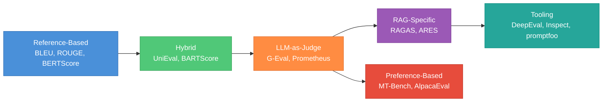
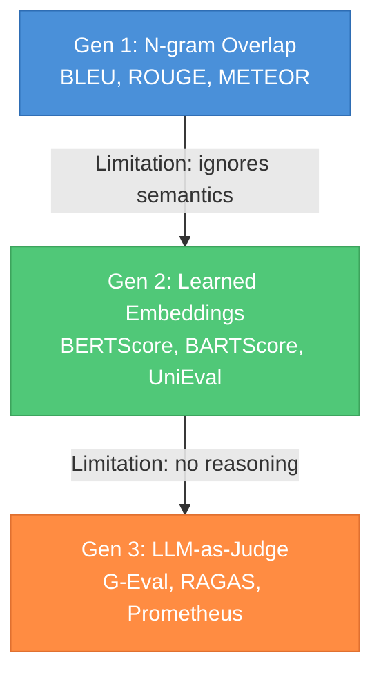
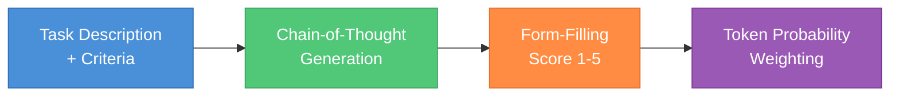
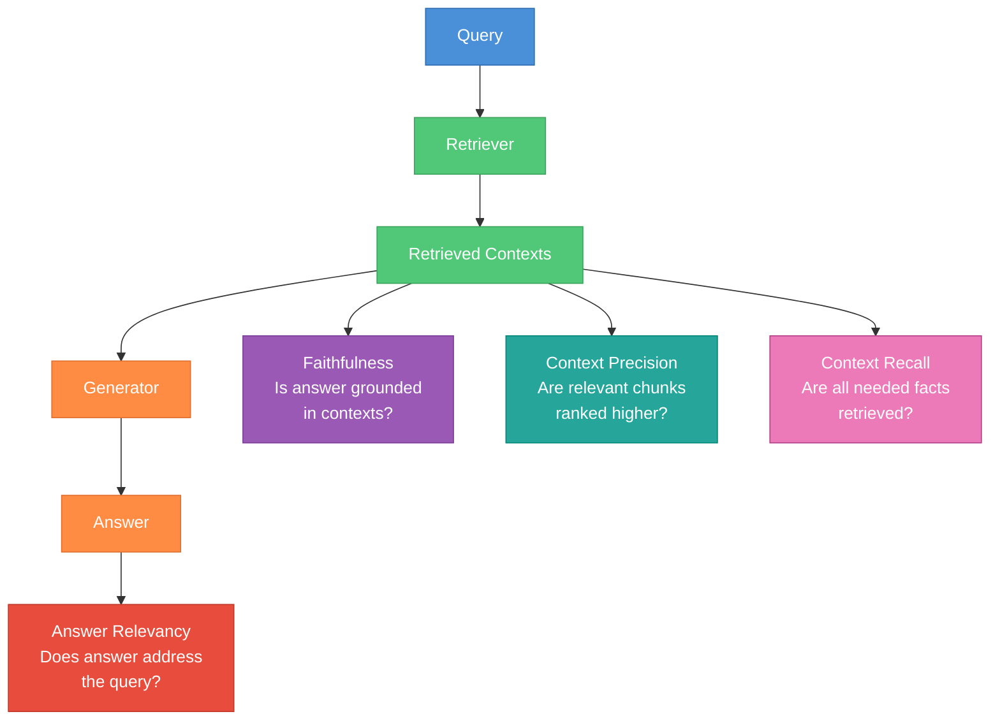
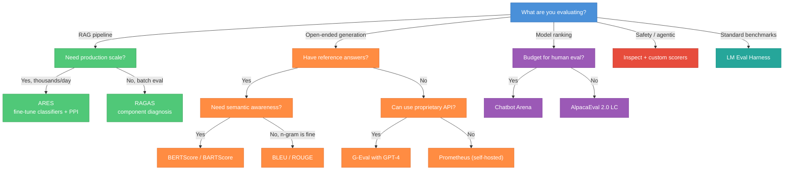

# LLM Eval Frameworks -- Practical Guide

A structured survey of the major frameworks and libraries for evaluating LLM outputs in practice. This guide covers the "how do I actually score model outputs?" question: from classical reference-based metrics through modern LLM-as-judge systems and RAG-specific pipelines. Where the [Evals Theory](evals-theory.md) guide explains WHY measurement works, this guide explains WHICH tools exist and WHEN to reach for each one.



---

## Table of Contents

**Part 1 -- Scoring Taxonomy**
1. [The Three Generations of LLM Scoring](#1-the-three-generations-of-llm-scoring)

**Part 2 -- Reference-Based Metrics**
2. [Classical N-gram Metrics](#2-classical-n-gram-metrics)
3. [Model-Based Reference Metrics](#3-model-based-reference-metrics)

**Part 3 -- LLM-as-Judge Frameworks**
4. [G-Eval](#4-g-eval)
5. [Prometheus](#5-prometheus)
6. [JudgeLM and PandaLM](#6-judgelm-and-pandalm)
7. [MT-Bench and Chatbot Arena](#7-mt-bench-and-chatbot-arena)
8. [AlpacaEval](#8-alpacaeval)

**Part 4 -- RAG Evaluation**
9. [RAGAS](#9-ragas)
10. [ARES](#10-ares)
11. [FActScore](#11-factscore)

**Part 5 -- Eval Tooling and Libraries**
12. [DeepEval](#12-deepeval)
13. [Inspect (UK AISI)](#13-inspect-uk-aisi)
14. [promptfoo](#14-promptfoo)
15. [TruLens](#15-trulens)
16. [Eleuther LM Eval Harness](#16-eleuther-lm-eval-harness)

**Part 6 -- Comparison and Selection**
17. [Framework Comparison Table](#17-framework-comparison-table)
18. [Decision Flowchart](#18-decision-flowchart)

**Part 7 -- Interview Prep**
19. [Interview Questions](#19-interview-questions)
20. [Cross-Reference](#cross-reference)

---

# Part 1 -- Scoring Taxonomy

---

## 1. The Three Generations of LLM Scoring



### Generation 1: N-gram Overlap (2002--2015)

Compare generated text to a reference string using surface-level token overlap. Fast, deterministic, reproducible. Fails silently on paraphrases: "the cat sat on the mat" and "a feline rested on the rug" score near zero despite identical meaning. Still widely used in machine translation and summarization benchmarks because they are cheap and everyone has historical numbers to compare against.

### Generation 2: Learned Embeddings (2019--2022)

Embed both candidate and reference into a shared vector space and compute similarity. Captures semantic equivalence that n-gram metrics miss. Still requires a reference answer. Quality depends on the embedding model: a domain-specific embedding outperforms a general one for medical or legal text.

### Generation 3: LLM-as-Judge (2023--present)

Use a strong LLM to evaluate outputs against a rubric, optionally with chain-of-thought reasoning. No reference needed (reference-free). Can evaluate subjective dimensions (helpfulness, harmlessness, honesty). The dominant paradigm for open-ended generation tasks. Key risk: judge biases (verbosity bias, position bias, self-preference bias) must be measured and mitigated — see the [judge theory section in Evals Theory](evals-theory.md#6-judge-theory).

### When Each Generation Applies

| Dimension | Gen 1 (N-gram) | Gen 2 (Embedding) | Gen 3 (LLM-as-Judge) |
|-----------|----------------|--------------------|-----------------------|
| Speed | Milliseconds | Seconds | Seconds to minutes |
| Cost per sample | ~$0 | ~$0 | $0.001--$0.10 |
| Reference required | Yes | Yes | Optional |
| Semantic awareness | None | Token-level | Full reasoning |
| Subjective quality | Cannot measure | Cannot measure | Can measure |
| Reproducibility | Perfect | Near-perfect | Stochastic (temp > 0) |
| Best for | MT, summarization baselines | Paraphrase-heavy tasks | Open-ended generation, safety, chat |

---

# Part 2 -- Reference-Based Metrics

---

## 2. Classical N-gram Metrics

### BLEU (Bilingual Evaluation Understudy)

[Papineni et al. (2002)](https://aclanthology.org/P02-1040/). The original automated MT metric. Computes modified n-gram precision for n=1..4, applies a brevity penalty for short outputs, then takes the geometric mean.

**Formula.** `BLEU = BP * exp(sum_{n=1}^{4} w_n * log(p_n))` where `p_n` is clipped n-gram precision and `BP = min(1, exp(1 - r/c))` penalizes candidates shorter than the reference.

**Strengths.** Fast, deterministic, widely reported. Corpus-level BLEU (aggregated over many samples) correlates reasonably with human judgement for translation.

**Weaknesses.** Sentence-level BLEU is noisy. Insensitive to meaning-preserving paraphrases. Does not handle open-ended generation well. The brevity penalty can over-penalize concise but correct answers.

**When to use.** Machine translation benchmarks, or when you need a cheap baseline metric for regression testing on generation tasks where you have gold references.

### ROUGE (Recall-Oriented Understudy for Gisting Evaluation)

[Lin (2004)](https://aclanthology.org/W04-1013/). A family of recall-oriented metrics designed for summarization.

| Variant | What it measures |
|---------|-----------------|
| ROUGE-1 | Unigram recall between candidate and reference |
| ROUGE-2 | Bigram recall |
| ROUGE-L | Longest common subsequence (LCS) — captures sentence-level structure |
| ROUGE-Lsum | LCS computed per-sentence then aggregated — better for multi-sentence summaries |

**Strengths.** Standard for summarization evaluation. ROUGE-L captures word order without requiring exact n-gram matches. F1 variants balance precision and recall.

**Weaknesses.** Same paraphrase blindness as BLEU. ROUGE-1 can be gamed by including many relevant unigrams in any order. Does not penalize hallucinated content that happens to not overlap with the reference.

### METEOR

[Banerjee & Lavie (2005)](https://aclanthology.org/W05-0909/). Extends n-gram matching with stemming, synonymy (via WordNet), and paraphrase tables. Computes a harmonic mean of precision and recall with a fragmentation penalty.

**Why it exists.** Addresses BLEU's two biggest limitations: paraphrase insensitivity and poor sentence-level correlation. Achieves higher correlation with human judgement than BLEU on MT tasks.

**When to use.** When you need a reference-based metric that handles lexical variation better than BLEU/ROUGE but don't want the cost of an embedding model.

---

## 3. Model-Based Reference Metrics

### BERTScore

[Zhang et al. (2020)](https://arxiv.org/abs/1904.09675). Computes token-level cosine similarity between contextual embeddings (from BERT or RoBERTa) of the candidate and reference, then takes a greedy max-match to produce precision, recall, and F1.

**Key insight.** "The cat sat on the mat" and "A feline rested on the rug" score high because BERT embeds synonyms near each other. This is the core advance over n-gram metrics.

**Practical notes.**
- Use `microsoft/deberta-xlarge-mnli` (the default in the `bert_score` package) for English — it has the highest correlation with human judgement.
- IDF weighting (optional) downweights common tokens, improving correlation on long documents.
- Scores are not absolute — they are only meaningful as comparisons between systems on the same dataset.

**When to use.** Any task where you have reference answers and want semantic-aware comparison. Good default choice for regression tests on generation pipelines.

### BARTScore

[Yuan et al. (2021)](https://arxiv.org/abs/2106.11520). Uses BART's log-likelihood as a scoring function: `BARTScore(src, tgt) = sum log P(tgt_i | tgt_{<i}, src)`. Can score in multiple directions:

| Direction | Measures | Formula |
|-----------|----------|---------|
| src → tgt | Faithfulness (does the output follow from the input?) | `log P(output | input)` |
| tgt → src | Relevance (does the output capture the input?) | `log P(input | output)` |
| ref → tgt | Adequacy (does the output match the reference?) | `log P(output | reference)` |

**Why it matters.** A single model gives you three different evaluation dimensions without any task-specific training. The faithfulness direction (src → tgt) is especially useful for summarization, where you want to catch hallucinations.

### UniEval

[Zhong et al. (2022)](https://arxiv.org/abs/2210.07197). Reframes evaluation as boolean QA: for each dimension (coherence, fluency, consistency, relevance), it constructs a question like "Is this summary consistent with the source document?" and fine-tunes a T5 model to answer yes/no with a probability score.

**Key advance.** Multi-dimensional evaluation from a single model. Outperforms BERTScore and BARTScore on the SummEval benchmark across all four dimensions. The boolean QA formulation means you can add new dimensions by writing new questions — no retraining.

---

# Part 3 -- LLM-as-Judge Frameworks

---

## 4. G-Eval

[Liu et al. (2023)](https://arxiv.org/abs/2303.16634). The foundational paper for using LLMs as evaluators with chain-of-thought reasoning.



### How It Works

1. **Define the task and criteria.** Specify what dimension to evaluate (e.g., coherence, fluency, relevance) and the evaluation criteria in natural language.
2. **Auto-generate CoT steps.** Prompt the LLM to produce a chain-of-thought evaluation plan — a sequence of reasoning steps that will guide the scoring.
3. **Score via form-filling.** The LLM reads the CoT steps and the candidate text, then outputs a score on a Likert scale (typically 1--5).
4. **Probability-weighted scoring.** Instead of taking the argmax score, G-Eval uses the token-level probabilities of each score token (1, 2, 3, 4, 5) and computes the expected value: `score = sum_{i=1}^{5} i * P(token_i)`. This reduces the discretization noise of integer scores.

### Results

On the SummEval benchmark, G-Eval with GPT-4 achieves Spearman correlation of 0.514 with human judgement on coherence — the highest reported at the time, surpassing all previous automated metrics. The probability-weighting step alone improves correlation by ~0.05 over argmax scoring.

### Strengths

- **Reference-free.** No gold answer needed — evaluate against criteria.
- **Multi-dimensional.** Define any dimension via natural language criteria.
- **CoT improves calibration.** The reasoning steps force the model to consider the criteria before scoring, reducing anchoring bias.

### Weaknesses and Known Biases

- **Verbosity bias.** Longer outputs tend to score higher regardless of quality. Mitigate by including length-neutral criteria or penalizing verbosity explicitly.
- **Self-preference bias.** GPT-4 as judge rates GPT-4 outputs higher than equivalent outputs from other models. Use a different judge model than the generator when possible.
- **Position bias.** In pairwise comparisons, the first candidate is preferred ~60% of the time. Mitigate by running both orderings and averaging.
- **Cost.** Each evaluation requires a full LLM call with CoT — at scale, this dominates the eval budget.

### When to Use G-Eval

Best for evaluating open-ended generation on subjective dimensions (summarization quality, dialogue coherence, instruction following) when you have the budget for LLM judge calls and need fine-grained scores rather than binary pass/fail.

---

## 5. Prometheus

[Kim et al. (2023)](https://arxiv.org/abs/2310.08491). An open-source LLM (13B/7B) specifically fine-tuned to be an evaluator, trained on 100K human-written fine-grained evaluation feedback samples.

### Motivation

G-Eval requires a proprietary frontier model (GPT-4) as the judge, which creates cost, reproducibility, and data-privacy problems. Prometheus asks: can we fine-tune an open model to match GPT-4's evaluation quality?

### Architecture

- **Base model.** Llama-2 13B (Prometheus-1) or Mistral 7B (Prometheus-2).
- **Training data.** 100K samples of (instruction, response, rubric, score, detailed feedback) from the Feedback Collection dataset, with scores verified against human judgement.
- **Input format.** Takes an instruction, a response, and a scoring rubric (1--5 scale with descriptions for each level), outputs a score and detailed written feedback explaining the score.

### Prometheus-2 Improvements

[Kim et al. (2024)](https://arxiv.org/abs/2405.01535) extends to both direct assessment (score 1--5) and pairwise comparison (A vs B). Trained on a merged dataset of absolute and relative judgement data. Achieves the highest correlation with human judges among all open-source evaluator models.

### Strengths

- **Open-source and self-hostable.** No API costs, no data leaves your infrastructure.
- **Rubric-grounded.** Scores are anchored to explicit rubric descriptions, making them more interpretable and consistent than free-form G-Eval.
- **Written feedback.** Produces explanations alongside scores — useful for debugging model failures.

### Weaknesses

- **Smaller model = weaker reasoning.** On complex evaluation tasks (multi-hop reasoning, code correctness), the 7B/13B models may miss subtle errors that GPT-4 catches.
- **Fixed rubric format.** The model expects a specific rubric structure. Novel evaluation dimensions may require creating new rubric templates.

### When to Use Prometheus

When you need an LLM judge but cannot use proprietary APIs (data privacy, cost, reproducibility), and the evaluation dimensions can be captured in a 5-point rubric.

---

## 6. JudgeLM and PandaLM

### JudgeLM

[Zhu et al. (2023)](https://arxiv.org/abs/2310.17631). Fine-tunes LLMs on 100K+ judge samples to produce scalable evaluators. Key contributions:

- **Swap augmentation.** During training, each pairwise comparison sample is augmented with the candidates in both orderings, explicitly training out position bias.
- **Reference-guided judging.** Optionally provides a reference answer to the judge, which improves agreement with human scores from 72.6% to 78.5% on the JudgeLM benchmark.
- **Multi-scale.** Models at 7B, 13B, and 33B parameters. The 33B model achieves agreement with GPT-4 judgements comparable to inter-annotator agreement among humans.

### PandaLM

[Wang et al. (2024)](https://arxiv.org/abs/2306.05087). Fine-tunes a Llama model (7B) specifically for pairwise comparison, training on 300K samples of (instruction, response_A, response_B, preference label).

**Distinguishing feature.** PandaLM outputs a structured judgement: the winner (A, B, or tie) plus per-dimension scores (correctness, fluency, comprehensiveness, harmlessness, conciseness) with explanations for each.

### When to Use

Both are useful when you need a self-hosted judge for pairwise ranking at scale. JudgeLM is better studied; PandaLM provides more structured per-dimension feedback.

---

## 7. MT-Bench and Chatbot Arena

### MT-Bench

[Zheng et al. (2023)](https://arxiv.org/abs/2306.05685). A curated set of 80 multi-turn questions across 8 categories (writing, roleplay, extraction, reasoning, math, coding, STEM, humanities) designed to test instruction-following quality. Scored by GPT-4 on a 1--10 scale with reference answers for math/reasoning.

**Why it matters.** Before MT-Bench, LLM evaluation was either massive benchmarks (MMLU, HumanEval) that test narrow capabilities or single-turn RLHF preference data. MT-Bench tests the multi-turn conversational ability that real users care about.

**Design choices.**
- Multi-turn: each question has a follow-up that tests whether the model can maintain context and refine its answer.
- Category balance: equal representation across diverse skill areas.
- Reference-guided grading: math/coding questions include gold answers to anchor the judge.

### Chatbot Arena (LMSYS)

[Chiang et al. (2024)](https://arxiv.org/abs/2403.04132). A live platform where users chat with two anonymous models side by side and pick a winner. Produces Elo ratings from hundreds of thousands of human preference votes.

**Why it matters.** This is the closest thing to a ground-truth ranking of LLM quality. Because humans provide the judgements in a blind setting with self-selected prompts, it avoids the distributional mismatch between benchmark prompts and real usage. The Elo ratings correlate well with model capabilities as perceived by practitioners.

**Limitations.** Expensive (requires real human traffic), slow to converge for new models, biased toward English and consumer use cases.

### When to Use

MT-Bench for quick automated multi-turn evaluation during development. Chatbot Arena rankings as an external reference for calibrating your own eval results against the community consensus.

---

## 8. AlpacaEval

[Li et al. (2023)](https://arxiv.org/abs/2404.04475). An automated evaluation framework for instruction-following models. The model generates responses to 805 instructions from the AlpacaFarm dataset; a strong LLM judge (GPT-4-turbo) compares each response against a reference model (GPT-4) and reports a win rate.

### AlpacaEval 2.0 (Length-Controlled)

The original AlpacaEval had severe length bias — verbose models scored disproportionately high. AlpacaEval 2.0 adds a length-controlled (LC) win rate that regresses out the effect of response length, producing rankings that better match Chatbot Arena Elo than the raw win rate.

**LC win rate formula.** Fit a logistic regression: `logit(win) = beta_0 + beta_1 * log(length_ratio)`, then adjust each sample's win probability by subtracting the length effect.

### Strengths

- **Fast automated ranking.** 805 samples × 1 judge call each — can rank a new model in under an hour.
- **High correlation.** LC AlpacaEval 2.0 achieves Spearman correlation of 0.98 with Chatbot Arena Elo rankings.
- **Cheap.** ~$10 in API costs per evaluation run.

### Weaknesses

- **Single reference model.** The baseline is frozen (GPT-4 at a specific snapshot), which becomes less meaningful as models surpass it.
- **Instruction distribution.** The 805 instructions may not represent your deployment distribution.
- **Judge model dependency.** Results are only as good as GPT-4-turbo's evaluation ability.

---

# Part 4 -- RAG Evaluation

---

## 9. RAGAS

[Es et al. (2024)](https://arxiv.org/abs/2309.15217). The de facto standard framework for evaluating Retrieval-Augmented Generation pipelines. Decomposes RAG quality into component metrics that isolate retriever vs generator failures.



### Core Metrics

| Metric | What it measures | How it works | Range |
|--------|-----------------|-------------|-------|
| **Faithfulness** | Is the answer grounded in the retrieved contexts? | Extract claims from the answer via LLM, check each claim against the contexts. Score = fraction of claims supported. | 0--1 |
| **Answer Relevancy** | Does the answer address the question? | Generate N hypothetical questions from the answer, compute mean cosine similarity between generated questions and the original query. | 0--1 |
| **Context Precision** | Are the relevant chunks ranked higher? | LLM labels each retrieved chunk as relevant/irrelevant to the query, compute precision@K weighted by rank. | 0--1 |
| **Context Recall** | Are all the facts needed to answer retrieved? | Extract reference-answer claims, check each against retrieved contexts. Score = fraction of claims covered. | 0--1 |

### Metric Decomposition

The power of RAGAS is diagnostic isolation:

- **Low faithfulness, high context recall.** The retriever found the right documents, but the generator hallucinated beyond them. Fix: improve the generation prompt, add grounding constraints, or reduce context window.
- **High faithfulness, low answer relevancy.** The answer is grounded but off-topic. Fix: improve the query understanding or retrieval query reformulation.
- **Low context precision, high context recall.** The retriever found the right docs but ranked irrelevant ones higher. Fix: improve reranking or chunk boundaries.
- **Low context recall.** The retriever missed critical information. Fix: improve embedding model, chunking strategy, or add more source documents.

### Strengths

- **Component-level diagnosis.** Pinpoints whether a failure is in retrieval or generation.
- **No fine-tuning required.** Uses an off-the-shelf LLM (GPT-3.5/4) for all metric computations.
- **Python library.** `pip install ragas` — integrates with LangChain, LlamaIndex, Haystack.
- **Extensible.** Custom metrics can be added by defining new LLM-based scoring functions.

### Weaknesses

- **LLM-dependent.** All metrics rely on LLM calls for claim extraction and labeling. Quality degrades with weaker judge models.
- **Faithfulness is binary per-claim.** Partially supported claims are scored as 0 or 1, missing nuance.
- **Answer relevancy uses embeddings.** The cosine-similarity approach can miss semantic relevance that requires reasoning.
- **Cost at scale.** Each sample requires multiple LLM calls (claim extraction + verification per metric).

### When to Use RAGAS

Default choice for evaluating RAG pipelines in development. Run it on a sample of production queries to diagnose whether to invest in better retrieval or better generation.

---

## 10. ARES

[Saad-Falcon et al. (2024)](https://arxiv.org/abs/2311.09476). Automated RAG Evaluation System. Addresses RAGAS's key limitation: the cost and noise of using an LLM judge for every sample.

### How It Works

1. **Generate synthetic training data.** Use an LLM to create (query, context, answer) triples with known quality labels — both positive (faithful, relevant) and negative (hallucinated, irrelevant).
2. **Fine-tune lightweight classifiers.** Train DeBERTa-based classifiers on the synthetic data for each dimension (context relevance, answer faithfulness, answer relevance).
3. **Apply PPI (Prediction-Powered Inference).** Score unlabeled production data with the fine-tuned classifiers, then use a small set of human-labeled samples to correct for classifier bias via [prediction-powered inference](https://arxiv.org/abs/2301.09633) — producing confidence intervals on the true metric, not just point estimates.

### Why PPI Matters

The fine-tuned classifiers are fast but biased. Raw classifier accuracy on out-of-distribution data may be 80%, meaning 20% of your metric is noise. PPI uses a small human-labeled calibration set (typically 50--150 samples) to estimate and correct for this bias, producing a confidence interval like "faithfulness = 0.82 ± 0.04 (95% CI)" that accounts for both sampling variance and classifier error.

### Strengths

- **Cheap at scale.** After the one-time fine-tuning cost, each sample costs a single DeBERTa forward pass — orders of magnitude cheaper than RAGAS's per-sample LLM calls.
- **Statistical guarantees.** PPI provides valid confidence intervals even when the classifier is imperfect.
- **Self-hostable.** The fine-tuned classifiers are small enough to run on a single GPU.

### Weaknesses

- **Upfront investment.** Requires generating synthetic data, fine-tuning classifiers, and collecting a human calibration set.
- **Domain sensitivity.** The classifiers may not transfer well across domains — a classifier fine-tuned on customer support data may perform poorly on legal documents.
- **Fewer dimensions.** ARES evaluates three dimensions vs RAGAS's four (no context precision equivalent).

### When to Use ARES

When you need to evaluate RAG quality at production scale (thousands of queries/day) and cannot afford per-sample LLM judge calls. The PPI framework is also valuable whenever you want confidence intervals on any classifier-based metric.

---

## 11. FActScore

[Min et al. (2023)](https://arxiv.org/abs/2305.14251). Fine-grained Atomic fact score for measuring factual precision of long-form text generation (biographies, Wikipedia-style articles, etc.).

### How It Works

1. **Atomic fact decomposition.** Break the generated text into individual atomic facts — the smallest self-contained factual claims (e.g., "Barack Obama was born in Hawaii" is one atomic fact).
2. **Retrieval.** For each atomic fact, retrieve relevant passages from a knowledge source (Wikipedia, or a custom corpus).
3. **Verification.** Use an LLM (or NLI model) to check whether each atomic fact is supported by the retrieved passages.
4. **Score.** `FActScore = (# supported atomic facts) / (# total atomic facts)`.

### Why Atomic Decomposition Matters

A single sentence like "Marie Curie won two Nobel Prizes in Physics and Chemistry" contains three atomic facts: (1) Marie Curie won Nobel Prizes, (2) she won two of them, (3) they were in Physics and Chemistry. Fact (2) is correct, fact (3) is partially wrong (Physics and Chemistry are correct, but she won one in each, not two in one field). Sentence-level scoring would miss this — FActScore catches it by checking each atom independently.

### Strengths

- **Fine-grained.** Identifies exactly which facts are wrong, not just that the output is "unfaithful."
- **Knowledge-grounded.** Verifies against a retrieval corpus, not just internal model consistency.
- **Interpretable.** The output is a list of atomic facts with support/not-supported labels — directly actionable for debugging.

### Weaknesses

- **Decomposition quality.** The atomic fact extraction step can miss implicit claims or over-split complex statements.
- **Recall is not measured.** FActScore measures precision (are the stated facts correct?) but not recall (are all important facts stated?).
- **Requires a knowledge source.** For niche domains without good retrieval corpora, verification quality degrades.

### When to Use FActScore

Evaluating factual accuracy of long-form generation tasks: biographies, encyclopedic summaries, research paper summaries. Pair with a recall-oriented metric (like ROUGE against a reference) for complete coverage.

---

# Part 5 -- Eval Tooling and Libraries

---

## 12. DeepEval

[GitHub: confident-ai/deepeval](https://github.com/confident-ai/deepeval). An open-source LLM evaluation framework that bundles multiple metrics (including G-Eval, faithfulness, answer relevancy, hallucination, toxicity, bias) into a pytest-like testing interface.

### Key Features

- **pytest integration.** Write eval tests as `def test_faithfulness():` functions, run with `deepeval test run`.
- **14+ built-in metrics.** G-Eval, answer relevancy, faithfulness, contextual precision/recall, hallucination, toxicity, bias, summarization, tool use correctness, conversation completeness, JSON correctness, task completion.
- **Custom metrics.** Define new metrics via `GEval(criteria="...")` — it uses the G-Eval paradigm under the hood.
- **Dashboard.** Optional hosted dashboard (Confident AI) for tracking metric trends across runs.
- **Conversational eval.** Metrics that evaluate multi-turn conversations, not just single responses.

### Example Usage

```python
from deepeval.metrics import GEval, FaithfulnessMetric
from deepeval.test_case import LLMTestCase
from deepeval import evaluate

test_case = LLMTestCase(
    input="What is the capital of France?",
    actual_output="Paris is the capital of France.",
    retrieval_context=["France is a country in Western Europe. Its capital is Paris."]
)

faithfulness = FaithfulnessMetric(threshold=0.7)
relevancy = GEval(
    name="Answer Relevancy",
    criteria="Determine whether the output addresses the input query directly.",
    evaluation_steps=[
        "Check if the main question is answered",
        "Check if the answer is specific rather than vague"
    ],
    evaluation_params=["input", "actual_output"]
)

evaluate([test_case], [faithfulness, relevancy])
```

### When to Use DeepEval

When you want a batteries-included eval library that integrates into a CI/CD pipeline. Good for teams that need to ship eval tests alongside model changes with a familiar pytest workflow.

---

## 13. Inspect (UK AISI)

[GitHub: UKGovernmentBEIS/inspect_ai](https://github.com/UKGovernmentBEIS/inspect_ai). The UK AI Safety Institute's open-source evaluation framework, designed for rigorous safety evaluations.

### Key Features

- **Task-centric.** Evals are defined as tasks with datasets, solvers (model interaction patterns), and scorers.
- **Agentic eval support.** First-class support for multi-step tool-using agents — sandboxed Docker environments, tool definitions, trajectory logging.
- **Solver patterns.** Built-in solvers for common patterns: chain-of-thought, self-critique, multi-turn, plan-and-execute.
- **Community evals.** The `inspect_evals` package includes implementations of published benchmarks: MMLU, GSM8K, HumanEval, SWE-bench, GAIA, XSTest, CyberMetric, and more.
- **Log viewer.** Web-based UI for inspecting eval results, model traces, and scorer outputs.

### When to Use Inspect

When you need to run agentic safety evaluations with sandboxed tool execution. Also a good choice when you want to reproduce published benchmark results with a standardized framework.

---

## 14. promptfoo

[GitHub: promptfoo/promptfoo](https://github.com/promptfoo/promptfoo). An open-source tool for testing and evaluating LLM prompts and models. Designed for prompt engineering workflows.

### Key Features

- **YAML-based test definitions.** Define test cases, assertions, and expected outputs in YAML — no Python required.
- **Multi-provider comparison.** Test the same prompts against multiple models (OpenAI, Anthropic, Llama, Mistral, etc.) in a single run.
- **Assertion types.** Built-in assertions: contains, regex, JSON schema validation, similarity thresholds, LLM-graded rubrics, Python functions.
- **Red-team module.** Automated adversarial testing: prompt injection, jailbreaks, PII leakage, hallucination probes.
- **Web UI.** Side-by-side comparison view for prompt variants and model outputs.
- **CI integration.** GitHub Actions support for running prompt tests on every PR.

### When to Use promptfoo

When your primary concern is prompt engineering and comparison — testing different prompt templates, system messages, or model choices. Lighter weight than DeepEval for teams that don't need deep metric customization.

---

## 15. TruLens

[GitHub: truera/trulens](https://github.com/truera/trulens). An observability and evaluation framework for LLM applications, with special focus on RAG.

### Key Features

- **RAG triad.** Evaluates three dimensions: groundedness (faithfulness), answer relevance, and context relevance — similar to RAGAS but with chain-of-thought-based scoring.
- **Instrumentation.** Wraps LangChain, LlamaIndex, and custom apps to automatically capture retrieval and generation traces.
- **Feedback functions.** Pluggable scoring functions that can use any LLM or embedding model as the evaluator.
- **Leaderboard dashboard.** Web UI for comparing app versions across evaluation dimensions.

### When to Use TruLens

When you want RAG evaluation tightly integrated with application monitoring — TruLens sits between RAGAS (pure eval) and production observability tools. Good for teams running RAG in production who want continuous evaluation, not just batch testing.

---

## 16. Eleuther LM Eval Harness

[GitHub: EleutherAI/lm-evaluation-harness](https://github.com/EleutherAI/lm-evaluation-harness). The standard benchmarking framework for evaluating language models on academic benchmarks.

### Key Features

- **400+ tasks.** MMLU, HellaSwag, ARC, WinoGrande, GSM8K, TruthfulQA, HumanEval, and hundreds more.
- **Model agnostic.** Supports HuggingFace models, GGUF, OpenAI API, Anthropic API, vLLM, and more.
- **Standardized evaluation.** Exact prompt templates, few-shot configurations, and scoring procedures for each benchmark — ensuring reproducible comparisons.
- **Group evaluations.** Run suites of related benchmarks (e.g., all MMLU subjects) with a single command.

### When to Use

When you need standardized benchmark numbers for a model. The harness is the community standard — if you report benchmark numbers, they should come from this tool (or explicitly note deviations).

---

# Part 6 -- Comparison and Selection

---

## 17. Framework Comparison Table

| Framework | Type | Reference Needed? | Cost/Sample | Best For | Self-Hostable? |
|-----------|------|-------------------|-------------|----------|----------------|
| BLEU / ROUGE | N-gram | Yes | ~$0 | MT, summarization baselines | Yes |
| BERTScore | Embedding | Yes | ~$0 | Semantic similarity regression tests | Yes |
| BARTScore | Generative | Optional | ~$0 | Multi-directional faithfulness | Yes |
| UniEval | Boolean QA | Yes | ~$0 | Multi-dimensional quality | Yes |
| G-Eval | LLM-as-Judge | No | $0.01--0.10 | Open-ended generation quality | No (needs GPT-4) |
| Prometheus | LLM-as-Judge | No | ~$0 | Privacy-sensitive rubric evaluation | Yes (7B/13B) |
| JudgeLM | LLM-as-Judge | Optional | ~$0 | Pairwise ranking at scale | Yes (7B--33B) |
| MT-Bench | LLM-as-Judge | Partial | $0.01--0.10 | Multi-turn chat evaluation | Partial |
| AlpacaEval | LLM-as-Judge | Yes (baseline) | ~$10/run | Quick model ranking | No (needs GPT-4) |
| RAGAS | RAG-specific | Optional | $0.03--0.15 | RAG pipeline diagnosis | Partial |
| ARES | RAG-specific | No | ~$0 (after setup) | Production RAG at scale | Yes |
| FActScore | Factuality | No (uses retrieval) | $0.01--0.05 | Long-form factual accuracy | Partial |
| DeepEval | Framework | Varies | Varies | CI/CD eval pipelines | Yes |
| Inspect | Framework | Varies | Varies | Agentic safety evals | Yes |
| promptfoo | Framework | Varies | Varies | Prompt engineering + comparison | Yes |
| TruLens | Framework | Varies | Varies | RAG observability + continuous eval | Yes |
| LM Eval Harness | Framework | Yes (benchmark) | Varies | Standardized benchmarking | Yes |

---

## 18. Decision Flowchart



---

# Part 7 -- Interview Prep

---

## 19. Interview Questions

### Q1: "What is G-Eval and how does it improve over traditional metrics?"

G-Eval uses an LLM to evaluate outputs via chain-of-thought reasoning and form-filling on a Likert scale, with probability-weighted scoring to reduce discretization noise. It improves over n-gram metrics (BLEU, ROUGE) by capturing semantic quality without requiring reference answers, and over embedding metrics (BERTScore) by supporting subjective dimensions like coherence and helpfulness. The key innovation is auto-generating evaluation steps via CoT and using token probabilities for fine-grained scoring. Main weaknesses: verbosity bias, self-preference bias, and cost.

### Q2: "How does RAGAS evaluate a RAG pipeline, and what does each metric tell you?"

RAGAS decomposes RAG quality into four component metrics. Faithfulness measures whether the answer is grounded in retrieved contexts (claim extraction + verification). Answer relevancy measures whether the answer addresses the query (hypothetical question generation + cosine similarity). Context precision measures whether relevant chunks are ranked higher (LLM relevance labeling + weighted precision). Context recall measures whether all needed facts were retrieved (reference claim coverage). The diagnostic power is in the decomposition: low faithfulness with high context recall points to a generation problem, while low context recall points to a retrieval problem.

### Q3: "Why would you choose ARES over RAGAS for production RAG evaluation?"

RAGAS requires multiple LLM calls per sample — at production scale (thousands of queries/day), this becomes prohibitively expensive. ARES addresses this by fine-tuning lightweight DeBERTa classifiers on synthetic data, then using prediction-powered inference (PPI) with a small human-labeled calibration set to correct for classifier bias. The result is per-sample cost of a single DeBERTa forward pass (orders of magnitude cheaper) with valid confidence intervals on the metric. The tradeoff is upfront investment in data generation, fine-tuning, and human labeling.

### Q4: "What is FActScore and when would you use it instead of RAGAS faithfulness?"

FActScore decomposes text into atomic facts (the smallest self-contained claims), retrieves evidence for each from a knowledge corpus, and computes the fraction that are supported. Use it instead of RAGAS faithfulness when: (a) you are evaluating open-ended generation (not RAG — there are no "retrieved contexts"), (b) you need to identify exactly which facts are wrong (not just a faithfulness score), or (c) you are verifying against an external knowledge source rather than the model's own retrieved contexts.

### Q5: "Compare Prometheus with GPT-4-as-judge. When would you pick each?"

GPT-4-as-judge (G-Eval style) has stronger reasoning, handles complex evaluation tasks better, and requires no fine-tuning. Choose it when: evaluation budget allows API costs, tasks require nuanced multi-hop reasoning, and data privacy is not a concern. Prometheus is an open-source 7B/13B model fine-tuned specifically for evaluation. Choose it when: data cannot leave your infrastructure, you need reproducible evaluations without API dependency, cost is a constraint, and the evaluation dimensions fit into a structured 5-point rubric. Prometheus-2 narrows the gap by supporting both direct assessment and pairwise comparison.

### Q6: "What biases do LLM judges exhibit and how do you mitigate them?"

Three main biases: (1) Verbosity bias — longer outputs score higher. Mitigate with length-controlled scoring (AlpacaEval 2.0) or explicit length-neutral rubric criteria. (2) Position bias — in pairwise comparisons, the first candidate is preferred ~60% of the time. Mitigate by running both orderings and averaging (swap augmentation, as in JudgeLM). (3) Self-preference bias — a model rates its own outputs higher. Mitigate by using a different model as the judge than as the generator. Additional mitigations: use a judge envelope (min/median/max across multiple judges — see [Evals Theory: Judge Theory](evals-theory.md#6-judge-theory)) and report inter-judge agreement via Cohen's Kappa.

### Q7: "You're building a CI pipeline for an LLM application. Which eval framework do you pick and why?"

For a CI pipeline, I would use DeepEval because: (1) pytest integration — eval tests live alongside unit tests and run on every PR, (2) built-in metrics cover the common cases (faithfulness, relevancy, hallucination, toxicity), (3) custom G-Eval metrics can be added for domain-specific criteria, (4) it supports threshold-based pass/fail — the PR fails if any metric drops below the threshold. For the specific case of prompt engineering iteration, promptfoo is lighter weight and supports YAML-based test definitions with multi-provider comparison.

### Q8: "Walk me through how you would evaluate a summarization system end-to-end."

Three layers of evaluation. Layer 1 (regression baseline): ROUGE-L and BERTScore against reference summaries — cheap, fast, catches gross regressions in CI. Layer 2 (quality assessment): G-Eval or Prometheus with four criteria (coherence, fluency, consistency with source, relevance) — run on a sample of outputs after each model update. Layer 3 (factual accuracy): FActScore or BARTScore (src → tgt direction) to catch hallucinations — the most important metric for production summarization. Report all metrics with confidence intervals (Wilson for proportions, bootstrap for composite scores). Flag for human review when: G-Eval scores diverge from reference-based metrics (could indicate reference quality issues) or FActScore drops below threshold.

### Q9: "How does AlpacaEval 2.0 solve the length bias problem?"

AlpacaEval 1.0 had severe length bias: verbose models won more pairwise comparisons simply because longer outputs appear more thorough. AlpacaEval 2.0 fits a logistic regression of win probability on log length ratio, then subtracts the length effect to produce a length-controlled (LC) win rate. This brings the Spearman correlation with Chatbot Arena Elo from 0.93 (raw) to 0.98 (LC) — showing that after removing length confounding, the automated ranking nearly perfectly matches human preferences.

### Q10: "What is the difference between reference-based and reference-free evaluation? When do you need each?"

Reference-based evaluation compares model output to a gold answer (BLEU, ROUGE, BERTScore). It works when there is a single correct or canonical answer — translation, factoid QA, structured extraction. Reference-free evaluation scores the output against criteria or the input alone (G-Eval, RAGAS faithfulness, Prometheus). It is necessary when: (a) there is no single correct answer (creative writing, open-ended chat), (b) the task is too diverse for gold answers (instruction following), or (c) you want to measure subjective quality dimensions (helpfulness, harmlessness). In practice, use both: reference-based for regression testing and reference-free for quality assessment.

---

## Cross-Reference

| Topic | Where to go |
|-------|-------------|
| Statistical foundations for eval metrics (CIs, power, multiplicity) | [Evals Theory](evals-theory.md) |
| Judge calibration, Cohen's Kappa, judge envelope protocol | [Evals Theory: Judge Theory](evals-theory.md#6-judge-theory) |
| Designing an eval from scratch (7-phase lifecycle) | [Eval Design Lifecycle](eval-design-lifecycle.md) |
| METR-style case study with hierarchical bootstrap | [Eval Design Case Study](eval-design-case-study.md) |
| Adversarial robustness benchmarks and methodology | [Adv Robustness Survey](adv-robustness-survey.md) |
| Hands-on paired bootstrap, power analysis, FDR | [Quant Stats Skill Building](quant-stats-skill-building.md) |
| Wilson CIs, BH-FDR correction in runnable code | [Companion Notebooks](../notebooks/) |
