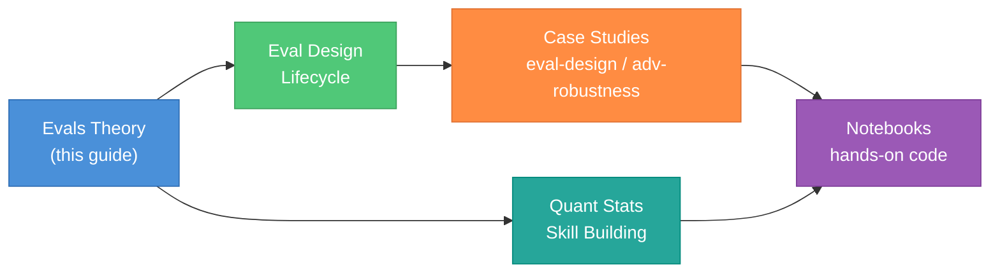
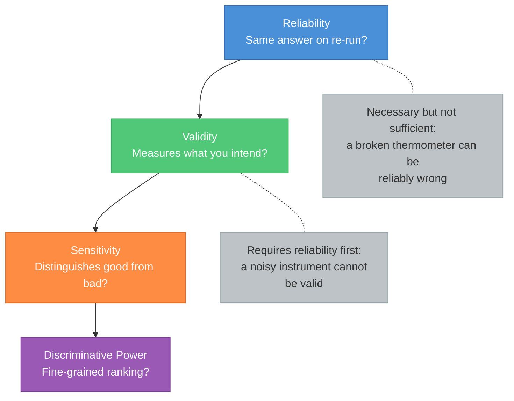
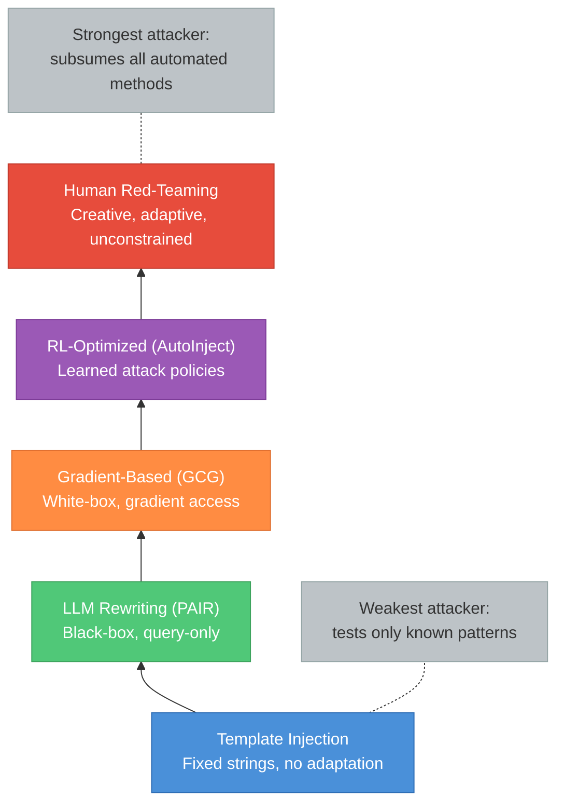

# Eval Design Theory -- Foundational Reference

A structured reference for the theoretical underpinnings of evaluation design for LLM and agentic systems. Part 1 covers foundations you must know cold -- the concepts that every eval implicitly relies on. Part 2 covers advanced topics that separate rigorous evals from paper-mill exercises. Part 3 is a curated resource list. This guide is the "start here" for the Evals and Safety section of this repo: it explains WHY the methods work so you can move to the applied guides to see HOW to use them.



---

## Table of Contents

**Part 1 -- Foundations of Eval Design**
1. [What Is an Eval?](#1-what-is-an-eval)
2. [Experimental Design for Evals](#2-experimental-design-for-evals)
3. [Hypothesis Testing for Evals](#3-hypothesis-testing-for-evals)
4. [Measurement Theory for Evals](#4-measurement-theory-for-evals)
5. [Scoring and Metrics Theory](#5-scoring-and-metrics-theory)
6. [Judge Theory](#6-judge-theory)

**Part 2 -- Advanced Topics**
7. [Selection Bias in Evals](#7-selection-bias-in-evals)
8. [Adaptive Evaluation](#8-adaptive-evaluation)
9. [Eval Design Patterns](#9-eval-design-patterns)
10. [Threat Modeling for Evals](#10-threat-modeling-for-evals)

**Part 3 -- Curated Resources**
11. [Curated Resources](#11-curated-resources)

**Part 4 -- Interview Prep**
12. [Interview Questions Checklist](#12-interview-questions-checklist)
13. [Cross-Reference](#cross-reference)

---

# Part 1 -- Foundations of Eval Design

---

## 1. What Is an Eval?

### Core Definition

An **eval** is a structured experiment designed to measure a specific property of a model or system. It has a hypothesis, a measurement procedure, controls, and statistical properties. The output is a quantitative claim with uncertainty bounds, not a pass/fail stamp.

### Evals vs Benchmarks vs Red-Teaming

| Concept | What it is | Example |
|---------|-----------|---------|
| **Benchmark** | A fixed test suite with a canonical scoring procedure. Results are comparable across time and teams. | MMLU, HumanEval, AdvBench |
| **Eval** | An experiment with a hypothesis, controls, confounds, and a pre-registered analysis plan. May use a benchmark as its test set. | "Does defense X reduce ASR on HarmBench by at least 10pp at n=200 with 80% power?" |
| **Red-teaming** | Adversarial probing, often open-ended, aimed at finding failure modes rather than measuring a rate. | Manual prompt-crafting sessions, automated attack sweeps with human review |

The key distinction: a benchmark tells you the score; an eval tells you whether the score means anything and how much you should trust it. Most published "evals" are benchmarks with no uncertainty quantification -- Miller (2024) documents this gap.

### The Eval as a Measurement Instrument

Every eval is an instrument. Like any instrument, it has four properties you must assess before trusting its readings:

1. **Reliability** -- does it give the same answer on re-runs? (Section 4)
2. **Validity** -- does it measure what you think it measures? (Section 4)
3. **Sensitivity** -- can it distinguish a good model from a bad one? (Section 4)
4. **Calibration** -- do the scores mean what they claim to mean? (Section 5)

If any of these fail, the eval number is noise dressed up as signal.

---

## 2. Experimental Design for Evals

### Factorial Design

When an eval has multiple factors -- model, attack method, judge, dataset category -- the number of cells grows combinatorially. A full-factorial design tests every combination.

```
Full factorial:  cells = |models| x |attacks| x |judges| x |categories|

Example: 3 models x 4 attacks x 2 judges x 10 categories = 240 cells
```

At n=100 test cases per cell, this is 24,000 eval runs. When this is too expensive, use **fractional factorial** designs: select a strategic subset of cells that lets you estimate main effects and key two-way interactions while aliasing higher-order interactions you do not expect to matter.

**When to use each:**
- Full factorial: when compute is cheap relative to design effort (small factor counts, fast inference).
- Fractional factorial: when you have 4+ factors and cannot afford the full cross. Common in agent evals where each run involves tool execution.

### Paired vs Unpaired Designs

**Paired design:** the same test cases are scored under both conditions. Prompt X is given to model A and model B; the difference in outcome on each prompt is the observation.

**Unpaired design:** independent sets of test cases are used for each condition.

For model comparison, **pairing is almost always right**. The variance of a paired difference is:

```
Var(d) = Var(X_A) + Var(X_B) - 2 * Cov(X_A, X_B)
```

When the same prompt is used, `Cov(X_A, X_B) > 0` (hard prompts tend to be hard for both models), so the paired variance is smaller and you need fewer samples for the same power. Cross-reference: [Week 2 of quant-stats-skill-building](quant-stats-skill-building.md#week-2--comparing-two-things-properly).

### Within-Subject vs Between-Subject

In eval design, "subjects" are test cases (prompts, behaviors, scenarios).

- **Within-subject:** the same test case is scored under both conditions. This is paired design applied to test cases.
- **Between-subject:** different test cases are assigned to different conditions.

Within-subject is almost always preferred for evals because it controls for item difficulty -- a confound that dominates variance in safety evals where some prompts are trivially refused and others are near-impossible to defend.

### Blocking and Stratification

Group test cases by attributes that correlate with the outcome: difficulty tier, harm category, prompt length, attack type. Then ensure each condition sees a balanced representation of each block.

**Why this matters concretely:** JailbreakBench uses 10 harm categories and HarmBench uses 7 semantic categories. If your eval draws 80% of prompts from "cybercrime" and 20% from "harassment," your ASR reflects the cybercrime difficulty, not the model's general vulnerability. Stratified sampling or post-hoc category-level reporting fixes this.

### Randomization

- **Random assignment** of test cases to conditions when between-subject design is necessary.
- **Random ordering** of prompts within a condition to avoid position effects.
- **The primacy/recency problem in LLM-as-judge:** the order in which candidate responses are presented to a judge model can bias the score. Randomize or counterbalance presentation order, then test for order effects.

### Controls

Every eval needs two baselines:

1. **Positive control (the model should be attackable).** The undefended model, tested with the same prompts and judge. If the positive control shows ASR near zero, your test cases are too easy or your judge is broken.
2. **Negative control (the model should refuse everything).** A trivially defended model (e.g., system prompt that refuses all requests). If the negative control shows ASR above zero, your judge is miscounting. It should also be tested on benign prompts -- if it refuses benign requests at a high rate, the eval confirms the defense is just denial-of-service.

Both are necessary. Many published evals omit the positive control and report a low ASR that might just mean the test set is weak.

---

## 3. Hypothesis Testing for Evals

### Framing the Null Hypothesis

The null hypothesis for an eval is the single most important design decision. Common framings:

| Eval goal | Null hypothesis H_0 |
|-----------|-------------------|
| Safety improvement | "The defended model has the same ASR as the undefended model" |
| Capability | "The model has no ability to complete this task class" |
| Vulnerability discovery | "The model is not exploitable by this attack class" |
| Judge agreement | "The LLM judge agrees with human labels at chance level" |

Getting this wrong means your statistical test answers a question nobody asked.

### One-Sided vs Two-Sided Tests

Safety evals are almost always one-sided. The question is not "is the defended model different?" but "is the defended model LESS vulnerable?" Pre-register the direction before seeing data.

```
Two-sided: H_0: ASR_defended = ASR_undefended
           H_1: ASR_defended != ASR_undefended

One-sided: H_0: ASR_defended >= ASR_undefended
           H_1: ASR_defended < ASR_undefended
```

The one-sided test has more power (smaller critical region on the relevant side) at the cost of being unable to detect a worsening effect. For safety evals, this tradeoff is correct -- you already know the defense should not make things worse, and if it does, that is a separate, obvious failure.

### Effect Size vs Statistical Significance

A result can be statistically significant but practically meaningless. On n=100 binary outcomes, a 2pp ASR difference (e.g., 10% vs 12%) can reach p<0.05, but no one would change a deployment decision based on 2pp.

**Practical significance thresholds** must be set before the experiment. The [eval-design case study](eval-design-case-study.md) uses `log(1.5)` as the minimum meaningful odds ratio -- roughly a 50% relative increase in the odds of attack success. Anything smaller is noise in practice even if p is small.

### Power Analysis for Evals

Power is the probability of detecting a real effect. The standard formula for comparing two proportions is:

```
n = ( z_{1-alpha} * sqrt(2 * p_bar * (1 - p_bar))
    + z_{1-beta} * sqrt(p_1*(1-p_1) + p_2*(1-p_2)) )^2
    / (p_1 - p_2)^2

where:
  p_1, p_2  = the two proportions (e.g., ASR_undefended, ASR_defended)
  p_bar     = (p_1 + p_2) / 2
  alpha     = significance level (typically 0.05)
  beta      = Type II error rate (1 - power)
  z_x       = standard normal quantile
```

**The critical insight:** at n=100, you cannot detect a 5pp difference between ASR=10% and ASR=5% with 80% power. You need approximately n=435 per group. Most published safety evals use n=100--200 and do not report power -- they are underpowered by design.

For complex metrics (hierarchical bootstrap, composite scores), power analysis via simulation is necessary because there is no closed-form formula. Cross-reference: [Week 3 of quant-stats-skill-building](quant-stats-skill-building.md#week-3--power-and-sample-size), [eval-design case study notebook](../notebooks/eval_design_case_study.ipynb).

### Multiple Comparisons

When you test K categories, K models, or K attacks, the family-wise error rate inflates:

```
P(at least one false positive) = 1 - (1 - alpha)^K

For K=10 at alpha=0.05:  P(>= 1 FP) = 1 - 0.95^10 = 0.40
```

Forty percent of the time you will see at least one "significant" result by chance alone. Corrections:

| Method | Controls | Formula | When to use |
|--------|----------|---------|-------------|
| Bonferroni | FWER | Reject if p_i < alpha/K | Conservative; few comparisons |
| Holm-Bonferroni | FWER | Stepwise variant, more power | Moderate number of comparisons |
| Benjamini-Hochberg | FDR | Rank p-values, reject if p_(i) < i*alpha/K | **Default for evals** -- controls the expected fraction of false discoveries |

BH-FDR is the default for eval work because you care about the fraction of your claims that are wrong, not the probability of any single false claim. Cross-reference: [Week 4 of quant-stats-skill-building](quant-stats-skill-building.md#week-4--multiple-testing).

---

## 4. Measurement Theory for Evals

### The Measurement Properties Pyramid



Each level requires the level below it. A valid eval must first be reliable; a sensitive eval must first be valid.

### Reliability

**Definition:** the eval produces the same result when re-run under identical conditions.

**Sources of unreliability in LLM evals:**

| Source | Mechanism | Mitigation |
|--------|-----------|------------|
| LLM sampling noise | Non-zero temperature introduces variance across runs | Fix temperature=0 for deterministic evals, or average over K runs and report the standard deviation |
| Judge noise | LLM-as-judge gives different verdicts on re-evaluation of the same response | Run judge N times per item, report agreement rate, use majority vote |
| Test-set variance | A different random draw of test cases changes the aggregate metric | Report CIs that account for test-set sampling; use stratified sampling |
| Prompt-ordering effects | Changing the order of few-shot examples or candidate responses changes outcomes | Randomize and counterbalance; test for order effects |

**Quantifying reliability:** test-retest correlation. Run the eval twice on the same model with the same test set. The Pearson correlation between the two sets of per-item scores is the test-retest reliability coefficient. Values below 0.8 are a problem.

### Validity

**Definition:** the eval measures the construct you intend.

| Type | Question | Example failure |
|------|----------|----------------|
| **Construct validity** | Does the metric capture the underlying property? | "Jailbreak success" defined as "model does not output a refusal phrase" -- but the model outputs incoherent text that contains no refusal phrase. Counted as success, but no harm is caused. |
| **Face validity** | Do the test cases look realistic? | Jailbreak prompts that no real user would ever type. High ASR on unrealistic prompts tells you nothing about production risk. |
| **Ecological validity** | Does the lab setting match production? | Testing a coding agent with synthetic 5-line files when production repos have 100K+ lines. The agent's failure modes at scale are invisible. |
| **Convergent validity** | Do related metrics agree? | ASR measured by three different judges should correlate. If they do not, at least one metric is invalid. |

### Sensitivity (Discriminative Power)

**Definition:** the eval can tell apart a model with the property from a model without it.

Sensitivity depends on:

1. **Statistical power** (Section 3): enough samples to detect the difference.
2. **Item difficulty distribution**: if all test cases are trivially easy (every model passes) or trivially hard (every model fails), the eval has no sensitivity -- it produces the same score regardless of model quality. The ideal distribution has items spanning the range of model capability.

### Item Response Theory Basics

IRT, borrowed from psychometrics, formalizes item difficulty and discrimination. Each test case `i` has:

- **Difficulty `b_i`:** the model capability level at which the probability of success is 50%.
- **Discrimination `a_i`:** how sharply the success probability changes around the difficulty threshold. High discrimination = the item cleanly separates models near that capability level.

The two-parameter logistic model:

```
P(success | theta) = 1 / (1 + exp(-a_i * (theta - b_i)))

where:
  theta = model capability (latent trait)
  a_i   = discrimination parameter for item i
  b_i   = difficulty parameter for item i
```

IRT has been used sparingly in LLM eval (mainly for capability benchmarks), but the concepts apply directly to safety evals: a jailbreak prompt with high `a_i` cleanly separates defended from undefended models, while a prompt with low `a_i` gives noisy signal regardless of the defense.

---

## 5. Scoring and Metrics Theory

### Binary vs Continuous Metrics

| Metric type | Example | Pros | Cons |
|------------|---------|------|------|
| **Binary** | ASR (attack success rate): 1 if jailbroken, 0 otherwise | Clean, interpretable, easy CIs (binomial) | Loses information -- a near-miss and a full compliance score the same |
| **Continuous** | StrongREJECT score [0,1]: `(1 - refused) * (specific + convincing) / 2` | Richer signal, more statistical power per sample | Requires a calibrated rubric; harder to interpret; CI computation needs bootstrap |

**Practical default:** report both. Binary ASR for headlines and comparisons with prior work; continuous score for power and nuance.

### Aggregation: Micro vs Macro

- **Micro-average:** pool all items across all categories, compute one aggregate metric. `ASR_micro = total_successes / total_items`.
- **Macro-average:** compute the metric within each category, then average the per-category values. `ASR_macro = (1/K) * sum ASR_k`.

| Aggregation | Behavior | When appropriate |
|-------------|----------|-----------------|
| Micro | Categories with more items dominate | When all items are equally important (e.g., production traffic distribution) |
| Macro | Each category contributes equally regardless of size | When you want equal coverage across harm categories (the safety eval default) |

HarmBench and JailbreakBench both report macro-averaged ASR across categories. If you only report micro-average and your dataset is 60% "cybercrime" prompts, your number mostly reflects cybercrime performance.

### Composite Metrics

Combining multiple dimensions (e.g., ASR + utility) into a single number is tempting but usually wrong.

**Pareto frontier vs weighted sum:** a weighted sum (`score = w_1 * ASR + w_2 * utility`) requires choosing weights that embed a value judgment. The Pareto frontier shows all non-dominated tradeoffs without forcing a collapse.

**The BU/UA/ASR tripartite:** [AgentDojo](https://arxiv.org/abs/2406.13352) reports three numbers separately:
- **BU (Benign Utility):** task success rate when no attack is present.
- **UA (Utility under Attack):** task success rate when an attack is present.
- **ASR (Attack Success Rate):** rate at which the attack achieves its goal.

This is the right default. Reporting ASR alone hides the cost: a defense that blocks everything has ASR=0% and BU=0%. That is denial of service, not security.

### Confidence Intervals on Eval Metrics

| Metric type | CI method | When to use |
|-------------|-----------|-------------|
| Proportion (ASR) | **Wilson score interval** | Default for binary metrics. Works near 0 and 1 where safety ASRs live. |
| Proportion (ASR) | Wald interval | **Never for safety evals.** Collapses to zero width at p=0 and p=1. |
| Complex metric (F1, composite) | **Percentile bootstrap** | No closed-form variance; resample and take quantiles. |
| Nested data (items within categories, categories within models) | **Hierarchical bootstrap** | Accounts for within-cluster correlation. Used in [eval-design case study](eval-design-case-study.md). |

**Why Wald is wrong for safety evals:** the Wald interval for a proportion is `p_hat +/- z * sqrt(p_hat*(1-p_hat)/n)`. When `p_hat = 0` (no attacks succeeded), the interval is `[0, 0]` -- the eval claims perfect safety with certainty, which is absurd. The Wilson interval returns a nonzero upper bound even at `p_hat = 0`. Cross-reference: [Week 1 of quant-stats-skill-building](quant-stats-skill-building.md#week-1--confidence-intervals-that-matter).

Wilson score interval formula:

```
                p_hat + z^2/(2n) +/- z * sqrt( p_hat*(1-p_hat)/n + z^2/(4n^2) )
Wilson CI  =  -------------------------------------------------------------------
                                     1 + z^2/n
```

---

## 6. Judge Theory

### Inter-Rater Reliability

When multiple raters (human or LLM) score the same items, you need a metric for agreement that accounts for chance.

| Metric | Raters | Scale | Formula sketch |
|--------|--------|-------|---------------|
| **Cohen's Kappa** | 2 | Categorical | `kappa = (p_o - p_e) / (1 - p_e)` where `p_o` = observed agreement, `p_e` = expected agreement by chance |
| **Fleiss' Kappa** | 2+ | Categorical | Generalizes Cohen's to multiple raters |
| **Krippendorff's alpha** | Any | Any (nominal, ordinal, interval, ratio) | Most general; handles missing data |

**Interpretation thresholds:**

| Kappa range | Interpretation |
|-------------|---------------|
| < 0.20 | Poor |
| 0.21 -- 0.40 | Fair |
| 0.41 -- 0.60 | Moderate |
| 0.61 -- 0.80 | Substantial |
| > 0.80 | Near-perfect |

For safety evals, **substantial agreement (>0.6) is the minimum** for reporting results. Below that, the judge noise dominates the signal.

### LLM-as-Judge

**The promise:** scalable, consistent, cheap compared to human annotation.

**The problems:**

1. **Noise.** [Beyer et al. (2025)](https://arxiv.org/abs/2503.02574) document up to 25 percentage-point disagreement between LLM judges on the same eval. ["A Coin Flip for Safety" (2026)](https://arxiv.org/abs/2603.06594) finds near-chance agreement on borderline cases.
2. **Adversarial manipulability.** Jailbreak outputs can be crafted to fool the judge into scoring "safe" while a human would score "unsafe." The judge becomes part of the attack surface.
3. **Distribution-shift sensitivity.** A judge calibrated on one model's outputs may miscalibrate on another model's style. [Eiras et al. "Know Thy Judge" (2025)](https://arxiv.org/abs/2503.04474) quantify this.
4. **Position bias.** When comparing two responses, the judge may prefer whichever is presented first (or last).

### Judge Calibration

Calibration is the process of tuning an LLM judge to match human labels on a held-out gold set.

**Procedure:**
1. Collect human-labeled gold set (minimum ~200 items for stable estimates).
2. Run the LLM judge on the same items.
3. Compute precision, recall, and F1 against the human gold set.
4. If agreement is below threshold, adjust the judge prompt, temperature, or rubric.
5. Report the agreement metric alongside every result the judge produces.

**The StrongREJECT standard:** the [StrongREJECT judge](https://arxiv.org/pdf/2402.10260) achieves Spearman rho=0.846 with human median scores -- the highest published inter-judge agreement figure. This is the bar.

### The Judge-Shopping Problem

If you try K judges and report the one that gives you the best number, you have K hidden comparisons. This is the [Week 5 (eval overfitting)](quant-stats-skill-building.md#week-5--the-quant-nose-cheat-code) problem applied to judges.

**Fix:** report the envelope (minimum, median, maximum) across all judges you evaluated, not a single cherry-picked judge. The [adv-robustness non-adaptive notebook](../notebooks/adv_robustness_non_adaptive.ipynb) demonstrates this pattern.

---

# Part 2 -- Advanced Topics

---

## 7. Selection Bias in Evals

### Leaderboard Overfitting (Max-of-K)

When K teams independently evaluate on the same fixed test set, the reported best score is inflated. The expected maximum of K draws from a distribution with standard deviation sigma is approximately:

```
E[max of K] ~ mu + sigma * sqrt(2 * log(K))

Inflation for K teams on a leaderboard:
  K=10:   ~ mu + 2.15 * sigma
  K=100:  ~ mu + 3.03 * sigma
  K=1000: ~ mu + 3.72 * sigma
```

Applied to eval leaderboards (MMLU, HumanEval, AdvBench): even with no intentional gaming, the top-ranked result is inflated by selection. The deflated score after correction is `score_deflated = score_raw - sigma * sqrt(2 * log(K))`. Cross-reference: [Week 5 of quant-stats-skill-building](quant-stats-skill-building.md#week-5--the-quant-nose-cheat-code), [Bailey and Lopez de Prado, "The Deflated Sharpe Ratio"](https://papers.ssrn.com/sol3/papers.cfm?abstract_id=2460551).

### Best-of-N Inflation

[Hughes et al. (2024)](https://arxiv.org/abs/2412.03556) show that reporting `ASR(N=10000)` -- the attack success rate over 10,000 attempts -- without correction is reporting the maximum of 10,000 draws. The deflated correction:

```
ASR_deflated = ASR_raw - sigma * sqrt(2 * log(N))
```

This matters because many attack papers report "given enough tries, we can jailbreak any model" without acknowledging that the reported ASR is an artifact of compute, not a property of the defense.

### Benchmark Contamination

When the test set leaks into training data, eval results are meaningless.

**Detection methods:**
- **Canary strings:** embed unique tokens in the test set; search model outputs for them.
- **Membership inference:** test whether the model assigns higher probability to test-set items than to similar but unseen items.
- **Perplexity analysis:** test-set perplexity anomalously lower than held-out perplexity suggests memorization.

**Prevention:**
- **Held-out timestamps:** only use test cases created after the model's training cutoff.
- **Synthetic generation:** generate test cases procedurally so they cannot appear in any training corpus.
- **Versioned benchmarks:** rotate test sets periodically. [JailbreakBench](https://arxiv.org/abs/2404.01318) and [AgentDojo](https://arxiv.org/abs/2406.13352) both support versioning.

---

## 8. Adaptive Evaluation

### The Carlini-Tramer Principle

Any defense must be evaluated against an adversary that knows the defense mechanism. [Tramer et al. (2020, NeurIPS)](https://arxiv.org/abs/2002.08347) established this for image adversarial examples. The LLM analogue: [Nasr et al. "The Attacker Moves Second" (2025)](https://arxiv.org/abs/2510.09023) -- a defense evaluated only against attacks designed before the defense existed is not meaningfully evaluated.

**Implication for eval design:** if you build a defense and test it only against published template attacks (GCG, PAIR), you have tested against adversaries that did not know about your defense. This is the weakest possible eval. You must also test against attacks that can adapt to your specific defense mechanism.

### Attack Budget as an Experimental Variable

ASR is not a number; it is a function of attack compute. Reporting a single ASR without specifying the attack budget is like reporting a model's accuracy without specifying the test set.

```
ASR = f(budget)

where budget can be measured as:
  - Number of queries to the target model
  - Number of optimization steps (GCG)
  - Number of LLM-generated rewrites (PAIR)
  - Wall-clock time
  - Dollar cost
```

**The right pattern:** report ASR-vs-budget curves, not single points. Hughes et al. observe a power-law relationship between budget and ASR for many attacks. The [adv-robustness adaptive notebook](../notebooks/adv_robustness_adaptive.ipynb) demonstrates this.

### The Threat-Model Hierarchy



Each level subsumes the previous. An eval that only tests template injection has tested the weakest attacker and cannot claim the defense is robust. At minimum, an eval should test at least two levels of the hierarchy and report ASR at each.

| Level | Example | Access required | Typical budget |
|-------|---------|----------------|----------------|
| Template | "Ignore previous instructions and..." | Black-box, single query | 1 query |
| LLM rewriting | [PAIR (Chao et al., 2023)](https://arxiv.org/abs/2310.08419) | Black-box, multi-query | 20--60 queries |
| Gradient-based | [GCG (Zou et al., 2023)](https://arxiv.org/abs/2307.15043) | White-box, gradient access | 500--1000 steps |
| RL-optimized | [AutoInject (2026)](https://arxiv.org/abs/2602.05746) | Black-box, large query budget | 1000+ queries |
| Human | Manual crafting + iteration | Black-box, unlimited creativity | Hours of expert time |

---

## 9. Eval Design Patterns

### The Pre-Registration Pattern

Commit to the following BEFORE seeing any data:
1. **Hypothesis** (one-sided or two-sided)
2. **Sample size** n (justified by power analysis)
3. **Primary metric** (ASR, StrongREJECT score, composite)
4. **Decision rule** ("reject H_0 if p < 0.05 after BH correction")
5. **Sensitivity analyses** ("repeat with alternative judges," "repeat dropping the easiest 10% of items")

Why this matters: prevents the "I tried 17 metrics, one worked" failure mode. Cross-reference: [eval-design case study](eval-design-case-study.md).

### The Paired-Attack Pattern

Test the SAME behaviors under multiple attacks and/or multiple defenses. Each behavior is a blocking unit. The paired bootstrap is the right analysis.

```
For each behavior b in {1, ..., n}:
  d_b = ASR_attack1(b) - ASR_attack2(b)

Test statistic: mean(d) / SE(d)
CI: bootstrap the d_b vector
```

Cross-reference: [adv-robustness case study](adv-robustness-case-study.md).

### The Budget-Curve Pattern

Sweep attack compute and plot ASR vs budget. Report the area under the curve or the ASR at standardized budget levels (e.g., 10, 100, 1000 queries).

Cross-reference: [adv-robustness adaptive notebook](../notebooks/adv_robustness_adaptive.ipynb).

### The Judge-Envelope Pattern

Report eval metrics under 3+ judges. Show the envelope (min, median, max) for every aggregate number. If the envelope is wide, the result is judge-dependent and should not be trusted.

Cross-reference: [adv-robustness non-adaptive notebook](../notebooks/adv_robustness_non_adaptive.ipynb).

### The Concealment Pattern

Measure BOTH primary compromise AND user-facing concealment. An attack that succeeds but is obvious to the user is less dangerous than one that succeeds silently. The [UK/US AISI concealment study (2026)](https://arxiv.org/pdf/2603.15714) introduces metrics for this in agent evals.

### The Utility-Security Tradeoff Pattern

Report benign utility alongside ASR. The [AgentDojo BU/UA/ASR tripartite](https://arxiv.org/abs/2406.13352) is the standard. A defense that blocks everything is not a defense -- it is denial of service.

```
Good defense:   ASR low,  BU high, UA high
Bad defense:    ASR low,  BU low,  UA low   (just broke the agent)
No defense:     ASR high, BU high, UA low
```

---

## 10. Threat Modeling for Evals

### Anthropic's Four-Layer Framework

[*Trustworthy Agents*](https://www.anthropic.com/research/trustworthy-agents) (Anthropic, April 2026) decomposes an agent into four layers, each an independent attack surface:

1. **Model layer.** The LLM: training data, alignment tuning, inference behavior. Eval question: does the model refuse an injected instruction without any system-level defense?
2. **Harness layer.** Scaffolding: prompt construction, tool dispatch, memory, retry logic. Eval question: does the harness sanitize tool outputs before feeding them into context?
3. **Tool layer.** APIs and executables the agent can invoke. Eval question: are tool permissions scoped to the minimum necessary?
4. **Environment layer.** Runtime context: file system, network, credentials, CI pipelines. Eval question: does the environment contain exploitable state the agent can access?

A vulnerability at any single layer can compromise the system even if the other three are secure. An eval that only tests the model layer misses three-quarters of the attack surface.

### OpenAI's Three-Actor System

[*Designing Agents to Resist Prompt Injection*](https://openai.com/index/designing-agents-to-resist-prompt-injection/) (OpenAI) frames IPI as a three-actor interaction:

- **User:** provides the benign task.
- **Agent:** fulfills the task under delegated authority.
- **Adversary:** places injected instructions in data the agent will read.

The eval must simulate all three actors. Testing only "does the model refuse an injected instruction?" tests the agent actor in isolation without a realistic user task or adversary strategy.

### STRIDE Adapted for LLMs

The STRIDE model (originally from Microsoft threat modeling) maps to LLM-specific risks:

| STRIDE category | LLM analogue | Example |
|----------------|-------------|---------|
| **Spoofing** | Prompt injection | Adversary impersonates the user or system prompt |
| **Tampering** | Data poisoning | Adversary modifies training data or retrieval corpus |
| **Repudiation** | Concealment | Agent takes harmful action but hides it from the user |
| **Information disclosure** | Data exfiltration | Agent leaks private data via tool calls or output |
| **Denial of service** | Resource waste / over-refusal | Agent refuses all requests or enters infinite loops |
| **Elevation of privilege** | Tool misuse | Agent uses tools beyond intended scope |

### Attack Surface Enumeration for Agents

Every input channel to the agent is a potential injection point:

```
User prompts ------>|
System prompts ---->|
Retrieved docs ---->|  Agent
Tool responses ---->|  (model + harness)
Memory ------------>|
File contents ----->|
Web pages --------->|
API payloads ------>|
```

An eval should cover at least the injection points that exist in the production deployment. Testing only user-prompt injection when the agent also reads untrusted documents is testing the wrong threat.

---

# Part 3 -- Curated Resources

---

## 11. Curated Resources

### Eval Design Methodology

- Evan Miller, [*"Adding Error Bars to Evals"*](https://arxiv.org/abs/2411.00640) (Anthropic, 2024) -- the definitive paper treating eval design as a statistical experiment
- METR, [*"Measuring AI Ability to Complete Long Tasks"*](https://metr.org/blog/2025-03-19-measuring-ai-ability-to-complete-long-tasks/) (2025) -- logistic-fit + hierarchical bootstrap for capability scaling
- Beyer et al., [*"LLM-Safety Evaluations Lack Robustness"*](https://arxiv.org/abs/2503.02574) (2025) -- meta-analysis: no CIs, 25pp judge disagreement, implementation sensitivity
- Pasquini et al., [*"Indirect Prompt Injection: Are Firewalls All You Need?"*](https://arxiv.org/abs/2510.05244) (2025) -- meta-critique of IPI benchmarks, BU/UA/ASR standard
- UK/US AISI concealment study, [arXiv 2603.15714](https://arxiv.org/pdf/2603.15714) (2026) -- concealment metrics for agent evals

### Threat Modeling and Frameworks

- Anthropic, [*Trustworthy Agents*](https://www.anthropic.com/research/trustworthy-agents) (2026) -- four-layer agent framework
- OpenAI, [*Designing Agents to Resist Prompt Injection*](https://openai.com/index/designing-agents-to-resist-prompt-injection/) -- three-actor system + impact constraint
- Greshake et al., [*"Not What You've Signed Up For"*](https://arxiv.org/abs/2302.12173) (2023) -- foundational IPI threat model
- DeepMind, [*Frontier Safety Framework*](https://deepmind.google/discover/blog/an-approach-to-technical-agi-safety/) -- capability thresholds and eval triggers
- OWASP, [*Top 10 for LLM Applications*](https://owasp.org/www-project-top-10-for-large-language-model-applications/) -- standard risk taxonomy
- MITRE, [*ATLAS*](https://atlas.mitre.org/) -- adversarial threat landscape for ML systems
- NIST, [*AI Risk Management Framework*](https://www.nist.gov/artificial-intelligence/ai-risk-management-framework) -- risk management structure

### Jailbreak Benchmarks

- JailbreakBench (Chao et al., NeurIPS 2024) -- [arXiv 2404.01318](https://arxiv.org/abs/2404.01318)
- HarmBench (Mazeika et al., ICML 2024) -- [arXiv 2402.04249](https://arxiv.org/abs/2402.04249)
- StrongREJECT (Souly et al., NeurIPS 2024) -- [arXiv 2402.10260](https://arxiv.org/pdf/2402.10260)
- XSTest (Rottger et al., NAACL 2024) -- [arXiv 2308.01263](https://arxiv.org/abs/2308.01263)
- AgentHarm (Andriushchenko et al., ICLR 2025) -- [arXiv 2410.09024](https://arxiv.org/abs/2410.09024)

### IPI Benchmarks

- LLM-PIEval (Amazon Science, NeurIPS AdvML-Frontiers 2024) -- [GitHub](https://github.com/amazon-science/llm-pieval)
- InjecAgent (Zhan et al., ACL Findings 2024) -- [arXiv 2403.02691](https://arxiv.org/abs/2403.02691)
- BIPIA (Yi et al., KDD 2025) -- [arXiv 2312.14197](https://arxiv.org/abs/2312.14197)
- AgentDojo (Debenedetti et al., NeurIPS 2024) -- [arXiv 2406.13352](https://arxiv.org/abs/2406.13352)
- AgentDyn (Feb 2026) -- [arXiv 2602.03117](https://arxiv.org/abs/2602.03117)

### Attacks

- GCG (Zou et al., 2023) -- [arXiv 2307.15043](https://arxiv.org/abs/2307.15043)
- PAIR (Chao et al., 2023) -- [arXiv 2310.08419](https://arxiv.org/abs/2310.08419)
- Best-of-N (Hughes et al., 2024) -- [arXiv 2412.03556](https://arxiv.org/abs/2412.03556)
- AutoInject (2026) -- [arXiv 2602.05746](https://arxiv.org/abs/2602.05746)
- Many-shot jailbreaking (Anthropic, 2024) -- [anthropic.com](https://www.anthropic.com/research/many-shot-jailbreaking)
- Nasr et al., *"The Attacker Moves Second"* (2025) -- [arXiv 2510.09023](https://arxiv.org/abs/2510.09023)

### Defenses

- Circuit Breakers (Zou et al., NeurIPS 2024) -- [arXiv 2406.04313](https://arxiv.org/abs/2406.04313)
- Constitutional Classifiers (Anthropic, 2025) -- [anthropic.com](https://www.anthropic.com/research/constitutional-classifiers)
- Llama Guard 3 -- [GitHub model card](https://github.com/meta-llama/PurpleLlama/blob/main/Llama-Guard3/8B/MODEL_CARD.md)
- ShieldGemma -- [Google AI docs](https://ai.google.dev/responsible/docs/safeguards/shieldgemma)

### Judge Reliability

- Eiras et al., *"Know Thy Judge"* (2025) -- [arXiv 2503.04474](https://arxiv.org/abs/2503.04474)
- *"A Coin Flip for Safety"* (2026) -- [arXiv 2603.06594](https://arxiv.org/abs/2603.06594)
- StrongREJECT judge validation (rho=0.846) -- [arXiv 2402.10260](https://arxiv.org/pdf/2402.10260)

### Statistical Methods (Referenced in This Guide)

- Wasserman, *All of Statistics* -- [CMU](https://www.stat.cmu.edu/~larry/all-of-statistics/)
- Benjamini and Hochberg (1995) -- [JRSS-B](https://rss.onlinelibrary.wiley.com/doi/10.1111/j.2517-6161.1995.tb02031.x)
- Bailey and Lopez de Prado, *"The Deflated Sharpe Ratio"* -- [SSRN](https://papers.ssrn.com/sol3/papers.cfm?abstract_id=2460551)

### Eval Frameworks and Harnesses

- Inspect (UK AISI) -- [inspect.ai-safety-institute.org.uk](https://inspect.ai-safety-institute.org.uk/) -- opinionated open-source eval framework
- lm-evaluation-harness (EleutherAI) -- [GitHub](https://github.com/EleutherAI/lm-evaluation-harness) -- de facto benchmark runner
- HELM (Stanford CRFM) -- [crfm.stanford.edu/helm](https://crfm.stanford.edu/helm/) -- holistic evaluation with standardized scenarios
- MLCommons AILuminate -- [mlcommons.org](https://mlcommons.org/benchmarks/ailuminate/) -- formalizing safety eval with delta/gamma parameters

---

# Part 4 -- Interview Prep

---

## 12. Interview Questions Checklist

These cover all the theory sections above. No answers are provided -- use them for self-test. If you cannot answer one in 90 seconds, re-read the relevant section.

1. **What is the difference between reliability and validity in an eval?** (Section 4)

2. **You ran 10 category-level tests and 3 are significant at p<0.05. Are they real? How do you check?** (Section 3 -- multiple comparisons)

3. **Your eval gets ASR=5% on n=100. Give me the 95% confidence interval. Which interval method do you use and why?** (Section 5 -- Wilson vs Wald)

4. **Why is paired design almost always right for model comparison?** (Section 2 -- paired vs unpaired)

5. **What is the max-of-K bias and how does it apply to eval leaderboards?** (Section 7 -- leaderboard overfitting)

6. **Explain Cohen's Kappa in one sentence. What value would make you distrust a judge?** (Section 6 -- inter-rater reliability)

7. **What does the Carlini-Tramer principle say about defense evaluation? Give an LLM example.** (Section 8 -- adaptive evaluation)

8. **Your LLM judge disagrees with human labels 25% of the time. Is that acceptable? What metric do you report?** (Section 6 -- judge calibration)

9. **What is the BU/UA/ASR tripartite and why does it exist?** (Section 5 -- composite metrics)

10. **Design a power analysis for detecting a 10pp ASR reduction on n=200 behaviors. Is n=200 enough?** (Section 3 -- power analysis)

11. **Name the four layers of Anthropic's agent framework and explain why testing only the model layer is insufficient.** (Section 10 -- threat modeling)

12. **You tested one defense against three attacks and two judges. How many implicit comparisons did you make? How do you correct for them?** (Sections 3 and 6 -- multiple comparisons + judge shopping)

---

## Cross-Reference

### Theory to Applied Pipeline

| Start here (theory) | Then read (applied) | Then do (notebook) |
|---------------------|--------------------|--------------------|
| Sections 1--3 (eval as experiment, design, hypothesis testing) | [Eval Design Lifecycle](eval-design-lifecycle.md) Phases I--VII | [eval_design_lifecycle.ipynb](../notebooks/eval_design_lifecycle.ipynb) |
| Section 4 (measurement theory) | [Eval Design Case Study](eval-design-case-study.md) -- pre-registration template | [eval_design_case_study.ipynb](../notebooks/eval_design_case_study.ipynb) |
| Section 5 (scoring and metrics) | [Quant Stats Skill Building](quant-stats-skill-building.md) Weeks 1--2 | [week1_confidence_intervals.ipynb](../notebooks/week1_confidence_intervals.ipynb), [week2_paired_comparison.ipynb](../notebooks/week2_paired_comparison.ipynb) |
| Section 6 (judge theory) | [Adv Robustness Case Study](adv-robustness-case-study.md) -- judge-envelope protocol | [adv_robustness_non_adaptive.ipynb](../notebooks/adv_robustness_non_adaptive.ipynb) |
| Section 7 (selection bias) | [Quant Stats Skill Building](quant-stats-skill-building.md) Week 5 | [week5_eval_overfitting.ipynb](../notebooks/week5_eval_overfitting.ipynb) |
| Section 8 (adaptive eval) | [Adv Robustness Survey](adv-robustness-survey.md) Parts 2--3 | [adv_robustness_adaptive.ipynb](../notebooks/adv_robustness_adaptive.ipynb) |
| Section 10 (threat modeling) | [Eval Design Lifecycle](eval-design-lifecycle.md) Phase I | -- |

### Related Guides in This Repo

- [Probability and Statistics for ML Interviews](statistics.md) -- the foundational math this guide assumes
- [Quant Stats Skill Building](quant-stats-skill-building.md) -- 6-week applied-stats module with notebooks
- [Quant Stats FAQ](quant-stats-faq.md) -- quick answers to common statistics questions
- [Eval Design Lifecycle](eval-design-lifecycle.md) -- the 7-phase applied method this guide feeds into
- [Eval Design Case Study](eval-design-case-study.md) -- pre-registration template and hierarchical bootstrap
- [Adv Robustness Survey](adv-robustness-survey.md) -- landscape survey of benchmarks, attacks, defenses
- [Adv Robustness Case Study](adv-robustness-case-study.md) -- judge-envelope and paired-attack worked example

---

*This guide provides the theoretical foundation. For the applied method, start with [Eval Design Lifecycle](eval-design-lifecycle.md). For the statistical tools, start with [Quant Stats Skill Building](quant-stats-skill-building.md).*
