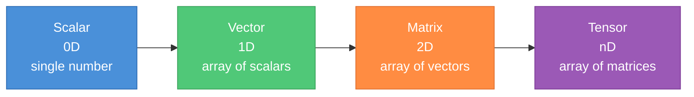
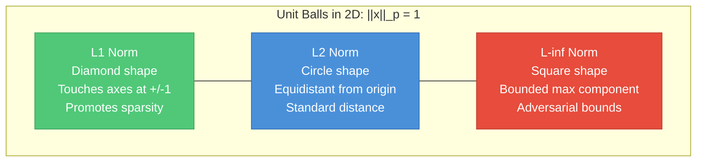
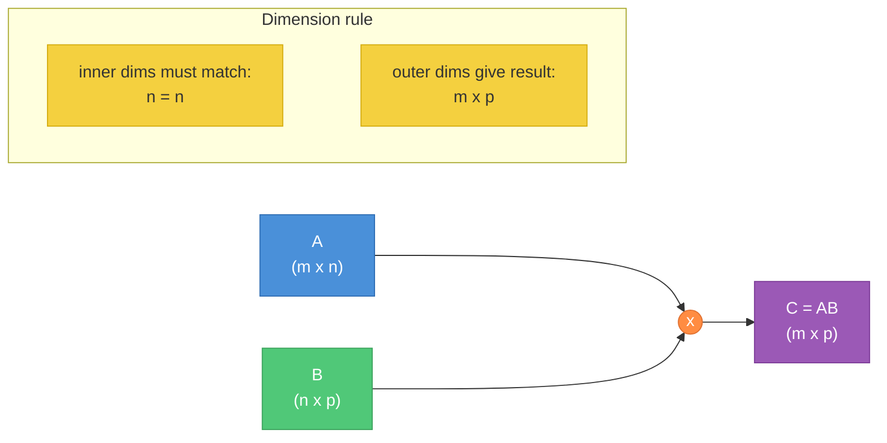
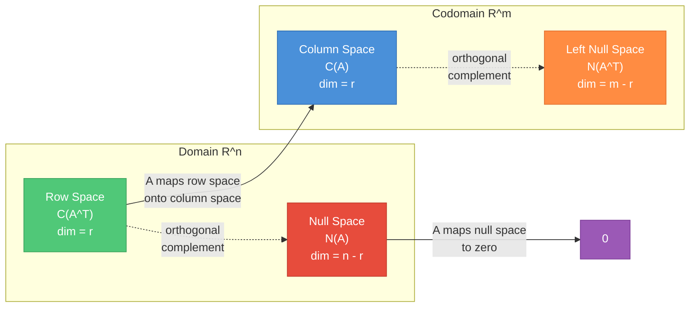
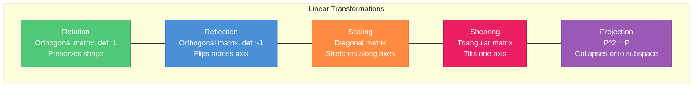
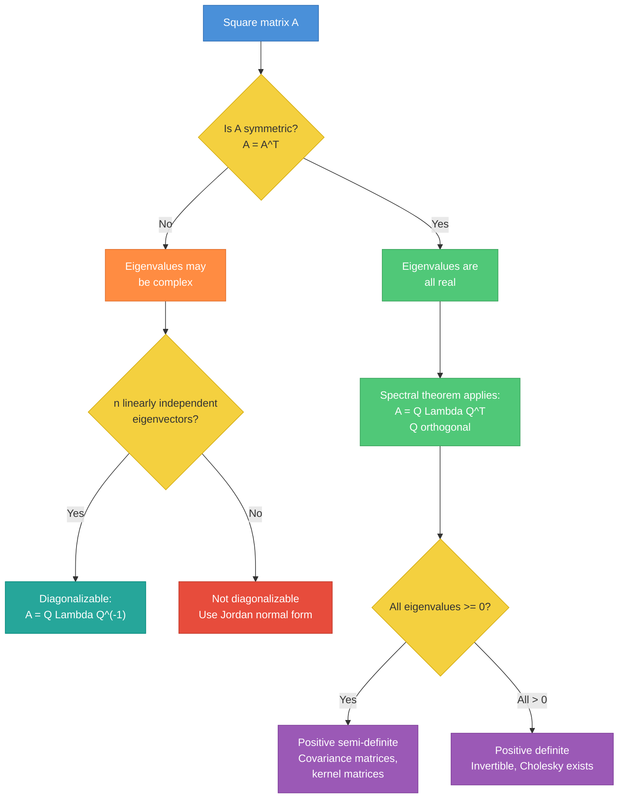
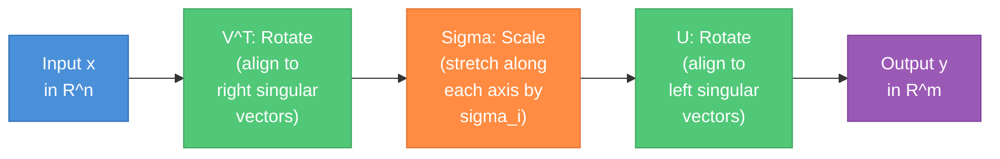
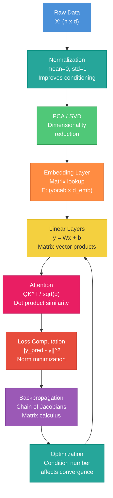

# Linear Algebra for ML Interviews

A practical study guide covering the linear algebra every ML engineer should know cold. Part 1 builds foundational intuition; Part 2 connects to real ML systems and interview-grade derivations.

---

## Part 1 -- Foundations

---

### 1. Scalars, Vectors, Matrices, and Tensors

**Scalar**: A single number. Temperature, loss value, learning rate.

**Vector**: An ordered list of numbers -- a point or direction in space. A feature vector `x` in R^n describes one data sample.

**Matrix**: A 2D grid of numbers. A weight matrix `W` in R^(m x n) maps n-dimensional inputs to m-dimensional outputs.

**Tensor**: The generalization to arbitrary dimensions. A batch of RGB images is a 4D tensor of shape `(batch, height, width, channels)`.

```
Scalar:  42                          shape: ()
Vector:  [1, 2, 3]                   shape: (3,)
Matrix:  [[1,2],[3,4],[5,6]]         shape: (3, 2)
Tensor:  batch of 32 RGB 224x224     shape: (32, 224, 224, 3)
```



**ML notation conventions**:

| Context | Convention | Example |
|---|---|---|
| Data matrix | rows = samples, cols = features | `X` shape `(N, D)` |
| Weight matrix | maps input dim to output dim | `W` shape `(D_in, D_out)` |
| Batch in deep learning | first axis is batch | `(B, C, H, W)` for images |
| Vectors | lowercase bold, column by default | `x`, `w`, `b` |
| Matrices | uppercase bold | `A`, `W`, `X` |

**Example**: A dataset of 1000 samples with 784 features (flattened 28x28 MNIST images) is a matrix `X` of shape `(1000, 784)`. A linear layer mapping to 256 hidden units uses `W` of shape `(784, 256)` and bias `b` of shape `(256,)`.

---

### 2. Vector Operations

**Addition and scalar multiplication**: Vectors add component-wise. Scalar multiplication scales every component. These two operations define a vector space.

```
a = [1, 2, 3],  b = [4, 5, 6]
a + b = [5, 7, 9]
3a = [3, 6, 9]
```

**Dot product** (inner product): The single most important operation in ML.

Algebraic form: `a . b = sum(a_i * b_i)` for `i = 1..n`

Geometric form: `a . b = ||a|| ||b|| cos(theta)`

The dot product measures similarity. When `cos(theta) = 1`, vectors point the same direction. When `cos(theta) = 0`, they are orthogonal (uncorrelated). When `cos(theta) = -1`, they are opposite.

**Why the dot product is the atomic operation of deep learning**: Every neuron computes `z = w . x + b` -- a dot product followed by a bias. Matrix multiplication is a batch of dot products. Attention scores are dot products. Cosine similarity is a normalized dot product. If you understand the dot product geometrically, you understand the core of neural networks.

**Cross product**: Defined only in R^3. Produces a vector orthogonal to both inputs with magnitude `||a|| ||b|| sin(theta)`. Rarely used in ML -- mainly relevant in 3D graphics/robotics.

**Norms** -- measuring vector magnitude:

| Norm | Formula | Geometric Unit Ball | ML Use |
|---|---|---|---|
| L1 (Manhattan) | `sum(\|x_i\|)` | Diamond (rotated square) | Sparsity-inducing regularization (Lasso) |
| L2 (Euclidean) | `sqrt(sum(x_i^2))` | Circle (sphere) | Weight decay, distance metrics |
| L-inf (Max) | `max(\|x_i\|)` | Square (hypercube) | Adversarial robustness (perturbation bounds) |



**Key insight for interviews**: L1 regularization promotes sparsity because the diamond-shaped unit ball has corners on the axes. When you constrain the weight vector to lie within the L1 ball, the optimal point is more likely to land on a corner (where some weights are exactly zero) than on a smooth surface.

**Example**: For `x = [3, -4]`:
- `||x||_1 = |3| + |-4| = 7`
- `||x||_2 = sqrt(9 + 16) = 5`
- `||x||_inf = max(3, 4) = 4`

---

### 3. Matrix Operations

**Matrix-vector multiplication `Ax`**: Think of it as a linear combination of columns of `A`, weighted by entries of `x`.

```
A = [[1, 2],      x = [3, 4]
     [5, 6],
     [7, 8]]

Ax = 3 * [1,5,7] + 4 * [2,6,8] = [11, 39, 53]
     ^col 1        ^col 2
```

This "columns view" is fundamental: `Ax` lives in the column space of `A`.

**Matrix-matrix multiplication `AB`**: Each column of `AB` is `A` times the corresponding column of `B`. Equivalently, entry `(i,j)` of `AB` is the dot product of row `i` of `A` with column `j` of `B`.

Dimensions must align: `(m x n)(n x p) = (m x p)`.



**Transpose properties**:
- `(A^T)^T = A`
- `(AB)^T = B^T A^T` (reversal of order)
- `(A + B)^T = A^T + B^T`

**Hadamard (element-wise) product**: `(A * B)_{ij} = A_{ij} * B_{ij}`. Same shape required. Used in gating mechanisms (LSTMs, GRUs), dropout masks, and feature-wise operations.

**Outer product**: `u v^T` where `u` in R^m, `v` in R^n produces an `(m x n)` matrix. Always rank 1. Used in attention mechanisms and low-rank updates.

```
u = [1, 2, 3],  v = [4, 5]
u v^T = [[4, 5],
         [8, 10],
         [12, 15]]
```

**Matrix inverse**: `A^(-1)` exists iff `A` is square and `det(A) != 0` (equivalently, full rank). Then `A A^(-1) = A^(-1) A = I`.

Properties:
- `(AB)^(-1) = B^(-1) A^(-1)`
- `(A^T)^(-1) = (A^(-1))^T`

In practice, you almost never compute inverses explicitly. Use `solve(A, b)` instead of `A^(-1) b`.

---

### 4. Special Matrices

| Matrix Type | Definition | Key Property |
|---|---|---|
| Identity `I` | 1s on diagonal, 0s elsewhere | `AI = IA = A` |
| Diagonal | Non-zero only on diagonal | Scales each basis vector independently |
| Symmetric | `A = A^T` | Real eigenvalues, orthogonal eigenvectors |
| Skew-symmetric | `A = -A^T` | Diagonal is all zeros, eigenvalues are pure imaginary |
| Orthogonal | `Q^T Q = Q Q^T = I` | Preserves lengths and angles; `Q^(-1) = Q^T` |
| Triangular | Upper or lower triangle is zero | Fast to solve via back/forward substitution |
| Sparse | Most entries are zero | Efficient storage and computation |

**Orthogonal matrices** deserve special attention. If `Q` is orthogonal:
- Columns (and rows) form an orthonormal basis
- `||Qx|| = ||x||` for all `x` (length preservation)
- `det(Q) = +/- 1`
- Rotations have `det = +1`; reflections have `det = -1`

Orthogonal matrices appear everywhere in ML: eigenvectors of symmetric matrices, SVD components `U` and `V`, Householder reflections in QR decomposition.

**Example**: The 2D rotation matrix is orthogonal:
```
Q = [[cos(t), -sin(t)],
     [sin(t),  cos(t)]]

Q^T Q = I, det(Q) = 1
```

---

### 5. Systems of Linear Equations

**The problem**: Find `x` such that `Ax = b`.

**Geometric interpretation**: Each equation is a hyperplane. The solution is where they intersect.

Three cases:
1. **Unique solution**: `rank(A) = rank([A|b]) = n` (number of unknowns). The hyperplanes meet at a single point.
2. **No solution**: `rank(A) < rank([A|b])`. The hyperplanes don't all intersect. System is overdetermined. This is the common case in ML (more data points than parameters).
3. **Infinite solutions**: `rank(A) = rank([A|b]) < n`. System is underdetermined. Solution is a subspace.

**Gaussian elimination**: Reduce `[A|b]` to row echelon form, then back-substitute. `O(n^3)` for an `n x n` system.

**Least squares** (the ML-critical case): When `Ax = b` has no exact solution (overdetermined), find the `x` that minimizes `||Ax - b||^2`.

Derivation (whiteboard-ready):
```
f(x) = ||Ax - b||^2 = (Ax - b)^T (Ax - b)
     = x^T A^T A x - 2 b^T A x + b^T b

Set gradient to zero:
  nabla_x f = 2 A^T A x - 2 A^T b = 0
  A^T A x = A^T b               <-- normal equations
  x = (A^T A)^(-1) A^T b        <-- if A^T A is invertible
```

The matrix `A^+ = (A^T A)^(-1) A^T` is the Moore-Penrose pseudoinverse (for full column rank `A`).

---

### 6. Vector Spaces and Subspaces

**Linear independence**: Vectors `{v_1, ..., v_k}` are linearly independent if no vector can be written as a linear combination of the others. Equivalently, `c_1 v_1 + ... + c_k v_k = 0` implies all `c_i = 0`.

**Span**: The set of all linear combinations of a set of vectors.

**Basis**: A linearly independent set that spans the entire space. Every basis for `R^n` has exactly `n` vectors.

**The four fundamental subspaces** of a matrix `A` (m x n):

| Subspace | Symbol | Lives in | Dimension |
|---|---|---|---|
| Column space | `C(A)` | `R^m` | `r` (rank) |
| Row space | `C(A^T)` | `R^n` | `r` (rank) |
| Null space | `N(A)` | `R^n` | `n - r` |
| Left null space | `N(A^T)` | `R^m` | `m - r` |



**Rank-nullity theorem**: `rank(A) + nullity(A) = n` (number of columns).

The rank tells you how many "independent directions" the matrix uses. The nullity tells you how many directions it collapses to zero.

**Example**: If `A` is `5 x 3` with rank 2, then:
- Column space is a 2D plane in `R^5`
- Null space is a 1D line in `R^3` (`3 - 2 = 1`)
- `A` maps all of `R^3` onto that 2D plane, collapsing one direction

---

### 7. Geometric Interpretations

Every matrix multiplication `y = Ax` is a linear transformation. Different matrices produce different geometric effects:



**Determinant**: `det(A)` measures the signed volume scaling factor of the transformation.
- `|det(A)| > 1`: expands volume
- `|det(A)| < 1`: shrinks volume
- `det(A) = 0`: collapses at least one dimension (singular, non-invertible)
- `det(A) < 0`: flips orientation

Properties:
- `det(AB) = det(A) det(B)`
- `det(A^T) = det(A)`
- `det(A^(-1)) = 1/det(A)`
- `det(cA) = c^n det(A)` for `n x n` matrix

**Trace**: `tr(A) = sum of diagonal entries = sum of eigenvalues`.

Properties:
- `tr(A + B) = tr(A) + tr(B)`
- `tr(AB) = tr(BA)` (cyclic property)
- `tr(A^T) = tr(A)`

The cyclic trace property is used frequently in ML derivations: `tr(ABC) = tr(CAB) = tr(BCA)`.

**Example**: The matrix `[[2, 0], [0, 3]]` scales the x-axis by 2 and y-axis by 3. A unit square becomes a 2x3 rectangle. `det = 6` (area scaled by 6). `tr = 5` (sum of eigenvalues).

---

## Part 2 -- Advanced Topics & ML Applications

---

### 8. Eigenvalues and Eigenvectors

**Definition**: For a square matrix `A`, a non-zero vector `v` is an eigenvector with eigenvalue `lambda` if:

```
A v = lambda v
```

The matrix stretches (or compresses) `v` by factor `lambda` without changing its direction.

**How to compute** (for small matrices in interviews):

```
A v = lambda v
(A - lambda I) v = 0
For non-trivial v: det(A - lambda I) = 0    <-- characteristic polynomial
```

**Example**: For `A = [[4, 1], [2, 3]]`:
```
det(A - lambda I) = (4 - lambda)(3 - lambda) - 2 = lambda^2 - 7 lambda + 10 = 0
lambda_1 = 5,  lambda_2 = 2

For lambda_1 = 5: (A - 5I)v = 0 --> v_1 = [1, 1] (up to scaling)
For lambda_2 = 2: (A - 2I)v = 0 --> v_2 = [1, -2] (up to scaling)
```

**Key properties** (frequently tested):

| Property | Formula |
|---|---|
| Sum of eigenvalues | `= tr(A)` |
| Product of eigenvalues | `= det(A)` |
| Eigenvalues of `A^(-1)` | `1/lambda_i` |
| Eigenvalues of `A^k` | `lambda_i^k` |
| Eigenvalues of `A + cI` | `lambda_i + c` |
| Symmetric matrix eigenvalues | Always real |
| Symmetric matrix eigenvectors | Orthogonal for distinct eigenvalues |

**Eigendecomposition**: If `A` has `n` linearly independent eigenvectors:

```
A = Q Lambda Q^(-1)
```

where `Q` = matrix of eigenvectors as columns, `Lambda` = diagonal matrix of eigenvalues.

**Spectral theorem** (symmetric matrices): If `A = A^T`, then:

```
A = Q Lambda Q^T
```

where `Q` is orthogonal (`Q^(-1) = Q^T`) and `Lambda` is real diagonal. This is the most important decomposition in ML.



**Likely interview questions**:
- What are eigenvalues/eigenvectors geometrically?
- Prove that eigenvalues of a symmetric matrix are real.
- If `A` has eigenvalue `lambda`, what are the eigenvalues of `A^2`? Of `A^(-1)`? Of `A - 3I`?
- Can a matrix have zero as an eigenvalue? What does it mean? (Yes -- the matrix is singular.)
- Why do covariance matrices always have real, non-negative eigenvalues?

---

### 9. Singular Value Decomposition (SVD)

SVD is the most general and arguably the most important matrix decomposition. It works for **any** matrix -- any shape, any rank.

```
A = U Sigma V^T
```

where:
- `A` is `m x n`
- `U` is `m x m` orthogonal (left singular vectors)
- `Sigma` is `m x n` diagonal with non-negative entries `sigma_1 >= sigma_2 >= ... >= 0` (singular values)
- `V` is `n x n` orthogonal (right singular vectors)

**Relationship to eigendecomposition**:
- `A^T A = V Sigma^2 V^T` -- eigendecomposition of `A^T A`
- `A A^T = U Sigma^2 U^T` -- eigendecomposition of `A A^T`
- Singular values of `A` = square roots of eigenvalues of `A^T A`

**Geometric interpretation**: SVD decomposes any linear transformation into three steps:



**Low-rank approximation** (Eckart-Young theorem): The best rank-`k` approximation to `A` (in Frobenius or spectral norm) is obtained by keeping only the top `k` singular values:

```
A_k = U_k Sigma_k V_k^T
```

where `U_k` is the first `k` columns of `U`, `Sigma_k` is the top-left `k x k` block of `Sigma`, and `V_k` is the first `k` columns of `V`.

Approximation error: `||A - A_k||_F = sqrt(sigma_{k+1}^2 + ... + sigma_r^2)`

**Pseudoinverse via SVD**:

```
A^+ = V Sigma^+ U^T
```

where `Sigma^+` is formed by taking reciprocals of non-zero singular values in `Sigma` and transposing.

**Compact/thin SVD**: In practice, if `A` is `m x n` with `m >> n`, store only `U` as `m x n`, `Sigma` as `n x n`, `V` as `n x n`. This is what `numpy.linalg.svd(A, full_matrices=False)` returns.

**Example**: Image compression. A grayscale image is a matrix. Keep the top `k` singular values to get a compressed approximation. With `k = 50` on a 1000x1000 image, you store `50 * (1000 + 1000 + 1) = 100,050` values instead of `1,000,000`.

---

### 10. Principal Component Analysis (PCA)

PCA finds the directions of maximum variance in the data. It is the most commonly asked linear algebra topic in ML interviews.

**Full derivation (whiteboard-ready)**:

Given data matrix `X` (n x d), centered (mean subtracted from each feature).

Goal: Find unit vector `w` that maximizes the variance of projections `Xw`.

```
Variance of projections = (1/n) ||Xw||^2 = (1/n) w^T X^T X w = w^T C w
```

where `C = (1/n) X^T X` is the covariance matrix.

Optimization problem:
```
max  w^T C w
s.t. w^T w = 1
```

Using Lagrange multipliers:
```
L(w, lambda) = w^T C w - lambda(w^T w - 1)

nabla_w L = 2 C w - 2 lambda w = 0
C w = lambda w
```

So `w` must be an eigenvector of `C`, and the variance along that direction equals the eigenvalue `lambda`. To maximize variance, choose the eigenvector with the largest eigenvalue.

The `k` principal components are the `k` eigenvectors of `C` with the largest eigenvalues.

**Connection to SVD**: If `X = U Sigma V^T`, then:
```
C = (1/n) X^T X = (1/n) V Sigma^2 V^T
```

The principal components are the columns of `V`. The singular values of `X` are related to eigenvalues of `C` by `lambda_i = sigma_i^2 / n`.

**Choosing the number of components**: Keep enough components to explain a target fraction (e.g., 95%) of total variance:

```
Explained variance ratio for k components = sum(lambda_1..k) / sum(all lambda)
```

**When PCA works well**: Data lies near a low-dimensional linear subspace. Features are correlated (redundant).

**When PCA fails**:
- Non-linear structure (use kernel PCA, t-SNE, UMAP instead)
- Features on very different scales (normalize first)
- Interpretability is needed (PCA components are linear combinations of all features)

**Likely interview questions**:
- Derive PCA from the max-variance principle (the derivation above).
- What is the relationship between PCA and SVD?
- How do you choose the number of principal components?
- What preprocessing is required before PCA? (Center the data. Optionally standardize.)
- Can you apply PCA to images? (Yes -- eigenfaces.)
- What is the time complexity? (`O(d^2 n + d^3)` for eigendecomposition approach, or `O(n d min(n,d))` for SVD.)
- What happens if you have more features than samples? (Use SVD on `X` directly or eigendecompose `X X^T` which is `n x n` instead of `d x d`.)

---

### 11. Positive Definiteness

**Positive definite (PD)**: A symmetric matrix `A` is PD if `x^T A x > 0` for all `x != 0`.

**Positive semi-definite (PSD)**: `x^T A x >= 0` for all `x`.

**Equivalent conditions for PD** (any one implies all others):

1. All eigenvalues are strictly positive
2. All leading principal minors (determinants of top-left k x k submatrices) are positive
3. Cholesky decomposition exists: `A = L L^T` where `L` is lower triangular with positive diagonal
4. `x^T A x > 0` for all `x != 0`

**Why this matters in ML**:

*Covariance matrices are PSD*: For any data matrix `X` (centered), the covariance `C = (1/n) X^T X` satisfies:
```
x^T C x = (1/n) x^T X^T X x = (1/n) ||Xx||^2 >= 0
```

*Hessians at local minima are PSD*: At a local minimum of `f(x)`, the Hessian `H = nabla^2 f` satisfies `H >= 0` (PSD). If `H > 0` (PD), the minimum is strict. This is the second-order condition for convexity.

*Connection to convexity*: A twice-differentiable function `f` is convex iff its Hessian is PSD everywhere. This is why PSD Hessians guarantee that gradient descent converges to a global minimum.

*Kernel matrices*: A valid kernel function must produce a PSD Gram matrix for any set of data points (Mercer's condition).

**Example**: `A = [[2, 1], [1, 2]]`. Eigenvalues are 3 and 1 (both positive), so `A` is PD. Cholesky: `A = L L^T` where `L = [[sqrt(2), 0], [1/sqrt(2), sqrt(3/2)]]`.

---

### 12. Condition Number and Numerical Stability

**Condition number**: `kappa(A) = sigma_max / sigma_min = ||A|| ||A^(-1)||`

(Using the 2-norm. `sigma_max` and `sigma_min` are the largest and smallest singular values.)

**Interpretation**: If `kappa(A) = 10^k`, solving `Ax = b` can lose up to `k` digits of precision. A matrix with `kappa(A) = 1` is perfectly conditioned (orthogonal matrices). A matrix with `kappa(A) = 10^16` is effectively singular in double precision.

**What it means for Ax = b**: A small perturbation `delta b` in the right-hand side causes a perturbation in the solution bounded by:

```
||delta x|| / ||x|| <= kappa(A) * ||delta b|| / ||b||
```

High condition number = solution is hypersensitive to noise.

**Connection to gradient descent convergence**: For the quadratic `f(x) = (1/2) x^T A x - b^T x`, gradient descent with optimal step size converges as:

```
||x_{t+1} - x*|| <= ((kappa - 1) / (kappa + 1)) ||x_t - x*||
```

When `kappa` is large, the ratio `(kappa - 1)/(kappa + 1)` is close to 1, so convergence is slow. This is why ill-conditioned problems (elongated "valleys" in the loss landscape) cause gradient descent to zig-zag.

**Practical implications**:
- Feature scaling (normalization/standardization) reduces the condition number of `X^T X`
- Regularization (`X^T X + lambda I`) always improves conditioning: `kappa = (sigma_max^2 + lambda) / (sigma_min^2 + lambda)`
- Adam and other adaptive optimizers implicitly handle ill-conditioning by scaling gradients per-parameter

**Example**: If `A = [[1, 0], [0, 0.001]]`, then `kappa(A) = 1000`. Gradient descent on `(1/2) x^T A x` will take ~1000 times as many steps as on a well-conditioned problem of the same size.

---

### 13. Matrix Calculus (Brief)

**Gradient of scalar w.r.t. vector**: If `f: R^n -> R`, then `nabla_x f` is the column vector of partial derivatives:

```
nabla_x f = [df/dx_1, df/dx_2, ..., df/dx_n]^T
```

**Key results to memorize**:

| Function `f(x)` | Gradient `nabla_x f` |
|---|---|
| `a^T x` | `a` |
| `x^T A x` | `(A + A^T) x`, or `2Ax` if `A` symmetric |
| `||x||_2^2 = x^T x` | `2x` |
| `||Ax - b||^2` | `2 A^T(Ax - b)` |
| `x^T A^T A x` | `2 A^T A x` |

**Derivation you should know** (normal equations):
```
f(w) = ||Xw - y||^2 = (Xw - y)^T (Xw - y)
     = w^T X^T X w - 2 y^T X w + y^T y

nabla_w f = 2 X^T X w - 2 X^T y = 0
X^T X w = X^T y
w = (X^T X)^(-1) X^T y
```

**Jacobian**: For `f: R^n -> R^m`, the Jacobian `J` is the `m x n` matrix where `J_{ij} = df_i/dx_j`. The Jacobian generalizes the gradient to vector-valued functions.

**Connection to backpropagation**: Backprop computes `nabla_theta L` by chaining Jacobians via the chain rule. For a composition `f = f_3(f_2(f_1(x)))`:

```
J_f = J_{f_3} J_{f_2} J_{f_1}
```

Backprop computes this product right-to-left (vector-Jacobian products) which is efficient when the output dimension (scalar loss) is much smaller than the input dimension (millions of parameters).

---

### 14. Applications in ML

**Linear regression**: The closed-form solution is pure linear algebra.
```
w = (X^T X)^(-1) X^T y
```
This is the least squares solution, equivalent to projecting `y` onto the column space of `X`.

**Neural network forward pass**: A fully-connected layer computes `h = sigma(Wx + b)`. The `Wx` is a matrix-vector product: a batch of dot products between weight vectors and the input.

**Embeddings**: Looking up an embedding for token `i` is selecting row `i` of the embedding matrix `E`. This is equivalent to multiplying `E` by a one-hot vector.

**Attention mechanism**: The core of transformers is matrix operations:
```
Attention(Q, K, V) = softmax(Q K^T / sqrt(d_k)) V
```
- `Q K^T` is a matrix of dot products (similarity scores)
- Division by `sqrt(d_k)` controls the scale
- Softmax normalizes
- Multiplication by `V` produces a weighted combination

**Covariance in Gaussian processes**: A GP is defined by a mean function and covariance (kernel) matrix `K`. The kernel matrix must be PSD. Predictions involve solving `K^(-1) y`, where condition number of `K` matters.

**Kernel matrices**: For `n` data points, the kernel matrix `K_{ij} = k(x_i, x_j)` is `n x n` and PSD. The kernel trick replaces dot products in high-dimensional feature spaces with kernel evaluations.



---

### 15. Interview Questions Checklist

**Conceptual questions**:

1. **What is the dot product geometrically? Why is it central to ML?**
   It measures the projection of one vector onto another, scaled by their magnitudes. `a . b = ||a|| ||b|| cos(theta)`. It is the core of every neuron (weighted sum), similarity metric (cosine similarity), and matrix operation.

2. **What does it mean for a matrix to be singular?**
   `det(A) = 0`, equivalently: not full rank, has a non-trivial null space, at least one eigenvalue is zero, `Ax = b` does not have a unique solution for all `b`.

3. **Explain the rank of a matrix and why it matters.**
   Rank = number of linearly independent rows (or columns). It determines the dimensionality of the output space of the transformation. In ML: the rank of `X^T X` determines whether linear regression has a unique solution.

4. **What is the difference between eigendecomposition and SVD?**
   Eigendecomposition requires a square matrix and may not exist. SVD works for any matrix. For symmetric matrices, they are closely related (`U = V = Q`, `Sigma = |Lambda|`).

5. **Derive the least squares solution.**
   (See Section 5 above. Must be able to do this on a whiteboard.)

6. **Derive PCA from the maximum variance principle.**
   (See Section 10 above.)

7. **Why does L1 regularization produce sparse solutions but L2 does not?**
   The L1 unit ball has corners on the axes. The constraint region intersects the level curves of the loss at these corners, where coordinates are exactly zero. The L2 ball is smooth, so intersections are generically at points with all non-zero coordinates.

8. **What is the condition number and why should you care?**
   `kappa(A) = sigma_max / sigma_min`. High condition number means the problem is sensitive to numerical errors and gradient descent converges slowly. Feature scaling and regularization improve it.

9. **How are singular values related to eigenvalues?**
   Singular values of `A` are the square roots of the eigenvalues of `A^T A` (or `A A^T`). For symmetric PSD matrices, singular values equal eigenvalues.

10. **What does positive definite mean? Why do covariance matrices need to be PSD?**
    PD: `x^T A x > 0` for all `x != 0`. Covariance matrices are PSD because `x^T C x = (1/n)||Xw||^2 >= 0` -- variance is non-negative. A non-PSD "covariance matrix" would imply negative variance, which is physically meaningless.

11. **How does the attention mechanism use linear algebra?**
    `Q K^T` computes all pairwise dot products (similarities) between queries and keys. Softmax converts to a probability distribution. Multiplying by `V` takes a weighted sum of value vectors.

12. **What is the pseudoinverse and when do you need it?**
    `A^+ = V Sigma^+ U^T` (via SVD). Used when `A` is not square or not invertible. Gives the minimum-norm least squares solution to `Ax = b`.

13. **Why does feature scaling help gradient descent?**
    Unscaled features create an ill-conditioned `X^T X` matrix (elongated loss landscape contours). The condition number determines the convergence rate. Scaling brings the condition number closer to 1.

14. **Explain the Eckart-Young theorem.**
    The best rank-`k` approximation (in Frobenius norm) to a matrix `A` is given by truncating the SVD at `k` components. Error = `sqrt(sigma_{k+1}^2 + ... + sigma_r^2)`.

15. **What is the spectral theorem and why does it matter for ML?**
    Any real symmetric matrix has real eigenvalues and orthogonal eigenvectors: `A = Q Lambda Q^T`. This guarantees PCA works, covariance matrices are diagonalizable, and kernel methods are well-defined.

**Derivations you must know cold**:
- Least squares: `w = (X^T X)^(-1) X^T y`
- PCA from max-variance (Lagrange multiplier argument)
- Gradient of `||Ax - b||^2` with respect to `x`
- Why `x^T A x > 0` for all `x != 0` iff all eigenvalues of `A` are positive
- Rank-nullity theorem statement and intuition
- SVD relationship: `sigma_i(A) = sqrt(lambda_i(A^T A))`
