# LLMs and NLP for ML Interviews

This guide is the definitive reference for NLP and Large Language Model topics for ML Engineer interviews. It goes deep on NLP fundamentals, transformer internals, attention variants, and modern LLM techniques. For broader coverage of neural architectures (CNNs, RNNs, etc.) see `deep-learning-architectures.md`. For end-to-end system design see `ml-system-design.md`.

---

## Part 1 — NLP Foundations

### 1. What is NLP?

Natural Language Processing is the field of teaching machines to understand, generate, and reason over human language. It sits at the intersection of linguistics, computer science, and machine learning.

**Why NLP is hard:**
- **Ambiguity**: "I saw her duck" — did she own a duck, or did she dodge?
- **Context dependence**: "bank" means different things in "river bank" vs "savings bank"
- **Variable length**: sentences and documents vary from one word to thousands
- **World knowledge**: "The trophy didn't fit in the suitcase because it was too big" — what is "it"?
- **Compositionality**: meaning of a sentence is not just the sum of word meanings
- **Long-range dependencies**: "The keys that the boy who lived down the street had lost were found"

**Classical NLP pipeline** (pre-2018): hand-crafted stages, each with its own model.

```
Tokenize → POS tag → Parse → NER → Coreference → Task-specific model
```

**Modern end-to-end approach** (post-transformer): one big model learns everything jointly from text.


---

### 2. Text Preprocessing

Classical text preprocessing normalized raw text so simple models (Naive Bayes, logistic regression, BoW) could learn from it.

| Step | What | Why it mattered | Modern LLM? |
|---|---|---|---|
| Lowercasing | `"Apple" → "apple"` | Merge surface variants | Usually not needed (tokenizer handles case) |
| Punctuation removal | `"hi!" → "hi"` | Reduce vocab noise | Skipped — punctuation carries meaning |
| Stop word removal | drop `the, is, a, of` | Reduce dimensionality for BoW | Skipped — attention uses them |
| Stemming | `running → run` (Porter) | Collapse morphology (crude) | Skipped |
| Lemmatization | `better → good` (WordNet) | Collapse morphology (linguistic) | Skipped |
| Spelling correction | `teh → the` | Handle noisy input | Skipped — subword tokens handle it |

**Stemming vs Lemmatization:**
- **Stemming** chops suffixes by rules. Fast, crude, may produce non-words. `studies → studi`.
- **Lemmatization** uses a dictionary and POS info to return the canonical base form. Slower, correct. `studies → study`.

**Why modern LLMs skip most preprocessing:**
- Subword tokenizers naturally handle morphology (`running → run + ning`)
- Stop words contribute useful syntactic signal to attention
- Punctuation and case carry semantics ("US" vs "us")
- End-to-end training lets the model learn optimal representations

**The only preprocessing modern pipelines still do**: Unicode normalization (NFC/NFKC), whitespace cleanup, and sometimes removing HTML tags for web-scraped corpora.

---

### 3. Tokenization

Tokenization is how raw text gets converted into integer IDs the model can embed. The choice of tokenizer profoundly affects vocabulary size, sequence length, OOV handling, and multilingual capability.

**Word-level tokenization:**
- Split on whitespace/punctuation. Each word → one ID.
- Pros: intuitive, preserves word boundaries.
- Cons: vocab explodes (English has 500K+ words), no OOV handling, morphology is opaque (`run`, `runs`, `running` are unrelated IDs).

**Character-level tokenization:**
- Every character is a token.
- Pros: tiny vocab (~256 for bytes), no OOV.
- Cons: very long sequences, model must learn what words are from scratch. Wastes compute.

**Subword tokenization (the modern standard):**
Break words into frequent subword units. Keeps vocab manageable, handles OOV (any word decomposes into subwords or characters), and captures morphology.

#### BPE (Byte-Pair Encoding)
Used by GPT-2, GPT-3, GPT-4, RoBERTa.

Algorithm:
1. Start with character (or byte) vocabulary.
2. Count all adjacent pair frequencies in the corpus.
3. Merge the most frequent pair into a new token.
4. Repeat until vocab reaches target size.

```
"low low lower newest" → [l, o, w, e, r, n, s, t]
most frequent pair: (l, o) → merge → "lo"
next:               (lo, w) → merge → "low"
...
```

**Byte-level BPE** (GPT-2) starts from 256 raw bytes, so it can represent any Unicode string with zero OOV.

#### WordPiece
Used by BERT, DistilBERT, ELECTRA.

Similar to BPE but the merge criterion is likelihood-based rather than frequency-based. Merges the pair that maximizes the likelihood of the training data under a unigram LM.

Marks subword continuations with `##`: `playing → play, ##ing`.

#### SentencePiece
Used by T5, LLaMA, ALBERT, XLNet.

Language-agnostic: treats input as a raw stream of Unicode code points (or bytes), including spaces. Doesn't require pre-tokenization — works for languages without word boundaries (Chinese, Japanese, Thai).

Can be trained with either BPE or Unigram LM objectives. Encodes whitespace as a special character (`▁`), so tokenization is fully reversible.

#### Unigram LM
Used by SentencePiece default, XLNet.

Probabilistic: starts with a large seed vocabulary, iteratively removes tokens that least hurt the corpus likelihood until the target vocab size is reached. Produces a probability for each token, so multiple tokenizations are possible (used for subword regularization).

**Tradeoffs:**

| Tokenizer | Vocab | Seq length | OOV | Multilingual |
|---|---|---|---|---|
| Word-level | Huge (500K+) | Short | Bad | Bad |
| Character | Tiny (~256) | Very long | None | Good |
| BPE | Medium (32K–100K) | Medium | None (byte-level) | OK |
| WordPiece | Medium (30K) | Medium | Rare via `##` | OK |
| SentencePiece | Medium (32K–256K) | Medium | None | Excellent |
| Unigram | Medium (32K) | Medium | None | OK |

**Common vocab sizes in production LLMs:**
- LLaMA 2: 32K (SentencePiece BPE)
- LLaMA 3: 128K (Tiktoken/BPE) — larger vocab → shorter sequences → more efficient
- GPT-4/GPT-4o: ~100K–200K (Tiktoken)
- Gemma: 256K
- Multilingual models (NLLB, mT5): 250K+

**Key insight**: larger vocab means fewer tokens per sentence (cheaper inference) but a bigger embedding table (more parameters). LLaMA 3 grew its vocab to 128K for this reason.

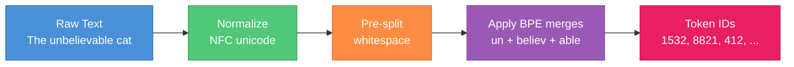

---

### 4. Word Embeddings (Pre-Transformer Era)

Before transformers, the central question of NLP was: how do we represent words as vectors that capture meaning?

#### One-hot encoding
Each word is a sparse vector of length `|V|` with a single 1. `cat = [0,0,1,0,...,0]`.
- No notion of similarity: `cos(cat, dog) = 0` same as `cos(cat, spaceship) = 0`.
- Curse of dimensionality: vocab of 50K → 50K-dim input vectors.
- Starting point, not useful on its own.

#### Word2Vec (Mikolov 2013)
Learn dense, low-dimensional (~300-dim) vectors where **distributional similarity ≈ geometric similarity**. "You shall know a word by the company it keeps" (Firth).

Two architectures:
- **CBOW (Continuous Bag of Words)**: predict center word from surrounding context. Fast, works well for frequent words.
- **Skip-gram**: predict context words from the center word. Slower, better for rare words.

Trained with negative sampling (treat as binary classification: is this (center, context) pair real or sampled from noise?).

The famous insight: **vector arithmetic captures semantic relationships.**
```
king - man + woman ≈ queen
paris - france + italy ≈ rome
walking - walk + swim ≈ swimming
```

#### GloVe (Pennington 2014)
Global Vectors. Factorizes the word co-occurrence matrix directly. Minimizes:
```
J = Σ f(X_ij) * (w_i · w_j + b_i + b_j - log X_ij)²
```
where `X_ij` is the co-occurrence count of words `i` and `j`. Combines the local-context philosophy of Word2Vec with global corpus statistics.

#### FastText (Bojanowski 2017)
Extends Word2Vec by representing each word as a bag of character n-grams. `where → <wh, whe, her, ere, re>`. A word's embedding is the sum of its n-gram embeddings.
- Handles OOV gracefully (compose from n-grams).
- Captures morphology (`running` and `runner` share n-grams).
- Great for morphologically rich languages.

**Fundamental limitation of all three**: they produce **static** embeddings. One vector per word, regardless of context.
- `bank` in "river bank" has the same vector as `bank` in "savings bank"
- Polysemy (multiple meanings) is averaged across usages
- No way to disambiguate at inference

This is why **contextualized embeddings** (ELMo 2018, BERT 2018, GPT 2018) took over. In a transformer, the embedding of `bank` depends on the entire sentence it appears in.

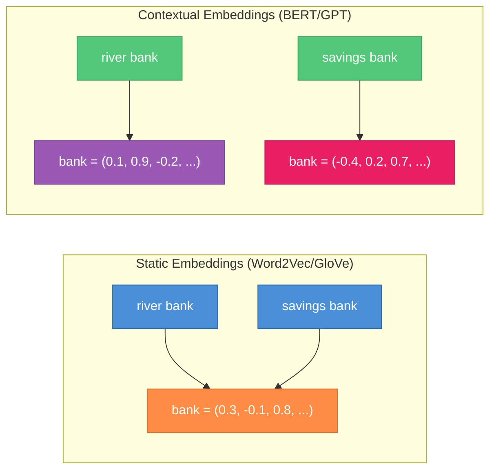

---

### 5. Language Modeling Basics

A **language model** assigns probabilities to sequences of tokens. Formally, given a sequence `x₁, x₂, ..., xₙ`, a language model computes `P(x₁, x₂, ..., xₙ)`.

By the chain rule, this factors into next-token prediction:
```
P(x₁, ..., xₙ) = Π P(xₜ | x₁, ..., xₜ₋₁)
```

The core task becomes: **given the previous tokens, predict the next token**.

#### Autoregressive (AR) / Causal Language Modeling
Used by GPT, LLaMA, Mistral, Claude, Gemini.

Left-to-right. At position `t`, model sees only `x₁, ..., xₜ₋₁` and predicts `xₜ`. Natural fit for generation.

Training loss (cross-entropy over the full sequence):
```
L = -Σₜ log P(xₜ | x₁, ..., xₜ₋₁)
```

#### Masked Language Modeling (MLM)
Used by BERT, RoBERTa, DeBERTa.

Randomly mask 15% of input tokens, predict the masked tokens using **bidirectional** context (both left and right). Not directly usable for generation — good for understanding tasks (classification, QA, NER).

```
Input:  The cat sat on the [MASK]
Target: mat
```

#### Denoising (span corruption)
Used by T5, BART.

Corrupt spans of tokens, predict the missing spans. T5 replaces spans with sentinels; the decoder emits the spans in order. Compatible with encoder-decoder generation.

#### Evaluation: Perplexity

Perplexity is the standard intrinsic metric for language models. It is the exponentiated average negative log-likelihood:
```
PPL = exp( -1/N Σₜ log P(xₜ | x<ₜ) ) = exp(cross_entropy_loss)
```

Intuition: perplexity is the model's **effective branching factor**. PPL=10 means the model is as uncertain as if it were choosing uniformly among 10 tokens at each step.

- **Lower is better.** A uniform model over a 50K vocab has PPL ≈ 50K.
- GPT-2 on WebText: ~20. GPT-3 on similar data: ~10. Frontier models: ~5–8.
- Only comparable across models with the **same tokenizer and same test set**.

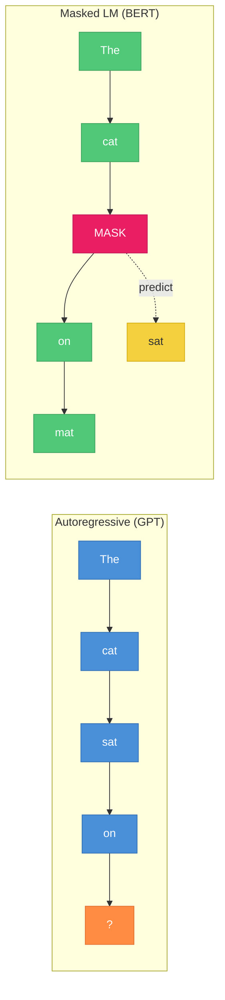

---

### 6. Pre-Transformer Sequence Models

Before 2017, these were the workhorses. Understanding them helps explain why transformers won.

#### N-gram models
Approximate `P(xₜ | x<ₜ) ≈ P(xₜ | xₜ₋ₙ₊₁, ..., xₜ₋₁)`. Count frequencies in a corpus.
- Markov assumption: only last `n-1` tokens matter.
- Sparse: most n-grams never seen; need smoothing (Kneser-Ney, Good-Turing).
- No generalization: `the red car` and `the red bike` share nothing.

#### RNN (Recurrent Neural Network)
Maintains a hidden state `hₜ = tanh(W_h hₜ₋₁ + W_x xₜ + b)`. Can in principle capture arbitrary-length dependencies.

Problems:
- **Vanishing gradient**: long-range gradients decay exponentially.
- **Sequential computation**: hard to parallelize across time steps.
- **Exploding gradient**: sometimes, requires clipping.

#### LSTM (Long Short-Term Memory, Hochreiter & Schmidhuber 1997)
Adds a cell state `cₜ` with three gates:
- **Forget gate**: what to drop from `cₜ₋₁`
- **Input gate**: what new info to add
- **Output gate**: what to expose as hₜ

The cell state has additive updates, so gradients flow more smoothly → solves (mitigates) vanishing gradient. Dominant architecture 1997–2017.

#### GRU (Gated Recurrent Unit, Cho 2014)
Simplified LSTM with two gates (reset, update) and no separate cell state. Fewer parameters, often comparable performance.

#### Seq2Seq with Attention (Bahdanau 2014, Luong 2015)
Encoder-decoder: RNN encoder compresses input to a fixed vector, RNN decoder generates output. The bottleneck hurt for long sentences.

**Bahdanau attention** let the decoder attend to all encoder hidden states at each step, weighted by relevance. This was **the precursor to the transformer**: it showed that attention alone could replace the compressed bottleneck.

#### Why transformers replaced all of these
- **Parallelism**: transformers process all positions simultaneously; RNNs are inherently sequential.
- **Long-range dependencies**: attention is `O(1)` path length between any two tokens vs `O(n)` for RNNs.
- **Scalability**: transformers scale to billions of parameters; RNNs saturate earlier.
- **Hardware fit**: matmul-heavy workloads map perfectly to GPU/TPU tensor cores.

---

## Part 2 — Transformer Deep Dive

### 7. The Transformer Architecture Overview

The transformer was introduced in "Attention Is All You Need" (Vaswani et al. 2017) for machine translation. The original architecture was an **encoder-decoder**. Today, three variants dominate:

| Variant | Examples | Use case |
|---|---|---|
| Encoder-only | BERT, RoBERTa, DeBERTa, ModernBERT | Classification, NER, retrieval embeddings |
| Decoder-only | GPT, LLaMA, Mistral, Claude | Generation, chat, agents |
| Encoder-decoder | T5, BART, original Transformer, Whisper | Translation, summarization, seq2seq |

**High-level components of any transformer:**
1. **Token embedding**: lookup table mapping token ID → `d_model`-dim vector
2. **Positional encoding**: inject position information
3. **N transformer blocks**: each a stack of attention + FFN with residuals and norms
4. **Output head**: linear projection to vocab size (for LMs) or classification head

**Why transformers work:**
- **Parallel processing**: all tokens computed at once (vs RNN's sequential loop)
- **Direct long-range paths**: attention is O(1) between any two tokens
- **Residual connections**: gradient flows without vanishing
- **Layer normalization**: stabilizes activations across depth

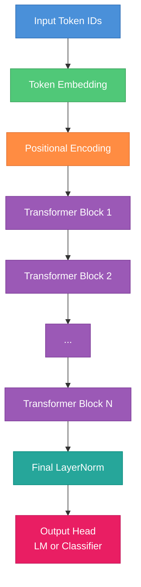

---

### 8. Input Processing

#### Token embeddings
A learned lookup table `E ∈ ℝ^(|V| × d_model)`. For token ID `i`, the embedding is `E[i]`. Typical sizes:
- LLaMA 2 7B: `|V|=32K`, `d_model=4096` → 131M embedding parameters
- LLaMA 3 8B: `|V|=128K`, `d_model=4096` → 525M embedding parameters

For LMs, this embedding table is often **tied** with the output projection (weight tying) to save parameters.

#### Why positional encoding is needed
Self-attention is **permutation invariant**: `Attention({x₁, x₂, x₃}) = Attention({x₃, x₁, x₂})` if you permute inputs and outputs the same way. Without position information, "dog bites man" and "man bites dog" are identical to the model.

#### Sinusoidal positional encoding (original transformer)
Fixed (no parameters), deterministic function of position:
```
PE(pos, 2i)   = sin(pos / 10000^(2i/d))
PE(pos, 2i+1) = cos(pos / 10000^(2i/d))
```
Different frequencies across dimensions. Added to token embeddings. Extrapolates somewhat beyond training length but not reliably.

#### Learned absolute positional encoding (GPT-2, BERT)
A learned embedding per position, added to token embedding. Simple and effective up to trained length — but **cannot extrapolate**: position 2049 has never been seen if trained at length 2048.

#### Relative positional encoding (T5, Transformer-XL)
Encodes the **relative distance** `i - j` between query and key, not absolute positions. T5 uses learned bias buckets. Better extrapolation because relative distances have been seen during training.

#### RoPE (Rotary Position Embedding, Su et al. 2021)
Used by: **LLaMA, LLaMA 2, LLaMA 3, Gemma, Qwen, Mistral, DeepSeek, Falcon**. The modern default.

Instead of adding a PE vector, RoPE **rotates the Q and K vectors** by an angle proportional to position. Pairs of dimensions `(2i, 2i+1)` are treated as complex numbers and multiplied by `e^(i·m·θ_i)` where `m` is position and `θ_i` is a frequency.

**Key properties:**
- Relative position is implicit: `⟨RoPE(q, m), RoPE(k, n)⟩` depends only on `m - n`, not absolute positions
- Works at inference time without recomputation
- Compatible with FlashAttention (rotation is cheap)
- Base frequency (default 10000) can be rescaled to extend context (see section 19)

#### ALiBi (Attention with Linear Biases, Press et al. 2021)
Used by: **BLOOM, MPT, Replit Code**.

No positional encoding at all! Instead, add a distance-dependent linear bias to the pre-softmax attention scores:
```
score(q_i, k_j) = q_i · k_j - m · |i - j|
```
where `m` is a head-specific slope. Extrapolates beautifully to longer contexts than seen during training. Simple and effective.

#### Comparison

| Scheme | Learned? | Extrapolation | Used by |
|---|---|---|---|
| Sinusoidal | No | Weak | Original Transformer |
| Absolute learned | Yes | None | GPT-2, BERT |
| Relative (T5) | Yes | Moderate | T5, Transformer-XL |
| RoPE | No (fixed freq) | Good (with scaling) | LLaMA, Gemma, Qwen, Mistral |
| ALiBi | No | Excellent | BLOOM, MPT |

---

### 9. Scaled Dot-Product Attention

The beating heart of the transformer. Given queries, keys, and values:

```
Attention(Q, K, V) = softmax(Q K^T / √d_k) V
```

**Intuition (the database analogy):**
- **Q (query)**: "what am I looking for?" — emitted by the current token
- **K (key)**: "here's what I am" — emitted by each token in the sequence
- **V (value)**: "here's my content" — the information that flows out if matched
- Compute similarity `Q · K^T`, normalize into weights, take weighted average of `V`.

**Step-by-step with shapes.** Let `n` = sequence length, `d_model` = model dim, `d_k` = key dim (per head).

1. **Project** inputs `X ∈ ℝ^(n × d_model)` to Q, K, V:
   ```
   Q = X W_Q   shape: (n, d_k)
   K = X W_K   shape: (n, d_k)
   V = X W_V   shape: (n, d_v)
   ```
2. **Similarity**: `S = Q K^T`, shape `(n, n)`. Entry `S[i,j]` = how much token `i` attends to token `j`.
3. **Scale**: `S / √d_k`. See below.
4. **Mask** (decoder): set `S[i,j] = -∞` for `j > i` so future tokens get zero weight after softmax.
5. **Softmax** row-wise: each row becomes a probability distribution over keys.
6. **Weighted sum**: `Output = softmax(S) V`, shape `(n, d_v)`.

**Why softmax?** It converts arbitrary similarity scores into a valid probability distribution: non-negative, sums to 1. Differentiable, emphasizes high scores.

**Why divide by √d_k?** For random Q, K with unit variance, the dot product `Q · K` has variance `d_k`. Without scaling, as `d_k` grows, the dot products get larger, pushing softmax into its saturated regime where gradients vanish (one entry ≈ 1, rest ≈ 0). Dividing by `√d_k` keeps variance ≈ 1 and softmax well-behaved.

**Causal masking.** For autoregressive models, token at position `i` must not attend to tokens at positions `j > i` (otherwise it would "cheat" at training time). Implemented by adding `-∞` to the upper-triangle of the `S` matrix before softmax. `softmax(-∞) = 0`.

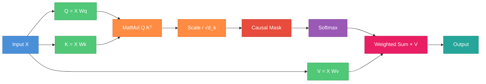

---

### 10. Multi-Head Attention (MHA)

Instead of a single `d_model`-dim attention, run `h` attentions in parallel with smaller per-head dimensions, then concatenate.

**Motivation.** Different heads can specialize:
- Head 1: coreference (pronoun → antecedent)
- Head 2: syntactic dependencies (verb → subject)
- Head 3: position-local patterns
- Head 4: semantic similarity
- etc.

Empirically, multi-head attention consistently outperforms single-head with the same total dimension.

**Mechanics.** Split `d_model` into `h` heads, each of dimension `d_head = d_model / h`.
```
Q_i = X W_Q^(i)   shape (n, d_head)   for i = 1..h
K_i = X W_K^(i)
V_i = X W_V^(i)
head_i = Attention(Q_i, K_i, V_i)
MultiHead(X) = Concat(head_1, ..., head_h) W_O
```

**Parameter count.** The four projection matrices `W_Q, W_K, W_V, W_O` are each `(d_model, d_model)`, so MHA has `4 · d_model²` parameters (ignoring biases).

For LLaMA 2 7B: `d_model=4096`, `h=32`, `d_head=128`. MHA params per layer = `4 · 4096² ≈ 67M`.

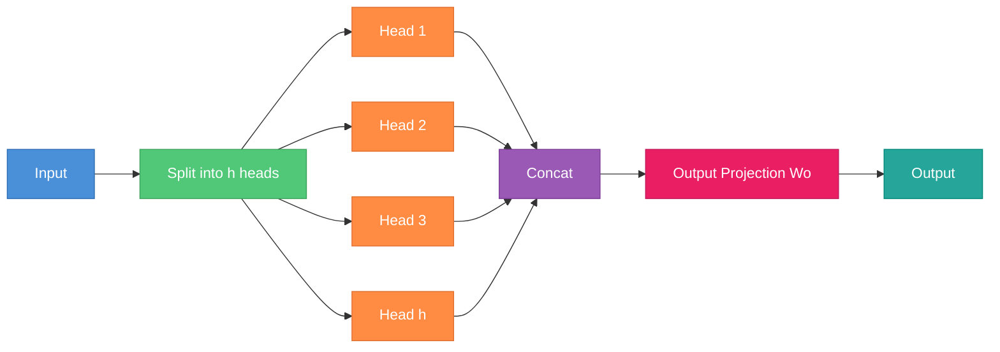

---

### 11. Transformer Block

A full transformer block combines multi-head attention with a position-wise feed-forward network, wrapped with residual connections and layer normalization.

**Post-norm (original 2017):**
```
x = LayerNorm(x + MHA(x))
x = LayerNorm(x + FFN(x))
```

**Pre-norm (modern default: GPT-2+, LLaMA, etc.):**
```
x = x + MHA(LayerNorm(x))
x = x + FFN(LayerNorm(x))
```

**Why pre-norm?** More stable training, especially for deep models (30+ layers). In post-norm, the residual path goes through a LayerNorm, dampening the gradient. In pre-norm, the residual path is clean, so gradients flow unimpeded from loss to input. Pre-norm usually doesn't require learning rate warmup, while post-norm does.

**RMSNorm** (LLaMA et al.) replaces LayerNorm with a simpler variant that only rescales (no mean subtraction, no bias). Slightly cheaper, often trains as well or better.

#### Feed-Forward Network (FFN)
Two linear layers with a nonlinearity:
```
FFN(x) = W_2 · activation(W_1 · x + b_1) + b_2
```
- **Up-projection**: `d_model → d_ff` (typically `d_ff = 4 · d_model`)
- **Activation**: ReLU (original), GELU (BERT, GPT-2), SwiGLU (LLaMA, PaLM)
- **Down-projection**: `d_ff → d_model`

**SwiGLU** is a gated variant: `FFN(x) = (Swish(xW_1) ⊙ xV) W_2`. Uses three matrices instead of two. Empirically, gives a small quality boost (a ~2% perplexity improvement in PaLM). Modern LLMs scale `d_ff ≈ 8/3 · d_model` when using SwiGLU to keep param count comparable.

**Why have an FFN at all?** Attention **mixes** tokens (it's a weighted sum across positions). The FFN is **position-wise**: it processes each token's representation independently, transforming features within a single token's vector. Without the FFN, all the model could do is linearly combine inputs across positions — expressivity would be severely limited. The FFN is where the model does the "thinking" per token. Recent mechanistic interpretability work suggests FFN layers act like key-value memories storing factual knowledge.

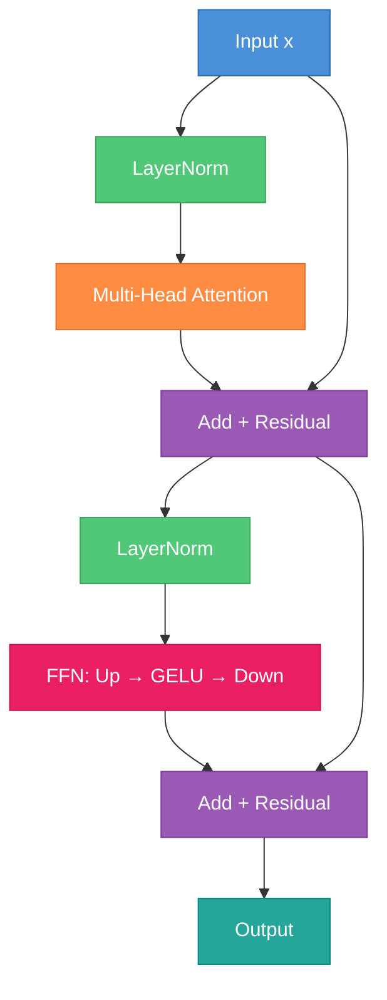

---

### 12. Encoder vs Decoder vs Encoder-Decoder

| Property | Encoder-only | Decoder-only | Encoder-Decoder |
|---|---|---|---|
| Attention | Bidirectional | Causal (masked) | Enc bidir, Dec causal + cross |
| Training | MLM (mask 15%) | Next-token prediction | Span corruption / seq2seq |
| Examples | BERT, RoBERTa, DeBERTa | GPT, LLaMA, Mistral | T5, BART, Whisper |
| Best for | Classification, NER, retrieval | Generation, chat, agents | Translation, summarization |
| Output | Per-token hidden states | Next-token distribution | Generated sequence |

**Encoder-only.** All tokens see all other tokens. Great for understanding — each output embedding is a contextual representation of its input token. You attach a classification head (on the `[CLS]` token or pooled output) for downstream tasks. Cannot generate text naturally (no causal structure).

**Decoder-only.** Causal attention mask prevents tokens from seeing the future. Can generate autoregressively. Modern LLMs are almost all decoder-only because:
- Training is simple (just next-token prediction on web text)
- Generation is the main product (chat, code, agents)
- Scales cleanly
- In-context learning emerges naturally

**Encoder-decoder.** Two stacks. The encoder processes the full input with bidirectional attention. The decoder generates output with causal self-attention **plus cross-attention** to encoder outputs (each decoder token attends to all encoder positions). Still the best choice for tasks with a clear input→output structure where input can be read fully before output starts (translation, summarization, speech-to-text).

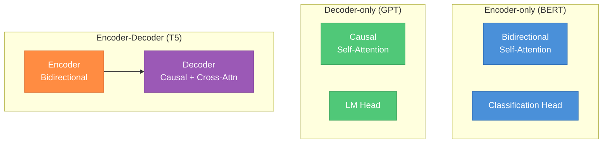

---

## Part 3 — Attention Variants and Efficiency

### 13. The O(n²) Problem

Standard scaled dot-product attention has two scaling bottlenecks in the sequence length `n`:

- **Memory**: the attention matrix `QKᵀ` has shape `(n, n)`. At `n = 32K`, that's 1B entries per head per layer → **gigabytes** of GPU memory, before we even multiply by V.
- **Compute**: the matmul is `O(n² · d_k)`, quadratic in sequence length.

For comparison, an FFN is `O(n · d_model · d_ff) = O(n · d_model²)` — linear in `n`. So as context grows, attention's quadratic term dominates.

**The memory wall.** The attention matrix often doesn't fit in GPU memory for long sequences. Even when it does, the traffic between High-Bandwidth Memory (HBM, ~1.5 TB/s on H100) and on-chip SRAM (~19 TB/s) dominates runtime. Attention is **memory-bound**, not compute-bound — the GPU is sitting idle waiting for HBM reads.

This is why context length has historically been tiny (512 for BERT, 1024 for GPT-2, 2048 for GPT-3). The last few years have seen an explosion of techniques to break this barrier: FlashAttention (exact, IO-aware), GQA/MQA (smaller KV cache), sliding window (sparse), RoPE scaling (extend at inference), PagedAttention (memory management).

---

### 14. FlashAttention

**FlashAttention** (Dao et al. 2022) is an **IO-aware exact attention algorithm**. It computes the same result as standard attention but runs 2–4× faster and uses O(n) memory instead of O(n²). It is the single most impactful attention engineering work of the past few years.

#### The key insight
Standard attention on GPU is memory-bound, not compute-bound. The bottleneck is moving the `n × n` attention matrix between HBM (slow, large) and SRAM (fast, tiny). Standard implementations:
1. Write `S = QKᵀ` to HBM
2. Read `S` back to SRAM to compute softmax
3. Write `P = softmax(S)` back to HBM
4. Read `P` back to SRAM to compute `PV`
5. Write output to HBM

Each of these reads/writes is hundreds of gigabytes for long sequences.

#### The solution: tiling with online softmax
FlashAttention splits Q, K, V into blocks and processes one block at a time, **keeping all intermediates in SRAM**. The attention matrix is **never fully materialized** in HBM. The trick is the **online softmax**: a numerically stable streaming algorithm that updates running softmax statistics as new blocks arrive, using the identity:
```
softmax(x) = exp(x - max(x)) / Σ exp(x - max(x))
```
with running max and running sum that can be updated incrementally.

#### Algorithm (forward pass)
```
For each block of Q:
    Initialize output block O and softmax stats (m, l) in SRAM
    For each block of K, V:
        Load K, V block into SRAM
        Compute S = Q·Kᵀ for this block
        Update running max m, running sum l
        Rescale previous O with new softmax stats
        Accumulate new softmax(S)·V into O
    Write final O to HBM
```

#### Backward pass
The backward pass needs the attention weights, but storing them would defeat the purpose. FlashAttention **recomputes** them during backward — still faster than reading them from HBM, because compute is cheap and memory is the bottleneck. It only needs to save `O`, `l`, `m` (small).

#### Results
- **Same FLOPs** as standard attention (it's exact, not an approximation)
- **2–4× faster** on typical workloads
- **O(n) memory** instead of O(n²) for the attention matrix
- Enables training with 8K, 16K, 32K contexts that were previously infeasible

#### FlashAttention-2 (2023)
Better work partitioning across GPU warps, fewer non-matmul operations, and parallelization across sequence length. **~2× faster than v1**. Default in most modern training stacks.

#### FlashAttention-3 (2024)
Exploits H100 specific features: async Tensor Core copies, warp specialization, FP8 support. Up to **75% of H100 peak throughput**.

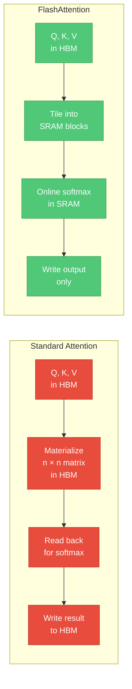

---

### 15. Multi-Query Attention (MQA) and Grouped-Query Attention (GQA)

During autoregressive generation, the **KV cache** (stored keys and values from previous tokens) often dominates GPU memory. Standard multi-head attention replicates K and V across all `h` query heads, wasting memory. MQA and GQA address this.

#### Multi-Head Attention (MHA)
`h` query heads, `h` key heads, `h` value heads. KV cache size per layer per token:
```
2 · h · d_head · dtype_size
```

#### Multi-Query Attention (MQA, Shazeer 2019)
`h` query heads, but **only 1 key head and 1 value head shared across all queries**. KV cache shrinks by a factor of `h`. Used by PaLM, Falcon.

**Pros:**
- KV cache is `h`× smaller (often 8–64× smaller in practice)
- Faster generation (memory bandwidth dominates at inference)
- Smaller memory footprint

**Cons:**
- Quality drop vs MHA on some tasks
- Training instability reported in some settings

#### Grouped-Query Attention (GQA, Ainslie et al. 2023)
Compromise between MHA and MQA. The `h` query heads are partitioned into `g` groups, each group sharing one K and one V head. So there are `h` query heads, `g` key heads, `g` value heads.
- `g = h` → standard MHA
- `g = 1` → MQA
- Typical: `g = h/8` (e.g., LLaMA 2 70B uses `h=64`, `g=8`)

**Used by: LLaMA 2 70B, LLaMA 3 (all sizes), Mistral 7B, Mixtral, Gemma, Qwen 2, DeepSeek.** Practically the default for production LLMs today.

**Why this matters for inference.** At long context, the KV cache (not the model weights) dominates memory. For a 70B MHA model at 8K context, the KV cache can be ~40GB per sequence. GQA with `g=8` reduces this to ~5GB, enabling larger batch sizes and longer contexts on the same hardware.

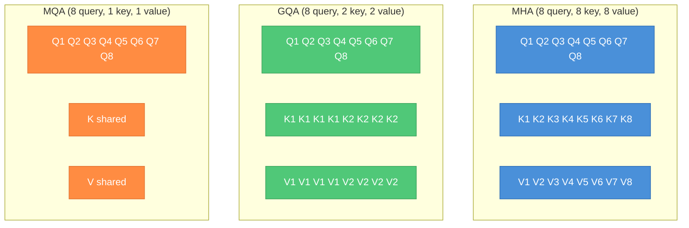

---

### 16. Sliding Window and Sparse Attention

Instead of attending to all `n` tokens, attend to a structured subset. Reduces complexity to `O(n · w)` where `w` is the window size.

#### Sliding Window Attention (Mistral)
Each token attends only to the previous `w` tokens (e.g., `w = 4096`). At inference, the KV cache only needs the last `w` tokens. But **information still propagates globally** through the stack: with `L` layers, the receptive field grows to `L · w`. Mistral 7B uses `w = 4096` with `L = 32`, giving an effective receptive field of 131K tokens.

#### Longformer (Beltagy 2020)
Combines:
- Sliding window attention (local)
- Global attention on special tokens (`[CLS]`, question tokens) that attend to everything and are attended to by everything

Designed for long-document tasks like QA over full papers.

#### BigBird (Zaheer 2020)
Three attention types combined:
- Sliding window (local context)
- Global tokens
- **Random attention**: each token attends to a few random positions

The random attention is justified by graph theory: a random sparse graph is still well-connected, preserving expressivity.

#### StreamingLLM (Xiao 2023)
For truly infinite streaming. Observation: modern LLMs place huge attention weight on the first few tokens (called **attention sinks**). Dropping them breaks the model. Solution: always keep the first few tokens (the sinks) plus a rolling window. Enables essentially unbounded generation with bounded KV cache.

**Tradeoff.** Sparse/windowed attention saves memory and compute but loses some global awareness. For tasks requiring retrieval from deep in the context, full attention (+ FlashAttention) is still preferred.

---

### 17. Linear Attention Approximations

Methods that try to avoid the `O(n²)` cost entirely by approximating softmax attention with linear operators.

#### Linformer (Wang 2020)
Projects `K` and `V` from length `n` to a smaller fixed length `k`: `K' = E·K`, `V' = F·V`. The attention then becomes `(n, k)` instead of `(n, n)`. Linear in `n`. Limitation: fixed projection loses information, and `k` must be chosen in advance.

#### Performer (Choromanski 2020)
Approximates `exp(q·k)` with random feature maps:
```
exp(q·k) ≈ φ(q) · φ(k)
```
allowing the attention computation to be reordered as `Q(KᵀV)` which is `O(n · d²)` instead of `O(n² · d)`. Unbiased estimator of softmax attention.

#### Linear Attention (Katharopoulos 2020)
Replaces `softmax(qk)` with `φ(q)φ(k)` for some feature map `φ`. Allows rewriting:
```
softmax(QKᵀ)V  ≈  φ(Q)·(φ(K)ᵀ V)
```
Computing `φ(K)ᵀ V` first gives an `O(n · d²)` algorithm.

**Reality check.** All these methods trade quality for speed, and in practice **FlashAttention beats them** because it's exact, fast, and well-engineered for real hardware. Linear attention dominated papers in 2020–2021 but has largely lost ground to FlashAttention + GQA + sliding window. Mamba and other SSM-based models are a distinct research direction that bypasses attention entirely.

---

### 18. KV Cache and Inference Optimization

During autoregressive generation, for each new token you only need to compute **new Q** and attend to **all previous K, V**. Storing past K, V avoids recomputation.

**Without KV cache.** Each new token requires `O(n²)` work to recompute attention over all past tokens. Total generation cost: `O(n³)` for a sequence of length n.

**With KV cache.** Each new token is `O(n)` work (attending over cached K, V). Total cost `O(n²)`. Almost every inference engine does this.

#### KV cache size
```
2 (K and V) × n_layers × n_kv_heads × d_head × seq_len × batch × dtype_size
```

**Example: LLaMA 2 70B at 8K context, fp16, batch 1:**
- `n_layers = 80`, `n_kv_heads = 8` (GQA), `d_head = 128`, `seq_len = 8192`
- `2 × 80 × 8 × 128 × 8192 × 1 × 2 bytes = ~2.7 GB`

**Example: same model as MHA (n_kv_heads=64):** would be ~22 GB. This is why GQA matters.

At very long context or large batch, the **KV cache can exceed the model weights**. For LLaMA 3 70B at 128K context, KV cache is tens of GB per sequence.

#### PagedAttention (vLLM)
Standard KV cache uses contiguous memory — wasteful because you pre-allocate for max length. **PagedAttention** (Kwon et al. 2023, basis of vLLM) manages the KV cache like **virtual memory with paging**:
- Split KV cache into fixed-size blocks (pages)
- Use a page table to map logical blocks to physical blocks
- Allocate lazily as sequence grows
- Share blocks across sequences (e.g., shared prompt prefix in parallel generation)

Result: **2–4× higher throughput** for batched serving, near-zero memory fragmentation.

#### KV cache quantization
Store K, V in int8 or fp8 instead of fp16 → **2× smaller cache**. Slight quality loss, but often negligible for K, V (less sensitive than weights).

#### Other tricks
- **Prefix caching**: reuse KV cache across requests that share a prompt prefix (system prompt, few-shot examples)
- **Speculative decoding**: a small draft model proposes tokens, the big model verifies in parallel
- **Chunked prefill**: interleave prefill and decode to keep the GPU busy

---

### 19. Context Length Extension

The problem: you trained a model with RoPE at context length 4K. You want to use it at 32K or 128K. Position indices beyond 4K have never been seen.

#### Position Interpolation (PI, Chen 2023)
Scale position indices down by factor `s = L_new / L_train`. Effectively squeeze longer positions into the range the model has seen. Simple but uniformly reduces precision at short distances.

#### NTK-aware scaling (emozilla 2023)
RoPE frequencies are not all equal — high frequencies encode short-range, low frequencies encode long-range. NTK-aware scaling changes only the base frequency:
```
new_base = base · s^(d/(d-2))
```
This compresses high frequencies less and low frequencies more, preserving short-range precision while stretching long-range coverage.

#### YaRN (Peng 2023)
**Yet another RoPE extensioN.** Combines PI and NTK ideas with a per-dimension scaling rule and a temperature adjustment in the attention softmax. Currently the most widely used extension method. LLaMA 3 used YaRN-style approaches for its long-context variants.

#### Fine-tuning at long context
Any of these methods works better after **fine-tuning at the target length** on a small amount of long-context data. Typically a few hundred to a few thousand steps is enough to adapt. Without fine-tuning, quality degrades at the edges.

**Tradeoff summary:** free extension (PI, NTK, YaRN) is cheap but lossy. Fine-tuning is expensive but gives the best quality. Production models usually fine-tune.

---

### 20. Modern LLM Architectures

Comparison of widely used open-weight LLMs as of 2024–2025:

| Model | Params | Attention | Pos Encoding | Norm | Activation | Context | Notable |
|---|---|---|---|---|---|---|---|
| GPT-4 | ~1.7T (MoE?) | ? | ? | ? | ? | 128K | Proprietary |
| GPT-4o | ? | ? | ? | ? | ? | 128K | Multimodal |
| Claude 3.5 Sonnet | ? | ? | ? | ? | ? | 200K | Proprietary |
| LLaMA 2 7B | 7B | MHA | RoPE | RMSNorm | SwiGLU | 4K | Open |
| LLaMA 2 70B | 70B | GQA (g=8) | RoPE | RMSNorm | SwiGLU | 4K | Open |
| LLaMA 3 8B | 8B | GQA (g=8) | RoPE | RMSNorm | SwiGLU | 8K → 128K | 128K vocab |
| LLaMA 3 70B | 70B | GQA (g=8) | RoPE | RMSNorm | SwiGLU | 8K → 128K | |
| LLaMA 3.1 405B | 405B | GQA | RoPE | RMSNorm | SwiGLU | 128K | |
| Mistral 7B | 7B | GQA + SWA | RoPE | RMSNorm | SwiGLU | 32K | Sliding window |
| Mixtral 8x7B | 47B total, 13B active | GQA | RoPE | RMSNorm | SwiGLU | 32K | Sparse MoE |
| Gemma 2 | 9B/27B | GQA | RoPE | RMSNorm | GeGLU | 8K | Logit soft-cap |
| Qwen 2 | 0.5B–72B | GQA | RoPE | RMSNorm | SwiGLU | 32K–128K | |
| DeepSeek-V3 | 671B total, 37B active | MLA | RoPE | RMSNorm | SwiGLU | 128K | Sparse MoE, Multi-head Latent Attention |
| Command R+ | 104B | GQA | RoPE | LayerNorm | SwiGLU | 128K | |

**Patterns across the modern stack:**
- Decoder-only
- RoPE for positions (sometimes ALiBi)
- RMSNorm over LayerNorm
- SwiGLU over GELU
- GQA over MHA for anything above 7B
- Mixture of Experts for frontier scale (Mixtral, DeepSeek-V3, rumored GPT-4)
- Long context (128K+) via YaRN/NTK-style scaling plus fine-tuning


---

### 21. Training Techniques Unique to LLMs

A brief tour. See `all-in-one-guide.md` and `ml-system-design.md` for deep coverage of distributed training.

- **Mixed precision (bf16, fp8)**: bf16 has the same exponent range as fp32 with 16 bits, so it won't overflow. Standard for training LLMs. fp8 training (H100) is the frontier.
- **Gradient checkpointing (activation recomputation)**: don't store all activations during forward; recompute them during backward. Trades compute for memory.
- **3D parallelism**: Data Parallelism × Tensor Parallelism × Pipeline Parallelism. DP splits batches, TP splits tensors (e.g., attention heads) across GPUs, PP splits layers across GPUs.
- **FSDP / ZeRO-3**: shards optimizer states, gradients, and parameters across GPUs. Lets you train 70B+ models without per-GPU OOM.
- **Mixture of Experts (MoE)**: a sparse layer with `E` expert FFNs. A router sends each token to the top-`k` (usually `k=2`) experts. Only `k/E` of parameters active per token. Used by Mixtral (8 experts), DeepSeek-V3 (256 experts + 1 shared). Loss of auxiliary load-balancing loss is the main trick.
- **Loss-free load balancing** (DeepSeek-V3): bias correction term instead of auxiliary loss.

---

### 22. Fine-Tuning Techniques

Taking a pretrained LLM and adapting it to a specific task or domain.

#### Full fine-tuning
Update all parameters on new data. Highest quality, but:
- For a 70B model: needs optimizer states (e.g., 8× params for Adam) + gradients + activations. Easily 1+ TB of GPU memory.
- Catastrophic forgetting of general knowledge.
- Each task gets its own full copy of the model.

#### LoRA (Low-Rank Adaptation, Hu et al. 2021)
**Core idea.** The weight update during fine-tuning has low intrinsic rank. So instead of learning a full `d × d` update `ΔW`, learn a low-rank decomposition:
```
ΔW = B · A
where A ∈ ℝ^(r × d), B ∈ ℝ^(d × r), r ≪ d
```

Freeze the base model `W`. Only `A` and `B` are trained. Effective weight at inference: `W + BA`.

**Why it works.**
- Trainable params drop from `d²` to `2rd`. For `d=4096, r=16`: 1024× fewer params.
- Base model is frozen → no forgetting, can share across tasks.
- Multiple LoRA adapters can be swapped at inference.
- At deployment, `BA` can be merged into `W` so no inference overhead.

Typical choice: `r=8` to `r=64`. Apply to Q, K, V, O projections (sometimes FFN too).

#### QLoRA (Dettmers 2023)
LoRA + quantization of the base model to 4-bit (NF4 format). Adapter weights stay in bf16. Can fine-tune a 65B model on a single 48GB GPU.

Key tricks:
- NF4 quantization (info-theoretically optimal for normally-distributed weights)
- Double quantization (quantize the quantization constants)
- Paged optimizers (swap to CPU on OOM spikes)

#### Prefix tuning / Prompt tuning (Li 2021, Lester 2021)
Instead of learning weights, learn **soft prompts**: a sequence of trainable embedding vectors prepended to the input. The frozen model processes these as if they were real tokens. Very parameter-efficient but usually needs larger models to work well.

#### Adapter layers (Houlsby 2019)
Insert small bottleneck MLPs between transformer sublayers. Train only those. Historical precursor to LoRA; LoRA is now dominant.

#### PEFT library
HuggingFace's `peft` package implements LoRA, QLoRA, prefix/prompt tuning, adapter fusion, and more. The standard for fine-tuning open-weight LLMs.

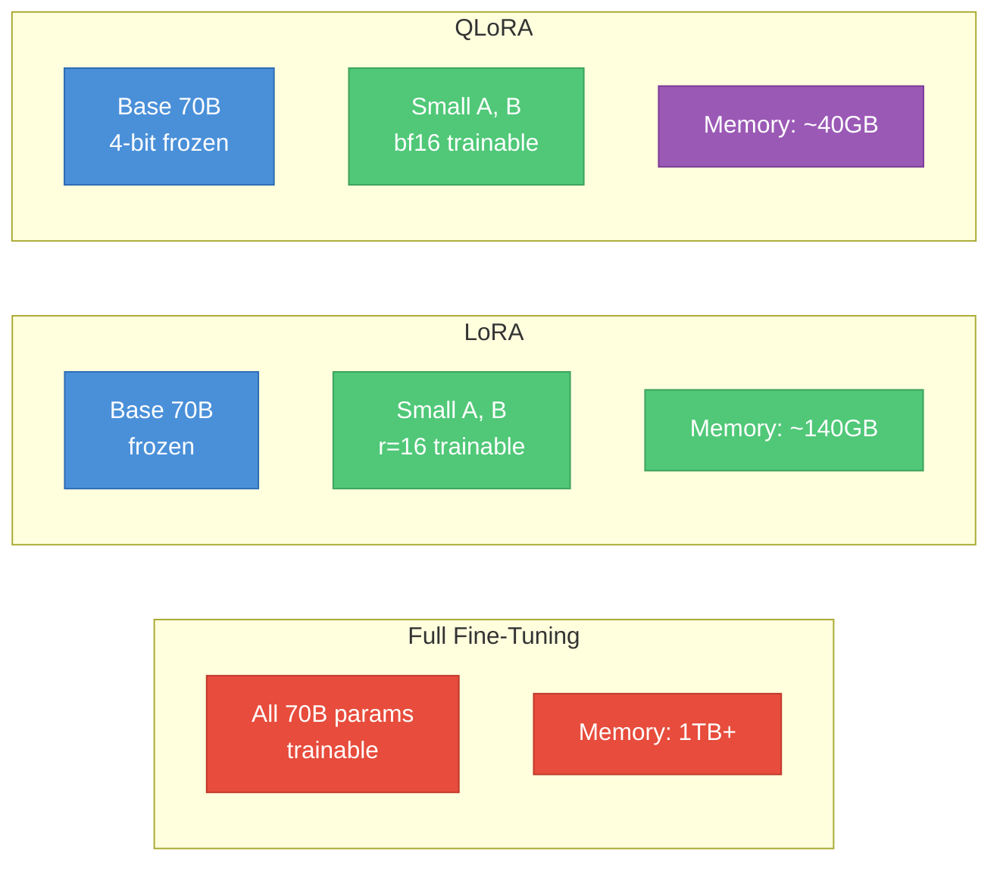

---

### 23. Prompting and In-Context Learning

LLMs do a remarkable thing: they can learn new tasks **at inference time**, just from examples in the prompt. No weight updates.

#### Zero-shot
Task description only. "Classify the following review as positive or negative: ..."

#### Few-shot (in-context learning)
Include `k` labeled examples in the prompt before the query. The model infers the pattern.
```
Translate English to French.
sea otter => loutre de mer
peppermint => menthe poivrée
plush giraffe => girafe en peluche
cheese =>
```

#### Chain-of-thought (CoT, Wei 2022)
Include reasoning in the few-shot examples, or just append "Let's think step by step" (zero-shot CoT, Kojima 2022). Dramatically improves multi-step reasoning, math, and logic on large models. Does nothing for small models (emergent ability).

#### Self-consistency (Wang 2022)
Sample multiple CoT reasoning paths with temperature > 0. Majority-vote the final answers. Trades compute for accuracy.

#### Tree of Thoughts (Yao 2023)
Explore the reasoning tree with search: generate multiple next-step thoughts, evaluate them with the model, backtrack on dead ends. Useful for problems like Game of 24 or crosswords.

#### System prompts vs user prompts
Chat models separate an invariant **system prompt** (persona, safety rules) from the evolving **user/assistant turns**. System prompts set style, constraints, and tools.

#### Why does in-context learning work?
Still an open question. Theories:
- Implicit Bayesian inference over pretraining tasks
- Learned gradient-descent-like updates in the forward pass (transformers can implement meta-learning in their weights)
- Retrieval from pretraining examples
- Task vector in activations
- Emergent at scale: small models don't do it, large models do

---

### 24. Retrieval-Augmented Generation (RAG)

**The problem.** LLMs have a static knowledge cutoff. They hallucinate when asked about facts they don't know. Fine-tuning to inject new facts is expensive and brittle.

**The solution.** Retrieve relevant documents from a corpus at query time, stuff them into the context, and let the LLM answer from them.

#### Basic RAG pipeline
1. **Offline indexing**:
   - Chunk documents into passages (e.g., 256–1024 tokens with overlap)
   - Embed each chunk with a text encoder (e.g., `text-embedding-3`, `bge-large`, `jina-embeddings`)
   - Store embeddings in a vector database
2. **Online query**:
   - Embed the user query with the same encoder
   - Nearest-neighbor search in the vector DB → top-k chunks
   - Assemble a prompt: `[system] + [retrieved chunks] + [query]`
   - LLM generates the answer

#### Vector databases
- **FAISS** (Facebook): library, in-process, very fast
- **Pinecone**: managed SaaS, easy scaling
- **Weaviate, Qdrant, Milvus, Chroma**: open source options
- **pgvector**: Postgres extension, nice for existing stacks

#### Key design choices
- **Chunking**: fixed size vs sentence vs semantic vs recursive. Tradeoff: small chunks precise but fragmented, large chunks contextual but noisy.
- **Embedding model**: domain matters (code vs legal vs biomedical). MTEB leaderboard compares options.
- **Hybrid search**: combine dense (vector) and sparse (BM25) retrieval. Often reranked with a cross-encoder.
- **Reranking**: a small cross-encoder (e.g., `bge-reranker`) rescores the top-k from retrieval. Big quality boost.
- **Query rewriting**: use an LLM to rewrite ambiguous queries before retrieval (HyDE, step-back prompting).
- **Recursive / agentic RAG**: multi-step retrieval plans, especially for questions needing information from multiple sources.

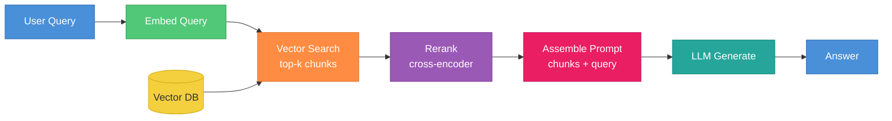

---

### 25. Interview Questions Checklist

Canonical LLM/NLP interview questions with brief, precise answers. Practice whiteboarding the diagrams too.

**1. Walk me through what happens in a transformer block.**
Input `x` goes through LayerNorm, then Q/K/V projections, then scaled dot-product attention (with causal mask for decoders), then the output projection; result is added to `x` as residual. Then LayerNorm again, then FFN (up-project, GELU/SwiGLU, down-project); result added as second residual. Output passed to next block.

**2. Why divide by √d_k in attention?**
Without scaling, dot products grow with `d_k`, pushing softmax into the saturated regime where gradients vanish. Dividing by `√d_k` keeps the pre-softmax scores at unit variance.

**3. Why softmax and not another normalization?**
Softmax produces a valid probability distribution (non-negative, sums to 1), it's differentiable, and it amplifies differences (the `exp`) so the model makes confident selections.

**4. Compare MHA, GQA, and MQA.**
MHA: `h` query heads, `h` key/value heads. Best quality, biggest KV cache. MQA: `h` queries, 1 shared K/V. Smallest cache, some quality loss. GQA: `h` queries, `g` groups of K/V. Compromise, `g = h/8` typical. Used in LLaMA 2 70B+, LLaMA 3, Mistral, Gemma.

**5. How does FlashAttention work?**
It's an **IO-aware, exact** attention algorithm. Tiles Q, K, V into blocks, computes attention per-block entirely in on-chip SRAM with an online softmax, never materializing the `n × n` attention matrix in HBM. Same FLOPs, 2–4× faster because it cuts HBM traffic, and uses O(n) memory.

**6. What is RoPE? Why is it used?**
Rotary Position Embedding. Rotates Q and K by an angle proportional to position before the dot product. The inner product of rotated vectors depends only on relative position, giving implicit relative positional encoding with no added parameters. Extends well to longer contexts with scaling tricks (PI, NTK, YaRN). Used in LLaMA, Gemma, Qwen, Mistral.

**7. Explain the KV cache. Why does it matter?**
During autoregressive generation, re-running the whole prompt for each new token is `O(n²)`. The KV cache stores past K, V so each new token only needs to project and attend, cutting cost to `O(n)` per step. Downside: KV cache memory can exceed model weights at long context. GQA/MQA and quantization mitigate this.

**8. How does LoRA work?**
Freeze the base model `W`. Learn a low-rank update `ΔW = BA` with `A ∈ ℝ^(r×d), B ∈ ℝ^(d×r), r ≪ d`. Effective weight is `W + BA`. Trains 100–1000× fewer parameters, base model can be shared, adapters can be swapped. QLoRA quantizes `W` to 4-bit to fit bigger models.

**9. BERT vs GPT vs T5 — when to use each?**
BERT (encoder-only, bidirectional): classification, NER, retrieval embeddings. GPT (decoder-only, causal): text generation, chat, agents. T5 (encoder-decoder): translation, summarization — anything with a clear input sequence fully read before output starts.

**10. Why do modern LLMs use pre-norm instead of post-norm?**
Pre-norm (`x + Sublayer(LN(x))`) keeps the residual path clean so gradients flow unimpeded from loss to input. Post-norm puts LayerNorm on the residual path, which destabilizes training in deep models. Pre-norm typically doesn't need learning-rate warmup.

**11. Why does context length matter, and how do we extend it?**
Longer context enables long documents, many-shot prompts, and agentic workflows. Extension techniques: Position Interpolation, NTK-aware scaling, YaRN (all manipulate RoPE frequencies), optionally followed by fine-tuning at the target length. Also: sliding window, FlashAttention for memory, GQA for KV cache.

**12. Tradeoffs of BPE vs WordPiece vs SentencePiece?**
BPE (GPT): greedy merges by frequency, simple, byte-level variant has no OOV. WordPiece (BERT): likelihood-based merges, uses `##` for continuations. SentencePiece (LLaMA, T5): language-agnostic, treats input as raw bytes/codepoints, no pre-tokenization, best for multilingual and non-whitespace languages. All produce similar quality; SentencePiece has the biggest generality edge.

**13. What is perplexity?**
`PPL = exp(cross_entropy_loss)`. The model's effective branching factor over tokens. Lower = better. Only comparable across models with the same tokenizer and test set.

**14. How does the FFN contribute? Why not just stack attention?**
Attention **mixes** information across tokens but is linear (weighted sum). The FFN applies a **position-wise** nonlinear transformation, giving the model per-token computation depth. Mechanistic interpretability suggests FFN layers act as key-value memories storing factual knowledge.

**15. What is mixture of experts?**
Replace the FFN with `E` expert FFNs plus a router. Each token is sent to top-`k` experts (usually `k=2`). Total params are `~E×` bigger but only `k/E` are active per token. Mixtral 8×7B, DeepSeek-V3, GPT-4 (rumored) use MoE. Training adds a load-balancing term so experts get used evenly.

**16. Explain chain-of-thought prompting and why it works.**
Include reasoning steps in few-shot examples, or add "Let's think step by step." The model emits intermediate reasoning before the final answer. Works because the extra tokens give the model more forward-pass compute to do implicit "thinking" and route the answer through a more correct computation. Emergent at scale — small models don't benefit.

**17. What is RAG, and when is it preferable to fine-tuning?**
Retrieval-Augmented Generation: fetch relevant documents at query time, stuff them into context. Prefer RAG when: knowledge changes often, you need citations, you can't retrain, or your knowledge base is big. Prefer fine-tuning when: you need new behaviors (not just new facts), latency is critical, or domain style must shift.

**18. What does beam search do, and when is it used?**
Decoding strategy: maintain `k` best partial hypotheses, expand each, keep top `k` by cumulative log-prob. Better than greedy for translation / summarization where there's a correct output. For open-ended generation, beam search produces bland text — temperature sampling and nucleus (top-p) sampling are preferred.

**19. What are attention sinks?**
Observation (StreamingLLM): LLMs dump unused attention mass on the first few tokens, regardless of their content. If you drop these tokens (e.g., with a rolling window), the model collapses. Keeping the first few tokens plus a rolling window enables unbounded streaming generation.

**20. Why is bf16 used for LLM training?**
bf16 has the same exponent range as fp32 (8 bits) with 16 bits total. It won't overflow on large activations/gradients like fp16 can. Trades mantissa precision for range, which is the right tradeoff for deep nets where magnitudes span many orders.

**21. Walk me through inference for a chat request in production.**
Tokenize → build prompt (system + history + user) → **prefill** (compute Q/K/V for full prompt, build KV cache) → **decode** (for each new token: run one forward pass, update KV cache, sample from logits, repeat until stop token or max length) → detokenize → stream back. Optimizations: continuous batching, PagedAttention, speculative decoding, prefix caching.

**22. What's the difference between temperature, top-k, and top-p sampling?**
Temperature `T` rescales logits (`logits/T`) before softmax: `T<1` sharpens, `T>1` flattens. Top-k keeps only the `k` highest-probability tokens. Top-p (nucleus) keeps the smallest set whose cumulative probability ≥ `p`. Typical chat settings: `T ≈ 0.7, top_p ≈ 0.9`.

---

#### Whiteboard drills to practice
1. Draw one transformer block end to end with shape annotations.
2. Write the attention formula and explain each symbol.
3. Draw the difference between MHA, GQA, and MQA.
4. Sketch FlashAttention's tiled compute vs standard attention's HBM traffic.
5. Draw the RAG pipeline and label each component.
6. Write the LoRA decomposition and explain parameter count savings.
7. Compute the KV cache size for LLaMA 2 70B at 8K context under both MHA and GQA.
8. Sketch the shape transformations in self-attention for a batch of `(B, n, d_model)`.
