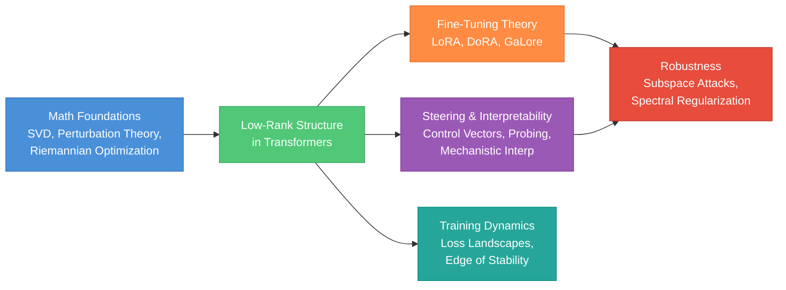
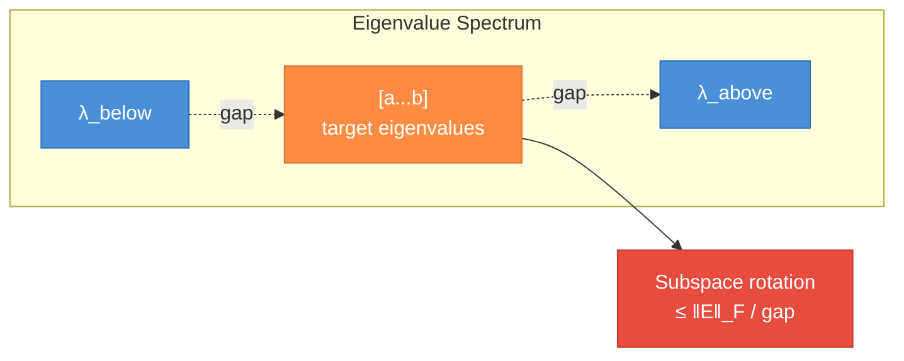
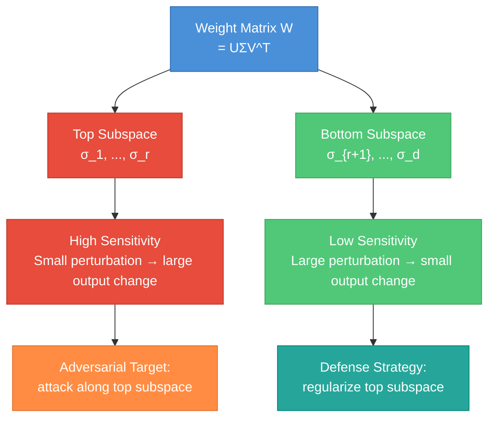

# Low-Rank Analysis for Robust LLMs

A deep reference covering the mathematical foundations, training dynamics, fine-tuning theory, interpretability techniques, and robustness analysis needed for low-rank research on large language models. This guide bridges the gap between the repo's existing math foundations ([Linear Algebra](linear-algebra.md), [Calculus & Optimization](calculus.md), [Probability & Statistics](statistics.md)) and the frontier research agenda of understanding and controlling LLMs through their low-rank structure.

The organizing thesis: both parameter-efficient fine-tuning (LoRA) and representation steering (control vectors, activation editing) are structured low-dimensional interventions. Understanding their shared geometry — and the vulnerability of models along specific low-rank subspaces — is the key to building models that are simultaneously controllable and robust.



---

## Table of Contents

**Part 1 -- Mathematical Foundations for Low-Rank Analysis**
1. [Low-Rank Approximation Theory](#1-low-rank-approximation-theory)
2. [Matrix Norms and the Nuclear Norm](#2-matrix-norms-and-the-nuclear-norm)
3. [Perturbation Theory](#3-perturbation-theory)
4. [Optimization on Low-Rank Manifolds](#4-optimization-on-low-rank-manifolds)
5. [Probabilistic Tools: Concentration and Random Matrices](#5-probabilistic-tools-concentration-and-random-matrices)

**Part 2 -- Low-Rank Structure in Transformers**
6. [Intrinsic Dimensionality of Neural Networks](#6-intrinsic-dimensionality-of-neural-networks)
7. [Spectral Properties of Transformer Weights](#7-spectral-properties-of-transformer-weights)
8. [Low-Rank Structure in Attention](#8-low-rank-structure-in-attention)

**Part 3 -- Parameter-Efficient Fine-Tuning: Theory and Methods**
9. [LoRA: Theory and Geometry](#9-lora-theory-and-geometry)
10. [Beyond LoRA: Modern PEFT Methods](#10-beyond-lora-modern-peft-methods)
11. [Training Dynamics of Low-Rank Adaptation](#11-training-dynamics-of-low-rank-adaptation)

**Part 4 -- Steering, Interpretability, and Representation Engineering**
12. [The Linear Representation Hypothesis](#12-the-linear-representation-hypothesis)
13. [Control Vectors and Activation Engineering](#13-control-vectors-and-activation-engineering)
14. [Activation Patching and Causal Intervention](#14-activation-patching-and-causal-intervention)
15. [Probing and Mechanistic Interpretability](#15-probing-and-mechanistic-interpretability)

**Part 5 -- Training Dynamics**
16. [Loss Landscape Geometry](#16-loss-landscape-geometry)
17. [Edge of Stability and Sharpness](#17-edge-of-stability-and-sharpness)
18. [Phase Transitions, Grokking, and Emergent Structure](#18-phase-transitions-grokking-and-emergent-structure)

**Part 6 -- Robustness Through the Low-Rank Lens**
19. [Subspace Vulnerability Analysis](#19-subspace-vulnerability-analysis)
20. [Spectral Regularization for Robustness](#20-spectral-regularization-for-robustness)
21. [Benchmarking Stability Under Perturbation](#21-benchmarking-stability-under-perturbation)

**Part 7 -- Interview Prep**
22. [Interview Questions](#22-interview-questions)
23. [Cross-Reference](#cross-reference)

---

# Part 1 -- Mathematical Foundations for Low-Rank Analysis

---

## 1. Low-Rank Approximation Theory

> **Prerequisite.** The [Linear Algebra guide](linear-algebra.md) covers SVD basics and the Eckart-Young theorem. This section extends that foundation to the full approximation theory you need for research.

### The Eckart-Young-Mirsky Theorem (Full Statement)

Given a matrix `A ∈ ℝ^{m×n}` with SVD `A = UΣV^T` and singular values `σ_1 ≥ σ_2 ≥ ... ≥ σ_p` (where `p = min(m,n)`), the best rank-r approximation is:

```
A_r = Σ_{i=1}^{r} σ_i u_i v_i^T
```

This minimizes the approximation error in **both** the Frobenius and spectral norms:

| Norm | Error formula | Interpretation |
|------|---------------|----------------|
| Frobenius | `‖A - A_r‖_F = √(Σ_{i=r+1}^{p} σ_i²)` | Total energy in discarded components |
| Spectral | `‖A - A_r‖_2 = σ_{r+1}` | Worst-case distortion along any direction |

**Why both matter.** The Frobenius error tells you the average-case quality of your approximation (relevant for training loss). The spectral error tells you the worst-case distortion along any single direction (relevant for adversarial robustness — an attacker only needs one bad direction).

### Singular Value Decay and Effective Rank

Real-world weight matrices rarely have exact low rank. Instead, their singular values decay, and the effective rank depends on the decay rate:

- **Exponential decay** (`σ_i ∝ e^{-αi}`): Very low effective rank. A small r captures almost all the energy. Common in fine-tuned models where the update is concentrated in a few directions.
- **Polynomial decay** (`σ_i ∝ i^{-β}`): Moderate effective rank. Need more components for the same approximation quality. Common in pretrained weight matrices.
- **Flat spectrum** (`σ_i ≈ constant`): Full rank. Low-rank approximation is lossy. This is what random matrices look like (Marchenko-Pastur, Section 5).

**Effective rank** (Roy & Vetterli, 2007): `erank(A) = exp(H(σ̃))` where `σ̃_i = σ_i / Σ_j σ_j` and `H` is Shannon entropy. Ranges from 1 (rank-1) to p (flat spectrum). This single number tells you how compressible a matrix is.

**Stable rank**: `srank(A) = ‖A‖_F² / ‖A‖_2² = (Σ σ_i²) / σ_1²`. Always ≤ rank(A). More robust to small singular values than algebraic rank. If `srank(A) ≪ rank(A)`, the matrix is "effectively low-rank" even though it is technically full-rank.

### Why This Matters for LLMs

When we fine-tune a pretrained model with weights `W_0`, the update `ΔW = W_fine - W_0` is empirically very low-rank (see Section 6). This is not an accident — it reflects the fact that fine-tuning adjusts the model along a small number of task-relevant directions while leaving the bulk of the pretrained representation untouched. The singular value decay of `ΔW` directly determines how well LoRA (which constrains `ΔW` to be rank-r) can approximate full fine-tuning.

---

## 2. Matrix Norms and the Nuclear Norm

### The Norm Hierarchy

For `A ∈ ℝ^{m×n}` with singular values `σ_1, ..., σ_p`:

| Norm | Definition | Notation | Interpretation |
|------|-----------|----------|----------------|
| **Spectral** (operator) | `max_i σ_i` | `‖A‖_2` | Maximum stretch factor |
| **Frobenius** | `√(Σ σ_i²)` | `‖A‖_F` | Euclidean size of the matrix |
| **Nuclear** (trace) | `Σ σ_i` | `‖A‖_*` | Sum of all singular values |

**Ordering.** `‖A‖_2 ≤ ‖A‖_F ≤ ‖A‖_*` always. Equality holds when A is rank-1.

**Dual norms.** The spectral norm and nuclear norm are dual to each other: `‖A‖_* = max_{‖B‖_2 ≤ 1} ⟨A, B⟩`. This duality is the foundation of nuclear norm minimization.

### The Nuclear Norm as Convex Envelope of Rank

The rank function `rank(A)` is combinatorial (NP-hard to optimize). The nuclear norm `‖A‖_*` is its **convex envelope** over the unit ball — the tightest convex lower bound of the rank function. This means:

```
minimize rank(A)  subject to constraints
```

can be relaxed to:

```
minimize ‖A‖_*  subject to constraints
```

and under mild conditions (restricted isometry, incoherence), the relaxation is tight — the nuclear norm solution has the same rank as the true rank-minimizing solution. This is the theoretical foundation of matrix completion (Netflix problem) and is relevant to low-rank fine-tuning: penalizing `‖ΔW‖_*` encourages low-rank updates without fixing the rank in advance.

### Schatten Norms

The spectral, Frobenius, and nuclear norms are special cases of the Schatten p-norm family:

```
‖A‖_{S_p} = (Σ σ_i^p)^{1/p}
```

| p | Name | Encourages |
|---|------|------------|
| ∞ | Spectral | Bounded maximum singular value (Lipschitz constraint) |
| 2 | Frobenius | Bounded total energy (weight decay) |
| 1 | Nuclear | Low rank (sparse singular values) |

**Analogy to vector norms.** The nuclear norm does for matrices what the L1 norm does for vectors: it promotes sparsity — but in the singular value spectrum rather than in the entries. Just as L1 regularization produces sparse weight vectors, nuclear norm regularization produces low-rank weight matrices.

---

## 3. Perturbation Theory

> **Why this matters.** The core question of the Low-Rank Steering project is: how sensitive is a model's output to perturbations along specific low-rank subspaces? Perturbation theory gives the mathematical tools to answer this precisely.

### Weyl's Inequality (Eigenvalue Stability)

For symmetric matrices `A, E ∈ ℝ^{n×n}` with `B = A + E`:

```
|λ_i(B) - λ_i(A)| ≤ ‖E‖_2   for all i
```

**Interpretation.** Adding a perturbation E shifts each eigenvalue by at most `‖E‖_2` (the spectral norm of the perturbation). Small perturbations → small eigenvalue changes. This is a worst-case bound; in practice, eigenvalues of high multiplicity are more stable than isolated ones.

**For singular values.** The same bound holds: `|σ_i(B) - σ_i(A)| ≤ ‖E‖_2`. Singular values are Lipschitz-continuous functions of the matrix entries.

**Application to LLMs.** When you perturb a weight matrix (via fine-tuning, noise injection, or adversarial attack), Weyl's inequality bounds how much each singular value can change. This is reassuring for small perturbations — but the interesting question is what happens to the *directions* (singular vectors), not just the values. That is Davis-Kahan.

### Davis-Kahan sin(θ) Theorem

The key result for understanding subspace stability. Let `A` and `B = A + E` be symmetric, and let `U_1` be the eigenspace of A corresponding to eigenvalues in an interval `[a, b]`. Let `Ũ_1` be the corresponding eigenspace of B. Then:

```
‖sin Θ(U_1, Ũ_1)‖_F ≤ ‖E‖_F / gap
```

where `gap = min(a - λ_{above}, λ_{below} - b)` is the **eigengap** — the distance from the eigenvalues of interest to the nearest eigenvalue outside the interval.



**Interpretation.** The angle between the original and perturbed subspaces is bounded by the ratio of perturbation size to eigengap. Large gap → stable subspace (hard to rotate). Small gap → fragile subspace (easy to rotate with a small perturbation).

**Why this is critical for low-rank steering.** If a model's behavior is determined by the top-r singular subspace of a weight matrix, then:
- **Large eigengap between σ_r and σ_{r+1}** → the subspace is robust to perturbations. Adversarial attacks must be large to shift behavior.
- **Small eigengap** → the subspace is fragile. A small, carefully chosen perturbation can rotate the subspace and change behavior drastically.

This directly connects to the project's goal of "investigating how vulnerabilities arise from sensitivity along specific low-rank subspaces."

### Wedin's Theorem (Singular Subspace Perturbation)

The generalization of Davis-Kahan to rectangular matrices (not just symmetric). For `A ∈ ℝ^{m×n}` with SVD `A = UΣV^T` and perturbation `B = A + E`:

```
max(‖sin Θ(U_1, Ũ_1)‖_F, ‖sin Θ(V_1, Ṽ_1)‖_F) ≤ max(‖E^T U_1‖_F, ‖E V_1‖_F) / (σ_r - σ_{r+1})
```

where `U_1, V_1` are the top-r left/right singular subspaces.

**Application.** Weight matrices `W_Q, W_K, W_V` in transformers are rectangular. Wedin's theorem tells you how much a perturbation (fine-tuning update, adversarial weight perturbation) rotates the subspaces that determine what the attention heads attend to.

---

## 4. Optimization on Low-Rank Manifolds

> **Prerequisite.** The [Calculus & Optimization guide](calculus.md) covers gradient descent, momentum, and Adam. This section covers the geometry-aware optimization needed for low-rank problems.

### The Low-Rank Manifold

The set of all rank-r matrices `M_r = {A ∈ ℝ^{m×n} : rank(A) = r}` is a smooth manifold of dimension `r(m + n - r)`. This is not a vector space (the sum of two rank-r matrices can have rank up to 2r), so standard gradient descent does not stay on the manifold.

**Tangent space.** At a point `A = UΣV^T` (thin SVD), the tangent space `T_A M_r` consists of matrices of the form:

```
Ż = U M V^T + U_perp K V^T + U L V_perp^T
```

where `M ∈ ℝ^{r×r}`, `K ∈ ℝ^{(m-r)×r}`, `L ∈ ℝ^{r×(n-r)}`. Dimension: `r² + r(m-r) + r(n-r) = r(m+n-r)`. The tangent space describes all directions you can move while staying (infinitesimally) on the manifold.

### Riemannian Gradient Descent

To optimize `f(A)` over rank-r matrices:

1. **Compute the Euclidean gradient** `∇f(A)` in ambient space `ℝ^{m×n}`.
2. **Project onto the tangent space**: `grad_R f(A) = P_{T_A}(∇f(A))` where the projection decomposes the gradient into its on-manifold component.
3. **Retract back to the manifold**: `A_{t+1} = R_A(A_t - η · grad_R f)` where the retraction maps from the tangent space back to a rank-r matrix (typically via a truncated SVD).

**Cost.** The projection and retraction each require a truncated SVD, which is `O(mnr)`. For large matrices, this is cheaper than a full SVD (`O(mn·min(m,n))`) but can still be the bottleneck.

### The Grassmann Manifold

The Grassmann manifold `Gr(r, n)` is the set of all r-dimensional subspaces of `ℝ^n`. Each point is a subspace (not a specific basis for it). This is the natural space for reasoning about "directions" without caring about scale or rotation within the subspace.

**Relevance.** When we say "the top-r singular subspace of a weight matrix," we are describing a point on the Grassmann manifold. LoRA's B and A factors together define a point on `Gr(r, d)`. Training LoRA is implicitly optimizing over the Grassmann manifold — even though the parameterization via B, A matrices works in Euclidean space.

**Grassmann distance.** The geodesic distance between two subspaces `U_1, U_2 ∈ Gr(r, n)` is `‖Θ‖_2 = ‖[θ_1, ..., θ_r]‖_2` where `θ_i` are the principal angles. Davis-Kahan bounds this distance under perturbation.

### Proximal Gradient for Nuclear Norm

When the objective includes a nuclear norm penalty:

```
minimize f(A) + λ‖A‖_*
```

the proximal gradient method alternates:

1. **Gradient step**: `B = A_t - η ∇f(A_t)`
2. **Proximal step** (singular value soft-thresholding): `A_{t+1} = SVT_τ(B)` where `SVT_τ(B) = U · max(Σ - τ, 0) · V^T`

The soft-thresholding shrinks each singular value by `τ = ηλ` and zeros out any that drop below zero. This simultaneously promotes low rank (small singular values are killed) and minimizes the smooth loss. Convergence rate: `O(1/t)` for convex f, `O(1/t²)` with acceleration (FISTA).

---

## 5. Probabilistic Tools: Concentration and Random Matrices

> **Prerequisite.** The [Statistics guide](statistics.md) covers distributions, expectation, and variance. This section covers the high-dimensional probability tools used in theoretical analysis of low-rank methods.

### Scalar Concentration Inequalities

Before matrix concentration, review the scalar versions:

| Inequality | Setting | Bound |
|-----------|---------|-------|
| **Markov** | X ≥ 0 | `P(X ≥ t) ≤ E[X] / t` |
| **Chebyshev** | Finite variance | `P(|X - μ| ≥ t) ≤ Var(X) / t²` |
| **Hoeffding** | Bounded, independent | `P(|X̄ - μ| ≥ t) ≤ 2 exp(-2nt² / (b-a)²)` |
| **Bernstein** | Bounded, independent | `P(|X̄ - μ| ≥ t) ≤ 2 exp(-nt² / (2σ² + 2bt/3))` |

Bernstein is tighter than Hoeffding when the variance `σ²` is small relative to the range `b-a` — it interpolates between sub-Gaussian (small t) and sub-exponential (large t) behavior.

### Matrix Concentration Inequalities

The matrix analogues replace scalar random variables with random matrices, and absolute values with spectral norms.

**Matrix Bernstein (Tropp, 2012).** Let `X_1, ..., X_n` be independent random symmetric matrices with `E[X_i] = 0` and `‖X_i‖_2 ≤ L`. Define `v = ‖Σ_i E[X_i²]‖_2` (matrix variance). Then:

```
P(‖Σ_i X_i‖_2 ≥ t) ≤ d · exp(-t² / (2v + 2Lt/3))
```

where d is the matrix dimension. The key difference from scalar Bernstein: you pay a factor of d (the dimension) in front.

**Matrix Chernoff (Tropp, 2012).** For positive semidefinite random matrices `X_1, ..., X_n` with `‖X_i‖_2 ≤ L` and `μ_min = λ_min(Σ_i E[X_i])`:

```
P(λ_min(Σ_i X_i) ≤ (1-δ) μ_min) ≤ d · exp(-μ_min δ² / (2L))
```

**Why these matter.** Matrix concentration inequalities are the workhorses of theoretical guarantees for:
- **Matrix completion**: how many entries do you need to observe to recover a rank-r matrix? Answer: `O(r n polylog(n))` entries, proved via matrix Bernstein.
- **Low-rank recovery**: how much noise can you tolerate in compressed sensing for matrices?
- **Spectral analysis of random weight perturbations**: if you add random noise to a weight matrix, how much do the top singular values and subspaces change?

### Random Matrix Theory Basics

**Marchenko-Pastur Law.** If `X ∈ ℝ^{n×p}` has i.i.d. entries from `N(0, σ²/n)` and `p/n → γ ∈ (0, ∞)`, then the eigenvalues of `X^T X` converge to the Marchenko-Pastur distribution supported on `[λ_-, λ_+]` where:

```
λ_± = σ²(1 ± √γ)²
```

**Interpretation.** The eigenvalues of a pure-noise matrix form a predictable bulk. Any eigenvalue that sticks out above `λ_+` is (probably) signal, not noise. This is the basis for signal-vs-noise separation in spectral methods.

**BBP Transition (Baik-Ben Arous-Péché).** Consider a rank-1 signal-plus-noise model: `Y = λ u v^T + X` where X is random. The top singular value of Y separates from the Marchenko-Pastur bulk if and only if `λ > σ γ^{1/4}`. Below this threshold, the signal is undetectable — it is drowned in the noise bulk.

**Application to LLMs.** When analyzing the singular spectrum of a weight matrix or an activation matrix, the Marchenko-Pastur bulk tells you where "noise" ends and "structure" begins. Singular values above the bulk edge are meaningful directions; those within the bulk are noise. This matters for choosing LoRA rank: set r to capture singular values above the bulk, not within it.

### Johnson-Lindenstrauss and Restricted Isometry

**JL Lemma.** n points in `ℝ^d` can be projected to `ℝ^k` with `k = O(log(n) / ε²)` while preserving all pairwise distances to within factor `(1 ± ε)`. Random Gaussian projections work.

**Restricted Isometry Property (RIP).** A measurement matrix `Φ` satisfies RIP of order s if for all s-sparse vectors x: `(1-δ)‖x‖² ≤ ‖Φx‖² ≤ (1+δ)‖x‖²`. The matrix analogue (for rank-r matrices) underpins guarantees for nuclear norm minimization.

---

# Part 2 -- Low-Rank Structure in Transformers

---

## 6. Intrinsic Dimensionality of Neural Networks

### The Aghajanyan et al. Result

[Aghajanyan et al. (2021), "Intrinsic Dimensionality Explains the Effectiveness of Language Model Fine-Tuning"](https://arxiv.org/abs/2012.13255). Key finding: fine-tuning a pretrained model is effectively an optimization over a very low-dimensional subspace. They measure this by:

1. Take a pretrained model with D parameters.
2. Reparameterize: `θ = θ_0 + P · z` where `P ∈ ℝ^{D×d}` is a random projection and `z ∈ ℝ^d` is the trainable parameter.
3. Find the smallest d such that optimization in this d-dimensional subspace achieves 90% of the full fine-tuning performance.

**Results.** For RoBERTa-large (355M params), the intrinsic dimension for many NLU tasks is only d ≈ 200-800. That is, 200 degrees of freedom suffice to capture most of the task-specific adaptation, even though the model has 355 million parameters.

**Implication for LoRA.** If the effective dimensionality of fine-tuning is ~500, then LoRA with rank r = 8-64 per weight matrix (totaling a few hundred to a few thousand degrees of freedom across all layers) is in the right ballpark. The intrinsic dimensionality result is the theoretical justification for why LoRA works.

### Li et al.: Measuring Intrinsic Dimension

[Li et al. (2018)](https://arxiv.org/abs/1804.08838) introduced the intrinsic dimension framework. They showed that even randomly initialized networks can be trained in surprisingly low-dimensional subspaces — the pretrained initialization further reduces the dimension needed.

**Connection to loss landscape.** The intrinsic dimension tells you the effective number of "important directions" in parameter space. The loss landscape is nearly flat along all other directions. This connects to the edge-of-stability phenomenon (Section 17) and to the observation that trained models occupy low-dimensional manifolds in weight space.

---

## 7. Spectral Properties of Transformer Weights

### What Do Weight Spectra Look Like?

Empirical studies of pretrained transformer weight matrices (`W_Q, W_K, W_V, W_O, W_up, W_down`) consistently show:

- **Top singular values are dominant.** The first 10-50 singular values capture a disproportionate fraction of the Frobenius norm.
- **Heavy-tailed decay.** The spectrum follows a power law `σ_i ∝ i^{-α}` with `α` typically between 0.5 and 2.0, depending on the layer and matrix type.
- **Layer-dependent structure.** Earlier layers tend to have flatter spectra (more directions are important); later layers tend to be more low-rank (fewer dominant directions).
- **Attention matrices are more low-rank than MLP matrices.** `W_Q, W_K` matrices tend to have steeper singular value decay than `W_up, W_down` (the MLP weights).

### Spectral Signatures of Fine-Tuning

[Sharma et al. (2024), "The Truth is in There: Improving Reasoning in Language Models with Layer-Selective Rank Reduction"](https://arxiv.org/abs/2312.13558) showed that removing low-rank components from certain weight matrices (setting small singular values to zero) can actually *improve* model performance. This suggests that some singular components encode noise or harmful correlations rather than useful computation.

**Implication.** Not all singular directions are equal. Some encode core computation, some encode fine-tuning artifacts, and some encode noise. A robustness intervention that targets the right subspace can improve both performance and stability.

---

## 8. Low-Rank Structure in Attention

### The Softmax Bottleneck

[Yang et al. (2018)](https://arxiv.org/abs/1711.03953) showed that the softmax function imposes a rank constraint on the log-probability matrix of a language model. Specifically, if the model computes `log P(w | context) = h^T e_w + b_w`, then the matrix of log-probabilities `log P ∈ ℝ^{|V| × |contexts|}` has rank at most d (the hidden dimension), even though the vocabulary size |V| may be much larger. This limits the model's expressive capacity.

**Connection to attention.** The attention matrix `A = softmax(QK^T / √d_k)` is also constrained. If Q and K have rank r (due to the projection matrices `W_Q, W_K`), then `QK^T` has rank at most r, and the attention pattern is "effectively low-rank" — it attends to a small number of independent patterns.

### Attention Rank and Head Redundancy

[Michel et al. (2019)](https://arxiv.org/abs/1905.10650) showed that many attention heads can be pruned without significant performance loss, suggesting redundancy. More precisely, the attention patterns across heads often span a low-dimensional subspace — different heads compute similar attention patterns.

This is the basis for:
- **Multi-Query Attention (MQA)**: share K, V across heads, keep separate Q.
- **Grouped-Query Attention (GQA)**: intermediate sharing.
- **Head pruning**: remove redundant heads post-training.

All of these exploit the low-rank structure of the attention computation.

### Low-Rank Attention in Practice

The attention matrix `A ∈ ℝ^{n×n}` (sequence length n) is often approximately low-rank for natural language, because:
1. Most tokens attend strongly to a few key positions (beginning of sentence, separator tokens, recent context).
2. The attention pattern is determined by `QK^T` which has rank ≤ d_k ≪ n.
3. Softmax concentrates probability mass, further reducing effective rank.

This low-rank structure is what makes efficient attention methods (linear attention, sparse attention) work — they exploit the fact that the full n×n attention matrix can be well-approximated by a lower-rank or sparse structure.

---

# Part 3 -- Parameter-Efficient Fine-Tuning: Theory and Methods

---

## 9. LoRA: Theory and Geometry

> **Prerequisite.** The [LLMs & NLP guide](llm-nlp.md) covers LoRA mechanics (the BA factorization, parameter counts, practical usage). This section covers the *theory* — why it works, how to choose rank, and the geometric interpretation.

### The LoRA Update

For a pretrained weight matrix `W_0 ∈ ℝ^{d×k}`, LoRA constrains the fine-tuning update to:

```
W = W_0 + ΔW = W_0 + BA
```

where `B ∈ ℝ^{d×r}`, `A ∈ ℝ^{r×k}`, and `r ≪ min(d, k)`. Only B and A are trained; `W_0` is frozen.

**Initialization.** A is initialized from `N(0, σ²)` and B is initialized to zero. At the start of training, `ΔW = BA = 0`, so the model begins at the pretrained weights. This is a deliberate design choice: the low-rank update starts from zero and gradually learns the task-specific correction.

### Why Low Rank Works: The Geometric Argument

The fine-tuning update `ΔW` occupies a low-dimensional subspace of `ℝ^{d×k}`. The LoRA factorization `ΔW = BA` constrains `ΔW` to have rank ≤ r, which is a manifold of dimension `r(d+k) - r²` in the `dk`-dimensional ambient space.

Three reasons this works:

1. **Intrinsic dimensionality (Section 6).** The effective dimension of fine-tuning is much smaller than the number of parameters. LoRA matches this intrinsic dimension.

2. **Singular value concentration of ΔW.** Empirically, full fine-tuning updates have rapidly decaying singular values. [Hu et al. (2022)](https://arxiv.org/abs/2106.09685) showed that `ΔW` for GPT-3 fine-tuning has a very low stable rank — most of the update energy is in the top few singular directions.

3. **Pretrained features are reused.** Fine-tuning does not learn new representations from scratch — it adjusts existing ones. This adjustment is a small rotation/scaling of existing subspaces, which is inherently low-rank.

### Rank Selection

How to choose r:

| Approach | Method | When to use |
|----------|--------|-------------|
| **Task complexity** | Simple tasks (classification) → r=4-8; complex tasks (generation, reasoning) → r=16-64 | Default starting point |
| **Singular value analysis** | Compute SVD of full fine-tuning `ΔW`, pick r at the "elbow" where singular values drop | When you can afford a full fine-tuning run for analysis |
| **Effective rank** | Compute `erank(ΔW)` or `srank(ΔW)` from a pilot run | More principled than task complexity heuristic |
| **AdaLoRA** | Learn the rank per layer during training (Section 10) | When different layers need different ranks |

**Over-rank vs under-rank.** Using too-high r wastes parameters and can overfit. Using too-low r under-fits the task-specific update. In practice, r=8-16 works for most tasks; r=64+ is only needed for complex multi-task adaptation.

### The Grassmann Perspective

The column space of B (equivalently, the row space of A) defines a point on the Grassmann manifold `Gr(r, d)`. Training LoRA is implicitly optimizing over this manifold: the gradient updates to B rotate the subspace, and the updates to A adjust the projection within the subspace.

**Subspace alignment.** After training, the column space of B tells you which r directions in the d-dimensional hidden space were most important for the task. Comparing these subspaces across tasks (via principal angles) reveals task similarity — tasks with aligned subspaces can share LoRA adapters.

---

## 10. Beyond LoRA: Modern PEFT Methods

### DoRA (Weight-Decomposed Low-Rank Adaptation)

[Liu et al. (2024)](https://arxiv.org/abs/2402.09353). Decomposes the weight matrix into magnitude and direction:

```
W = m · (W_0 + BA) / ‖W_0 + BA‖_c
```

where `m ∈ ℝ^d` is a learnable magnitude vector and `‖·‖_c` is the column-wise norm. The insight: full fine-tuning changes both direction and magnitude of weight columns, but LoRA couples them. DoRA decouples them, allowing independent optimization.

**Result.** DoRA consistently outperforms LoRA at the same rank, especially on complex tasks where the magnitude adjustment matters. The improvement is most pronounced at low ranks (r=4-8) where LoRA's rank budget is tight.

### AdaLoRA (Adaptive Budget Allocation)

[Zhang et al. (2023)](https://arxiv.org/abs/2303.10512). Learns the rank per layer during training via importance scoring of singular values. Starts with a high rank and prunes unimportant directions:

1. Parameterize `ΔW = P Λ Q` (SVD-like factorization with explicit singular values Λ).
2. Add an importance score for each singular value based on gradient magnitude and value.
3. Prune low-importance singular values during training, reallocating the rank budget to layers that need it.

**Result.** Outperforms fixed-rank LoRA by assigning higher rank to attention layers and lower rank to MLP layers — matching the empirical observation that attention weights are more low-rank than MLP weights.

### GaLore (Gradient Low-Rank Projection)

[Zhao et al. (2024)](https://arxiv.org/abs/2403.03507). Instead of constraining the weight *update* to be low-rank, GaLore projects the *gradient* onto a low-rank subspace:

1. Periodically compute the top-r left singular vectors of the gradient `∇L(W)`.
2. Project the gradient: `G_r = U_r U_r^T ∇L(W)` (keep only the top-r gradient directions).
3. Apply the optimizer (Adam) in the projected r-dimensional space.

**Key advantage.** Memory: LoRA stores the full pretrained weights + the adapter weights. GaLore stores only the pretrained weights + r-dimensional optimizer states (no adapter weights during training). For pretraining (not just fine-tuning), GaLore reduces memory to the same level as LoRA while training full-rank weights.

### LoRA+ and Asymmetric Learning Rates

[Hayou et al. (2024)](https://arxiv.org/abs/2402.12354). Shows that LoRA's default of using the same learning rate for B and A is suboptimal. The gradient signal flows differently through the two factors:

- `∇_B L = ∇_{ΔW} L · A^T` — scales with A
- `∇_A L = B^T · ∇_{ΔW} L` — scales with B

Since B is initialized to zero and A is initialized randomly, the gradients have very different magnitudes early in training. LoRA+ sets `η_A = λ · η_B` with `λ` typically 2-16x, achieving consistent improvements.

### Comparison Table

| Method | What it constrains | Rank allocation | Key advantage |
|--------|-------------------|-----------------|---------------|
| LoRA | Weight update | Fixed per layer | Simplicity, wide adoption |
| DoRA | Direction + magnitude | Fixed per layer | Better at low rank |
| AdaLoRA | Weight update | Learned per layer | Automatic rank allocation |
| GaLore | Gradient projection | Fixed, periodic update | Memory-efficient pretraining |
| LoRA+ | Weight update | Fixed per layer | Better optimization dynamics |

---

## 11. Training Dynamics of Low-Rank Adaptation

### Gradient Flow Through Low-Rank Factors

For the LoRA update `h = (W_0 + BA)x`, the gradients are:

```
∂L/∂B = (∂L/∂h) · (Ax)^T
∂L/∂A = B^T · (∂L/∂h) · x^T
```

**The zero-initialization problem.** At initialization, B = 0, so `∂L/∂A = 0^T · (∂L/∂h) · x^T = 0`. The A matrix receives zero gradient at the start. In practice, this is resolved because the first update to B makes it non-zero, after which A receives gradients — but the first step only updates B, creating an asymmetry.

**Implication.** The early training dynamics of LoRA are fundamentally different from full fine-tuning. The subspace (column space of B) is learned first, and the projection within the subspace (A) is learned second. This "direction before magnitude" ordering explains why LoRA sometimes converges slower than full fine-tuning on complex tasks.

### Convergence Properties

[Hayou et al. (2024)](https://arxiv.org/abs/2402.12354) analyze the convergence of LoRA training and show:

1. **LoRA converges to a rank-r critical point** of the full loss landscape, not necessarily the global minimum. If the true fine-tuning update has rank > r, LoRA finds the best rank-r approximation of a critical point — but this may not be the rank-r approximation of the global minimum.

2. **The loss landscape over (B, A) has saddle points** due to the symmetry of the factorization (BA = (BR)(R^{-1}A) for any invertible R). These saddle points can slow convergence but do not trap gradient descent (they are strict saddle points, escapable with noise).

3. **Warm-up helps.** Because of the zero-initialization asymmetry, learning rate warm-up is more important for LoRA than for full fine-tuning. The early updates to B must be small enough to find a good subspace before A starts receiving meaningful gradients.

---

# Part 4 -- Steering, Interpretability, and Representation Engineering

---

## 12. The Linear Representation Hypothesis

### Statement

The **linear representation hypothesis** states that high-level concepts (sentiment, truthfulness, toxicity, language, topic) are represented as linear directions in the residual stream of a transformer. Formally, there exists a direction `v ∈ ℝ^d` such that the projection `⟨h, v⟩` of a hidden state `h` onto `v` predicts the presence or absence of the concept.


### Evidence

1. **Linear probes work.** Training a linear classifier on hidden states to predict sentiment, topic, or factuality achieves high accuracy — often >90%. If concepts were encoded non-linearly, linear probes would fail.

2. **Arithmetic with directions.** Adding or subtracting concept directions from hidden states changes model behavior in predictable ways (Section 13). This would not work if the concept were encoded in a non-linear manifold.

3. **Superposition.** [Elhage et al. (2022)](https://transformer-circuits.pub/2022/toy_model/index.html) showed that models can represent more features than they have dimensions by using **superposition** — encoding features as nearly orthogonal directions. This explains how a d-dimensional space can encode thousands of concepts: the directions are not exactly orthogonal but have small enough interference to be individually extractable.

### Limitations

- **Not all concepts are linear.** Some representations are better modeled as multi-dimensional subspaces (e.g., "topic" may be a 5-10 dimensional subspace rather than a single direction).
- **Layer dependence.** The best direction for a concept varies by layer. Earlier layers encode syntactic features; later layers encode semantic features.
- **Polysemanticity.** Individual neurons and directions may encode multiple unrelated concepts (superposition), making interpretation harder.

---

## 13. Control Vectors and Activation Engineering

### Representation Engineering

[Zou et al. (2023), "Representation Engineering: A Top-Down Approach to AI Transparency"](https://arxiv.org/abs/2310.01405). The framework for reading and writing directions in a model's representation space.

**Reading** (probing): find direction v that predicts a concept from hidden states.
**Writing** (steering): add αv to hidden states at inference time to induce or suppress a behavior.

### Control Vectors (Turner et al.)

[Turner et al. (2024), "Activation Addition: Steering Language Models Without Optimization"](https://arxiv.org/abs/2308.10248). Compute a steering vector by contrasting hidden states on positive vs. negative examples:

1. **Collect contrast pairs.** Positive examples (e.g., honest completions) and negative examples (e.g., deceptive completions).
2. **Extract hidden states** at a target layer for both sets.
3. **Compute the steering vector**: `v = mean(h_positive) - mean(h_negative)`.
4. **At inference, add `αv` to the residual stream** at the target layer. Positive α steers toward the positive concept; negative α steers away.

**The low-rank connection.** The matrix of contrast differences `[h_1^+ - h_1^-, ..., h_n^+ - h_n^-]` is an n×d matrix. Its rank tells you the dimensionality of the concept in representation space. A rank-1 concept (single direction) can be steered with a single vector. A rank-k concept (multi-dimensional subspace) may need multiple steering vectors or a subspace projection.

### PCA-Based Control Vectors

Instead of using the mean difference, compute PCA on the contrast matrix to find the top-k directions of variation between positive and negative examples:

1. Stack contrast differences into a matrix `D ∈ ℝ^{n×d}`.
2. Compute SVD: `D = UΣV^T`.
3. The first right singular vector `v_1` is the primary steering direction. Additional singular vectors `v_2, ..., v_k` capture secondary concept dimensions.

**Advantage.** PCA-based vectors capture more of the concept variation than the simple mean difference, especially for multi-dimensional concepts. The singular values tell you how many dimensions the concept actually occupies.

### Strengths and Limitations of Steering

**Strengths.**
- **No training required.** Steering vectors are computed from a few hundred contrast pairs, no gradient updates.
- **Composable.** Multiple steering vectors can be added simultaneously (honesty + helpfulness + conciseness).
- **Reversible.** Remove the steering vector to return to baseline behavior.
- **Interpretable.** The direction itself can be analyzed to understand what the model encodes about the concept.

**Limitations.**
- **Layer selection matters.** Steering at the wrong layer has little effect or causes incoherence.
- **Side effects.** Steering can affect unrelated behaviors because directions are not perfectly orthogonal (superposition).
- **Scaling (α) is fragile.** Too small: no effect. Too large: degenerate output. The right α depends on the model, layer, and concept.
- **Not robust to adversarial inputs.** An adversarial prompt can potentially cancel or overwhelm the steering vector.

---

## 14. Activation Patching and Causal Intervention

### Activation Patching (Causal Tracing)

[Meng et al. (2022)](https://arxiv.org/abs/2202.05262). A technique for identifying which components of a model are causally responsible for a specific behavior.

**Method.**
1. Run the model on a clean input, record all activations.
2. Run the model on a corrupted input (e.g., different subject in a factual recall task), record all activations.
3. For each component (layer, head, MLP), replace the corrupted activation with the clean activation and measure how much the output recovers.

If patching component C recovers the correct output, then C is causally necessary for the behavior.

**Result for factual recall.** Meng et al. found that factual associations (e.g., "The Eiffel Tower is in Paris") are primarily mediated by MLP layers in a narrow range of middle layers. The attention heads route the subject information to the right position, but the MLP layers supply the factual knowledge.

### Distributed Alignment Search (DAS)

[Geiger et al. (2024)](https://arxiv.org/abs/2309.12553). A more principled version of activation patching that searches for the minimal subspace that mediates a causal effect:

1. Define a causal hypothesis (e.g., "the model uses a 3-dimensional subspace of layer 15 to represent sentiment").
2. Learn a rotation matrix R that aligns model activations with the hypothesized causal structure.
3. Perform causal interventions in the rotated space and measure if the model's behavior follows the causal model.

**Connection to low-rank analysis.** DAS finds the low-rank subspace that mediates a specific computation. The rank of this subspace tells you the dimensionality of the concept in the model's internal representation.

---

## 15. Probing and Mechanistic Interpretability

### Linear Probing

Train a linear classifier `y = σ(w^T h + b)` on frozen hidden states h to predict a target property y (POS tag, sentiment, factuality, etc.).

**What probing measures.** A successful probe demonstrates that the information is linearly accessible in the representation — it does not prove the model *uses* that information. A model might encode information in its hidden states without relying on it for downstream predictions. Activation patching (Section 14) tests causal relevance; probing tests information presence.

**Probe complexity and selectivity.** [Hewitt & Liang (2019)](https://arxiv.org/abs/1909.03368) introduced **control tasks** (random labeling) to measure probe selectivity. A probe that achieves high accuracy on both the real task and a random control task has learned to memorize, not to detect genuine structure. The difference (real accuracy - control accuracy) is the **selectivity** of the probe.

### Mechanistic Interpretability (Circuits)

[Olsson et al. (2022)](https://arxiv.org/abs/2209.11895). The program of reverse-engineering neural networks into interpretable circuits — compositions of attention heads and MLP layers that implement specific algorithms.

**Key findings.**
- **Induction heads.** A two-head circuit (one attention head copies a token, another attends to the copy) that implements in-context learning of repeated patterns. Present in all transformer LLMs studied.
- **Indirect Object Identification.** A circuit of ~26 attention heads in GPT-2 that identifies indirect objects in sentences like "When Mary and John went to the store, John gave a drink to ___".

**Connection to low-rank analysis.** Each circuit operates in a low-rank subspace of the full residual stream. The attention head's QK and OV circuits define rank-d_k and rank-d_v subspaces, respectively. Understanding which subspaces are "load-bearing" for a circuit tells you which low-rank directions are most important — and most vulnerable to perturbation.

### Superposition and Feature Dictionaries

[Bricken et al. (2023)](https://transformer-circuits.pub/2023/monosemantic-features/index.html). Models encode more features than they have dimensions via superposition. Sparse autoencoders (SAEs) can recover interpretable features from superposed representations:

1. Train an SAE: `h ≈ D · encode(h)` where the encoder produces a sparse code.
2. Each column of the dictionary D is an interpretable feature direction.
3. The sparsity constraint forces the SAE to find features that are "almost orthogonal" — matching the superposition geometry.

**Connection to low-rank steering.** Steering vectors operate in the same space as SAE features. A steering vector v can be decomposed into a sparse combination of SAE features, revealing which interpretable features the steering intervention activates or suppresses. This provides a mechanistic explanation of why steering works (and when it has unintended side effects).

---

# Part 5 -- Training Dynamics

---

## 16. Loss Landscape Geometry

### Saddle Points vs Local Minima

In high-dimensional non-convex optimization (neural network training), saddle points are exponentially more common than local minima. At a critical point, the Hessian eigenvalues can be positive (minimum direction), negative (maximum direction), or zero (flat direction). The probability that all eigenvalues are positive (local minimum) decreases exponentially with dimension.

**Implications.** SGD does not get "stuck" at saddle points because gradient noise pushes it off saddle regions. This is why SGD works despite the non-convexity of neural network loss — the landscape, while non-convex, does not have the "bad" kind of non-convexity (many poor local minima).

### Mode Connectivity

[Garipov et al. (2018)](https://arxiv.org/abs/1802.10026). Different trained solutions (reached from different initializations) are connected by low-loss paths in weight space. The loss barrier between solutions is much lower along curved paths (Bezier curves, polygonal chains) than along straight lines.

**Linear mode connectivity (LMC).** [Frankle et al. (2020)](https://arxiv.org/abs/1912.05671). Two models trained from the same pretrained initialization (but with different fine-tuning data or hyperparameters) are approximately linearly connected — the straight line between them in weight space has uniformly low loss. This is stronger than general mode connectivity.

**Why LMC matters for LoRA.** Two LoRA adapters fine-tuned from the same pretrained model are approximately linearly connected. This means you can interpolate between adapters (e.g., mixing task A and task B adapters by `α · ΔW_A + (1-α) · ΔW_B`) and expect reasonable performance. This is the basis for LoRA merging and multi-task adapter composition.

### Loss Surface Topology and Overparameterization

[Cooper (2021)](https://arxiv.org/abs/2101.12699). For overparameterized networks (more parameters than training samples), the set of global minima is a connected manifold, not isolated points. The dimension of this manifold is approximately `D - n` (parameters minus data points).

**Connection to low rank.** The global minimum manifold is high-dimensional, but the "useful" directions within it (those that generalize well) form a much lower-dimensional subspace. Regularization (weight decay, dropout, LoRA's rank constraint) selects points within this manifold that generalize better — effectively choosing the minimum-rank solution on the minimum manifold.

---

## 17. Edge of Stability and Sharpness

### The Edge of Stability (Cohen et al., 2021)

[Cohen et al. (2021)](https://arxiv.org/abs/2103.00065). A surprising empirical finding about gradient descent with a fixed learning rate η:

1. **Progressive sharpening.** The maximum eigenvalue of the Hessian `λ_max(H)` increases during training until it reaches `2/η`.
2. **Edge of stability.** Once `λ_max(H) ≈ 2/η`, the loss stops decreasing monotonically. Instead, the loss oscillates but makes progress on average. The sharpness stays near `2/η` — it self-stabilizes.

**Interpretation.** The model navigates to the boundary of stability and surfs along it. This is a self-organizing behavior that classical optimization theory does not predict (for quadratics, GD diverges when `λ_max > 2/η`).

**Why this matters for low-rank analysis.** The Hessian's maximum eigenvalue determines the sharpest direction in the loss landscape. At the edge of stability, the model is maximally sensitive along this direction. If this direction aligns with a low-rank subspace of the weight matrix, then perturbations along that subspace will have outsized effects on the loss — a potential vulnerability.

### Sharpness-Aware Minimization (SAM)

[Foret et al. (2021)](https://arxiv.org/abs/2010.01412). Explicitly seeks flat minima by optimizing a worst-case perturbed loss:

```
minimize max_{‖ε‖ ≤ ρ} L(θ + ε)
```

The inner maximization finds the worst-case perturbation of size ρ, and the outer minimization finds parameters that are robust to such perturbations.

**Connection to spectral norms.** The worst-case perturbation for a linear layer `h = Wx` is along the top right singular vector of W (the direction of maximum stretch). SAM implicitly regularizes the spectral norm of weight matrices — flattening the singular spectrum and reducing the model's sensitivity to worst-case input perturbations.

---

## 18. Phase Transitions, Grokking, and Emergent Structure

### Grokking

[Power et al. (2022)](https://arxiv.org/abs/2201.02177). A phenomenon where a model first memorizes the training data (achieving perfect training accuracy) and then, after many more training steps, suddenly generalizes to the test set. The generalization happens long after the model has apparently converged.

**Mechanism.** During the memorization phase, the model uses high-rank, "lookup table" representations. During grokking, the model discovers a low-rank, structured representation that captures the underlying algorithm. The transition is visible in the singular spectrum of weight matrices: the effective rank drops sharply at the grokking transition.

**Connection to low-rank analysis.** Grokking demonstrates that neural networks can transition from high-rank (memorization) to low-rank (generalization) solutions during training. Weight decay accelerates this transition by penalizing high-rank solutions. LoRA's rank constraint can be seen as an extreme form of this pressure — forcing the model to find low-rank solutions from the start.

### Emergent Abilities and Phase Transitions

[Wei et al. (2022)](https://arxiv.org/abs/2206.07682). Certain capabilities (chain-of-thought reasoning, multi-step arithmetic, in-context learning) appear suddenly as model scale increases, with near-zero performance below a critical scale and high performance above it.

**Spectral interpretation.** [Arora & Goyal (2023)](https://arxiv.org/abs/2304.15004) hypothesize that emergent abilities correspond to the formation of specific low-rank circuits in the weight matrices. Below the critical scale, the model does not have enough capacity to allocate singular directions to the circuit. Above the threshold, the circuit "crystallizes" — the relevant singular values separate from the noise bulk (BBP transition, Section 5).

### Lottery Tickets and Sparse Subnetworks

[Frankle & Carlin (2019)](https://arxiv.org/abs/1803.03635). The Lottery Ticket Hypothesis: dense neural networks contain sparse subnetworks (winning tickets) that, when trained from the same initialization, achieve comparable accuracy to the full network.

**Connection to low rank.** A sparse subnetwork is a special case of a structured low-rank factorization (sparsity in the weight matrix = low rank if the nonzero entries have structure). Both lottery tickets and LoRA exploit the observation that the effective dimensionality of the trainable parameter space is much smaller than the full parameter count.

---

# Part 6 -- Robustness Through the Low-Rank Lens

---

## 19. Subspace Vulnerability Analysis

### The Core Idea

Model behavior depends most on the top singular subspace of certain weight matrices (Section 7). Perturbations aligned with this subspace have outsized effects on the output, while perturbations orthogonal to it are largely ignored. An adversary who knows (or can estimate) this subspace can craft maximally effective attacks; a defender who regularizes this subspace can improve robustness.



### Formalizing Subspace Attacks

For a model `f(x) = g(Wx)`, a perturbation δ to the input x changes the output by:

```
f(x + δ) - f(x) ≈ J_g · W · δ
```

where `J_g` is the Jacobian of g. The maximally effective perturbation `δ*` (maximizing `‖f(x+δ) - f(x)‖` subject to `‖δ‖ ≤ ε`) is along the top right singular vector of `J_g · W`.

For weight perturbations (modifying W instead of x):

```
f_{W+E}(x) - f_W(x) ≈ J_g · E · x
```

The maximally effective weight perturbation E (subject to `‖E‖_F ≤ ε`) is `E* = ε · u_1 · (v_1^T x / ‖v_1^T x‖)` — a rank-1 perturbation aligned with the top singular direction of `J_g` and the input.

### Adversarial Prompts as Low-Rank Perturbations

An adversarial prompt modifies the input embeddings. In the embedding space, the difference between a clean prompt and an adversarial prompt `Δe = e_adv - e_clean` is a perturbation to the input of the first layer. For token-level attacks (GCG, PAIR), the perturbation is sparse in token space but can be arbitrary in embedding space.

**Subspace-aligned attacks.** An attacker who projects Δe onto the top-r singular subspace of the first layer's weight matrix `W_1` creates a perturbation that is maximally amplified by the model. Conversely, a perturbation orthogonal to this subspace is largely ignored — the model is "blind" in that direction.

**Empirical finding.** [Hasan et al. (2024)](https://arxiv.org/abs/2401.04252) showed that successful adversarial perturbations are disproportionately aligned with the top singular directions of weight matrices. This confirms the theory: the subspace vulnerability is real and exploitable.

---

## 20. Spectral Regularization for Robustness

### Spectral Norm Regularization

Constrain `‖W‖_2 ≤ c` for each weight matrix. This bounds the Lipschitz constant of the layer, ensuring that input perturbations are not amplified too much.

**Spectral normalization** ([Miyato et al., 2018](https://arxiv.org/abs/1802.05957)): normalize each weight matrix by its spectral norm at every forward pass: `W̃ = W / σ_1(W)`. Originally proposed for GAN training stability, it directly controls the worst-case sensitivity of each layer.

**Limitation.** Spectral normalization is a blunt instrument — it constrains the maximum singular value but says nothing about the distribution of other singular values. A matrix with `σ_1 = 1, σ_2 = 0.999, ..., σ_d = 0.99` is treated the same as one with `σ_1 = 1, σ_2 = 0.01, ..., σ_d = 0.001`, even though the latter is much more low-rank and potentially less robust to perturbations along the top direction.

### Singular Value Clipping and Reshaping

More nuanced than spectral normalization: explicitly shape the singular value spectrum.

- **Singular value clipping.** Set `σ_i = min(σ_i, c)` for all i. Caps the maximum amplification without affecting smaller singular values.
- **Spectral decay regularization.** Add a penalty `Σ (σ_i - σ_{i+1})²` that encourages a smooth spectrum (no large gaps). This makes the model equally sensitive in all directions — removing the low-rank vulnerability.
- **Nuclear norm regularization.** Add `λ‖W‖_*` to the loss. Encourages low rank by shrinking small singular values to zero. This *increases* the low-rank structure, which may help generalization but could increase vulnerability along the surviving directions.

**Tension.** There is a fundamental tension between low rank (good for compression, generalization, interpretability) and robustness (which benefits from a flat spectrum). The project's challenge is to find the right balance — preserving the low-rank structure that enables controllability while regularizing against the subspace vulnerabilities it creates.

---

## 21. Benchmarking Stability Under Perturbation

### Perturbation Types

| Perturbation | Where | What it tests |
|-------------|-------|---------------|
| **Input embedding noise** | Add Gaussian noise `N(0, σ²I)` to token embeddings | Distributional robustness |
| **Subspace-aligned input noise** | Project noise onto top-r singular subspace of `W_1` | Worst-case input sensitivity |
| **Weight perturbation** | Add noise to weight matrices, measure output change | Parameter sensitivity / flatness |
| **Activation perturbation** | Add noise at intermediate layers | Layer-wise stability |
| **Adversarial prompts** | GCG/PAIR/BoN attacks | Realistic adversarial robustness |
| **Steering vector perturbation** | Add/subtract steering vectors at various magnitudes α | Controllability vs stability tradeoff |

### Stability Metrics

**Output stability.** For a perturbation δ, measure `‖f(x+δ) - f(x)‖ / ‖δ‖` (local Lipschitz constant). Average over many inputs x and perturbations δ. Lower is more stable.

**Subspace stability.** After perturbation, compute the principal angles between the original and perturbed top-r singular subspaces. Small angles → the subspace is robust.

**Behavioral stability.** For semantic perturbations (paraphrases, adversarial prompts), measure whether the model's answer changes. Binary: same answer or different? Graded: semantic similarity of outputs.

**Steering fidelity.** After applying a steering vector v with magnitude α, measure: (1) the intended effect (does the target behavior change?), and (2) unintended effects (do other behaviors change?). The ratio of intended to unintended effect is the steering signal-to-noise ratio.

### Designing a Stability Benchmark

Following the methodology from the repo's [Eval Design Lifecycle](eval-design-lifecycle.md):

1. **Hypothesis.** "Model X with spectral regularization has a lower maximum Lipschitz constant along the top-10 singular directions of each attention weight matrix than the baseline."
2. **Perturbation budget.** Fix `‖δ‖_2 = ε` for a range of ε values. Compute output divergence at each ε.
3. **Subspace protocol.** For each layer, compute top-r SVD of the weight matrix. Project perturbations onto and orthogonal to this subspace. Compare output sensitivity in each case.
4. **Statistical rigor.** Report confidence intervals on the Lipschitz estimate (bootstrap over inputs). Use paired tests (same inputs, different perturbations) for comparing models.

---

# Part 7 -- Interview Prep

---

## 22. Interview Questions

### Q1: "Explain the Eckart-Young-Mirsky theorem and its relevance to LoRA."

The theorem states that the best rank-r approximation of a matrix A (minimizing Frobenius or spectral error) is the truncated SVD: keep the top-r singular values and their vectors, discard the rest. The error is exactly the energy in the discarded singular values. For LoRA, the relevance is: full fine-tuning produces an update ΔW that empirically has rapidly decaying singular values (low stable rank). LoRA constrains ΔW = BA to have rank ≤ r, which is optimal if ΔW is approximately rank-r. The theorem guarantees that this rank-r constraint loses only the energy in the tail of the singular spectrum.

### Q2: "What is the Davis-Kahan theorem and why does the eigengap matter for robustness?"

Davis-Kahan bounds the angle between eigenspaces before and after a perturbation: `sin(θ) ≤ ‖perturbation‖ / eigengap`. The eigengap is the distance between the eigenvalues of interest and the nearest other eigenvalue. A large gap means the subspace is stable (hard to rotate with a small perturbation); a small gap means it is fragile. For robustness: if a model's behavior depends on the top-r singular subspace and the gap between σ_r and σ_{r+1} is small, then a small adversarial perturbation can rotate this subspace and change behavior. The eigengap is a direct measure of subspace robustness.

### Q3: "Why is the nuclear norm called the convex envelope of rank?"

The rank function is combinatorial and NP-hard to optimize. The nuclear norm (sum of singular values) is the tightest convex function that lower-bounds the rank on the unit spectral-norm ball. This means minimizing the nuclear norm subject to constraints is a convex relaxation of the NP-hard rank minimization problem. Under conditions like RIP or incoherence, the relaxation is tight — the nuclear norm solution has the same rank as the true rank-minimizing solution. The analogy: nuclear norm is to rank what L1 norm is to L0 (sparsity) — both promote sparsity (in singular values or entries) via convex relaxation.

### Q4: "Compare LoRA, DoRA, AdaLoRA, and GaLore. When would you use each?"

LoRA: the default — simple, well-understood, wide adoption. Use for standard fine-tuning when you know a reasonable rank. DoRA: decouples magnitude and direction of weight updates, outperforms LoRA especially at low ranks. Use when parameter budget is very tight. AdaLoRA: learns per-layer rank during training. Use when different layers need different ranks and you do not want to grid-search. GaLore: projects gradients to low rank rather than constraining updates. Use for memory-efficient pretraining (not just fine-tuning) because it avoids storing adapter weights.

### Q5: "What is a control vector and how does it relate to the linear representation hypothesis?"

The linear representation hypothesis states that high-level concepts are encoded as linear directions in a transformer's residual stream. A control vector is the operational consequence: extract the direction by contrasting hidden states on positive vs. negative examples (v = mean(h⁺) - mean(h⁻)), then add αv to the residual stream at inference to steer behavior. The connection is direct — if concepts were not linearly encoded, adding a vector would not shift the model along a single concept dimension. PCA on the contrast matrix reveals the dimensionality of the concept: rank-1 concepts can be steered with one vector; higher-rank concepts need a subspace projection.

### Q6: "Explain the edge of stability phenomenon and its implications for low-rank structure."

During gradient descent with fixed learning rate η, the maximum Hessian eigenvalue increases until it hits 2/η, then self-stabilizes. The model surfs along the stability boundary — the loss oscillates but decreases on average. The implication for low-rank analysis: the maximum Hessian eigenvalue corresponds to the sharpest direction in the loss landscape. If this direction aligns with a low-rank subspace of the weight matrix, then perturbations along that subspace have the largest impact on the loss. At the edge of stability, the model is maximally sensitive along this direction by construction.

### Q7: "What does grokking tell us about the role of low-rank structure in generalization?"

Grokking shows that models transition from high-rank memorization solutions to low-rank generalizing solutions during extended training. The spectral signature is visible: the effective rank of weight matrices drops sharply at the grokking transition. This demonstrates that low rank is not just a compression trick — it is the structure of generalization itself. Weight decay accelerates grokking by penalizing high-rank solutions. LoRA's rank constraint can be viewed as an extreme form of this implicit regularization.

### Q8: "How would you design a benchmark for output stability under subspace-aligned perturbations?"

Three steps: (1) For each weight matrix of interest, compute the top-r SVD and project input perturbations onto and orthogonal to the top-r subspace. (2) For a range of perturbation magnitudes ε, compute the output divergence ‖f(x+δ) - f(x)‖ for both in-subspace and out-of-subspace perturbations. The ratio of in-subspace to out-of-subspace sensitivity is the subspace vulnerability score. (3) Report with confidence intervals (bootstrap over inputs) and paired tests comparing models with different regularization strategies on the same inputs. Pre-register the hypothesis and decision rule following the eval lifecycle methodology.

### Q9: "You discover that a model's attention weights have a very small gap between σ_8 and σ_9. What does this mean and what would you do?"

A small gap between σ_8 and σ_9 means the rank-8 subspace is fragile — by Davis-Kahan, a small perturbation can rotate the 8th singular direction significantly. If the model's behavior depends on the top-8 subspace, this is a vulnerability. Practically: (1) Test whether the model's output is sensitive to perturbations along the 8th singular direction — if not, the gap may not matter for behavior. (2) If it is sensitive, consider spectral regularization to either widen the gap (push σ_9 further down) or make the model less dependent on the rank-8 boundary. (3) Check whether this pattern is consistent across layers or specific to one layer.

### Q10: "Explain the tension between low-rank structure and adversarial robustness."

Low-rank structure is valuable for compression (LoRA), interpretability (linear probes, steering vectors), and generalization (grokking). But it concentrates the model's computation in a small number of directions, making those directions high-value targets for adversarial attack. A flat singular spectrum distributes sensitivity equally across all directions, making no single direction especially vulnerable — but at the cost of losing the structure that enables efficient fine-tuning and steering. The research challenge is to find representations that are low-rank enough for controllability but have sufficient spectral margin (eigengap) in the critical subspaces to resist perturbation.

---

## Cross-Reference

| Topic | Where to go |
|-------|-------------|
| SVD basics, eigenvalues, PCA derivation | [Linear Algebra](linear-algebra.md) |
| Gradient descent, Adam, convexity, Lagrange multipliers | [Calculus & Optimization](calculus.md) |
| Probability, distributions, Bayes, information theory | [Probability & Statistics](statistics.md) |
| Transformer architecture, attention, FlashAttention | [Deep Learning Architectures](deep-learning-architectures.md) |
| LoRA mechanics, QLoRA, prompt tuning, KV cache | [LLMs & NLP](llm-nlp.md) |
| Autograd, training loops, mixed precision, DDP/FSDP | [PyTorch & Tensors](pytorch.md) |
| Eval design methodology, statistical rigor | [Eval Design Lifecycle](eval-design-lifecycle.md) |
| Adversarial robustness benchmarks, attack taxonomy | [Adv Robustness Survey](adv-robustness-survey.md) |
| G-Eval, RAGAS, eval framework selection | [Eval Frameworks](eval-frameworks.md) |
| CIs, paired bootstrap, power, FDR for eval metrics | [Quant Stats Skill Building](quant-stats-skill-building.md) |
