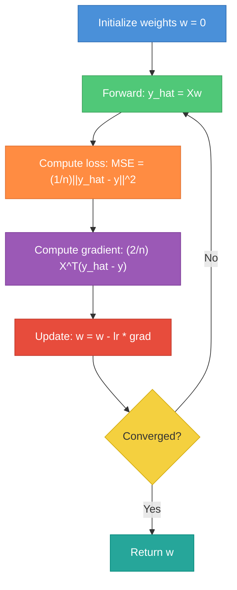
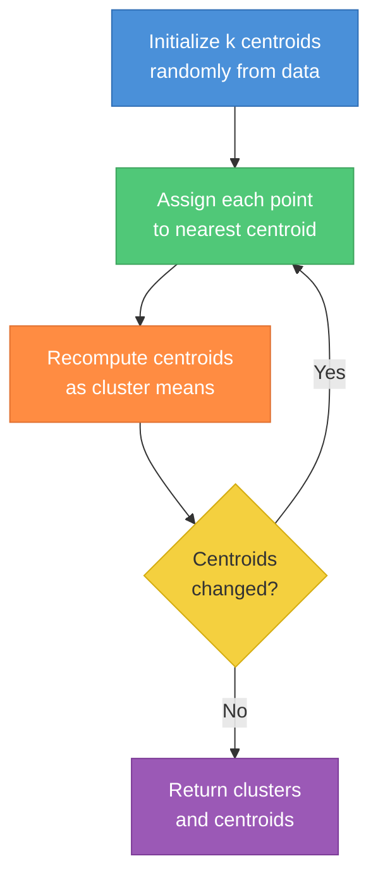
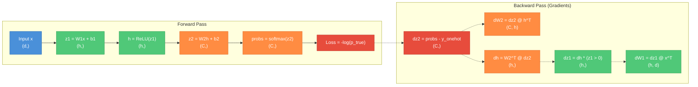
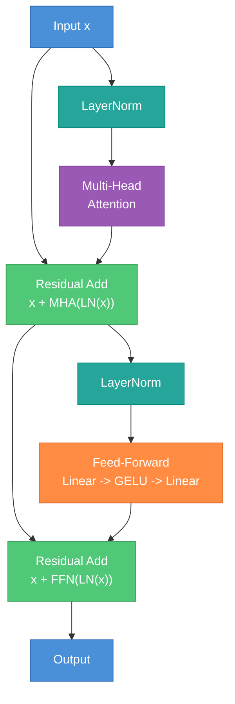
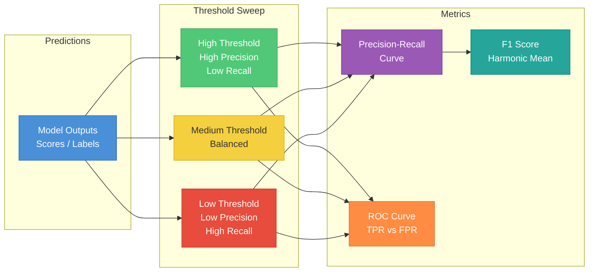
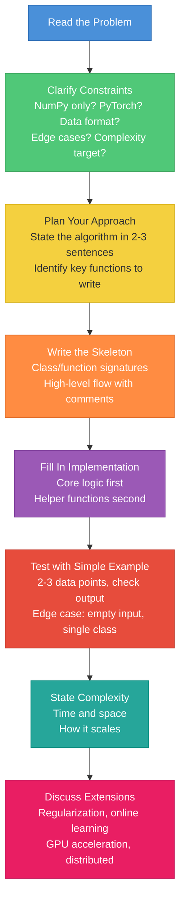

# ML Coding Patterns for Interviews

A practical study guide for the coding round of ML Engineer interviews -- where you implement algorithms from scratch on a whiteboard or shared editor. Part 1 covers from-scratch implementations using only NumPy, building the foundational algorithms every MLE candidate must be able to write cold. Part 2 moves to PyTorch implementations covering attention, transformers, training loops, and production patterns.

---

## Part 1 -- From-Scratch Implementations (NumPy Only)

---

### 1. Linear Regression

Linear regression fits a linear model y = Xw + b by minimizing the mean squared error. Interviewers expect you to know both the closed-form solution and gradient descent -- and to articulate when each is appropriate.

**Closed-form (Normal Equation)**: w = (X^T X)^{-1} X^T y. This is O(n * d^2 + d^3) where n is samples and d is features. Use when d is small (< 10k). Breaks down when X^T X is singular or when d is large.

**Gradient descent**: Iteratively update w in the direction of steepest descent. Use when d is large or when you want regularization flexibility. The gradient of MSE with respect to w is (2/n) X^T (Xw - y).

**Ridge (L2 regularization)**: Adds lambda * ||w||^2 to the loss. Closed-form becomes w = (X^T X + lambda * I)^{-1} X^T y. The regularization term also fixes the singularity problem.

```python
import numpy as np

class LinearRegression:
    def __init__(self, lr=0.01, n_iters=1000, l2_reg=0.0):
        self.lr = lr
        self.n_iters = n_iters
        self.l2_reg = l2_reg

    def fit_closed_form(self, X, y):
        """w = (X^T X + lambda*I)^{-1} X^T y"""
        X_b = np.c_[np.ones(X.shape[0]), X]  # add bias column
        reg = self.l2_reg * np.eye(X_b.shape[1])
        reg[0, 0] = 0  # don't regularize bias
        self.w = np.linalg.solve(X_b.T @ X_b + reg, X_b.T @ y)
        return self

    def fit_gradient_descent(self, X, y):
        """Gradient descent: grad = (2/n) X^T (Xw - y) + 2*lambda*w"""
        X_b = np.c_[np.ones(X.shape[0]), X]
        n = X_b.shape[0]
        self.w = np.zeros(X_b.shape[1])
        for _ in range(self.n_iters):
            residual = X_b @ self.w - y
            grad = (2 / n) * (X_b.T @ residual)
            grad[1:] += 2 * self.l2_reg * self.w[1:]  # L2 on weights only
            self.w -= self.lr * grad
        return self

    def predict(self, X):
        X_b = np.c_[np.ones(X.shape[0]), X]
        return X_b @ self.w
```



**Interview notes**: Always mention `np.linalg.solve` over `np.linalg.inv` -- solve is numerically more stable and faster. Know that gradient descent converges in O(1/epsilon) iterations for convex problems. Be ready to discuss: "When would you use closed-form vs gradient descent?" (Answer: closed-form for small d, GD for large d or online learning.)

---

### 2. Logistic Regression

Logistic regression models P(y=1|x) = sigmoid(w^T x). The loss is binary cross-entropy (log loss). There is no closed-form solution -- you must use gradient descent.

**Key insight for interviews**: The gradient of BCE with respect to w has the same form as linear regression's gradient: (1/n) X^T (y_hat - y). This is not a coincidence -- it comes from the fact that both are generalized linear models with canonical link functions.

**Sigmoid**: sigma(z) = 1 / (1 + exp(-z)). Its derivative is sigma(z) * (1 - sigma(z)).

**Binary cross-entropy**: L = -(1/n) sum[ y_i * log(y_hat_i) + (1-y_i) * log(1-y_hat_i) ]

```python
import numpy as np

class LogisticRegression:
    def __init__(self, lr=0.1, n_iters=1000, l2_reg=0.0):
        self.lr = lr
        self.n_iters = n_iters
        self.l2_reg = l2_reg

    def _sigmoid(self, z):
        # Numerically stable sigmoid
        return np.where(z >= 0,
                        1 / (1 + np.exp(-z)),
                        np.exp(z) / (1 + np.exp(z)))

    def fit(self, X, y):
        n, d = X.shape
        self.w = np.zeros(d)
        self.b = 0.0
        for _ in range(self.n_iters):
            z = X @ self.w + self.b
            y_hat = self._sigmoid(z)
            error = y_hat - y  # shape (n,)
            # Gradients: same form as linear regression
            grad_w = (1 / n) * (X.T @ error) + self.l2_reg * self.w
            grad_b = (1 / n) * np.sum(error)
            self.w -= self.lr * grad_w
            self.b -= self.lr * grad_b
        return self

    def predict_proba(self, X):
        return self._sigmoid(X @ self.w + self.b)

    def predict(self, X, threshold=0.5):
        return (self.predict_proba(X) >= threshold).astype(int)
```

**Extension -- multi-class with softmax**: Replace sigmoid with softmax, replace BCE with cross-entropy. The gradient generalizes cleanly: for each sample, grad = X^T (y_hat - y_onehot), where y_hat is the softmax output vector. See the next section for details.

---

### 3. Softmax and Cross-Entropy

These are the two most important numerical functions in ML. Interviewers will specifically test whether you know the stability tricks.

**Numerically stable softmax**: Naive exp(x_i) / sum(exp(x_j)) overflows for large x. Fix: subtract max(x) before exp. This does not change the result because exp(x_i - c) / sum(exp(x_j - c)) = exp(x_i) / sum(exp(x_j)) for any constant c.

**Cross-entropy loss**: L = -(1/n) sum_i[ sum_c y_{ic} * log(y_hat_{ic}) ]. For one-hot labels, this simplifies to L = -(1/n) sum_i log(y_hat_{i, true_class}).

**The clean gradient**: The gradient of (softmax + cross-entropy) with respect to the logits z is simply y_hat - y_onehot. This is one of the most important facts in ML -- the complex derivatives of softmax and log cancel out beautifully.

```python
import numpy as np

def softmax(z):
    """Numerically stable softmax. z shape: (n, C) or (C,)"""
    z_shifted = z - np.max(z, axis=-1, keepdims=True)
    exp_z = np.exp(z_shifted)
    return exp_z / np.sum(exp_z, axis=-1, keepdims=True)

def cross_entropy_loss(logits, y_true):
    """
    logits: (n, C) raw scores
    y_true: (n,) integer class labels
    Returns scalar loss.
    """
    n = logits.shape[0]
    probs = softmax(logits)
    # Clip to avoid log(0)
    log_probs = np.log(np.clip(probs, 1e-12, 1.0))
    loss = -np.mean(log_probs[np.arange(n), y_true])
    return loss

def softmax_cross_entropy_gradient(logits, y_true):
    """Gradient of CE loss w.r.t. logits: y_hat - y_onehot"""
    n, C = logits.shape
    probs = softmax(logits)
    grad = probs.copy()
    grad[np.arange(n), y_true] -= 1  # subtract one-hot
    return grad / n
```

**Log-sum-exp (LSE) trick**: When you need log(sum(exp(x_i))), compute it as max(x) + log(sum(exp(x_i - max(x)))). This avoids overflow in exp and underflow in log. LSE appears in computing cross-entropy from logits directly:

```python
def log_sum_exp(x, axis=-1):
    """Numerically stable log-sum-exp."""
    x_max = np.max(x, axis=axis, keepdims=True)
    return np.squeeze(x_max, axis=axis) + np.log(np.sum(np.exp(x - x_max), axis=axis))

def cross_entropy_from_logits(logits, y_true):
    """Direct CE from logits using LSE -- more stable than softmax then log."""
    n = logits.shape[0]
    lse = log_sum_exp(logits, axis=1)
    correct_logits = logits[np.arange(n), y_true]
    return np.mean(lse - correct_logits)
```

---

### 4. K-Nearest Neighbors

KNN is a non-parametric method that stores the training data and classifies new points by majority vote of the k closest training examples. No training step -- all computation happens at prediction time.

**Key implementation detail**: The bottleneck is computing pairwise distances. Naive double-loop is O(n_test * n_train * d). Vectorized approach uses the identity ||a - b||^2 = ||a||^2 + ||b||^2 - 2 * a^T b, which lets you use matrix multiplication.

```python
import numpy as np

class KNN:
    def __init__(self, k=5):
        self.k = k

    def fit(self, X, y):
        self.X_train = X
        self.y_train = y
        return self

    def _compute_distances(self, X):
        """Vectorized L2 distance: ||a-b||^2 = ||a||^2 + ||b||^2 - 2a^Tb"""
        sq_X = np.sum(X ** 2, axis=1, keepdims=True)       # (n_test, 1)
        sq_train = np.sum(self.X_train ** 2, axis=1)        # (n_train,)
        cross = X @ self.X_train.T                           # (n_test, n_train)
        dists = np.sqrt(np.maximum(sq_X + sq_train - 2 * cross, 0))
        return dists

    def predict(self, X):
        dists = self._compute_distances(X)
        k_indices = np.argpartition(dists, self.k, axis=1)[:, :self.k]
        k_labels = self.y_train[k_indices]
        # Majority vote per row
        predictions = np.array([
            np.bincount(row).argmax() for row in k_labels
        ])
        return predictions

    def predict_regression(self, X):
        dists = self._compute_distances(X)
        k_indices = np.argpartition(dists, self.k, axis=1)[:, :self.k]
        k_values = self.y_train[k_indices]
        return np.mean(k_values, axis=1)
```

**Interview notes**: Use `np.argpartition` instead of `np.argsort` for finding k-nearest -- it is O(n) instead of O(n log n). KNN complexity: O(1) training, O(n * d) prediction per query. Mention curse of dimensionality: distances become meaningless in very high dimensions.

---

### 5. K-Means Clustering

K-Means partitions n data points into k clusters by iteratively assigning points to the nearest centroid, then updating centroids to the mean of assigned points. It minimizes the within-cluster sum of squares (inertia).

**Algorithm**: (1) Initialize k centroids (random data points). (2) Assign each point to nearest centroid. (3) Recompute centroids as mean of assigned points. (4) Repeat until convergence.

```python
import numpy as np

class KMeans:
    def __init__(self, k=3, max_iters=100, tol=1e-4):
        self.k = k
        self.max_iters = max_iters
        self.tol = tol

    def fit(self, X):
        n, d = X.shape
        # Initialize centroids by choosing k random data points
        indices = np.random.choice(n, self.k, replace=False)
        self.centroids = X[indices].copy()

        for _ in range(self.max_iters):
            # Assign clusters: vectorized distance computation
            dists = np.linalg.norm(X[:, None] - self.centroids[None, :], axis=2)  # (n, k)
            self.labels = np.argmin(dists, axis=1)

            # Update centroids
            new_centroids = np.array([
                X[self.labels == j].mean(axis=0) if np.any(self.labels == j)
                else self.centroids[j]
                for j in range(self.k)
            ])

            # Check convergence
            if np.linalg.norm(new_centroids - self.centroids) < self.tol:
                break
            self.centroids = new_centroids

        return self

    def predict(self, X):
        dists = np.linalg.norm(X[:, None] - self.centroids[None, :], axis=2)
        return np.argmin(dists, axis=1)
```



**Interview notes**: K-Means converges but only to a local minimum -- initialization matters. Mention K-Means++ for better initialization (choose centroids spread apart probabilistically). Know that K-Means assumes spherical, equal-size clusters. Time complexity: O(n * k * d * iterations).

---

### 6. Decision Tree (Classification)

Decision trees recursively split the data on the feature and threshold that maximizes information gain (or equivalently, minimizes impurity in the child nodes). Interviewers love this because it tests recursion, data structures, and ML fundamentals simultaneously.

**Gini impurity**: Gini(S) = 1 - sum(p_c^2) where p_c is the proportion of class c. A pure node has Gini = 0.

**Information gain**: IG = Gini(parent) - weighted_avg(Gini(children))

```python
import numpy as np

class DecisionTree:
    def __init__(self, max_depth=10, min_samples=2):
        self.max_depth = max_depth
        self.min_samples = min_samples

    def _gini(self, y):
        if len(y) == 0:
            return 0
        counts = np.bincount(y)
        probs = counts / len(y)
        return 1 - np.sum(probs ** 2)

    def _best_split(self, X, y):
        best_gain, best_feat, best_thresh = -1, None, None
        parent_gini = self._gini(y)
        n = len(y)

        for feat in range(X.shape[1]):
            thresholds = np.unique(X[:, feat])
            for thresh in thresholds:
                left_mask = X[:, feat] <= thresh
                right_mask = ~left_mask
                if np.sum(left_mask) == 0 or np.sum(right_mask) == 0:
                    continue
                # Weighted Gini of children
                w_left = np.sum(left_mask) / n
                child_gini = (w_left * self._gini(y[left_mask])
                              + (1 - w_left) * self._gini(y[right_mask]))
                gain = parent_gini - child_gini
                if gain > best_gain:
                    best_gain = gain
                    best_feat = feat
                    best_thresh = thresh
        return best_feat, best_thresh

    def _build(self, X, y, depth):
        # Stopping conditions
        if (depth >= self.max_depth or len(y) < self.min_samples
                or len(np.unique(y)) == 1):
            return {'leaf': True, 'value': np.bincount(y).argmax()}

        feat, thresh = self._best_split(X, y)
        if feat is None:
            return {'leaf': True, 'value': np.bincount(y).argmax()}

        left_mask = X[:, feat] <= thresh
        return {
            'leaf': False,
            'feature': feat,
            'threshold': thresh,
            'left': self._build(X[left_mask], y[left_mask], depth + 1),
            'right': self._build(X[~left_mask], y[~left_mask], depth + 1),
        }

    def fit(self, X, y):
        self.tree = self._build(X, y, depth=0)
        return self

    def _predict_one(self, x, node):
        if node['leaf']:
            return node['value']
        if x[node['feature']] <= node['threshold']:
            return self._predict_one(x, node['left'])
        return self._predict_one(x, node['right'])

    def predict(self, X):
        return np.array([self._predict_one(x, self.tree) for x in X])
```

**Interview notes**: This naive implementation is O(n * d * n_thresholds) per split. In practice, sklearn sorts features once O(n log n) then scans linearly. Be ready to discuss: when to stop splitting (max_depth, min_samples_leaf, min impurity decrease), and how pruning works (grow full tree, then prune based on validation performance). Mention that random forests average many decorrelated trees (each trained on a bootstrap sample with a random subset of features).

---

### 7. PCA

PCA finds the directions of maximum variance in the data and projects onto the top-k. It is the most common dimensionality reduction technique and appears in interviews frequently.

**Algorithm**: (1) Center the data. (2) Compute covariance matrix. (3) Eigendecomposition (or SVD). (4) Project onto top-k eigenvectors.

**Two implementations**: Eigendecomposition of X^T X (d x d) vs SVD of X directly. SVD is numerically more stable and does not require forming the covariance matrix.

```python
import numpy as np

class PCA:
    def __init__(self, n_components):
        self.n_components = n_components

    def fit_eigen(self, X):
        """PCA via eigendecomposition of covariance matrix."""
        self.mean = X.mean(axis=0)
        X_centered = X - self.mean
        cov = (X_centered.T @ X_centered) / (X.shape[0] - 1)
        eigenvalues, eigenvectors = np.linalg.eigh(cov)
        # eigh returns ascending order, flip to descending
        idx = np.argsort(eigenvalues)[::-1]
        self.components = eigenvectors[:, idx[:self.n_components]].T  # (k, d)
        self.explained_variance = eigenvalues[idx[:self.n_components]]
        return self

    def fit_svd(self, X):
        """PCA via SVD -- numerically preferred."""
        self.mean = X.mean(axis=0)
        X_centered = X - self.mean
        U, S, Vt = np.linalg.svd(X_centered, full_matrices=False)
        self.components = Vt[:self.n_components]  # (k, d)
        self.explained_variance = (S[:self.n_components] ** 2) / (X.shape[0] - 1)
        return self

    def transform(self, X):
        return (X - self.mean) @ self.components.T  # (n, k)

    def inverse_transform(self, Z):
        return Z @ self.components + self.mean
```

**Interview notes**: Use `np.linalg.eigh` (not `eig`) for symmetric matrices -- it is faster and returns real eigenvalues. SVD-based PCA avoids forming the d x d covariance matrix, which matters when d is large. Know that PCA assumes linear relationships and is sensitive to feature scaling -- always standardize first. Explained variance ratio = eigenvalue_k / sum(all eigenvalues).

---

### 8. Naive Bayes

Gaussian Naive Bayes assumes features are conditionally independent given the class, and each feature follows a Gaussian distribution within each class. Despite this strong assumption, it works surprisingly well for text classification and as a baseline.

**Bayes rule**: P(y|x) proportional to P(y) * product_j P(x_j | y)

**Gaussian likelihood**: P(x_j | y=c) = (1 / sqrt(2*pi*var_jc)) * exp(-(x_j - mu_jc)^2 / (2*var_jc))

In practice, work in log space to avoid underflow: log P(y|x) = log P(y) + sum_j log P(x_j | y).

```python
import numpy as np

class GaussianNaiveBayes:
    def fit(self, X, y):
        self.classes = np.unique(y)
        n = len(y)
        self.priors = {}
        self.means = {}
        self.vars = {}

        for c in self.classes:
            X_c = X[y == c]
            self.priors[c] = len(X_c) / n
            self.means[c] = X_c.mean(axis=0)
            self.vars[c] = X_c.var(axis=0) + 1e-9  # smoothing for zero variance
        return self

    def _log_likelihood(self, X, c):
        """Log P(X | y=c) = sum_j log N(x_j; mu_jc, var_jc)"""
        mu = self.means[c]
        var = self.vars[c]
        log_probs = -0.5 * (np.log(2 * np.pi * var) + (X - mu) ** 2 / var)
        return log_probs.sum(axis=1)

    def predict(self, X):
        log_posteriors = []
        for c in self.classes:
            log_post = np.log(self.priors[c]) + self._log_likelihood(X, c)
            log_posteriors.append(log_post)
        log_posteriors = np.array(log_posteriors)  # (n_classes, n_samples)
        return self.classes[np.argmax(log_posteriors, axis=0)]

    def predict_proba(self, X):
        log_posteriors = []
        for c in self.classes:
            log_post = np.log(self.priors[c]) + self._log_likelihood(X, c)
            log_posteriors.append(log_post)
        log_posteriors = np.array(log_posteriors).T  # (n_samples, n_classes)
        # Stable softmax to convert log-posteriors to probabilities
        log_posteriors -= log_posteriors.max(axis=1, keepdims=True)
        probs = np.exp(log_posteriors)
        return probs / probs.sum(axis=1, keepdims=True)
```

**Interview notes**: The "naive" assumption (feature independence) is almost always violated, yet NB often performs well because it only needs to get the argmax right, not the exact probabilities. Laplace smoothing adds 1 to counts in multinomial NB (for text). Know that NB is a linear classifier in log space.

---

### 9. Neural Network from Scratch

This is the most commonly asked "hard" from-scratch implementation. You need to implement forward pass, backward pass (backpropagation), and a training loop. The key is getting the gradients right.

**Architecture**: Input (d) -> Hidden (h, ReLU) -> Output (C, Softmax)

**Forward pass**: z1 = W1 @ x + b1, h = relu(z1), z2 = W2 @ h + b2, probs = softmax(z2)

**Backward pass**: Start from the loss gradient and chain backward. The softmax + cross-entropy gradient is (probs - y_onehot). Then backprop through W2, the ReLU, and W1.



```python
import numpy as np

class TwoLayerNet:
    def __init__(self, d_in, d_hidden, d_out, lr=0.01):
        # He initialization
        self.W1 = np.random.randn(d_hidden, d_in) * np.sqrt(2.0 / d_in)
        self.b1 = np.zeros(d_hidden)
        self.W2 = np.random.randn(d_out, d_hidden) * np.sqrt(2.0 / d_hidden)
        self.b2 = np.zeros(d_out)
        self.lr = lr

    def _softmax(self, z):
        z -= z.max(axis=1, keepdims=True)
        e = np.exp(z)
        return e / e.sum(axis=1, keepdims=True)

    def forward(self, X):
        """X shape: (batch, d_in)"""
        self.X = X
        self.z1 = X @ self.W1.T + self.b1           # (batch, hidden)
        self.h = np.maximum(0, self.z1)               # ReLU
        self.z2 = self.h @ self.W2.T + self.b2       # (batch, out)
        self.probs = self._softmax(self.z2)            # (batch, out)
        return self.probs

    def compute_loss(self, y):
        """y: integer labels (batch,). Returns cross-entropy loss."""
        n = len(y)
        log_probs = np.log(np.clip(self.probs[np.arange(n), y], 1e-12, 1.0))
        return -np.mean(log_probs)

    def backward(self, y):
        """Backpropagation. Computes gradients and updates weights."""
        n = len(y)

        # Output layer gradient: softmax + CE gives (probs - one_hot)
        dz2 = self.probs.copy()
        dz2[np.arange(n), y] -= 1
        dz2 /= n  # (batch, out)

        dW2 = dz2.T @ self.h              # (out, hidden)
        db2 = dz2.sum(axis=0)             # (out,)

        # Hidden layer gradient
        dh = dz2 @ self.W2                 # (batch, hidden)
        dz1 = dh * (self.z1 > 0)          # ReLU backward

        dW1 = dz1.T @ self.X              # (hidden, d_in)
        db1 = dz1.sum(axis=0)             # (hidden,)

        # SGD update
        self.W2 -= self.lr * dW2
        self.b2 -= self.lr * db2
        self.W1 -= self.lr * dW1
        self.b1 -= self.lr * db1

    def train(self, X, y, epochs=100, batch_size=32):
        n = len(y)
        for epoch in range(epochs):
            # Shuffle
            perm = np.random.permutation(n)
            X_shuf, y_shuf = X[perm], y[perm]
            for i in range(0, n, batch_size):
                X_batch = X_shuf[i:i+batch_size]
                y_batch = y_shuf[i:i+batch_size]
                self.forward(X_batch)
                self.backward(y_batch)

    def predict(self, X):
        probs = self.forward(X)
        return np.argmax(probs, axis=1)
```

**Interview notes**: He initialization (sqrt(2/fan_in)) is critical for ReLU networks -- without it, activations explode or vanish. The ReLU backward pass is simply masking by (z1 > 0). Know that the full gradient derivation: dL/dW2 = dL/dz2 * dz2/dW2 = (probs - y_onehot)^T @ h. Be ready to extend: add dropout (multiply activations by random mask and scale), add batch norm, add momentum to SGD.

---

### 10. Common Numerical Patterns

These patterns appear across many implementations. Interviewers may ask them directly or expect you to use them within a larger implementation.

**Numerically stable sigmoid**: The standard formula 1/(1+exp(-z)) overflows for large negative z. Use a piecewise approach:

```python
import numpy as np

def stable_sigmoid(z):
    """For z >= 0: 1/(1+exp(-z)). For z < 0: exp(z)/(1+exp(z))."""
    return np.where(z >= 0,
                    1 / (1 + np.exp(-z)),
                    np.exp(z) / (1 + np.exp(z)))
```

**Vectorized pairwise distance matrix**: Compute all pairwise L2 distances between two sets of points without loops:

```python
def pairwise_distances(A, B):
    """
    A: (n, d), B: (m, d)
    Returns: (n, m) distance matrix.
    Uses ||a-b||^2 = ||a||^2 + ||b||^2 - 2*a^T*b
    """
    sq_A = np.sum(A ** 2, axis=1, keepdims=True)  # (n, 1)
    sq_B = np.sum(B ** 2, axis=1)                   # (m,)
    dist_sq = sq_A + sq_B - 2 * (A @ B.T)
    return np.sqrt(np.maximum(dist_sq, 0))  # clip negatives from numerical error
```

**Batch matrix operations with einsum**: Einstein summation is the most flexible way to express tensor operations. It handles batched matmul, outer products, traces, and more in a single readable call:

```python
# Batched matrix multiply: (B, n, d) @ (B, d, m) -> (B, n, m)
C = np.einsum('bnd,bdm->bnm', A, B)

# Dot product of each row pair: (n, d) . (n, d) -> (n,)
dots = np.einsum('nd,nd->n', A, B)

# Outer product: (n,) x (m,) -> (n, m)
outer = np.einsum('n,m->nm', a, b)

# Trace of a matrix: (d, d) -> scalar
tr = np.einsum('dd->', A)

# Weighted sum of rows: weights (n,) @ matrix (n, d) -> (d,)
weighted = np.einsum('n,nd->d', weights, X)
```

**Log-sum-exp** (also covered in Section 3):

```python
def log_sum_exp(x, axis=-1):
    c = np.max(x, axis=axis, keepdims=True)
    return np.squeeze(c, axis=axis) + np.log(np.sum(np.exp(x - c), axis=axis))
```

**Binary search for threshold tuning**: When you need to find the optimal threshold for a binary classifier given a metric constraint:

```python
def find_threshold(y_true, y_scores, target_recall=0.95):
    """Find the highest threshold that achieves at least target_recall."""
    thresholds = np.sort(np.unique(y_scores))[::-1]
    for t in thresholds:
        preds = (y_scores >= t).astype(int)
        recall = np.sum((preds == 1) & (y_true == 1)) / np.sum(y_true == 1)
        if recall >= target_recall:
            return t
    return thresholds[-1]
```

---

## Part 2 -- PyTorch Implementations

---

### 11. Scaled Dot-Product Attention

Attention is the core operation in transformers. The formula is Attention(Q, K, V) = softmax(QK^T / sqrt(d_k)) V. The scaling by sqrt(d_k) prevents the dot products from growing large and pushing softmax into regions with tiny gradients.

```python
import torch
import torch.nn as nn
import torch.nn.functional as F
import math

def scaled_dot_product_attention(Q, K, V, mask=None):
    """
    Q: (batch, seq_q, d_k)
    K: (batch, seq_k, d_k)
    V: (batch, seq_k, d_v)
    mask: (batch, seq_q, seq_k) or broadcastable -- True means IGNORE
    Returns: (batch, seq_q, d_v), attention weights (batch, seq_q, seq_k)
    """
    d_k = Q.size(-1)
    scores = Q @ K.transpose(-2, -1) / math.sqrt(d_k)  # (batch, seq_q, seq_k)
    if mask is not None:
        scores = scores.masked_fill(mask, float('-inf'))
    attn_weights = F.softmax(scores, dim=-1)
    output = attn_weights @ V  # (batch, seq_q, d_v)
    return output, attn_weights
```

**Interview notes**: The mask is critical. Causal (autoregressive) attention uses a lower-triangular mask so position i can only attend to positions <= i. Padding mask prevents attending to pad tokens. Know that attention is O(n^2 * d) in compute and O(n^2) in memory, where n is sequence length.

---

### 12. Multi-Head Attention

Multi-head attention runs h parallel attention functions on d/h-dimensional projections, then concatenates and projects. This lets the model jointly attend to information from different representation subspaces.

```python
class MultiHeadAttention(nn.Module):
    def __init__(self, d_model, n_heads):
        super().__init__()
        assert d_model % n_heads == 0
        self.d_model = d_model
        self.n_heads = n_heads
        self.d_k = d_model // n_heads

        self.W_q = nn.Linear(d_model, d_model)
        self.W_k = nn.Linear(d_model, d_model)
        self.W_v = nn.Linear(d_model, d_model)
        self.W_o = nn.Linear(d_model, d_model)

    def forward(self, Q, K, V, mask=None):
        batch = Q.size(0)

        # Project and reshape: (batch, seq, d_model) -> (batch, n_heads, seq, d_k)
        Q = self.W_q(Q).view(batch, -1, self.n_heads, self.d_k).transpose(1, 2)
        K = self.W_k(K).view(batch, -1, self.n_heads, self.d_k).transpose(1, 2)
        V = self.W_v(V).view(batch, -1, self.n_heads, self.d_k).transpose(1, 2)

        # Expand mask for heads: (batch, 1, seq_q, seq_k)
        if mask is not None:
            mask = mask.unsqueeze(1)

        # Scaled dot-product attention per head
        scores = Q @ K.transpose(-2, -1) / math.sqrt(self.d_k)
        if mask is not None:
            scores = scores.masked_fill(mask, float('-inf'))
        attn = F.softmax(scores, dim=-1)
        out = attn @ V  # (batch, n_heads, seq, d_k)

        # Concatenate heads and project
        out = out.transpose(1, 2).contiguous().view(batch, -1, self.d_model)
        return self.W_o(out)
```

**Interview notes**: The key reshape is (batch, seq, d_model) -> (batch, n_heads, seq, d_k). The .contiguous() call before .view() is necessary because transpose does not change memory layout. Total parameters: 4 * d_model^2 (three projections in + one out).

---

### 13. Transformer Block

A transformer block combines multi-head attention with a feed-forward network, using residual connections and layer normalization. The "Pre-LN" variant (norm before attention/FFN) is more stable during training and is the modern default.



```python
class TransformerBlock(nn.Module):
    def __init__(self, d_model, n_heads, d_ff, dropout=0.1):
        super().__init__()
        self.attn = MultiHeadAttention(d_model, n_heads)
        self.ffn = nn.Sequential(
            nn.Linear(d_model, d_ff),
            nn.GELU(),
            nn.Linear(d_ff, d_model),
        )
        self.norm1 = nn.LayerNorm(d_model)
        self.norm2 = nn.LayerNorm(d_model)
        self.dropout = nn.Dropout(dropout)

    def forward(self, x, mask=None):
        # Pre-LN: norm before attention/FFN
        attn_out = self.attn(self.norm1(x), self.norm1(x), self.norm1(x), mask)
        x = x + self.dropout(attn_out)
        ffn_out = self.ffn(self.norm2(x))
        x = x + self.dropout(ffn_out)
        return x
```

**Interview notes**: Pre-LN (norm inside residual) vs Post-LN (norm after residual). Pre-LN is easier to train (no warmup needed) but Post-LN can achieve slightly better final performance with careful tuning. d_ff is typically 4 * d_model. GELU is preferred over ReLU in modern transformers. Total FFN params: 2 * d_model * d_ff.

---

### 14. Training Loop

A production-quality training loop includes mixed precision, gradient clipping, learning rate scheduling, and proper evaluation. This is the kind of code you write in every ML project.

```python
import torch
import torch.nn as nn
from torch.cuda.amp import autocast, GradScaler

def train(model, train_loader, val_loader, epochs=10, lr=3e-4, max_grad_norm=1.0):
    optimizer = torch.optim.AdamW(model.parameters(), lr=lr, weight_decay=0.01)
    scheduler = torch.optim.lr_scheduler.CosineAnnealingLR(optimizer, T_max=epochs)
    scaler = GradScaler()
    criterion = nn.CrossEntropyLoss()
    device = next(model.parameters()).device

    for epoch in range(epochs):
        model.train()
        total_loss = 0

        for batch in train_loader:
            x, y = batch[0].to(device), batch[1].to(device)

            with autocast():
                logits = model(x)
                loss = criterion(logits, y)

            optimizer.zero_grad()
            scaler.scale(loss).backward()
            scaler.unscale_(optimizer)
            torch.nn.utils.clip_grad_norm_(model.parameters(), max_grad_norm)
            scaler.step(optimizer)
            scaler.update()
            total_loss += loss.item()

        scheduler.step()

        # Validation
        model.eval()
        correct, total = 0, 0
        with torch.no_grad():
            for batch in val_loader:
                x, y = batch[0].to(device), batch[1].to(device)
                logits = model(x)
                correct += (logits.argmax(1) == y).sum().item()
                total += len(y)

        print(f"Epoch {epoch+1}: loss={total_loss/len(train_loader):.4f}, "
              f"val_acc={correct/total:.4f}, lr={scheduler.get_last_lr()[0]:.6f}")
```

**Interview notes**: The order matters -- zero_grad before backward, unscale before clip, step before update. Mixed precision uses float16 for forward/backward (faster, less memory) and float32 for weight updates (precision). GradScaler handles loss scaling to prevent underflow in float16 gradients. Gradient clipping prevents exploding gradients -- essential for transformers and RNNs.

---

### 15. Custom Dataset and DataLoader

Implementing a custom Dataset is a common interview task, especially for NLP where you need to handle variable-length sequences with padding.

```python
import torch
from torch.utils.data import Dataset, DataLoader

class TextClassificationDataset(Dataset):
    def __init__(self, texts, labels, vocab, max_len=128):
        self.texts = texts      # list of token-id lists
        self.labels = labels    # list of int labels
        self.vocab = vocab
        self.max_len = max_len
        self.pad_id = vocab.get('<PAD>', 0)

    def __len__(self):
        return len(self.texts)

    def __getitem__(self, idx):
        tokens = self.texts[idx][:self.max_len]
        label = self.labels[idx]
        return torch.tensor(tokens, dtype=torch.long), torch.tensor(label)

def collate_fn(batch):
    """Pad variable-length sequences to the longest in the batch."""
    tokens_list, labels = zip(*batch)
    max_len = max(len(t) for t in tokens_list)
    padded = torch.zeros(len(batch), max_len, dtype=torch.long)
    mask = torch.ones(len(batch), max_len, dtype=torch.bool)  # True = pad
    for i, tokens in enumerate(tokens_list):
        padded[i, :len(tokens)] = tokens
        mask[i, :len(tokens)] = False
    labels = torch.stack(labels)
    return padded, labels, mask

# Usage:
# loader = DataLoader(dataset, batch_size=32, shuffle=True, collate_fn=collate_fn)
```

**Interview notes**: The collate function is where padding happens -- not in __getitem__. This way, each batch is padded to its own max length rather than a global max, which is more efficient. The attention mask is True for positions to ignore (pad tokens). For very long sequences, consider bucketing (grouping similar-length sequences together) to minimize padding waste.

---

### 16. Common PyTorch Patterns

These operations come up repeatedly in model implementations. Knowing them by heart saves time in interviews.

**torch.gather** -- select elements along a dimension using index tensor:

```python
# Select the logit corresponding to each true label
# logits: (batch, n_classes), labels: (batch,)
selected = torch.gather(logits, dim=1, index=labels.unsqueeze(1))  # (batch, 1)

# Equivalent to: logits[torch.arange(batch), labels]
# gather is useful when you need the operation to be differentiable
# and work with arbitrary index patterns
```

**torch.scatter** -- the inverse of gather, writes values into specific positions:

```python
# Create one-hot encoding
# labels: (batch,), n_classes: int
one_hot = torch.zeros(batch, n_classes).scatter_(1, labels.unsqueeze(1), 1.0)
```

**torch.einsum** -- flexible tensor contractions:

```python
# Batched matrix multiply
out = torch.einsum('bik,bkj->bij', A, B)

# Attention scores: (batch, heads, seq_q, d) x (batch, heads, seq_k, d) -> (batch, heads, seq_q, seq_k)
scores = torch.einsum('bhqd,bhkd->bhqk', Q, K)

# Bilinear: x^T W y for batched vectors
out = torch.einsum('bi,ijk,bk->bj', x, W, y)
```

**Masked operations** -- applying masks to loss, attention, and metrics:

```python
# Masked loss: ignore padding tokens in language modeling
logits = model(input_ids)  # (batch, seq, vocab)
loss_fn = nn.CrossEntropyLoss(reduction='none')
per_token_loss = loss_fn(logits.view(-1, vocab_size), targets.view(-1))
per_token_loss = per_token_loss.view(batch, seq)
mask = (targets != pad_id).float()
loss = (per_token_loss * mask).sum() / mask.sum()
```

**Gradient checkpointing** -- trade compute for memory:

```python
from torch.utils.checkpoint import checkpoint

class MemoryEfficientModel(nn.Module):
    def __init__(self, n_layers):
        super().__init__()
        self.layers = nn.ModuleList([TransformerBlock(...) for _ in range(n_layers)])

    def forward(self, x):
        for layer in self.layers:
            # Recompute activations during backward instead of storing them
            x = checkpoint(layer, x, use_reentrant=False)
        return x
```

**Interview notes**: Gradient checkpointing reduces memory from O(n_layers) to O(sqrt(n_layers)) at the cost of ~33% more compute. It is essential for training large transformer models. The `use_reentrant=False` flag is the modern default and handles non-deterministic ops correctly.

---

### 17. Evaluation Metrics from Scratch

Being able to implement metrics from scratch shows you understand what they measure, not just how to call sklearn.

**Precision, Recall, F1**:

```python
import numpy as np

def precision_recall_f1(y_true, y_pred, average='macro'):
    """
    Compute precision, recall, F1.
    average: 'macro' (average per-class) or 'micro' (global TP/FP/FN)
    """
    classes = np.unique(np.concatenate([y_true, y_pred]))

    if average == 'micro':
        tp = np.sum(y_true == y_pred)
        total_pred = len(y_pred)
        total_true = len(y_true)
        precision = tp / total_pred if total_pred > 0 else 0
        recall = tp / total_true if total_true > 0 else 0
    else:  # macro
        precisions, recalls = [], []
        for c in classes:
            tp = np.sum((y_pred == c) & (y_true == c))
            fp = np.sum((y_pred == c) & (y_true != c))
            fn = np.sum((y_pred != c) & (y_true == c))
            precisions.append(tp / (tp + fp) if (tp + fp) > 0 else 0)
            recalls.append(tp / (tp + fn) if (tp + fn) > 0 else 0)
        precision = np.mean(precisions)
        recall = np.mean(recalls)

    f1 = 2 * precision * recall / (precision + recall) if (precision + recall) > 0 else 0
    return precision, recall, f1
```

**AUC-ROC**:

```python
def auc_roc(y_true, y_scores):
    """Compute AUC-ROC by trapezoidal integration of TPR vs FPR curve."""
    # Sort by descending score
    desc_idx = np.argsort(y_scores)[::-1]
    y_sorted = y_true[desc_idx]

    # Compute TPR and FPR at each threshold
    tps = np.cumsum(y_sorted == 1)
    fps = np.cumsum(y_sorted == 0)
    tpr = tps / np.sum(y_true == 1)
    fpr = fps / np.sum(y_true == 0)

    # Prepend (0,0) for the curve
    tpr = np.r_[0, tpr]
    fpr = np.r_[0, fpr]

    # Trapezoidal rule
    auc = np.trapz(tpr, fpr)
    return auc
```

**NDCG (Normalized Discounted Cumulative Gain)** for ranking:

```python
def ndcg_at_k(relevances, k):
    """
    relevances: list of relevance scores in the order returned by the model.
    k: cutoff position.
    """
    relevances = np.array(relevances[:k])
    # DCG
    discounts = np.log2(np.arange(2, len(relevances) + 2))
    dcg = np.sum(relevances / discounts)
    # Ideal DCG
    ideal = np.sort(relevances)[::-1]
    idcg = np.sum(ideal / discounts)
    return dcg / idcg if idcg > 0 else 0
```



**Interview notes**: Micro-average treats all samples equally (dominated by majority class). Macro-average treats all classes equally (better for imbalanced data). AUC-ROC = probability that a random positive is scored higher than a random negative. For highly imbalanced data, use AUC-PR (precision-recall) instead of AUC-ROC.

---

### 18. End-to-End Mini-Projects

These are the kinds of "build it in 45 minutes" tasks that appear in ML coding interviews. Each one combines multiple patterns from above.

**Mini-project 1: Logistic Regression on MNIST (NumPy)**

```python
import numpy as np

def mnist_logistic_regression(X_train, y_train, X_test, y_test,
                               lr=0.1, epochs=50, batch_size=128):
    """
    X_train: (60000, 784), y_train: (60000,) with values 0-9
    Implements multi-class logistic regression (softmax regression).
    """
    n, d = X_train.shape
    C = 10
    W = np.zeros((d, C))
    b = np.zeros(C)

    for epoch in range(epochs):
        perm = np.random.permutation(n)
        for i in range(0, n, batch_size):
            X_b = X_train[perm[i:i+batch_size]]
            y_b = y_train[perm[i:i+batch_size]]
            m = len(y_b)

            # Forward: softmax
            logits = X_b @ W + b
            logits -= logits.max(axis=1, keepdims=True)
            exp_l = np.exp(logits)
            probs = exp_l / exp_l.sum(axis=1, keepdims=True)

            # Gradient: (probs - one_hot)
            probs[np.arange(m), y_b] -= 1
            grad_W = (X_b.T @ probs) / m
            grad_b = probs.mean(axis=0)

            W -= lr * grad_W
            b -= lr * grad_b

        # Evaluate
        logits = X_test @ W + b
        acc = np.mean(np.argmax(logits, axis=1) == y_test)
        print(f"Epoch {epoch+1}: test_acc={acc:.4f}")

    return W, b
```

**Mini-project 2: Transformer for Sequence Classification (PyTorch)**

```python
import torch
import torch.nn as nn
import math

class PositionalEncoding(nn.Module):
    def __init__(self, d_model, max_len=512):
        super().__init__()
        pe = torch.zeros(max_len, d_model)
        pos = torch.arange(max_len).unsqueeze(1).float()
        div = torch.exp(torch.arange(0, d_model, 2).float() * (-math.log(10000.0) / d_model))
        pe[:, 0::2] = torch.sin(pos * div)
        pe[:, 1::2] = torch.cos(pos * div)
        self.register_buffer('pe', pe.unsqueeze(0))  # (1, max_len, d_model)

    def forward(self, x):
        return x + self.pe[:, :x.size(1)]

class TransformerClassifier(nn.Module):
    def __init__(self, vocab_size, d_model=128, n_heads=4, n_layers=2,
                 d_ff=256, n_classes=2, max_len=512, dropout=0.1):
        super().__init__()
        self.embedding = nn.Embedding(vocab_size, d_model)
        self.pos_enc = PositionalEncoding(d_model, max_len)
        self.layers = nn.ModuleList([
            TransformerBlock(d_model, n_heads, d_ff, dropout)
            for _ in range(n_layers)
        ])
        self.classifier = nn.Linear(d_model, n_classes)
        self.dropout = nn.Dropout(dropout)

    def forward(self, input_ids, mask=None):
        x = self.dropout(self.pos_enc(self.embedding(input_ids)))
        # Convert padding mask (batch, seq) to attention mask (batch, 1, seq)
        if mask is not None:
            attn_mask = mask.unsqueeze(1).expand(-1, input_ids.size(1), -1)
        else:
            attn_mask = None
        for layer in self.layers:
            x = layer(x, attn_mask)
        # Pool: mean of non-padded tokens
        if mask is not None:
            lengths = (~mask).sum(dim=1, keepdim=True).float()
            x = (x * (~mask).unsqueeze(-1).float()).sum(dim=1) / lengths
        else:
            x = x.mean(dim=1)
        return self.classifier(x)
```

**Mini-project 3: KNN Anomaly Detection (NumPy)**

```python
import numpy as np

def knn_anomaly_detection(X_train, X_test, k=5, threshold_percentile=95):
    """
    Anomaly score = mean distance to k nearest neighbors in training set.
    Points with score above the threshold are anomalies.
    """
    # Pairwise distances between test and train
    sq_test = np.sum(X_test ** 2, axis=1, keepdims=True)
    sq_train = np.sum(X_train ** 2, axis=1)
    dists = np.sqrt(np.maximum(sq_test + sq_train - 2 * X_test @ X_train.T, 0))

    # k nearest distances
    k_nearest_idx = np.argpartition(dists, k, axis=1)[:, :k]
    k_dists = np.take_along_axis(dists, k_nearest_idx, axis=1)
    anomaly_scores = k_dists.mean(axis=1)

    # Threshold from training data's own scores
    sq_tt = np.sum(X_train ** 2, axis=1, keepdims=True)
    train_dists = np.sqrt(np.maximum(sq_tt + sq_train - 2 * X_train @ X_train.T, 0))
    np.fill_diagonal(train_dists, np.inf)  # exclude self-distance
    train_k_idx = np.argpartition(train_dists, k, axis=1)[:, :k]
    train_k_dists = np.take_along_axis(train_dists, train_k_idx, axis=1)
    train_scores = train_k_dists.mean(axis=1)
    threshold = np.percentile(train_scores, threshold_percentile)

    is_anomaly = anomaly_scores > threshold
    return anomaly_scores, is_anomaly, threshold
```

---

### 19. Interview Tips for Coding Rounds



**Before coding:**

1. **Clarify the problem**. Ask: "Can I use numpy? PyTorch? What format is the data in? How large is the dataset?" These are not filler questions -- they determine your implementation strategy.

2. **State your approach**. "I'll implement gradient descent logistic regression. The key steps are: sigmoid forward pass, binary cross-entropy loss, gradient computation, and weight update. Time complexity will be O(n * d * iterations)."

3. **Write the skeleton first**. Class name, method signatures, docstrings with shapes. This shows organization and lets the interviewer follow along.

**While coding:**

4. **Talk through your code**. "Here I'm using the stable softmax trick -- subtracting the max before exp to prevent overflow." Interviewers are evaluating your understanding, not just your typing.

5. **Handle shapes explicitly**. Comment shapes at key points: `# (batch, d) @ (d, C) -> (batch, C)`. Shape mismatches are the number one source of bugs.

6. **Use vectorized operations**. Never write a for-loop over data points when numpy broadcasting works. This is a strong signal of experience.

**After coding:**

7. **Test with a tiny example**. Create 3-5 data points, run through your code mentally or on paper. Check that the output makes sense.

8. **State complexity**. Time and space. "Training is O(n * d * T) where T is iterations. Prediction is O(d) per sample."

9. **Discuss extensions**. "I could add L2 regularization by adding lambda * ||w||^2 to the loss. For large-scale data, I'd switch to mini-batch SGD."

**Common pitfalls to avoid:**

- Forgetting to add bias (the +1 column or separate b term)
- Not handling numerical stability (sigmoid overflow, log(0))
- Writing loops where broadcasting works
- Mixing up matrix multiplication dimensions
- Forgetting to normalize (divide by n for average loss)
- Not initializing weights properly (zeros for linear, He for ReLU)

---

### 20. Practice Problems Checklist

**Easy (10-15 minutes each) -- warm-up problems:**

| Problem | Key Insight | Target Time |
|---|---|---|
| Implement sigmoid | Use piecewise formula for stability | 3 min |
| Implement softmax | Subtract max before exp | 5 min |
| Compute L2 distance matrix | Use ||a-b||^2 = ||a||^2 + ||b||^2 - 2a^Tb | 5 min |
| Implement cross-entropy loss | Clip probabilities to avoid log(0) | 5 min |
| Implement accuracy, precision, recall | Handle zero-division edge cases | 10 min |
| One-hot encoding | np.eye(n_classes)[labels] or scatter | 3 min |
| Implement log-sum-exp | Subtract max for stability | 5 min |
| Batch normalization forward pass | (x - mean) / sqrt(var + eps) * gamma + beta | 10 min |

**Medium (15-25 minutes each) -- core interview problems:**

| Problem | Key Insight | Target Time |
|---|---|---|
| Logistic regression with GD | Gradient is X^T(sigmoid(Xw) - y) | 15 min |
| K-Nearest Neighbors | Use argpartition, not argsort | 15 min |
| K-Means clustering | Vectorize distance computation | 15 min |
| PCA (SVD-based) | Center data, SVD, take top-k rows of V^T | 15 min |
| Gaussian Naive Bayes | Work in log-space, smooth variance | 20 min |
| AUC-ROC from scratch | Sort by score, cumsum for TPR/FPR | 20 min |
| Scaled dot-product attention | Mask before softmax, scale by sqrt(d_k) | 15 min |
| Custom Dataset + collate_fn | Padding happens in collate, not __getitem__ | 15 min |
| Mini-batch gradient descent loop | Shuffle, slice, accumulate | 15 min |

**Hard (25-45 minutes each) -- differentiating problems:**

| Problem | Key Insight | Target Time |
|---|---|---|
| 2-layer neural net with backprop | Chain rule: softmax+CE grad is (probs - one_hot) | 35 min |
| Decision tree (classification) | Recursion + Gini impurity + stopping conditions | 35 min |
| Multi-head attention | Reshape to (batch, heads, seq, d_k), concat back | 25 min |
| Full transformer block | Pre-LN + residual connections + FFN | 30 min |
| Training loop with AMP + clipping | Order: zero_grad, forward, scale, backward, unscale, clip, step | 25 min |
| MNIST softmax regression (numpy) | Vectorized batch gradient over 10 classes | 25 min |
| Transformer classifier end-to-end | Embedding + positional encoding + pooling + classifier head | 40 min |
| Implement AdamW optimizer | Maintain m, v buffers; decoupled weight decay | 30 min |

**How to use this list**: Start with Easy to warm up and build confidence. Spend most practice time on Medium -- these are the most likely interview problems. Do Hard problems to prepare for top-tier companies (FAANG, top AI labs). Time yourself. If you cannot finish within 1.5x the target time, review the solution and redo it the next day.

---

### Quick Reference Card

**Gradients you must know by heart:**

| Model | Loss | Gradient w.r.t. weights |
|---|---|---|
| Linear regression | MSE | (2/n) X^T (Xw - y) |
| Logistic regression | BCE | (1/n) X^T (sigmoid(Xw) - y) |
| Softmax regression | Cross-entropy | (1/n) X^T (softmax(Xw) - Y_onehot) |
| 2-layer net, W2 | Cross-entropy | (1/n) (probs - Y_onehot)^T @ h |
| 2-layer net, W1 | Cross-entropy | (1/n) (W2^T @ dz2 * relu_mask)^T @ X |

**Numerical stability patterns:**

| Problem | Solution |
|---|---|
| exp overflow in softmax | Subtract max before exp |
| log(0) in cross-entropy | Clip probabilities: max(p, 1e-12) |
| sigmoid overflow | Piecewise: use exp(z)/(1+exp(z)) for z < 0 |
| log-sum-exp overflow | Factor out max: max + log(sum(exp(x - max))) |
| Distance computation underflow | Clip squared distances to >= 0 before sqrt |

**Complexity cheat sheet:**

| Algorithm | Training | Prediction |
|---|---|---|
| Linear regression (closed-form) | O(nd^2 + d^3) | O(d) |
| Linear/logistic regression (GD) | O(ndT) | O(d) |
| KNN | O(1) | O(nd) per query |
| K-Means | O(nkdT) | O(kd) |
| Decision tree | O(nd * n_thresholds * depth) | O(depth) |
| PCA | O(min(nd^2, n^2d)) | O(dk) |
| Naive Bayes | O(nd) | O(Cd) |
| Attention | O(n^2 d) | O(n^2 d) |
