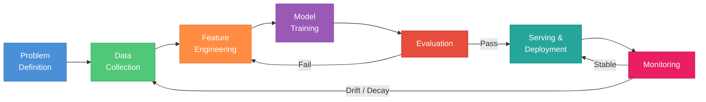
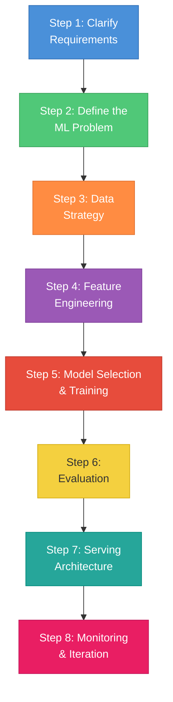
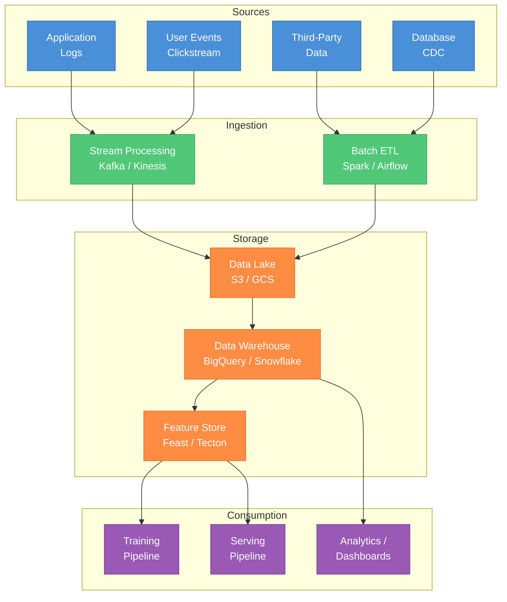
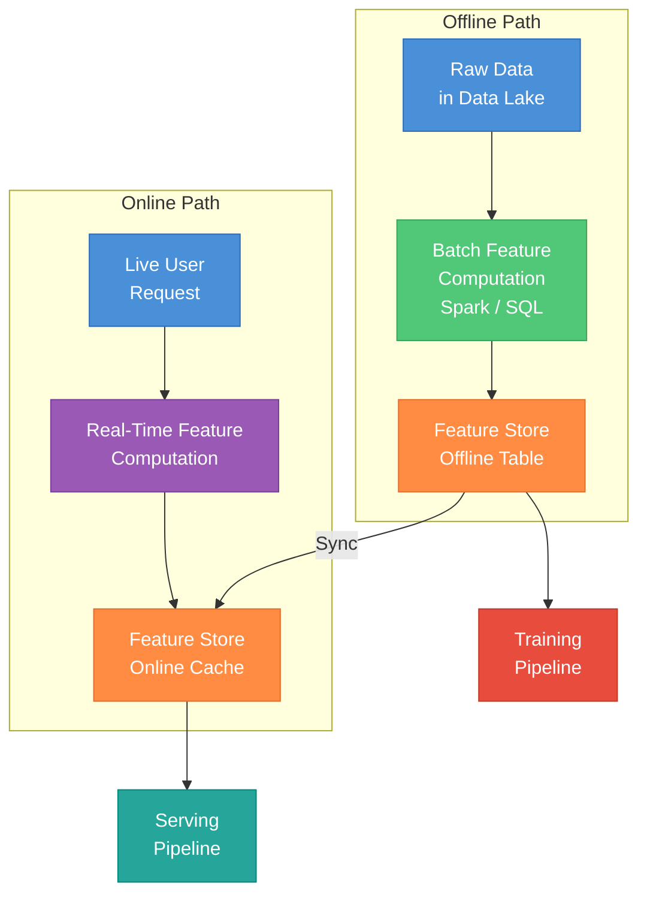
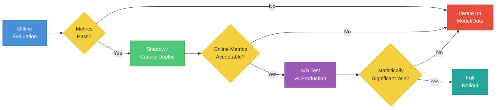
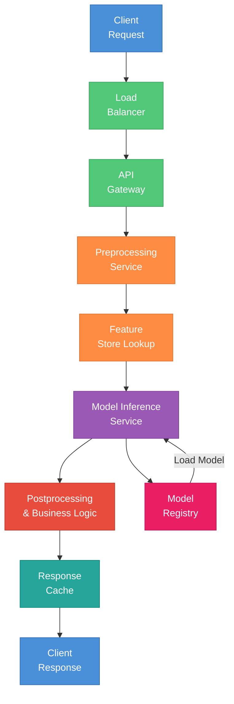
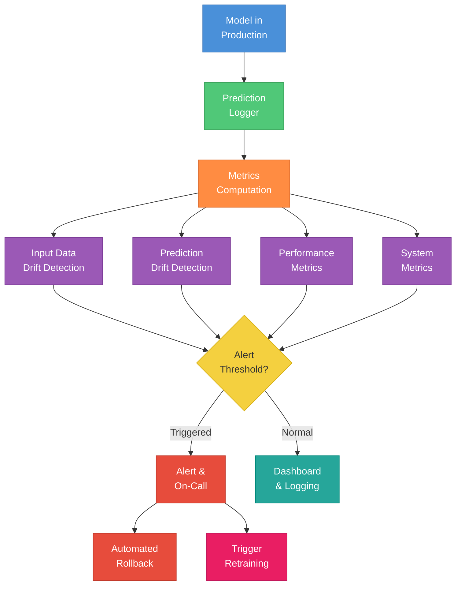
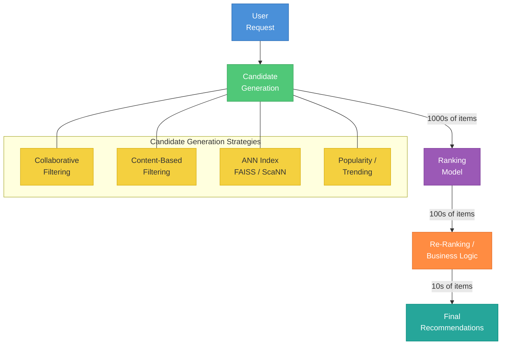
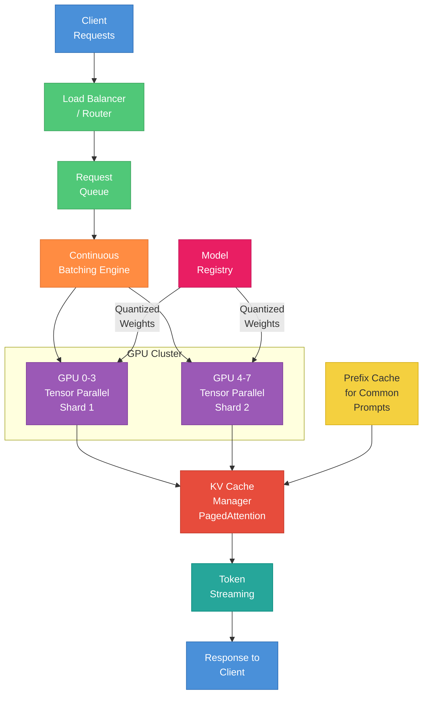
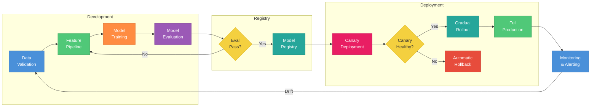

# ML System Design for ML Interviews

A comprehensive study guide covering the full spectrum of ML system design -- from foundational concepts to advanced patterns and worked interview examples.

---

## Part 1 -- Foundations

---

### 1. What is ML System Design?

ML system design interviews evaluate your ability to build **end-to-end machine learning systems**, not just train a model. Unlike traditional software system design (which focuses on APIs, databases, and scaling), ML system design requires you to reason about:

| Dimension | Traditional System Design | ML System Design |
|---|---|---|
| Core artifact | Code / services | Model + code + data |
| Correctness | Deterministic logic | Probabilistic outputs |
| Testing | Unit/integration tests | Offline metrics + A/B tests |
| Failure modes | Crashes, timeouts | Silent degradation, drift |
| Iteration | Deploy new code | Retrain, re-evaluate, re-deploy |
| Data dependency | Reads/writes data | Data IS the system |

The key insight: **an ML system is a software system where the central component (the model) is learned from data rather than explicitly programmed**. This means data quality, feature pipelines, evaluation, and monitoring are first-class concerns -- not afterthoughts.

#### The ML Lifecycle

Every ML system follows this lifecycle. Understanding it is the single most important foundation for the interview.

**Key takeaway for interviews**: Always think in loops, not lines. Models degrade, data shifts, and requirements evolve. Your system must handle continuous iteration.

---

### 2. The Framework -- How to Approach Any ML System Design Question

Use this 8-step framework for every ML system design question. It keeps you structured and ensures you cover all the areas interviewers care about.

#### Step 1: Clarify Requirements (3-5 minutes)

Before designing anything, ask clarifying questions. This shows maturity and prevents wasted effort.

**Functional requirements** -- What does the system do?
- What is the user-facing behavior? (e.g., "show 10 recommended videos")
- What inputs does the system receive? (e.g., user ID, query text, image)
- What outputs does it produce? (e.g., ranked list, binary decision, generated text)

**Non-functional requirements** -- How well must it perform?
- Latency: What is the acceptable p99 latency? (e.g., <100ms for search, <500ms for recommendations)
- Throughput: How many requests per second? (e.g., 10K QPS for a large platform)
- Availability: What is the uptime requirement? (e.g., 99.9%)
- Freshness: How stale can predictions be? (e.g., real-time for fraud, daily for email digest)

**Constraints** -- What are the boundaries?
- Scale: How many users, items, events per day?
- Cost budget: GPU budget for serving?
- Regulatory: GDPR, fairness requirements, explainability needs?
- Existing infrastructure: What is already in place?

#### Step 2: Define the ML Problem

Map the business problem to a well-defined ML task:

| Business Problem | ML Task | Labels |
|---|---|---|
| "Show relevant products" | Ranking / Recommendation | Clicks, purchases, ratings |
| "Block spam emails" | Binary classification | Spam / not-spam labels |
| "Predict delivery time" | Regression | Actual delivery time |
| "Auto-complete search queries" | Sequence generation / ranking | Historical query completions |
| "Detect fraudulent transactions" | Anomaly detection / classification | Fraud labels (often delayed) |
| "Group similar images" | Clustering / similarity search | None (unsupervised) or weak labels |

Key questions to answer:
- What are the **features** (inputs to the model)?
- What are the **labels** (ground truth for training)?
- How do you **obtain labels**? (explicit feedback, implicit signals, human annotation)
- What is the **prediction target**? (probability, score, class, text)

#### Step 3: Data Strategy

- **Sources**: User interaction logs, third-party data, crawled data, databases
- **Labeling**: Human annotation (expensive, high quality), weak supervision (cheap, noisy), implicit signals (clicks = positive, no click = ambiguous)
- **Storage**: Raw data in a data lake (S3/GCS), processed data in a warehouse (BigQuery/Snowflake), features in a feature store
- **Freshness**: How often does data need to be refreshed? Batch (daily) vs streaming (real-time)

#### Step 4: Feature Engineering

- Identify **offline features** (precomputed, e.g., "user's purchase history last 30 days")
- Identify **online features** (computed at request time, e.g., "items currently in cart")
- Plan for **train-serve consistency** (use a feature store)

#### Step 5: Model Selection and Training

- Start simple (logistic regression, gradient boosted trees)
- Justify complexity when needed (deep learning for unstructured data)
- Discuss training infrastructure and iteration speed

#### Step 6: Evaluation

- Define **offline metrics** aligned with business goals
- Plan **online evaluation** (A/B tests)
- Discuss the gap between offline and online metrics

#### Step 7: Serving Architecture

- Choose serving pattern (batch, real-time, or hybrid)
- Define latency budget
- Plan for scaling, caching, fallbacks

#### Step 8: Monitoring and Iteration

- Monitor data drift, prediction drift, and business metrics
- Define retraining triggers
- Plan for automated rollback

---

### 3. Data Systems

Data is the foundation of every ML system. In interviews, demonstrating a strong understanding of data pipelines signals that you can build production systems, not just Jupyter notebooks.

#### Data Collection

| Method | Latency | Use Case |
|---|---|---|
| Application logging | Real-time | User clicks, impressions, searches |
| CDC (Change Data Capture) | Near real-time | Database changes (new users, updated profiles) |
| Batch ETL | Hours | Large data transformations, aggregations |
| Third-party ingestion | Varies | External datasets, API pulls |

#### Data Quality

Data quality issues are the number one cause of ML system failures in production. Key practices:

- **Schema enforcement**: Validate data types, ranges, and required fields at ingestion time (e.g., Great Expectations, TFX Data Validation)
- **Completeness checks**: Monitor for missing values, dropped events, logging failures
- **Freshness monitoring**: Alert when data pipelines are delayed
- **Distribution checks**: Compare incoming data distributions against historical baselines

#### Labeling Strategies

| Strategy | Cost | Quality | Scale | When to Use |
|---|---|---|---|---|
| Human annotation | High | High | Low | Safety-critical, ambiguous tasks |
| Weak supervision (Snorkel) | Low | Medium | High | When heuristic rules exist |
| Active learning | Medium | High | Medium | Limited labeling budget |
| Self-supervision | None | Varies | Very high | Pretraining, representation learning |
| Implicit feedback | None | Noisy | Very high | Clicks, purchases, dwell time |

#### Train/Validation/Test Splits

- **Random split**: Standard for i.i.d. data (e.g., image classification)
- **Time-based split**: Required for temporal data -- train on past, validate/test on future. Never leak future data into training.
- **Stratified split**: For imbalanced classes, ensure each split has proportional representation
- **User-based split**: For recommendation, split by user to prevent data leakage from the same user appearing in train and test

**Interview trap**: If the data has a temporal component, always use time-based splits. Random splits will give overly optimistic offline metrics that do not translate to production.

---

### 4. Feature Engineering

Feature engineering is where domain expertise meets ML. In interviews, strong feature engineering shows you understand the problem deeply, not just the algorithm.

#### Feature Types and Encoding

| Feature Type | Examples | Encoding |
|---|---|---|
| Numerical (continuous) | Price, age, count | Standardization, log transform, binning |
| Categorical (low cardinality) | Country, device type | One-hot encoding, ordinal encoding |
| Categorical (high cardinality) | User ID, product ID | Learned embeddings, hashing |
| Text | Search query, review | Tokenization + embeddings (BERT, TF-IDF) |
| Temporal | Timestamp, day of week | Cyclical encoding, time since event |
| Geospatial | Latitude, longitude | Geohash, distance features |
| Interaction features | User x Item | Cross-features, dot product of embeddings |

#### Offline vs Online Features

**Offline (batch) features**: Computed periodically (hourly/daily) and stored in the feature store.
- Examples: "Average order value over last 30 days", "Number of logins this week", "Item popularity score"
- Pros: Can use complex aggregations, no latency pressure
- Cons: Stale by design

**Online (real-time) features**: Computed at request time from the current context.
- Examples: "Items in cart right now", "Time since last page view", "Current device type"
- Pros: Always fresh, capture immediate context
- Cons: Must be computed within the latency budget (often <10ms)

**Near-real-time (streaming) features**: Computed from event streams with short windows.
- Examples: "Number of transactions in the last 5 minutes" (fraud detection), "Trending topics in the last hour"
- Pros: Balance of freshness and complexity
- Cons: Requires stream processing infrastructure (Kafka + Flink/Spark Streaming)

#### Feature Store

A feature store is the bridge between offline and online feature systems. Its primary purpose is to ensure **train-serve consistency** -- the model sees the same feature values in training as it does in production.

Key components:
- **Offline store**: Stores historical feature values for training (e.g., Hive, BigQuery)
- **Online store**: Serves feature values at low latency for inference (e.g., Redis, DynamoDB)
- **Feature registry**: Catalog of available features with metadata (owner, description, freshness)
- **Materialization**: Process of syncing offline features to the online store

Popular tools: Feast (open source), Tecton (managed), Hopsworks, AWS SageMaker Feature Store

#### Common Pitfalls

**Data leakage**: Using information at training time that would not be available at prediction time.
- Example: Using the label as a feature (obvious), or using features computed from future data (subtle)
- Fix: Always ask "Would I have this information at the moment of prediction?"

**Train-serve skew**: The feature values used in training differ from those used in serving.
- Example: Training on daily-aggregated features but serving with real-time values
- Fix: Use a feature store, log features at serving time and compare against training data

---

### 5. Model Selection and Training

#### Start Simple, Then Iterate

This is the most important principle in model selection. In an interview, propose a simple baseline first, then explain when and why you would upgrade.

| Stage | Model | When to Use |
|---|---|---|
| Baseline | Logistic regression, heuristics | Always start here. Fast to train, easy to debug. |
| First iteration | Gradient boosted trees (XGBoost, LightGBM) | Structured/tabular data, good with feature engineering |
| Deep learning | Neural networks (DNNs, transformers) | Unstructured data (text, images), massive data, complex interactions |
| Ensemble | Stacking, blending | When pushing metrics, can afford complexity |

**When deep learning is justified**:
- Unstructured data: Images (CNNs, Vision Transformers), text (Transformers), audio (wav2vec)
- Massive datasets: >100M examples where more parameters help
- Complex interactions: User-item embeddings in recommendation, multi-modal inputs
- Sequence modeling: Time-series, language, user behavior sequences

**When deep learning is NOT justified** (and interviewers watch for this):
- Small datasets (<100K examples) -- simpler models generalize better
- Pure tabular data -- gradient boosted trees still often win
- Strict latency requirements -- large models may not fit the budget
- Interpretability requirements -- tree-based models are easier to explain

#### Training Infrastructure

| Scale | Infrastructure | When |
|---|---|---|
| Small data (<1M rows) | Single CPU/GPU | Prototyping, tabular data |
| Medium data (1M-1B rows) | Single GPU or multi-GPU | Most deep learning tasks |
| Large data (>1B rows) | Multi-node GPU cluster | Large-scale recommendation, LLMs |
| Massive (pretraining) | Hundreds/thousands of GPUs | Foundation models |

Data parallelism vs model parallelism:
- **Data parallelism**: Same model replicated across GPUs, each processes different data batches. Simple, works for most cases.
- **Model parallelism**: Model split across GPUs because it does not fit on one. Needed for very large models (>10B parameters).

#### Hyperparameter Tuning

| Method | Efficiency | Parallelizable | When to Use |
|---|---|---|---|
| Grid search | Low | Yes | Few hyperparameters, small search space |
| Random search | Medium | Yes | Many hyperparameters, better coverage |
| Bayesian optimization | High | Limited | Expensive evaluations, small budget |
| Population-based training | Very high | Yes | Neural networks with many HPs |

#### Experiment Tracking

Track all experiments with tools like MLflow, Weights & Biases, or Neptune.ai. Record:
- Hyperparameters and configuration
- Training metrics over time
- Dataset version and splits used
- Model artifacts and checkpoints
- Hardware utilization

---

### 6. Evaluation

Evaluation is where many ML systems fail. A model that looks great offline can perform terribly in production. Interviewers test your understanding of this gap.

#### Offline Metrics by Task

**Classification**:
| Metric | What it Measures | When to Use |
|---|---|---|
| Precision | Of predicted positives, how many are correct | When false positives are costly (spam filter) |
| Recall | Of actual positives, how many are found | When false negatives are costly (fraud, disease) |
| F1 Score | Harmonic mean of precision and recall | When both matter equally |
| AUC-ROC | Ranking quality across all thresholds | When threshold can be tuned post-training |
| AUC-PR | Precision-recall tradeoff curve area | Imbalanced datasets (prefer over AUC-ROC) |
| Log loss | Calibration of predicted probabilities | When you need well-calibrated probabilities |

**Ranking**:
| Metric | What it Measures |
|---|---|
| NDCG@k | Quality of top-k ranked results, graded relevance |
| MRR | Position of first relevant result |
| MAP@k | Average precision across queries |
| Recall@k | Fraction of relevant items in top-k |

**Regression**: MSE (penalizes large errors), MAE (robust to outliers), R-squared (explained variance), MAPE (percentage error).

**Generation**: BLEU (n-gram overlap), ROUGE (recall of reference n-grams), perplexity (language model quality), human evaluation (gold standard but expensive).

#### Online Metrics

Online metrics measure real business impact:
- **Engagement**: Click-through rate (CTR), dwell time, scroll depth
- **Conversion**: Purchase rate, sign-up rate, completion rate
- **Revenue**: Revenue per user, average order value
- **User satisfaction**: Retention, NPS, support ticket rate
- **Guardrail metrics**: Latency, error rate, safety violations (must not regress)

#### A/B Testing

- **Statistical significance**: Typically p < 0.05, but large platforms often use p < 0.01
- **Sample size**: Calculate in advance. Too small = inconclusive; too large = wasted time
- **Duration**: Run long enough to capture weekly seasonality (at least 1-2 weeks)
- **Guardrail metrics**: Metrics that must not degrade (latency, crash rate, revenue)
- **Network effects**: User interactions can violate independence assumptions; use cluster-randomized experiments

#### The Offline-Online Gap

This is the biggest trap in ML system design. Common causes:
- **Train-serve skew**: Features differ between training and serving
- **Selection bias**: Training data does not represent production traffic
- **Feedback loops**: Model predictions influence future data
- **Proxy metric mismatch**: Offline metric (AUC) does not correlate with online metric (revenue)

**Interview tip**: Always acknowledge this gap and explain how you would validate with A/B tests.

---

### 7. Serving Architecture

How you serve your model determines user experience and operational cost.

#### Serving Patterns

| Pattern | Latency | Freshness | Cost | Use Case |
|---|---|---|---|---|
| **Batch prediction** | None (precomputed) | Stale (hours/days) | Low | Email recommendations, daily reports |
| **Real-time inference** | 10-500ms | Fresh | High | Search ranking, fraud detection |
| **Streaming** | Seconds-minutes | Near-real-time | Medium | Trending topics, anomaly detection |
| **Hybrid** | Varies | Varies | Medium | Pre-compute where possible, real-time for rest |

#### Latency Budget Decomposition

For a 100ms end-to-end budget:
- Network (client to server): 10-20ms
- Feature lookup: 5-15ms
- Preprocessing: 5-10ms
- Model inference: 20-50ms
- Postprocessing: 5-10ms
- Network (server to client): 10-20ms

**Key tradeoff**: More complex models = better accuracy but higher inference latency. Always decompose the latency budget to understand what model complexity you can afford.

#### Caching Strategies

- **Prediction cache**: Cache model outputs for identical inputs (e.g., same search query within 5 minutes)
- **Embedding cache**: Cache embedding lookups for frequently accessed entities (users, items)
- **KV cache** (for LLMs): Cache key-value attention states for prefix reuse
- **Feature cache**: Cache frequently accessed feature vectors

Cache invalidation strategy matters: time-based TTL, event-based (user action), or hybrid.

#### Scaling

- **Horizontal scaling**: Add more inference servers behind a load balancer
- **Auto-scaling**: Scale based on QPS, latency, GPU utilization
- **Model optimization**: Quantization (FP32 to INT8), pruning, distillation to reduce per-request cost
- **Batching**: Group requests for GPU efficiency (dynamic batching for throughput)

---

### 8. Monitoring and Feedback Loops

A deployed model is not done -- it is just beginning. Monitoring is what separates production ML from academic ML.

#### What to Monitor

| Category | Metrics | Tools |
|---|---|---|
| Data quality | Missing values, schema violations, feature distributions | Great Expectations, TFX |
| Data drift | KS test, PSI (Population Stability Index), JS divergence | Evidently, WhyLabs |
| Prediction drift | Output distribution shift, confidence distribution changes | Custom dashboards |
| Model performance | Online accuracy (if labels available), proxy metrics | A/B testing platforms |
| System health | Latency (p50, p95, p99), throughput, error rate, GPU utilization | Prometheus, Grafana, Datadog |

#### Data Drift Detection

Data drift occurs when the distribution of input features changes over time, causing model performance to degrade.

- **Kolmogorov-Smirnov (KS) test**: Compares two distributions; good for continuous features
- **Population Stability Index (PSI)**: Measures distribution shift; PSI > 0.2 indicates significant drift
- **Feature importance monitoring**: Track which features are contributing most to predictions; sudden changes indicate drift

#### Feedback Loops

**Positive feedback loops** are one of the most dangerous failure modes in ML systems:
- Model recommends popular items -- popular items get more clicks -- model learns they are even more popular
- Content moderation flags content -- flagged content gets less engagement -- model learns low engagement = problematic

**Mitigation**: Exploration (show some random/diverse items), counterfactual evaluation, monitoring for homogeneity in outputs.

#### Retraining Strategies

| Strategy | Trigger | Pros | Cons |
|---|---|---|---|
| Scheduled | Fixed interval (daily/weekly) | Predictable, simple | May retrain unnecessarily or too late |
| Drift-triggered | When drift metrics exceed threshold | Responsive | Requires good drift detection |
| Continuous | Every new batch of labeled data | Always fresh | Complex infrastructure, expensive |
| Performance-triggered | When online metrics degrade | Directly tied to business impact | Labels may be delayed |

---

## Part 2 -- Advanced Patterns & Worked Examples

---

### 9. Recommendation Systems

**Interview prompt**: "Design a recommendation system for an e-commerce platform."

#### Two-Stage Architecture

Almost all production recommendation systems use a two-stage (or multi-stage) architecture because you cannot afford to score millions of items with a complex model in real-time.

#### Stage 1: Candidate Generation

Goal: Quickly narrow millions of items to thousands of candidates.

- **Collaborative filtering**: "Users who liked X also liked Y." Matrix factorization, or two-tower neural networks that produce user and item embeddings.
- **Content-based**: Match user profile with item attributes (e.g., user likes "sci-fi" matches to sci-fi movies).
- **Approximate Nearest Neighbors (ANN)**: Precompute item embeddings, use ANN index (FAISS, ScaNN) for fast retrieval of nearest items to user embedding.
- **Popularity/trending**: Include globally popular or trending items to cover cold-start cases.

Multiple candidate generators run in parallel, and their outputs are merged (deduplicated, union).

#### Stage 2: Ranking

Goal: Score each candidate with a rich model using detailed features.

Typical ranking model: Deep neural network (e.g., Wide & Deep, DeepFM, DCN) trained on user engagement signals.

Features for ranking:
- **User features**: Demographics, historical behavior, preferences (from feature store)
- **Item features**: Category, price, popularity, recency (from feature store)
- **Context features**: Time of day, device, location (from request)
- **User-item interaction features**: Has user viewed/purchased this item before, similarity score

Training data: Implicit feedback (clicks, purchases, dwell time). Use appropriate loss function (e.g., cross-entropy for CTR prediction, pairwise loss for ranking).

#### Re-Ranking and Business Logic

After the ranking model scores items, apply business rules:
- Diversity: Do not show 10 items from the same category
- Freshness: Boost newly added items
- Monetization: Mix in sponsored items
- Filtering: Remove out-of-stock, blocked, or already-purchased items

#### Cold Start Problem

| Scenario | Strategy |
|---|---|
| New user | Use content-based features (demographics, signup info), popularity-based recommendations, ask explicit preferences (onboarding quiz) |
| New item | Use item content features (description, category, images), promote in exploration slots, use metadata similarity |

---

### 10. Search and Ranking

**Interview prompt**: "Design a search ranking system for an e-commerce platform."

#### Search Pipeline

Query understanding -> Retrieval -> Ranking -> Re-ranking

**Query understanding**:
- Spell correction ("iphoen" -> "iphone")
- Query expansion (synonyms: "sneakers" -> "sneakers OR running shoes")
- Intent classification (navigational vs informational vs transactional)
- Named entity recognition (brand: "Nike", category: "shoes")

**Retrieval**:
- **Sparse retrieval (BM25/TF-IDF)**: Fast, lexical matching. Great baseline. Misses semantic similarity.
- **Dense retrieval (embedding-based)**: Encode query and documents into embeddings, use ANN for retrieval. Captures semantic similarity ("cheap flights" matches "affordable airfare").
- **Hybrid**: Combine sparse and dense retrieval for best coverage.

**Ranking** (learning to rank):
| Approach | Input | Loss Function | Pros | Cons |
|---|---|---|---|---|
| Pointwise | Individual doc relevance | Cross-entropy / MSE | Simple | Ignores relative order |
| Pairwise | Pairs of docs | Hinge / logistic on pairs | Models relative preference | Quadratic pairs |
| Listwise | Full ranked list | ListNet, LambdaMART | Directly optimizes ranking metrics | Complex, slower training |

**Position bias**: Items shown higher get more clicks regardless of relevance. Must debias training data.
- **Inverse propensity weighting (IPW)**: Downweight clicks from top positions
- **Position as feature**: Include position as a feature during training, set to a constant at inference

**Real-time personalization**: Include user features in the ranking model -- same query from different users produces different rankings based on purchase history, browsing behavior, etc.

---

### 11. LLM Serving Systems

**Interview prompt**: "Design a system to serve a 70B parameter model to 10,000 concurrent users with sub-2-second latency for the first token."

This is increasingly common in ML system design interviews. The key challenges are memory, compute, and batching.

#### Key Components

**Model parallelism for serving**:
- A 70B parameter model in FP16 requires ~140GB of GPU memory
- A single A100 has 80GB -- so you need at least 2 GPUs
- **Tensor parallelism**: Split each layer across GPUs (low latency, high bandwidth needed)
- **Pipeline parallelism**: Split layers across GPUs (higher latency, lower bandwidth needed)
- For serving, tensor parallelism is preferred (lower latency per request)

**KV cache management**:
- During autoregressive decoding, each token requires key-value pairs from all previous tokens
- KV cache grows linearly with sequence length and batch size
- **PagedAttention (vLLM)**: Manages KV cache like virtual memory pages, eliminating fragmentation and enabling memory sharing
- Memory savings: 2-4x more concurrent sequences vs naive allocation

**Continuous batching**:
- Naive batching: Wait for a batch to fill, process all at once. Problem: short sequences wait for long ones.
- **Continuous batching (iteration-level scheduling)**: New requests join the batch at every decode step. Completed sequences leave immediately. Result: 2-10x throughput improvement.

**Speculative decoding**:
- Use a small "draft" model to generate N candidate tokens quickly
- Large model verifies all N tokens in a single forward pass
- Accepted tokens are free; rejected ones are regenerated
- Net effect: 2-3x latency reduction when acceptance rate is high

**Quantization**:
| Precision | Memory | Quality | Speedup |
|---|---|---|---|
| FP16 / BF16 | Baseline | Baseline | 1x |
| INT8 (W8A8) | 0.5x | ~No loss | 1.5-2x |
| FP8 (W8A8) | 0.5x | ~No loss | 1.5-2x |
| INT4 (W4A16) | 0.25x | Small loss | 2-3x |
| GPTQ / AWQ / GGUF | 0.25x | Varies | 2-3x |

**Prefix caching**: For common system prompts, cache their KV states and reuse across requests. Saves significant compute for the prefill phase.

---

### 12. Content Moderation / Classification at Scale

**Interview prompt**: "Design a content moderation system for a social media platform handling 500M posts per day."

#### Multi-Stage Pipeline

The key insight: Use cheap, fast methods first and only escalate expensive methods for uncertain cases.

| Stage | Method | Latency | Cost | Handles |
|---|---|---|---|---|
| Stage 1 | Keyword/regex rules | <1ms | Very low | Known bad words, URLs, patterns |
| Stage 2 | Fast ML model (distilled) | 5-10ms | Low | 90% of content, clear cases |
| Stage 3 | Large ML model | 50-200ms | Medium | Ambiguous cases from Stage 2 |
| Stage 4 | Human review | Hours-days | Very high | Hardest cases, appeals, policy edge cases |

Each stage acts as a filter: content only passes to the next stage if the current stage is uncertain.

#### Key Design Decisions

**Class imbalance**: Harmful content is typically <1% of all content.
- Use focal loss or class weights to handle imbalance
- Optimize for recall on harmful content (miss nothing) at acceptable precision
- Use AUC-PR rather than AUC-ROC for evaluation

**Latency**: For real-time moderation (before content is shown), the ML model must run within the content publishing latency budget (~100ms). For post-publication moderation, you have more time.

**False positive vs false negative tradeoff**:
- **False positive** (flagging safe content): Bad user experience, censorship complaints
- **False negative** (missing harmful content): Safety risk, regulatory liability
- Typically: Set high recall (>95% for harmful), accept lower precision, and use human review for borderline cases

**Multi-modal**: Posts can contain text + images + video. Need separate models or multi-modal models. Process in priority order: text (cheapest) first, then images, then video.

---

### 13. Fraud Detection

**Interview prompt**: "Design a real-time fraud detection system for a payments platform processing 50K transactions per second."

#### Key Challenges

1. **Extreme class imbalance**: Fraud rate is typically 0.01-0.1%
2. **Real-time requirements**: Must score transactions in <50ms to avoid blocking legitimate payments
3. **Concept drift**: Fraudsters constantly adapt their techniques
4. **Delayed labels**: Fraud may not be detected for days/weeks (chargebacks, investigations)

#### Feature Engineering for Fraud

| Feature Category | Examples | Computation |
|---|---|---|
| Transaction features | Amount, merchant category, currency, time of day | Available at request time |
| Velocity features | Transactions in last 1hr/24hr, amount in last 24hr | Streaming aggregation |
| Device features | Device fingerprint, IP geolocation, browser type | Real-time lookup |
| Behavioral features | Typical spend pattern, usual merchants, login frequency | Offline + feature store |
| Network features | Shared device with known fraudster, connected accounts | Graph computation (batch) |
| Historical features | Previous fraud flags, account age, verification status | Feature store |

Velocity features are the most critical for fraud detection and require **streaming infrastructure** (Kafka + Flink) to compute in real-time.

#### Model Design

- **Two-model approach**: Fast rule-based model for obvious fraud + ML model for complex patterns
- **Cost-sensitive learning**: Weight misclassifying fraud (false negative) much higher than misclassifying legitimate transactions (false positive). A missed $10K fraud costs far more than temporarily blocking a $50 purchase.
- **Ensemble of models**: Different models catch different fraud patterns. Combine rule-based, tree-based, and neural models.
- **Anomaly detection**: Isolation forests or autoencoders for detecting novel fraud patterns not seen in training data.

#### Handling Concept Drift

Fraudsters adapt. A model trained on last year's fraud patterns will miss new attack vectors.

- **Frequent retraining**: Retrain weekly or daily on recent labeled data
- **Online learning**: Update model weights incrementally with each new labeled example
- **Monitoring**: Track fraud detection rate and false positive rate daily. Alert on degradation.
- **Manual fraud analysis**: Fraud analysts identify new patterns; encode them as rules while waiting for enough labeled data to retrain the ML model

---

### 14. ML Pipeline and MLOps

Production ML is 90% engineering and 10% modeling. MLOps is the discipline of running ML systems reliably.

#### CI/CD for ML

ML CI/CD extends traditional CI/CD with data and model tests:

| Test Type | What it Tests | When it Runs |
|---|---|---|
| Unit tests | Feature computation logic, preprocessing | Every commit |
| Data validation tests | Schema, completeness, distributions | Every data pipeline run |
| Model quality tests | Offline metrics above threshold | Every training run |
| Integration tests | End-to-end pipeline (data -> prediction) | Before deployment |
| Bias/fairness tests | Performance across subgroups | Before deployment |
| Latency tests | Inference time under load | Before deployment |

#### Model Versioning and Registry

A model registry (MLflow, Vertex AI Model Registry, SageMaker Model Registry) stores:
- Trained model artifacts (weights, configuration)
- Training metadata (dataset version, hyperparameters, metrics)
- Model lineage (which data and code produced this model)
- Deployment status (staging, production, archived)

#### Deployment Patterns

| Pattern | Risk | Use Case |
|---|---|---|
| **Shadow mode** | Zero (no user impact) | New models observing real traffic without serving predictions |
| **Canary** | Very low | Route 1-5% of traffic to new model, monitor metrics |
| **A/B test** | Low | Controlled experiment with statistical rigor |
| **Blue-green** | Low | Instant switch with quick rollback capability |
| **Gradual rollout** | Progressive | Slowly increase traffic percentage (5% -> 25% -> 50% -> 100%) |

#### Pipeline Orchestration

Tools for orchestrating ML pipelines:
- **Airflow**: General-purpose workflow orchestration. Widely used, mature.
- **Kubeflow Pipelines**: Kubernetes-native ML pipelines. Good for GPU workloads.
- **Metaflow (Netflix)**: Python-native, easy to use, good for data science workflows.
- **Prefect / Dagster**: Modern alternatives to Airflow with better developer experience.
- **Vertex AI / SageMaker Pipelines**: Managed cloud-specific solutions.

---

### 15. Cost and Scaling Considerations

Interviewers expect you to reason about costs, not just accuracy. A 0.1% accuracy improvement that requires 10x the GPU budget is rarely worth it.

#### GPU Cost Optimization

| Strategy | Savings | Tradeoff |
|---|---|---|
| Spot/preemptible instances | 60-90% | Training may be interrupted; need checkpointing |
| Right-sizing GPU type | 30-50% | Smaller GPUs may slow training |
| Model distillation | 50-80% serving cost | Small quality loss |
| Quantization | 50-75% serving cost | Small quality loss (sometimes none) |
| Caching predictions | 30-90% serving cost | Stale results for some queries |
| Batch prediction (where possible) | 50-80% serving cost | Higher latency |
| Mixed-precision training | 30-50% training cost | Negligible quality loss |

#### CPU vs GPU for Inference

| Model Type | CPU Inference | GPU Inference |
|---|---|---|
| Logistic regression | Best choice | Overkill |
| Gradient boosted trees | Best choice | Marginal benefit |
| Small neural networks (<10M params) | Viable | Faster but may not justify cost |
| Medium neural networks (10M-1B params) | Too slow | Required |
| Large models (>1B params) | Not viable | Required, often multi-GPU |

#### Model Distillation

Train a small "student" model to mimic a large "teacher" model:
1. Run the teacher model on a large dataset to generate soft labels (probability distributions)
2. Train the student model on these soft labels (which contain more information than hard labels)
3. The student model achieves 90-99% of the teacher's quality at a fraction of the size

Use cases:
- Deploy a BERT-base student instead of a BERT-large teacher for production
- Distill a 70B LLM into a 7B model for edge deployment
- Distill an ensemble into a single model

#### Scaling Decision Framework

When facing scale, ask these questions in order:
1. **Can I cache it?** (Cheapest if the same inputs recur)
2. **Can I batch it?** (Pre-compute for known inputs)
3. **Can I make the model smaller?** (Distillation, quantization, pruning)
4. **Can I use cheaper hardware?** (CPU, smaller GPUs, spot instances)
5. **Do I need to scale horizontally?** (Add more servers)
6. **Do I need to shard the model?** (Model parallelism)

---

### 16. Common Interview Questions and Worked Frameworks

#### "Design YouTube's Video Recommendation System"

- **Candidate generation**: Two-tower model producing user/video embeddings, ANN retrieval using FAISS/ScaNN, multiple sources (watch history, subscription-based, trending, collaborative filtering)
- **Ranking model**: Deep neural network with hundreds of features (user engagement history, video metadata, context). Optimize for a weighted combination of click, watch time, likes, and shares.
- **Key tradeoffs**: Engagement vs responsible recommendations (avoid rabbit holes), freshness vs relevance (new creators need exposure), personalization vs diversity
- **Scale consideration**: Billions of videos, hundreds of millions of users. Candidate generation must be O(1) per user via ANN. Ranking model scores ~1000 candidates per request.

#### "Design Gmail's Spam Classifier"

- **Model**: Gradient boosted trees or neural network. Text features (subject, body), sender features (reputation, sending patterns), metadata (SPF/DKIM, links, attachments).
- **Key challenge**: Adversarial -- spammers actively try to evade the classifier. Requires frequent retraining.
- **Evaluation**: Optimize for very high precision (>99.9%) to avoid misclassifying legitimate email. Users are more upset by a missed legitimate email than by seeing some spam.
- **Scale**: Billions of emails per day. Use a fast first-stage filter (rules + lightweight model) and a heavier model for uncertain cases.

#### "Design a News Feed Ranking System"

- **Two-stage architecture**: Candidate generation (posts from friends/follows, trending, group posts) then ranking.
- **Ranking signals**: Predicted probability of engagement (like, comment, share, click), content type preference, recency, social closeness to poster.
- **Key tradeoff**: Engagement optimization vs content quality (avoid clickbait, misinformation). Use integrity classifiers as guardrails.
- **Feedback loop risk**: Ranking for engagement can create filter bubbles and amplify sensational content. Mitigate with diversity injection and quality scores.

#### "Design an Autocomplete / Suggestion System"

- **Architecture**: Trie or prefix index for fast prefix matching + ML ranking model for ordering suggestions.
- **Ranking features**: Query popularity, personalized query frequency, recency, trending queries.
- **Latency**: Must respond in <50ms for a smooth typing experience. Heavy caching of common prefixes.
- **Key tradeoff**: Popularity-based (show what everyone searches) vs personalized (show what this user likely wants). Blend both with a mixing parameter.

#### "Design a Real-Time Ad Click Prediction System"

- **Model**: Deep learning model (Wide & Deep or similar) predicting P(click | ad, user, context).
- **Features**: User demographics, browsing history, ad creative features, context (page content, time, device), advertiser bid.
- **Latency**: Must return ad decisions in <100ms including auction logic.
- **Key tradeoff**: Revenue optimization (show highest bidding ads) vs user experience (show relevant ads). CTR prediction aligns both -- relevant ads get clicked, generating revenue.
- **Calibration**: Predicted probabilities must be well-calibrated because they directly determine ad pricing (expected cost per click).

---

### Interview Questions Checklist

| # | Question | Key Considerations |
|---|---|---|
| 1 | Design a recommendation system | Two-stage architecture, cold start, diversity vs relevance |
| 2 | Design a search ranking system | Query understanding, retrieval + ranking, position bias |
| 3 | Design a spam/content classifier | Adversarial setting, precision vs recall, multi-stage pipeline |
| 4 | Design a fraud detection system | Real-time features, extreme imbalance, concept drift |
| 5 | Design a notification system | User engagement vs annoyance, send-time optimization |
| 6 | Design an ad click prediction system | Calibration, latency budgets, auction integration |
| 7 | Design an image search system | Embedding-based retrieval, multi-modal, ANN indexing |
| 8 | Design a chatbot / conversational AI | Intent classification, dialog state, fallback handling |
| 9 | Design an ETA prediction system | Regression with spatial-temporal features, outlier handling |
| 10 | Design a content moderation system | Multi-stage filtering, multi-modal, false positive cost |
| 11 | Design an autocomplete system | Extreme latency requirements, prefix indexing, personalization |
| 12 | Design a news feed ranking system | Multi-objective optimization, feedback loops, integrity |
| 13 | Design a ride-matching system | Real-time optimization, geospatial features, supply-demand balance |
| 14 | Design a music recommendation system | Sequence modeling (playlists), exploration, mood/context |
| 15 | Design an LLM serving system | Model parallelism, KV cache, continuous batching, quantization |
| 16 | Design a people-you-may-know system | Graph features, privacy constraints, cold start for new users |
| 17 | Design a dynamic pricing system | Demand forecasting, fairness constraints, A/B testing prices |
| 18 | Design a document summarization system | Extractive vs abstractive, evaluation (ROUGE + human), hallucination |
| 19 | Design an anomaly detection system | Unsupervised learning, alert fatigue, root cause analysis |
| 20 | Design a voice assistant | ASR + NLU + TTS pipeline, streaming, on-device vs cloud tradeoff |

---

### Quick Reference: The 8-Step Framework Cheat Sheet

Use this in every interview:

1. **Clarify**: Users, scale, latency, constraints, success metrics
2. **ML Problem**: Task type, features, labels, prediction target
3. **Data**: Sources, labeling, storage, freshness, quality
4. **Features**: Offline vs online, feature store, avoid leakage
5. **Model**: Start simple, justify complexity, training infra
6. **Evaluate**: Offline metrics, online metrics (A/B), know the gap
7. **Serve**: Batch vs real-time, latency budget, caching, scaling
8. **Monitor**: Drift, feedback loops, retraining triggers, rollback

**The most common mistake in ML system design interviews**: Jumping straight to model architecture without discussing data, features, or evaluation. Interviewers care more about your **system thinking** than your knowledge of model architectures.

---

### Key Tradeoffs Summary

Every ML system design involves tradeoffs. Interviewers want to see you reason about these explicitly.

| Tradeoff | Tension | How to Decide |
|---|---|---|
| Model complexity vs latency | More parameters = better accuracy but slower inference | Decompose latency budget, use distillation if needed |
| Freshness vs cost | Real-time features are expensive to compute and serve | Only compute real-time features that significantly improve quality |
| Precision vs recall | Depends on cost of errors | Analyze business cost of false positives vs false negatives |
| Exploration vs exploitation | Showing known-good vs discovering new items | Use epsilon-greedy, Thompson sampling, or exploration slots |
| Personalization vs privacy | More user data = better personalization | Use federated learning, differential privacy, or on-device inference |
| Offline vs online evaluation | Offline is fast but can be misleading | Always validate with A/B tests; track offline-online correlation |
| Build vs buy | Custom models vs managed services | Build when it is a core differentiator; buy for commodity ML tasks |
| Single model vs ensemble | Ensemble is more accurate but harder to maintain | Use ensemble for ranking/recommendations; single model for latency-sensitive paths |
| Batch vs real-time serving | Batch is cheap but stale | Batch for stable predictions; real-time for context-dependent ones |
| Global model vs per-segment | Per-segment can be more accurate | Start global, split when you have enough data per segment |
