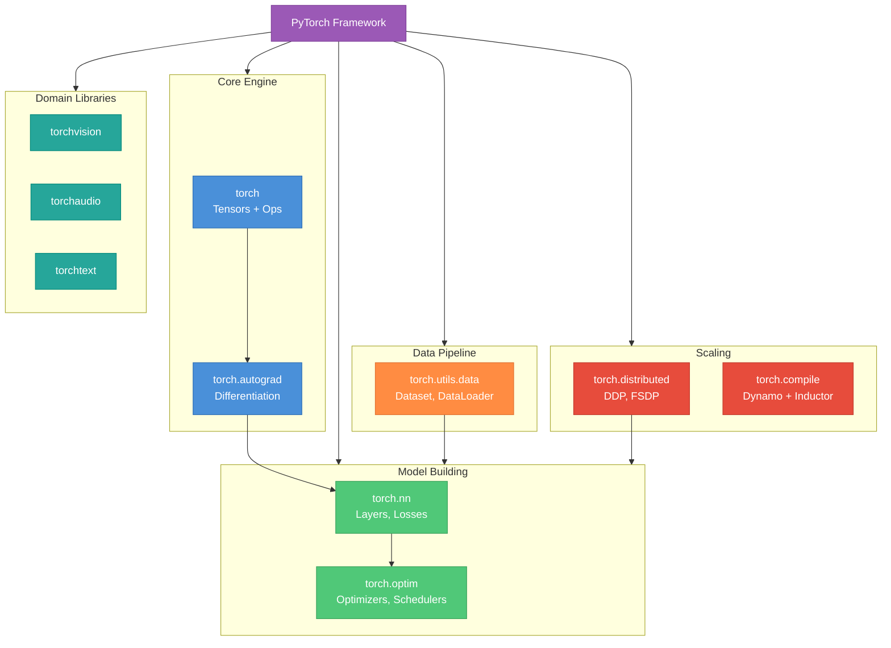
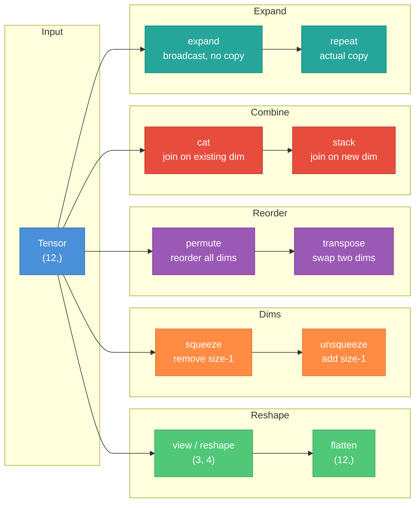
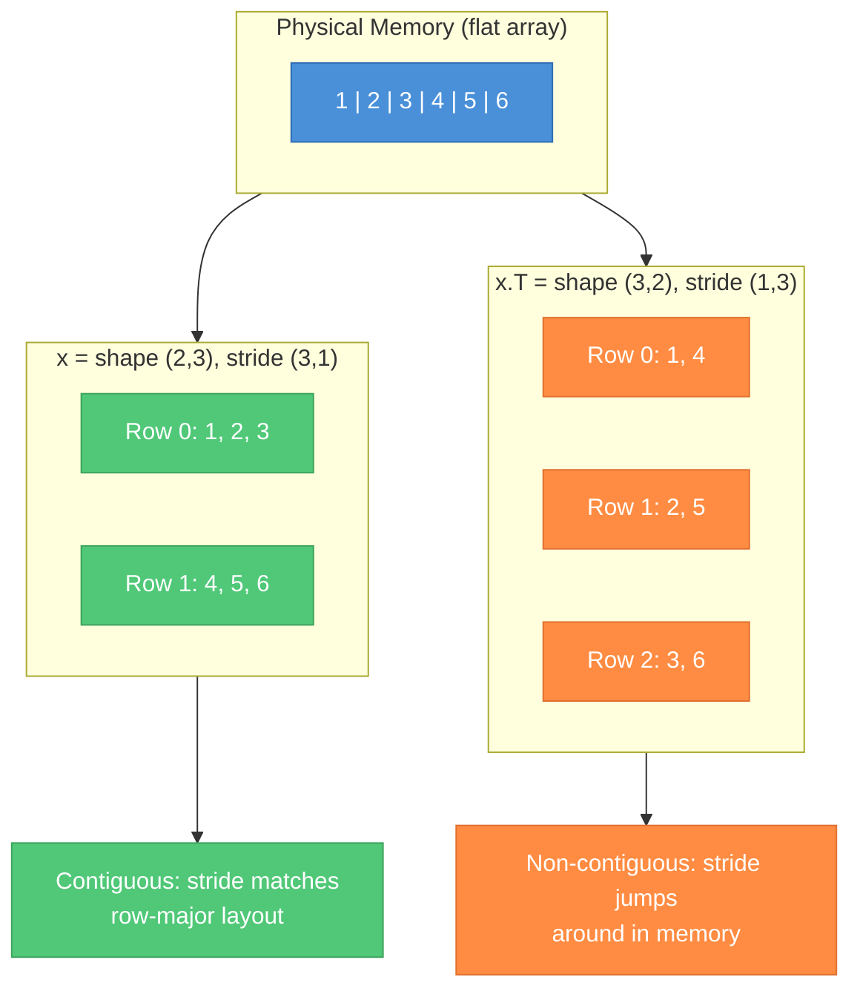
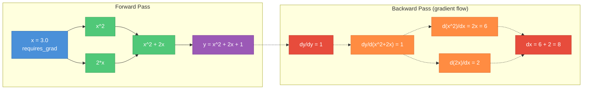
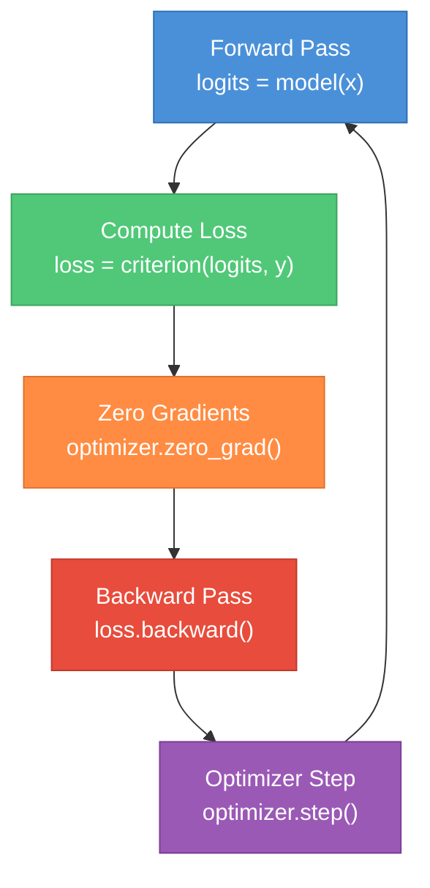
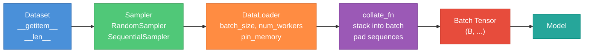
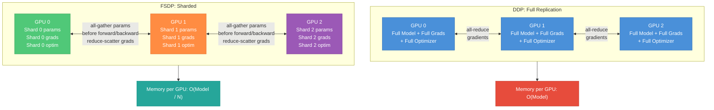

# PyTorch and Tensors for ML Interviews

A practical study guide covering PyTorch from tensor basics to production distributed training. Part 1 builds foundational fluency with tensors, autograd, and nn.Module. Part 2 covers advanced topics: training loops, mixed precision, distributed training, torch.compile, and debugging patterns that come up in senior ML interviews.

---

## Part 1 -- Foundations

---

### 1. What is PyTorch?

PyTorch is an open-source ML framework built on three design principles: **dynamic computational graphs**, **eager execution**, and **Python-first** philosophy. Unlike TensorFlow 1.x, which required building a static graph and then running it in a session, PyTorch builds the graph on-the-fly during the forward pass. Every line of Python executes immediately -- you can use print(), set breakpoints, and write normal Python control flow (if/else, for loops) that varies per input.

**Dynamic vs static graphs**: In static-graph frameworks (TF 1.x, early Caffe), the full computation graph is defined once, then compiled and executed. This enables aggressive optimization but makes debugging painful. PyTorch's dynamic graphs (also called define-by-run) rebuild the graph every forward pass, which allows variable-length inputs, conditional logic, and standard Python debugging. TensorFlow 2.x adopted eager mode by default, narrowing this gap.

**Core components**:

| Module | Purpose |
|---|---|
| `torch` | Tensor creation, math operations, device management |
| `torch.nn` | Neural network layers, loss functions, containers |
| `torch.optim` | Optimizers (SGD, Adam, AdamW) and learning rate schedulers |
| `torch.utils.data` | Dataset, DataLoader, samplers for data pipelines |
| `torch.autograd` | Automatic differentiation engine |
| `torch.distributed` | Multi-GPU and multi-node training primitives |
| `torch.compile` | JIT compilation via Dynamo + Inductor (2.0+) |
| `torchvision` / `torchaudio` / `torchtext` | Domain-specific utilities |



**Why interviewers care**: They want to know you can reason about what happens under the hood -- that dynamic graphs rebuild each pass, that tensors live on specific devices, and that autograd tracks operations. Surface-level API knowledge is not enough.

---

### 2. Tensors -- The Core Data Structure

A tensor is an n-dimensional array -- like a NumPy ndarray but with two critical additions: **GPU acceleration** and **automatic differentiation** support. Every piece of data in PyTorch -- inputs, weights, gradients, activations -- is a tensor.

**Creating tensors**:

```python
import torch

# From Python data
x = torch.tensor([1.0, 2.0, 3.0])             # 1D, float32
m = torch.tensor([[1, 2], [3, 4]])              # 2D, int64

# Standard constructors
z = torch.zeros(3, 4)                           # 3x4 of zeros
o = torch.ones(2, 3, dtype=torch.float16)       # specify dtype
r = torch.randn(64, 128)                        # normal distribution
a = torch.arange(0, 10, 2)                      # [0, 2, 4, 6, 8]
e = torch.empty(3, 3)                           # uninitialized (fast)
eye = torch.eye(4)                              # 4x4 identity

# From NumPy (shares memory -- no copy)
import numpy as np
n = np.array([1.0, 2.0])
t = torch.from_numpy(n)                         # changes to n affect t
```

**Tensor attributes**:

```python
x = torch.randn(2, 3, 4)
x.shape          # torch.Size([2, 3, 4]) -- same as x.size()
x.dtype          # torch.float32
x.device         # device(type='cpu')
x.requires_grad  # False (default for non-parameter tensors)
x.ndim           # 3 (number of dimensions)
x.numel()        # 24 (total number of elements)
```

**Data types and when to use each**:

| dtype | Bits | Use case |
|---|---|---|
| `torch.float32` | 32 | Default for training -- good precision/speed tradeoff |
| `torch.float16` | 16 | Mixed precision training (with GradScaler) |
| `torch.bfloat16` | 16 | Mixed precision on Ampere+ GPUs -- no scaler needed |
| `torch.float64` | 64 | Rare -- numerical tests, some scientific computing |
| `torch.int64` | 64 | Default integer type -- indices, class labels |
| `torch.int32` | 32 | Indices when memory matters |
| `torch.bool` | 1 | Masks (attention masks, padding masks) |

**Moving between devices**:

```python
device = torch.device("cuda" if torch.cuda.is_available() else "cpu")

x = torch.randn(3, 4)
x = x.to(device)         # preferred -- works for any device
x = x.cuda()             # explicitly to GPU
x = x.cpu()              # explicitly to CPU
x = x.to("cuda:1")       # specific GPU index
```

Key rule: **all tensors in an operation must be on the same device**. Mixing CPU and CUDA tensors raises a RuntimeError.

---

### 3. Tensor Operations

**Element-wise operations** -- applied independently to each element:

```python
a = torch.tensor([1.0, 2.0, 3.0])
b = torch.tensor([4.0, 5.0, 6.0])

a + b                  # [5, 7, 9]
a * b                  # [4, 10, 18] -- element-wise, NOT dot product
torch.exp(a)           # [e^1, e^2, e^3]
torch.log(a)           # [0, 0.693, 1.099]
torch.relu(a - 2)      # [0, 0, 1] -- max(0, x)
torch.clamp(a, 0, 2)   # [1, 2, 2]
```

**Matrix operations**:

```python
A = torch.randn(3, 4)
B = torch.randn(4, 5)

C = torch.matmul(A, B)    # (3, 5) -- general matrix multiply
C = A @ B                  # same as matmul -- preferred syntax

# mm: strictly 2D matrix multiply (no broadcasting)
C = torch.mm(A, B)         # (3, 5)

# bmm: batched matrix multiply -- batch dim must match
A_batch = torch.randn(8, 3, 4)  # 8 matrices of shape 3x4
B_batch = torch.randn(8, 4, 5)  # 8 matrices of shape 4x5
C_batch = torch.bmm(A_batch, B_batch)  # (8, 3, 5)

# dot: only for 1D vectors
torch.dot(torch.tensor([1., 2.]), torch.tensor([3., 4.]))  # 11.0
```

**Reduction operations** -- collapse a dimension:

```python
x = torch.tensor([[1., 2., 3.], [4., 5., 6.]])  # shape (2, 3)

x.sum()                    # 21.0 -- all elements
x.sum(dim=0)               # [5, 7, 9] -- sum across rows (batch dim)
x.sum(dim=1)               # [6, 15] -- sum across columns (feature dim)
x.sum(dim=1, keepdim=True) # [[6], [15]] -- shape (2, 1), preserves dims

x.mean(dim=1)              # [2, 5]
x.max(dim=1)               # values=[3, 6], indices=[2, 2]
x.argmax(dim=1)            # [2, 2] -- index of max along dim 1
```

**Comparison operations**:

```python
x = torch.tensor([1, 2, 3, 4, 5])
mask = x > 3                        # [False, False, False, True, True]
x[mask]                              # [4, 5] -- boolean indexing
torch.where(x > 3, x, torch.zeros_like(x))  # [0, 0, 0, 4, 5]
```

**In-place operations** -- the trailing underscore convention:

```python
x = torch.tensor([1., 2., 3.], requires_grad=True)
# x.add_(1)  # ERROR: in-place on a leaf tensor that requires grad

y = torch.tensor([1., 2., 3.])
y.add_(1)      # y is now [2, 3, 4] -- modified in place
y.mul_(2)      # y is now [4, 6, 8]
y.zero_()      # y is now [0, 0, 0]
```

In-place operations save memory but **can break autograd** because they overwrite values needed for gradient computation. Avoid them on tensors that require gradients.

---

### 4. Tensor Shapes and Manipulation

Shape manipulation is the bread and butter of PyTorch code. Interviewers frequently test your ability to reason about shapes through a chain of operations.

**view vs reshape**:

```python
x = torch.arange(12)              # shape (12,)
x.view(3, 4)                       # shape (3, 4) -- must be contiguous
x.reshape(3, 4)                    # shape (3, 4) -- works even if non-contiguous
x.view(3, -1)                      # -1 is inferred: (3, 4)
```

`view` returns a new tensor sharing the same underlying data (zero-copy) but **requires the tensor to be contiguous in memory**. `reshape` will return a view when possible, or create a copy when the tensor is non-contiguous.

**squeeze and unsqueeze**:

```python
x = torch.randn(1, 3, 1, 4)
x.squeeze()                        # shape (3, 4) -- removes ALL size-1 dims
x.squeeze(0)                       # shape (3, 1, 4) -- removes only dim 0
x.squeeze(2)                       # shape (1, 3, 4) -- removes only dim 2

y = torch.randn(3, 4)
y.unsqueeze(0)                     # shape (1, 3, 4) -- add batch dim
y.unsqueeze(-1)                    # shape (3, 4, 1) -- add trailing dim
```

**permute and transpose**:

```python
x = torch.randn(2, 3, 4)           # (batch, seq_len, features)
x.permute(0, 2, 1)                  # (2, 4, 3) -- reorder all dims
x.transpose(1, 2)                   # (2, 4, 3) -- swap two dims

# Common: channel-first to channel-last
img = torch.randn(3, 224, 224)      # (C, H, W)
img.permute(1, 2, 0)                # (H, W, C) for matplotlib
```

After `transpose` or `permute`, the tensor is typically **non-contiguous**. Call `.contiguous()` if you need to use `.view()` afterward.

**cat vs stack**:

```python
a = torch.randn(2, 3)
b = torch.randn(2, 3)

torch.cat([a, b], dim=0)           # (4, 3) -- concatenate along existing dim
torch.cat([a, b], dim=1)           # (2, 6)

torch.stack([a, b], dim=0)         # (2, 2, 3) -- creates NEW dimension
torch.stack([a, b], dim=1)         # (2, 2, 3) -- new dim at position 1
```

**expand vs repeat**:

```python
x = torch.tensor([[1], [2], [3]])   # shape (3, 1)
x.expand(3, 4)                      # shape (3, 4) -- no memory copy, broadcasts
x.repeat(1, 4)                      # shape (3, 4) -- actually copies memory
x.expand(-1, 4)                     # -1 means "keep this dim" -> (3, 4)
```

`expand` is preferred because it avoids copying data. It works by setting the stride to 0 along the expanded dimension.



---

### 5. Broadcasting

Broadcasting allows operations between tensors of different shapes without explicitly expanding them. PyTorch follows NumPy broadcasting rules.

**The rules** (applied right-to-left):

1. If tensors have different numbers of dimensions, prepend size-1 dimensions to the smaller tensor.
2. For each dimension, the sizes must either be equal or one of them must be 1.
3. The size-1 dimension is "stretched" (broadcast) to match the other.

**Step-by-step example**:

```
A: shape (3, 1)    B: shape (1, 4)

Step 1: Dimensions already match (both 2D)
Step 2: Compare right-to-left:
  dim 1: A has 1, B has 4 -> broadcast A to 4
  dim 0: A has 3, B has 1 -> broadcast B to 3
Result: (3, 4)
```

```python
A = torch.tensor([[1], [2], [3]])    # (3, 1)
B = torch.tensor([[10, 20, 30, 40]]) # (1, 4)
C = A + B
# tensor([[11, 21, 31, 41],
#         [12, 22, 32, 42],
#         [13, 23, 33, 43]])         # (3, 4)
```

**Common ML patterns**:

```python
# Adding bias: (batch, features) + (features,)
x = torch.randn(32, 128)        # (32, 128)
bias = torch.randn(128)          # (128,) -> becomes (1, 128)
result = x + bias                 # (32, 128) -- bias added to each sample

# Scaling features: (batch, seq, features) * (features,)
x = torch.randn(8, 50, 256)      # (8, 50, 256)
scale = torch.randn(256)          # (256,) -> (1, 1, 256)
result = x * scale                # (8, 50, 256)
```

**Common gotcha -- accidental broadcasting**:

```python
# Intended: element-wise multiply two vectors
a = torch.randn(3)     # (3,)
b = torch.randn(3, 1)  # (3, 1) -- oops, should have been (3,)
c = a * b               # (3, 3) -- silent bug! No error, wrong shape
```

Always verify shapes after operations when debugging. Use `assert x.shape == expected_shape` liberally.

---

### 6. Memory Layout and Views

Understanding memory layout is essential for performance and for answering "why does `.view()` fail here?" in interviews.

**Strides**: PyTorch stores tensor data in a contiguous 1D block. Strides tell you how many elements to skip in memory to advance one position along each dimension.

```python
x = torch.tensor([[1, 2, 3],
                   [4, 5, 6]])     # shape (2, 3)
x.stride()                          # (3, 1)
# To move one row (dim 0): skip 3 elements
# To move one col (dim 1): skip 1 element

# After transpose, strides flip but data stays the same
y = x.t()                           # shape (3, 2)
y.stride()                          # (1, 3) -- now non-contiguous!
y.is_contiguous()                   # False
```

**Contiguous**: A tensor is contiguous when elements are laid out in memory in the order you would visit them by iterating the rightmost dimension first (row-major / C order). After `transpose()` or `permute()`, the strides no longer correspond to contiguous layout.



**Views vs copies**:

```python
x = torch.arange(6).reshape(2, 3)
y = x[0]          # y is a VIEW -- shares memory with x
y[0] = 99         # modifies x too!

z = x.clone()     # z is a COPY -- independent memory
z[0, 0] = 42      # does NOT affect x
```

**clone vs detach**:

| Operation | Copies data? | Keeps in autograd graph? |
|---|---|---|
| `.clone()` | Yes | Yes -- gradients flow through clone |
| `.detach()` | No | No -- disconnects from graph |
| `.clone().detach()` | Yes | No -- independent copy, no gradients |

Use `.detach()` when you want to use a tensor's value without tracking gradients (e.g., logging a loss value). Use `.clone()` when you need an independent copy that still participates in autograd.

---

### 7. Autograd -- Automatic Differentiation

Autograd is PyTorch's engine for computing gradients. It records operations on tensors with `requires_grad=True` into a directed acyclic graph (DAG), then walks backward through this graph to compute gradients via the chain rule.

**Basic mechanics**:

```python
x = torch.tensor(3.0, requires_grad=True)
y = x ** 2 + 2 * x + 1    # y = x^2 + 2x + 1
y.backward()                # computes dy/dx
print(x.grad)               # tensor(8.0) -- dy/dx = 2x + 2 = 8 at x=3
```

**The computational graph**:

Every operation creates a node in the graph. Each tensor has a `.grad_fn` attribute pointing to the function that created it. `.backward()` traverses this graph in reverse, applying the chain rule at each node.



**Key autograd patterns**:

```python
# Disable gradient tracking for inference
with torch.no_grad():
    output = model(input)    # faster, less memory

# Detach a tensor from the graph
hidden = hidden.detach()     # stops gradients from flowing further back

# Gradient accumulation -- gradients ADD by default
optimizer.zero_grad()         # MUST zero before each backward pass
loss.backward()
optimizer.step()
```

**Why gradients accumulate**: This is a design choice, not a bug. It enables gradient accumulation across micro-batches (useful when a full batch doesn't fit in GPU memory). But it means you **must call `optimizer.zero_grad()`** (or `model.zero_grad()`) before each `loss.backward()`, or gradients from previous steps will corrupt the current update.

**Leaf tensors**: Only leaf tensors (those created directly, not from operations) retain `.grad` after `.backward()`. Intermediate tensors have their gradients computed and used for the chain rule but are not stored by default.

```python
# Checking autograd properties
x = torch.randn(3, requires_grad=True)
y = x * 2
print(x.is_leaf)       # True
print(y.is_leaf)        # False
print(y.grad_fn)        # <MulBackward0 ...>
```

---

### 8. nn.Module -- Building Blocks

`nn.Module` is the base class for all neural network components in PyTorch. Every layer, loss function, and model is a Module.

**The pattern**: Subclass `nn.Module`, define layers in `__init__`, define computation in `forward`.

```python
import torch.nn as nn

class MLP(nn.Module):
    def __init__(self, input_dim, hidden_dim, output_dim):
        super().__init__()
        self.fc1 = nn.Linear(input_dim, hidden_dim)
        self.relu = nn.ReLU()
        self.fc2 = nn.Linear(hidden_dim, output_dim)

    def forward(self, x):
        x = self.relu(self.fc1(x))
        return self.fc2(x)

model = MLP(784, 256, 10)
output = model(torch.randn(32, 784))  # calls forward() via __call__
```

**Never call `model.forward()` directly** -- always use `model(input)`. The `__call__` method wraps `forward()` and runs registered hooks.

**Registering parameters**: Any `nn.Module` or `nn.Parameter` assigned as an attribute in `__init__` is automatically registered. This means `.parameters()` will include it, and `.to(device)` will move it.

```python
# nn.Parameter: a tensor that IS a learnable parameter
self.custom_weight = nn.Parameter(torch.randn(10, 10))

# Plain tensor: NOT registered -- .to() and .parameters() will miss it
self.buffer = torch.randn(10, 10)  # BAD -- won't move with model

# register_buffer: not a parameter, but moves with the model
self.register_buffer('running_mean', torch.zeros(10))
```

**Iterating over parameters**:

```python
for name, param in model.named_parameters():
    print(f"{name}: {param.shape}, requires_grad={param.requires_grad}")
# fc1.weight: torch.Size([256, 784]), requires_grad=True
# fc1.bias: torch.Size([256]), requires_grad=True
# fc2.weight: torch.Size([10, 256]), requires_grad=True
# fc2.bias: torch.Size([10]), requires_grad=True

total_params = sum(p.numel() for p in model.parameters())
trainable = sum(p.numel() for p in model.parameters() if p.requires_grad)
```

**train vs eval mode**:

```python
model.train()   # dropout active, batchnorm uses batch stats
model.eval()    # dropout disabled, batchnorm uses running stats
```

This is one of the most common bugs: forgetting to call `model.eval()` before inference leads to non-deterministic outputs (dropout still dropping) and worse performance (batchnorm using batch statistics instead of learned running statistics).

**Module containers**:

```python
# Sequential: modules applied in order
model = nn.Sequential(
    nn.Linear(784, 256),
    nn.ReLU(),
    nn.Linear(256, 10),
)

# ModuleList: when you need a Python list that registers modules
layers = nn.ModuleList([nn.Linear(256, 256) for _ in range(4)])

# ModuleDict: named access
heads = nn.ModuleDict({
    'classifier': nn.Linear(256, 10),
    'regressor': nn.Linear(256, 1),
})
```

Use `ModuleList` and `ModuleDict` instead of plain Python lists/dicts so that parameters are properly registered.

**Likely interview questions**:

- What happens if you use a plain Python list of layers instead of `nn.ModuleList`?
- What is the difference between `nn.Parameter` and `register_buffer`?
- Why should you never call `model.forward()` directly?
- What does `model.eval()` change, and what layers are affected?
- How do you freeze specific layers during fine-tuning?

---

## Part 2 -- Advanced Topics and Production Patterns

---

### 9. Training Loop Anatomy

The canonical PyTorch training loop follows a fixed pattern. Interviewers expect you to write it from memory.

```python
model = MLP(784, 256, 10).to(device)
optimizer = torch.optim.AdamW(model.parameters(), lr=1e-3)
criterion = nn.CrossEntropyLoss()

model.train()
for epoch in range(num_epochs):
    for batch_x, batch_y in dataloader:
        batch_x, batch_y = batch_x.to(device), batch_y.to(device)

        # Forward
        logits = model(batch_x)
        loss = criterion(logits, batch_y)

        # Backward
        optimizer.zero_grad()     # clear previous gradients
        loss.backward()           # compute gradients
        optimizer.step()          # update parameters
```



**DataLoader details**:

```python
from torch.utils.data import DataLoader, TensorDataset

dataset = TensorDataset(X_train, y_train)
dataloader = DataLoader(
    dataset,
    batch_size=64,
    shuffle=True,          # randomize order each epoch
    num_workers=4,         # parallel data loading processes
    pin_memory=True,       # pin to page-locked memory for faster GPU transfer
    drop_last=True,        # drop incomplete final batch
)
```

`pin_memory=True` is a free speedup on GPU training -- it pins CPU tensors in page-locked memory so that `.to(device, non_blocking=True)` can overlap data transfer with computation.

**Loss functions -- know these three**:

| Loss | Use case | Notes |
|---|---|---|
| `nn.CrossEntropyLoss` | Multi-class classification | Takes raw logits (not softmax). Combines `log_softmax + NLLLoss` |
| `nn.BCEWithLogitsLoss` | Binary / multi-label classification | Takes raw logits (not sigmoid). More numerically stable than `BCELoss` |
| `nn.MSELoss` | Regression | Mean squared error |

**Optimizers -- know when to use each**:

| Optimizer | When to use |
|---|---|
| `SGD` | Classic, good with momentum for computer vision |
| `Adam` | Good default, adaptive learning rates |
| `AdamW` | Adam with decoupled weight decay -- preferred for transformers |

**Learning rate scheduling**:

```python
scheduler = torch.optim.lr_scheduler.CosineAnnealingLR(optimizer, T_max=100)
# Call scheduler.step() after each epoch (or step, depending on scheduler)
```

---

### 10. Custom Layers and Functions

**Custom nn.Module**:

```python
class LayerNorm(nn.Module):
    def __init__(self, dim, eps=1e-5):
        super().__init__()
        self.gamma = nn.Parameter(torch.ones(dim))
        self.beta = nn.Parameter(torch.zeros(dim))
        self.eps = eps

    def forward(self, x):
        mean = x.mean(dim=-1, keepdim=True)
        std = x.std(dim=-1, keepdim=True)
        return self.gamma * (x - mean) / (std + self.eps) + self.beta
```

**Custom autograd function** -- when you need to define your own backward:

```python
class StraightThroughEstimator(torch.autograd.Function):
    @staticmethod
    def forward(ctx, x):
        return (x > 0).float()     # non-differentiable step function

    @staticmethod
    def backward(ctx, grad_output):
        return grad_output          # pass gradient straight through

# Usage: StraightThroughEstimator.apply(x)
```

Use `torch.autograd.Function` when: (1) you need a custom gradient for a non-differentiable operation, (2) you want a numerically stable implementation that fuses forward/backward, or (3) you're wrapping a custom CUDA kernel.

**Hooks** -- for debugging, feature extraction, gradient modification:

```python
# Forward hook: inspect/modify layer outputs
def print_output_shape(module, input, output):
    print(f"{module.__class__.__name__}: {output.shape}")

handle = model.fc1.register_forward_hook(print_output_shape)
# ... run forward pass ...
handle.remove()   # always clean up hooks

# Backward hook: inspect/modify gradients
def clip_grad(module, grad_input, grad_output):
    return tuple(g.clamp(-1, 1) if g is not None else g for g in grad_input)

model.fc1.register_backward_hook(clip_grad)
```

---

### 11. Data Pipeline



**Custom Dataset**:

```python
from torch.utils.data import Dataset

class TextDataset(Dataset):
    def __init__(self, texts, labels, tokenizer):
        self.texts = texts
        self.labels = labels
        self.tokenizer = tokenizer

    def __len__(self):
        return len(self.texts)

    def __getitem__(self, idx):
        tokens = self.tokenizer(self.texts[idx])
        return torch.tensor(tokens), torch.tensor(self.labels[idx])
```

**Custom collate function** -- needed when samples have different sizes (e.g., variable-length sequences):

```python
def collate_fn(batch):
    texts, labels = zip(*batch)
    # Pad sequences to max length in this batch
    texts_padded = nn.utils.rnn.pad_sequence(texts, batch_first=True)
    labels = torch.stack(labels)
    return texts_padded, labels

dataloader = DataLoader(dataset, batch_size=32, collate_fn=collate_fn)
```

**IterableDataset** -- for streaming data that doesn't fit in memory or comes from a stream:

```python
class StreamDataset(torch.utils.data.IterableDataset):
    def __init__(self, file_path):
        self.file_path = file_path

    def __iter__(self):
        with open(self.file_path) as f:
            for line in f:
                yield process_line(line)
```

With `IterableDataset`, you cannot use `shuffle=True` in DataLoader. Instead, shuffle the source or use a shuffle buffer.

---

### 12. Mixed Precision Training

Mixed precision uses lower-precision floating point (fp16 or bf16) for most operations to reduce memory and increase throughput, while keeping critical operations in fp32.

```python
from torch.cuda.amp import autocast, GradScaler

scaler = GradScaler()
model = model.to(device)

for batch_x, batch_y in dataloader:
    batch_x, batch_y = batch_x.to(device), batch_y.to(device)
    optimizer.zero_grad()

    with autocast():                     # fp16 for eligible ops
        logits = model(batch_x)
        loss = criterion(logits, batch_y)

    scaler.scale(loss).backward()        # scale loss to prevent underflow
    scaler.step(optimizer)               # unscale gradients, then step
    scaler.update()                      # adjust scale factor
```

**Which ops run in reduced precision**:

| Reduced precision (fp16/bf16) | Full precision (fp32) |
|---|---|
| matmul, linear, conv | loss computation |
| batched matmul (bmm) | softmax, log_softmax |
| embedding lookup | layer norm, batch norm |
| | reductions (sum, mean) |

**bf16 vs fp16**:

| Property | fp16 | bf16 |
|---|---|---|
| Mantissa bits | 10 | 7 |
| Exponent bits | 5 | 8 (same as fp32) |
| Range | Limited -- needs GradScaler | Same range as fp32 -- no scaler needed |
| Hardware | All modern GPUs | Ampere+ (A100, H100, etc.) |

If you have Ampere or newer hardware, prefer bf16: `with autocast(dtype=torch.bfloat16)` and skip the GradScaler entirely.

---

### 13. Distributed Training

**DataParallel (DP)** -- simple but slow:

Replicates the model to all GPUs, splits the batch, gathers outputs on GPU 0. Bottlenecked by the Python GIL and GPU 0 receiving all outputs. **Do not use DP for serious training.**

**DistributedDataParallel (DDP)** -- the standard:

One process per GPU. Each process has a full copy of the model. After backward, gradients are synchronized via all-reduce across processes. No GIL bottleneck.

```python
# Launch with: torchrun --nproc_per_node=4 train.py
import torch.distributed as dist
from torch.nn.parallel import DistributedDataParallel as DDP

dist.init_process_group("nccl")
local_rank = int(os.environ["LOCAL_RANK"])
torch.cuda.set_device(local_rank)

model = MyModel().to(local_rank)
model = DDP(model, device_ids=[local_rank])

# Use DistributedSampler to split data across ranks
sampler = torch.utils.data.distributed.DistributedSampler(dataset)
dataloader = DataLoader(dataset, sampler=sampler, batch_size=64)
```

**FullyShardedDataParallel (FSDP)** -- for large models:

Implements ZeRO Stage 3 in PyTorch. Instead of each GPU holding a full copy of model parameters, gradients, and optimizer states, FSDP **shards** them across GPUs. Each GPU only holds `1/N`th of the data. Parameters are all-gathered on demand for computation, then freed.



**When to use each**:

| Approach | Use when |
|---|---|
| Single GPU | Model fits in one GPU |
| DDP | Model fits in one GPU but you want faster training via data parallelism |
| FSDP | Model does NOT fit in one GPU -- must shard parameters |
| Pipeline parallelism | Extremely large models, split layers across GPUs sequentially |

---

### 14. torch.compile and Performance

`torch.compile()` (PyTorch 2.0+) is a JIT compiler that captures the computation graph via **TorchDynamo** and optimizes it with **TorchInductor**, generating fused CUDA kernels.

```python
model = MyModel().to(device)
model = torch.compile(model)   # one-line change

# First call is slow (compilation), subsequent calls are fast
output = model(input)
```

**Compilation modes**:

| Mode | Tradeoff |
|---|---|
| `"default"` | Balanced compile time and runtime performance |
| `"reduce-overhead"` | Uses CUDA graphs -- reduces kernel launch overhead for small models |
| `"max-autotune"` | Tries many kernel configurations -- longest compile, fastest runtime |

**Graph breaks**: When Dynamo encounters Python code it cannot convert to a graph operation (e.g., data-dependent control flow, calling unsupported functions, printing tensor values), it inserts a "graph break" -- splitting the graph into subgraphs. Each break reduces optimization opportunity.

Common graph break causes: `print(tensor)`, Python-level data-dependent branching on tensor values, calling non-torch functions on tensors, `torch.autograd.Function` with non-standard patterns.

**Performance tips for interviews**:

1. **Vectorize**: Replace Python for-loops over tensor elements with torch operations
2. **Fuse operations**: Use `torch.compile()` or write fused kernels
3. **pin_memory + non_blocking**: Overlap data transfer and computation
4. **Avoid CPU-GPU sync points**: `.item()`, `print(tensor)`, and `if tensor > 0` force synchronization
5. **Pre-allocate output tensors** instead of creating new ones each iteration
6. **Use `torch.profiler`** to find actual bottlenecks before optimizing

```python
with torch.profiler.profile(
    activities=[torch.profiler.ProfilerActivity.CPU,
                torch.profiler.ProfilerActivity.CUDA],
    with_stack=True,
) as prof:
    model(input)

print(prof.key_averages().table(sort_by="cuda_time_total", row_limit=10))
```

---

### 15. Saving and Loading

**The right way -- save state_dict, not the model**:

```python
# Save
torch.save(model.state_dict(), "model.pt")

# Load
model = MyModel()  # must define architecture in code
model.load_state_dict(torch.load("model.pt", map_location=device))
model.eval()
```

Why not `torch.save(model, "model.pt")`? Because it uses pickle, which is brittle -- it depends on the exact class definition, file path, and Python version. `state_dict` is just a dictionary of parameter names to tensors.

**Checkpoint saving during training** -- save optimizer state too, so you can resume:

```python
checkpoint = {
    'epoch': epoch,
    'model_state_dict': model.state_dict(),
    'optimizer_state_dict': optimizer.state_dict(),
    'loss': loss.item(),
}
torch.save(checkpoint, f"checkpoint_epoch_{epoch}.pt")

# Resume
ckpt = torch.load("checkpoint_epoch_5.pt", map_location=device)
model.load_state_dict(ckpt['model_state_dict'])
optimizer.load_state_dict(ckpt['optimizer_state_dict'])
```

**map_location** -- critical for loading models trained on GPU to CPU (or vice versa):

```python
# Trained on GPU, loading on CPU
state = torch.load("model.pt", map_location="cpu")

# Trained on GPU 0, loading on GPU 3
state = torch.load("model.pt", map_location="cuda:3")
```

**SafeTensors** (Hugging Face standard): A secure, fast format that avoids pickle's arbitrary code execution risk. Becoming the industry standard for model distribution.

```python
from safetensors.torch import save_file, load_file

save_file(model.state_dict(), "model.safetensors")
state_dict = load_file("model.safetensors")
model.load_state_dict(state_dict)
```

---

### 16. Debugging and Common Pitfalls

```mermaid
graph TD
    BUG["Bug Encountered"]:::purple

    BUG --> NAN{"NaN / Inf<br/>in output?"}
    BUG --> OOM{"CUDA Out<br/>of Memory?"}
    BUG --> WRONG{"Wrong output<br/>or accuracy?"}
    BUG --> SHAPE{"Shape<br/>mismatch?"}

    NAN -->|Yes| N1["Check input data for NaN"]:::red
    NAN -->|Yes| N2["Add gradient clipping<br/>torch.nn.utils.clip_grad_norm_"]:::red
    NAN -->|Yes| N3["Reduce learning rate"]:::red
    NAN -->|Yes| N4["Check for log(0) or div by 0"]:::red

    OOM -->|Yes| O1["Reduce batch size"]:::orange
    OOM -->|Yes| O2["Enable mixed precision (fp16/bf16)"]:::orange
    OOM -->|Yes| O3["Use gradient checkpointing<br/>torch.utils.checkpoint"]:::orange
    OOM -->|Yes| O4["Check for memory leaks<br/>tensors stored in lists"]:::orange

    WRONG -->|Yes| W1["model.eval() called?"]:::blue
    WRONG -->|Yes| W2["Gradients zeroed each step?"]:::blue
    WRONG -->|Yes| W3["Data on correct device?"]:::blue
    WRONG -->|Yes| W4["Loss function matches task?<br/>CrossEntropy expects logits"]:::blue

    SHAPE -->|Yes| S1["Print shapes at every layer"]:::green
    SHAPE -->|Yes| S2["Check broadcasting rules"]:::green
    SHAPE -->|Yes| S3["Verify DataLoader output shapes"]:::green

    classDef blue fill:#4A90D9,stroke:#2E6DB4,color:#fff
    classDef green fill:#50C878,stroke:#3DA35D,color:#fff
    classDef orange fill:#FF8C42,stroke:#E07030,color:#fff
    classDef purple fill:#9B59B6,stroke:#7D3C98,color:#fff
    classDef red fill:#E74C3C,stroke:#C0392B,color:#fff
```



**Top pitfalls in detail**:

**1. Forgetting `model.eval()` at inference time**

Dropout randomly zeros neurons during training. BatchNorm uses batch statistics during training but learned running statistics during evaluation. If you forget `model.eval()`, inference results will be non-deterministic and worse.

**2. Not zeroing gradients**

```python
# BUG: gradients accumulate across batches
for x, y in dataloader:
    loss = criterion(model(x), y)
    loss.backward()
    optimizer.step()
    # Missing: optimizer.zero_grad()
```

**3. Storing computation graph in lists**

```python
# BUG: stores entire graph in memory -- OOM after enough iterations
losses = []
for x, y in dataloader:
    loss = criterion(model(x), y)
    losses.append(loss)          # holds reference to entire graph

# FIX: detach or call .item()
losses.append(loss.item())       # stores just the Python float
```

**4. In-place ops breaking autograd**

```python
x = torch.randn(3, requires_grad=True)
y = x * 2
y.add_(1)    # in-place modification AFTER y is in the graph
# .backward() may fail or give wrong gradients
```

**5. CUDA OOM** -- the out-of-memory checklist:

1. Reduce batch size
2. Enable mixed precision training (fp16/bf16)
3. Use gradient checkpointing: `torch.utils.checkpoint.checkpoint(fn, input)`
4. Ensure you are not storing computation graphs in lists
5. Delete unused tensors and call `torch.cuda.empty_cache()`
6. Use FSDP for models that don't fit on a single GPU

**6. Device mismatches**

```python
# RuntimeError: tensors on different devices
x = torch.randn(3).cuda()
w = torch.randn(3)           # on CPU
result = x + w                # ERROR
```

---

### 17. Key PyTorch Idioms for Interviews

**Implementing scaled dot-product attention from scratch**:

```python
def attention(Q, K, V, mask=None):
    # Q, K, V: (batch, heads, seq_len, d_k)
    d_k = Q.size(-1)
    scores = Q @ K.transpose(-2, -1) / (d_k ** 0.5)  # (B, H, S, S)
    if mask is not None:
        scores = scores.masked_fill(mask == 0, float('-inf'))
    weights = torch.softmax(scores, dim=-1)             # (B, H, S, S)
    return weights @ V                                   # (B, H, S, d_k)
```

**torch.einsum** -- concise notation for tensor contractions:

```python
# Matrix multiply: (i,j) x (j,k) -> (i,k)
C = torch.einsum('ij,jk->ik', A, B)

# Batched matrix multiply: (b,i,j) x (b,j,k) -> (b,i,k)
C = torch.einsum('bij,bjk->bik', A, B)

# Dot product of batched vectors
d = torch.einsum('bi,bi->b', x, y)

# Attention: (b,h,s,d) x (b,h,d,s) -> (b,h,s,s)
scores = torch.einsum('bhsd,bhtd->bhst', Q, K)

# Trace
tr = torch.einsum('ii->', A)

# Outer product
outer = torch.einsum('i,j->ij', a, b)
```

**gather and scatter** -- indexing along a dimension:

```python
# Gather: select elements from a tensor using index tensor
logits = torch.randn(4, 10)          # (batch, classes)
labels = torch.tensor([3, 7, 2, 5])  # (batch,)
# Get the logit for the correct class in each sample
selected = logits.gather(1, labels.unsqueeze(1))  # (4, 1)

# Scatter: write values into a tensor at specific indices
one_hot = torch.zeros(4, 10)
one_hot.scatter_(1, labels.unsqueeze(1), 1.0)     # (4, 10)
```

**Gradient clipping** -- essential for RNNs and transformer training:

```python
torch.nn.utils.clip_grad_norm_(model.parameters(), max_norm=1.0)
# Call AFTER loss.backward() but BEFORE optimizer.step()
```

**Freezing layers for fine-tuning**:

```python
# Freeze all parameters
for param in model.parameters():
    param.requires_grad = False

# Unfreeze only the classifier head
for param in model.classifier.parameters():
    param.requires_grad = True
```

---

### 18. Interview Questions Checklist

**Conceptual Questions**:

1. **What is the difference between `torch.Tensor` and `torch.tensor()`?**
   `torch.Tensor` is the class (aliased to `torch.FloatTensor`). `torch.tensor()` is a function that infers dtype from data. Prefer `torch.tensor()`.

2. **Why does PyTorch use dynamic computational graphs?**
   Enables standard Python control flow (if/else, loops) that varies per input, easier debugging, and natural support for variable-length inputs (NLP).

3. **What happens during `.backward()`?**
   PyTorch walks the computational graph in reverse topological order, computing gradients at each node using the chain rule (reverse-mode autodiff). Gradients are accumulated in `.grad` attributes of leaf tensors.

4. **Why must you call `optimizer.zero_grad()`?**
   Gradients accumulate by default (they are added, not replaced). Without zeroing, each backward pass adds to the previous gradients, producing incorrect parameter updates.

5. **What is the difference between `.detach()` and `torch.no_grad()`?**
   `.detach()` creates a new tensor disconnected from the graph (shares data). `torch.no_grad()` is a context manager that disables gradient tracking for all operations inside it (saves memory during inference).

6. **Explain `.view()` vs `.reshape()` vs `.contiguous().view()`.**
   `.view()` requires contiguous memory -- it will fail on transposed tensors. `.reshape()` returns a view if possible, copies otherwise. `.contiguous().view()` explicitly makes the tensor contiguous first, guaranteeing `.view()` succeeds.

7. **What is gradient checkpointing and when do you use it?**
   It trades compute for memory. During the forward pass, intermediate activations are discarded instead of stored. During backward, they are recomputed on the fly. Roughly halves activation memory at the cost of ~30% more compute. Used when the model fits on the GPU only without the stored activations.

8. **How does `nn.CrossEntropyLoss` work internally?**
   It combines `log_softmax` and `NLLLoss` in a single numerically stable operation. It expects raw logits, NOT probabilities. The softmax is computed internally using the log-sum-exp trick for numerical stability.

9. **Explain DDP vs FSDP.**
   DDP replicates the full model on each GPU and synchronizes gradients via all-reduce. Every GPU holds `O(model_size)` memory. FSDP shards parameters, gradients, and optimizer states across GPUs, so each GPU holds `O(model_size / N)`. FSDP requires all-gather before computation and reduce-scatter after, adding communication overhead but enabling much larger models.

10. **What are graph breaks in `torch.compile`?**
    When TorchDynamo encounters Python operations it cannot trace (data-dependent control flow, unsupported functions, print statements on tensors), it inserts a graph break, splitting the computation into separate subgraphs. Each subgraph is compiled independently, reducing optimization opportunities.

**Write-it-in-PyTorch Questions**:

11. **Implement a training loop from scratch** -- with DataLoader, loss, optimizer, gradient zeroing, device transfer.

12. **Implement multi-head self-attention** -- scaled dot product with Q, K, V projections, splitting into heads, and concatenating.

13. **Implement a custom Dataset and DataLoader** for a CSV file with text and labels.

14. **Implement a mixed-precision training loop** with `autocast` and `GradScaler`.

15. **Write a function that freezes all layers except the last N layers** of a pretrained model for fine-tuning.

**Debugging Scenario Questions**:

16. **Your model outputs NaN after a few training steps. Walk through your debugging process.**
    Check inputs for NaN/Inf -> check learning rate (too high?) -> add gradient clipping -> check for log(0) or division by zero -> try fp32 if using mixed precision -> reduce model complexity to isolate the layer.

17. **Training loss decreases but validation accuracy does not improve. What do you check?**
    Overfitting (add regularization, dropout, data augmentation) -> data leakage -> wrong evaluation metric -> `model.eval()` missing during validation -> bug in validation DataLoader (e.g., not resetting sampler).

18. **You get CUDA OOM at batch size 32 but the model should fit. What do you investigate?**
    Check for stored computation graphs (loss appended to a list without `.item()`) -> check for unused tensors not being freed -> ensure `torch.no_grad()` wraps validation -> try `torch.cuda.empty_cache()` -> profile with `torch.cuda.memory_summary()`.

19. **Your DDP training hangs at the start. What could be wrong?**
    Not all ranks calling into the collective (one rank hit an exception) -> NCCL backend not installed properly -> firewall blocking inter-node communication -> mismatched `world_size` -> one process crashed silently.

20. **Model accuracy is different between `model.train()` and `model.eval()` modes, even on the same data. Why?**
    Dropout is active in train mode (randomly zeroing neurons) and disabled in eval mode. BatchNorm uses per-batch statistics in train mode and learned running statistics in eval mode. Both cause different outputs.

---

**Quick Reference: Tensor Cheat Sheet**

```
Creation:     torch.tensor, zeros, ones, randn, arange, empty, eye, from_numpy
Attributes:   .shape, .dtype, .device, .requires_grad, .grad, .grad_fn
Shapes:       .view, .reshape, .squeeze, .unsqueeze, .permute, .transpose, .flatten
Combining:    torch.cat, torch.stack, torch.chunk, torch.split
Math:         +, -, *, /, @, torch.matmul, torch.mm, torch.bmm, torch.einsum
Reduction:    .sum, .mean, .max, .min, .argmax, .argmin, .norm
Comparison:   ==, >, <, torch.where, torch.masked_fill
Memory:       .contiguous, .clone, .detach, .is_contiguous, .stride, .storage
Device:       .to(device), .cuda(), .cpu(), .device
Autograd:     .backward, .grad, .requires_grad_, .detach, torch.no_grad
```
