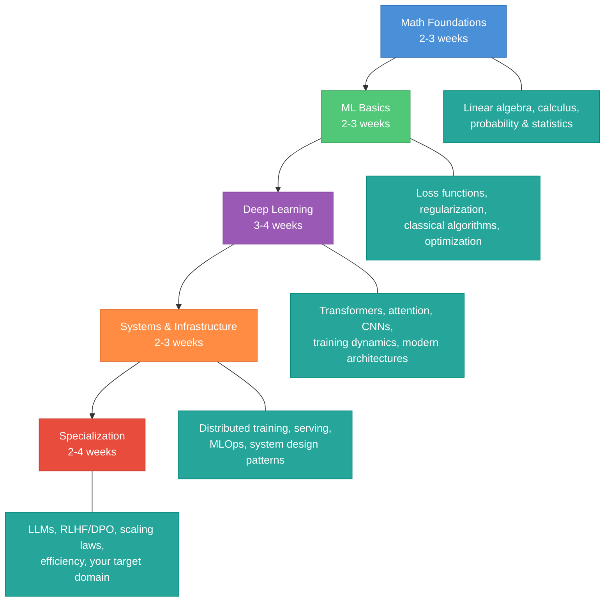
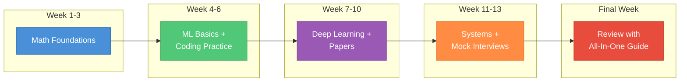

# Resources and References

> A curated collection of the best resources for MLE interview prep and deep learning mastery. Every link here is worth your time.

---

## Learning Roadmap

The path below is not the only way, but it is a proven sequence. Each stage builds on the previous one. Adjust time estimates based on your background — if you already know linear algebra cold, skip ahead.

**Total estimated time: 11-17 weeks** for a thorough preparation. Cut this in half if you are brushing up rather than learning from scratch.

---

## Essential Articles

### LLM Training Pipelines

- **You Don't Know LLM Training** by Tw93 — The best single article on the complete 9-stage LLM pipeline from raw data to deployment. Covers data collection, preprocessing, pre-training, SFT, RLHF, evaluation, optimization, deployment, and monitoring. See our [All-In-One Guide](all-in-one-guide.md) for how these stages map to study topics.

### Transformers and Attention

- **The Illustrated Transformer** by Jay Alammar — Visual walkthrough of the transformer architecture. The best first introduction to attention, positional encoding, and encoder-decoder structure. See our [Deep Learning Architectures](deep-learning-architectures.md) guide for a deeper treatment.
- **Attention Is All You Need** (Vaswani et al., 2017) — [arxiv.org/abs/1706.03762](https://arxiv.org/abs/1706.03762) — The original paper. Read it after you understand the basics from the illustrated guide above.
- **The Annotated Transformer** by Harvard NLP — Line-by-line PyTorch implementation of the original paper. Bridges the gap between paper and code. Pairs well with our [PyTorch](pytorch.md) guide.
- **FlashAttention: Fast and Memory-Efficient Exact Attention with IO-Awareness** (Dao et al., 2022) — [arxiv.org/abs/2205.14135](https://arxiv.org/abs/2205.14135) — IO-aware exact attention that is now the default in every major framework. Must-read for understanding modern inference.

### Training and Optimization

- **An Overview of Gradient Descent Optimization Algorithms** by Sebastian Ruder — Comprehensive comparison of SGD, Momentum, AdaGrad, RMSProp, Adam, and variants. Essential context for our [Calculus and Optimization](calculus.md) guide.
- **Training Compute-Optimal Large Language Models** (Hoffmann et al., 2022 / "Chinchilla") — [arxiv.org/abs/2203.15556](https://arxiv.org/abs/2203.15556) — Scaling laws that changed how we think about model size vs. data size. Every MLE should know the Chinchilla ratio.
- **The Bitter Lesson** by Rich Sutton — A short essay on why compute and scale beat clever algorithms in the long run. Shapes how you should think about ML systems.

### Distributed Training and Systems

- **How to Train Really Large Models on Many GPUs** by Lilian Weng — Best single overview of data parallelism, tensor parallelism, pipeline parallelism, and mixed precision. Directly relevant to our [ML System Design](ml-system-design.md) guide.
- **ZeRO: Memory Optimizations Toward Training Trillion Parameter Models** (Rajbhandari et al., 2020) — [arxiv.org/abs/1910.02054](https://arxiv.org/abs/1910.02054) — The paper behind DeepSpeed ZeRO and PyTorch FSDP. Explains optimizer state, gradient, and parameter sharding.
- **Efficient Memory Management for Large Language Model Serving with PagedAttention** (Kwon et al., 2023) — [arxiv.org/abs/2309.06180](https://arxiv.org/abs/2309.06180) — The paper behind vLLM. Revolutionized LLM serving with virtual memory for KV cache.

### RL and Alignment

- **Illustrating Reinforcement Learning from Human Feedback (RLHF)** by Hugging Face — Practical, visual introduction to RLHF. Start here before reading the papers. See our [All-In-One Guide](all-in-one-guide.md) for the theory.
- **Constitutional AI: Harmlessness from AI Feedback** (Bai et al., 2022) — [arxiv.org/abs/2212.08073](https://arxiv.org/abs/2212.08073) — Anthropic's approach to alignment without per-example human labels.
- **Direct Preference Optimization** (Rafailov et al., 2023) — [arxiv.org/abs/2305.18290](https://arxiv.org/abs/2305.18290) — RLHF without the RL. Simpler, more stable, and increasingly the default.

### Math for ML

- **3Blue1Brown "Essence of Linear Algebra"** (YouTube series) — The best visual introduction to linear algebra. Watch before or alongside our [Linear Algebra](linear-algebra.md) guide.
- **3Blue1Brown "Essence of Calculus"** (YouTube series) — Same quality treatment for calculus. Pairs with our [Calculus and Optimization](calculus.md) guide.
- **Mathematics for Machine Learning** by Deisenroth, Faisal, and Ong — Free textbook at [mml-book.github.io](https://mml-book.github.io). Thorough coverage of linear algebra, calculus, probability, and optimization in an ML context.
- **StatQuest with Josh Starmer** (YouTube channel) — Statistics and ML concepts explained simply with clear visuals. Good companion to our [Statistics](statistics.md) guide.

### System Design for ML

- **Designing Machine Learning Systems** by Chip Huyen — The definitive book on ML system design. Covers data engineering, feature stores, model serving, monitoring, and more. Essential for system design interview rounds. See our [ML System Design](ml-system-design.md) guide.
- **Made With ML** by Goku Mohandas — End-to-end MLOps course covering design, development, deployment, and iteration. Free and practical.
- **Stanford CS 329S: Machine Learning Systems Design** — Lecture notes cover deployment, monitoring, continual learning, and real-world case studies. Complements the Chip Huyen book.

---

## Essential Papers (Must-Read List)

### Foundation Models

| Paper | Year | Why It Matters | Related Guide |
|---|---|---|---|
| Attention Is All You Need (Vaswani et al.) | 2017 | Introduced the transformer. Everything since builds on this. | [Deep Learning Architectures](deep-learning-architectures.md) |
| BERT: Pre-training of Deep Bidirectional Transformers (Devlin et al.) | 2018 | Popularized pre-train + fine-tune. Defined masked language modeling. | [Deep Learning Architectures](deep-learning-architectures.md) |
| Language Models are Unsupervised Multitask Learners (GPT-2, Radford et al.) | 2019 | Showed large LMs can do zero-shot tasks. Opened the "scaling" era. | [All-In-One Guide](all-in-one-guide.md) |
| Language Models are Few-Shot Learners (GPT-3, Brown et al.) | 2020 | Demonstrated in-context learning. Proved scale unlocks capabilities. | [All-In-One Guide](all-in-one-guide.md) |
| LLaMA: Open and Efficient Foundation Language Models (Touvron et al.) | 2023 | High-quality open weights. Chinchilla-optimal training. Launched the open-source LLM wave. | [All-In-One Guide](all-in-one-guide.md) |

### Training Techniques

| Paper | Year | Why It Matters | Related Guide |
|---|---|---|---|
| Batch Normalization (Ioffe and Szegedy) | 2015 | Enabled much faster, more stable training. Still ubiquitous in CNNs. | [Deep Learning Architectures](deep-learning-architectures.md) |
| Layer Normalization (Ba, Kiros, and Hinton) | 2016 | The normalization used in transformers. Know how it differs from BatchNorm. | [Deep Learning Architectures](deep-learning-architectures.md) |
| Dropout (Srivastava et al.) | 2014 | Simple, effective regularization. Every DL practitioner should understand why it works. | [Deep Learning Architectures](deep-learning-architectures.md) |
| Deep Residual Learning / ResNets (He et al.) | 2015 | Skip connections solved vanishing gradients in deep nets. Core building block everywhere. | [Deep Learning Architectures](deep-learning-architectures.md) |
| Adam: A Method for Stochastic Optimization (Kingma and Ba) | 2014 | The default optimizer. Know how it combines momentum and adaptive learning rates. | [Calculus and Optimization](calculus.md) |

### Scaling

| Paper | Year | Why It Matters | Related Guide |
|---|---|---|---|
| Scaling Laws for Neural Language Models (Kaplan et al.) | 2020 | First rigorous scaling laws for LLMs. Shows power-law relationships between compute, data, and performance. | [All-In-One Guide](all-in-one-guide.md) |
| Training Compute-Optimal LLMs / Chinchilla (Hoffmann et al.) | 2022 | Revised scaling laws: most models were undertrained on data. Changed training budgets industry-wide. | [All-In-One Guide](all-in-one-guide.md) |

### Alignment

| Paper | Year | Why It Matters | Related Guide |
|---|---|---|---|
| Training Language Models to Follow Instructions / InstructGPT (Ouyang et al.) | 2022 | The RLHF recipe that powered ChatGPT. SFT + reward model + PPO. | [All-In-One Guide](all-in-one-guide.md) |
| Constitutional AI (Bai et al.) | 2022 | Self-supervised alignment using principles instead of per-example labels. | [All-In-One Guide](all-in-one-guide.md) |
| Direct Preference Optimization / DPO (Rafailov et al.) | 2023 | Eliminates the reward model. Simpler, more stable RLHF alternative. | [All-In-One Guide](all-in-one-guide.md) |

### Efficiency

| Paper | Year | Why It Matters | Related Guide |
|---|---|---|---|
| FlashAttention (Dao et al.) | 2022 | IO-aware exact attention. 2-4x speedup, now the default everywhere. | [Deep Learning Architectures](deep-learning-architectures.md) |
| LoRA: Low-Rank Adaptation of Large Language Models (Hu et al.) | 2021 | Fine-tune billion-parameter models on a single GPU. The standard for parameter-efficient fine-tuning. | [All-In-One Guide](all-in-one-guide.md) |
| GPTQ: Accurate Post-Training Quantization (Frantar et al.) | 2022 | 4-bit quantization with minimal quality loss. Enabled running large models on consumer hardware. | [ML System Design](ml-system-design.md) |
| AWQ: Activation-Aware Weight Quantization (Lin et al.) | 2023 | Improved quantization by protecting salient weights. Better than GPTQ on many benchmarks. | [ML System Design](ml-system-design.md) |

### Serving

| Paper | Year | Why It Matters | Related Guide |
|---|---|---|---|
| PagedAttention / vLLM (Kwon et al.) | 2023 | Virtual memory for KV cache. Near-zero waste, 2-4x throughput. The standard for LLM serving. | [ML System Design](ml-system-design.md) |
| Speculative Decoding (Leviathan et al., Chen et al.) | 2023 | Use a small model to draft, large model to verify. Lossless speedup for autoregressive generation. | [ML System Design](ml-system-design.md) |

### Modern Architectures

| Paper | Year | Why It Matters | Related Guide |
|---|---|---|---|
| DeepSeek-V3 Technical Report | 2024 | Mixture of Experts at scale with innovative load balancing and training recipes. | [Deep Learning Architectures](deep-learning-architectures.md) |
| Outrageously Large Neural Networks / MoE (Shazeer et al.) | 2017 | Introduced sparsely-gated Mixture of Experts for conditional computation. | [Deep Learning Architectures](deep-learning-architectures.md) |
| GQA: Training Generalized Multi-Query Transformer Models (Ainslie et al.) | 2023 | Grouped-Query Attention: the sweet spot between MHA and MQA. Used in LLaMA 2, Mistral, and most modern LLMs. | [Deep Learning Architectures](deep-learning-architectures.md) |

---

## Courses

| Course | Instructor / Institution | Why Take It |
|---|---|---|
| [CS229: Machine Learning](https://cs229.stanford.edu/) | Andrew Ng, Stanford | Rigorous ML foundations. Covers supervised/unsupervised learning, generalization theory, and core algorithms. |
| [CS231N: CNNs for Visual Recognition](http://cs231n.stanford.edu/) | Stanford | Deep dive into vision architectures, training dynamics, and backpropagation. Excellent assignments. |
| [CS224N: NLP with Deep Learning](https://web.stanford.edu/class/cs224n/) | Chris Manning, Stanford | Transformers, attention, language models, and modern NLP. Lecture videos freely available. |
| [CS336: Language Modeling from Scratch](https://stanford-cs336.github.io/spring2025/) | Stanford | Newer course covering modern LLM training, including data, scaling, and systems. |
| [Practical Deep Learning for Coders](https://course.fast.ai/) | Jeremy Howard, fast.ai | Best hands-on course. Top-down approach — train models first, understand theory as you go. |
| [MIT 18.06: Linear Algebra](https://ocw.mit.edu/courses/18-06-linear-algebra-spring-2010/) | Gilbert Strang, MIT | The gold standard for linear algebra. Video lectures freely available on MIT OpenCourseWare. |

---

## Tools and Frameworks

| Tool | What It Does | When You Need It |
|---|---|---|
| **PyTorch** | Deep learning framework with eager execution and dynamic graphs | Default for research and increasingly for production. See our [PyTorch](pytorch.md) guide. |
| **JAX** | Functional numerical computing with autograd and XLA compilation | When you need custom transforms, TPU support, or functional style. Used at Google/DeepMind. |
| **Hugging Face Transformers** | Pre-trained model hub and high-level API for transformers | Fine-tuning, inference, and experimentation with existing models. |
| **vLLM** | High-throughput LLM serving engine with PagedAttention | Serving LLMs in production. The current standard. |
| **DeepSpeed** | Distributed training library with ZeRO optimizer | Training large models across multiple GPUs/nodes. Microsoft's solution. |
| **Megatron-LM** | Large-scale distributed training framework | Tensor and pipeline parallelism for training the biggest models. NVIDIA's solution. |
| **Weights and Biases** | Experiment tracking, visualization, and model registry | Logging metrics, comparing runs, and collaborating on experiments. |
| **MLflow** | Open-source ML lifecycle management | Experiment tracking, model packaging, and deployment. Popular in enterprise. |

---

## Books

| Book | Author(s) | Why Read It |
|---|---|---|
| **Deep Learning** | Goodfellow, Bengio, Courville | The "deep learning bible." Thorough coverage of theory from basics to advanced topics. Available free at [deeplearningbook.org](https://www.deeplearningbook.org/). |
| **Mathematics for Machine Learning** | Deisenroth, Faisal, Ong | Free textbook covering all the math you need: linear algebra, calculus, probability, optimization. Available at [mml-book.github.io](https://mml-book.github.io). |
| **Designing Machine Learning Systems** | Chip Huyen | The definitive guide to ML system design. Covers the full lifecycle from data to deployment and monitoring. |
| **Probabilistic Machine Learning** (Books 1 and 2) | Kevin Murphy | Advanced, comprehensive treatment of ML from a probabilistic perspective. The most thorough reference available. |

---

## How to Use These Resources

Different interview rounds test different things. Use this map to focus your preparation.

```mermaid
graph TD
    subgraph "Interview Rounds"
        MATH["Math / Theory Round"]:::blue
        CODE["Coding Round"]:::green
        SYSDES["System Design Round"]:::orange
        RESEARCH["Research / Deep Dive Round"]:::purple
    end

    subgraph "Primary Resources"
        3B1B["3Blue1Brown Series"]:::teal
        MML["Math for ML Book"]:::teal
        FASTAI["fast.ai Course"]:::teal
        CHIPBOOK["Chip Huyen Book"]:::teal
        PAPERS["Essential Papers"]:::teal
    end

    subgraph "Study Guides in This Repo"
        LINALG["Linear Algebra Guide"]:::pink
        CALC["Calculus Guide"]:::pink
        STATS["Statistics Guide"]:::pink
        PYTORCH["PyTorch Guide"]:::pink
        MLCODE["ML Coding Patterns"]:::pink
        SYSGUIDE["ML System Design Guide"]:::pink
        DLARCH["DL Architectures Guide"]:::pink
        ALLIN["All-In-One Guide"]:::pink
    end

    MATH --> 3B1B
    MATH --> MML
    MATH --> LINALG
    MATH --> CALC
    MATH --> STATS

    CODE --> FASTAI
    CODE --> MLCODE
    CODE --> PYTORCH

    SYSDES --> CHIPBOOK
    SYSDES --> SYSGUIDE
    SYSDES --> PAPERS

    RESEARCH --> PAPERS
    RESEARCH --> DLARCH
    RESEARCH --> ALLIN

    classDef blue fill:#4A90D9,stroke:#2E6DB4,color:#fff
    classDef green fill:#50C878,stroke:#3DA35D,color:#fff
    classDef orange fill:#FF8C42,stroke:#E07030,color:#fff
    classDef purple fill:#9B59B6,stroke:#7D3C98,color:#fff
    classDef red fill:#E74C3C,stroke:#C0392B,color:#fff
    classDef yellow fill:#F4D03F,stroke:#D4AC0F,color:#333
    classDef pink fill:#E91E63,stroke:#C2185B,color:#fff
    classDef teal fill:#26A69A,stroke:#00897B,color:#fff
```

### Preparation Strategy by Round

**Math / Theory Round** -- Start with 3Blue1Brown's video series for intuition, then work through the Mathematics for Machine Learning textbook for rigor. Use the [Linear Algebra](linear-algebra.md), [Calculus](calculus.md), and [Statistics](statistics.md) guides in this repo for interview-focused practice.

**Coding Round** -- Take the fast.ai course for practical fluency. Practice implementations from our [ML Coding Patterns](ml-coding-patterns.md) guide. Make sure you can write training loops and attention from scratch using our [PyTorch](pytorch.md) guide.

**System Design Round** -- Read the Chip Huyen book cover to cover. Study the PagedAttention, ZeRO, and distributed training papers. Work through the examples in our [ML System Design](ml-system-design.md) guide.

**Research / Deep Dive Round** -- Read the essential papers listed above, focusing on the ones relevant to your target role. Use our [Deep Learning Architectures](deep-learning-architectures.md) guide for architecture details and the [All-In-One Guide](all-in-one-guide.md) for rapid review.

---

Don't try to read everything. Pick the path that matches your gaps, study the foundations, and use the detailed guides in this repo to practice.
