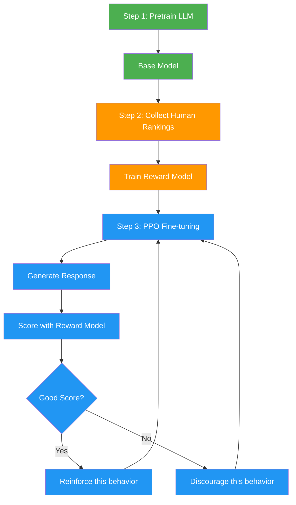
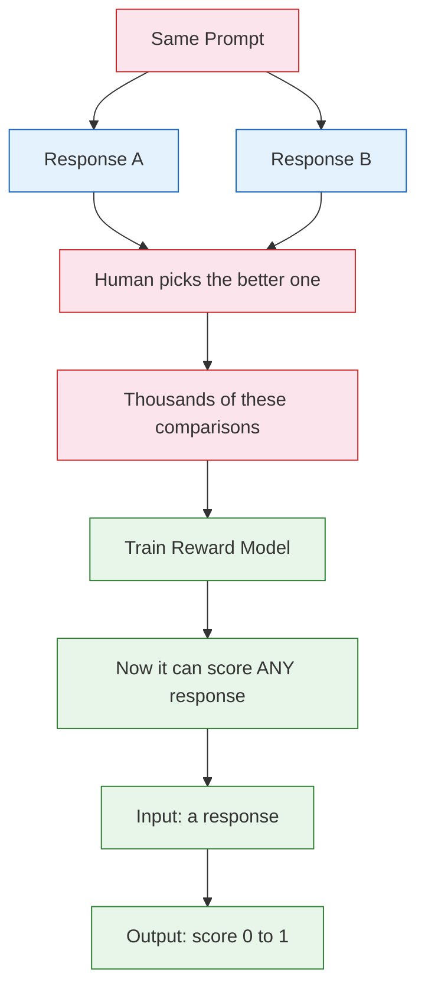
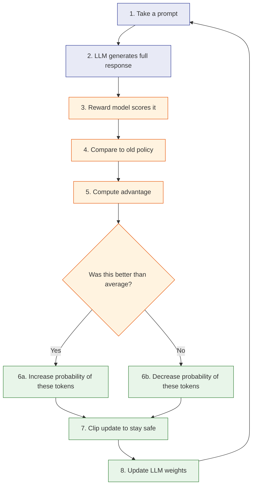

# Monte Carlo Methods in RLHF — A Beginner's Guide

## Key Terms

### State
**Where you are right now.** Everything about your current situation.

- In a maze game: your position, which doors are open, how much health you have.
- In an LLM: the prompt + all the tokens generated so far.

### Action
**One move you can make** from your current state.

- In a maze game: go left, go right, go up, go down.
- In an LLM: picking the next token (word).

### Reward
**The score you get after taking an action.** Tells you how good that move was.

- In a maze game: +100 for reaching treasure, -1 for each step.
- In RLHF: the reward model's score for the completed response.

### Trajectory
**A full sequence of states and actions** from start to finish. One complete playthrough.

- In a maze game: Start -> right -> right -> up -> left -> treasure. That whole path is one trajectory.
- In an LLM: prompt -> token 1 -> token 2 -> ... -> end of response.

### Planning Horizon
**How many steps ahead you think about.** The length of the action sequences you consider.

- Horizon of 1: "What's the best move right now?"
- Horizon of 10: "What's the best sequence of 10 moves from here?"
- Longer horizon = better plans, but way more possibilities to consider.

### Policy
**Your strategy for picking actions.** Given a state, what action do you take?

- In a maze game: "always turn right at intersections" is a (bad) policy.
- In an LLM: the model's weights ARE the policy. They determine the probability of each next token.

---

## What is Monte Carlo?

Imagine you want to figure out the best route to walk to school. You could:

1. Try 100 random routes
2. Time each one
3. Pick the fastest

That's Monte Carlo. **Try a bunch of random things, see what works best.** Named after the casino in Monaco — it's basically strategic gambling.

The key idea: instead of trying to calculate the perfect answer mathematically, just **run simulations and use the results**.

---

## The RLHF Pipeline (3 Stages)

RLHF = Reinforcement Learning from Human Feedback. It's how models like ChatGPT learn to give *good* answers instead of just *any* answer.



### Stage 1 — Pretrain the base model (green)
The AI reads the entire internet and learns to predict the next word. At this point it can write text, but it has no concept of "helpful" vs "unhelpful."

### Stage 2 — Train the reward model (orange)
Humans rank pairs of responses. This teaches a separate "reward model" to score any response the way a human would.

### Stage 3 — PPO fine-tuning with Monte Carlo rollouts (blue)
The LLM generates responses (Monte Carlo rollouts), the reward model scores them, and the LLM updates its weights. This is the core loop.

---

## How the Reward Model is Trained

Before we can do RL, we need a way to score responses automatically. That's the reward model.



1. Give the same prompt to the base model, get two different responses.
2. A human picks which response is better.
3. Repeat this thousands of times.
4. Train a model on these rankings — now it can score any response automatically.

---

## One Monte Carlo Rollout in RLHF

This is what one "rollout" looks like — the LLM generating a complete response, one token at a time.

```mermaid
flowchart LR
    classDef state fill:#E3F2FD,stroke:#1565C0
    classDef action fill:#FFF3E0,stroke:#E65100
    classDef reward fill:#E8F5E9,stroke:#2E7D32
    S0[State: Prompt]:::state --> A1[Action: Token 1]:::action
    A1 --> S1[State: Prompt + Token 1]:::state
    S1 --> A2[Action: Token 2]:::action
    A2 --> S2[State: Prompt + Tokens 1-2]:::state
    S2 --> A3[Action: Token 3]:::action
    A3 --> S3[State: Prompt + Tokens 1-3]:::state
    S3 --> A4[Action: ... more tokens]:::action
    A4 --> S4[State: Full Response]:::state
    S4 --> R[Reward Model Score: 0.85]:::reward
```



- **Blue boxes (states)**: what the model "sees" at each step — the prompt plus everything generated so far.
- **Orange boxes (actions)**: each token the model picks.
- **Green box (reward)**: the score given at the very end by the reward model.

This is Monte Carlo because the model **plays out the entire response to the end** and uses the final score to learn. It doesn't get feedback mid-response.

---

## The PPO Update Cycle

PPO (Proximal Policy Optimization) is the algorithm that actually updates the LLM's weights using the reward signal.



### Step by step:

1. **Take a prompt** — pick a prompt from the training set.
2. **Generate a full response** — this is the Monte Carlo rollout. The LLM writes out a complete answer.
3. **Reward model scores it** — the reward model gives the response a score (e.g., 0.85 out of 1).
4. **Compare to old policy** — how different is the current model from what it was before the last update?
5. **Compute advantage** — "was this response better or worse than what we'd normally expect?" This is the key signal.
6. **Adjust probabilities**:
   - If the response scored **above average**: make the tokens in that response more likely next time.
   - If the response scored **below average**: make those tokens less likely.
7. **Clip the update** — PPO's secret sauce. Don't change too much at once, or the model goes off the rails. The "clip" limits how big each update can be.
8. **Update weights** — apply the (clipped) changes to the LLM's weights.
9. **Repeat** with the next prompt.

### Why "clipping" matters

Without clipping, a single really good (or really bad) response could dramatically change the model. Clipping says: "even if this response was amazing, only adjust a little bit." This keeps training stable.

---

## How All the Terms Connect

```
You're in a STATE         (prompt + tokens so far)
Your POLICY picks an      (the LLM's weights decide)
ACTION                    (the next token)
That takes you to a new   
STATE and gives you a     
REWARD                    (reward model score, at the end)
The full sequence =       
one TRAJECTORY            (one complete response)
Monte Carlo = try many    
TRAJECTORIES and learn    
from the results
```

| Term | Maze Game | LLM in RLHF |
|------|-----------|-------------|
| **State** | Your position in the maze, which doors are open, health remaining | The prompt + all tokens generated so far |
| **Action** | Move left, right, up, or down | Pick the next token (word) |
| **Reward** | +100 for treasure, -1 per step, -50 for hitting a wall | Reward model's score for the full response (e.g., 0.85) |
| **Trajectory** | Start -> right -> right -> up -> left -> treasure | Prompt -> token 1 -> token 2 -> ... -> end of response |
| **Planning Horizon** | How many moves ahead you consider (e.g., 10 steps) | The length of the generated response |
| **Policy** | Your rule for choosing moves ("always turn right") | The LLM's weights (probability distribution over next tokens) |
| **Episode End** | You reach the treasure or run out of health | The model outputs a stop token |
| **What Monte Carlo does** | Try 100 random paths, pick the one that scores highest | Generate full responses, score them, update weights to favor high-scoring patterns |
| **What gets better** | You pick a smarter path right now | The model itself improves over time |

---

## Basketball Analogy

Think of it like a basketball player practicing free throws:

- **Monte Carlo approach (what RLHF uses)**: Shoot the ball, see if it goes in (complete outcome), adjust your form.
- **Alternative (TD learning)**: Have someone judge your elbow angle, wrist flick, etc. mid-shot (partial feedback at each step).

RLHF uses the first approach — generate the whole response, get a score at the end, learn from it.

---

## Monte Carlo for Planning vs. Learning

There are two different uses of Monte Carlo:

| | MC Planning (the PR code) | MC Learning (RLHF) |
|---|---|---|
| **Goal** | Pick the best action right now | Improve the policy over time |
| **How** | Try random action sequences in simulation, pick the best | Generate responses, score them, update weights |
| **Exploration** | Random action sequences | LLM sampling (temperature) |
| **Feedback** | Simulated reward | Reward model score |
| **Result** | A single best action | A better model |

Same core idea: **run it out, see what happens, use the result.**
