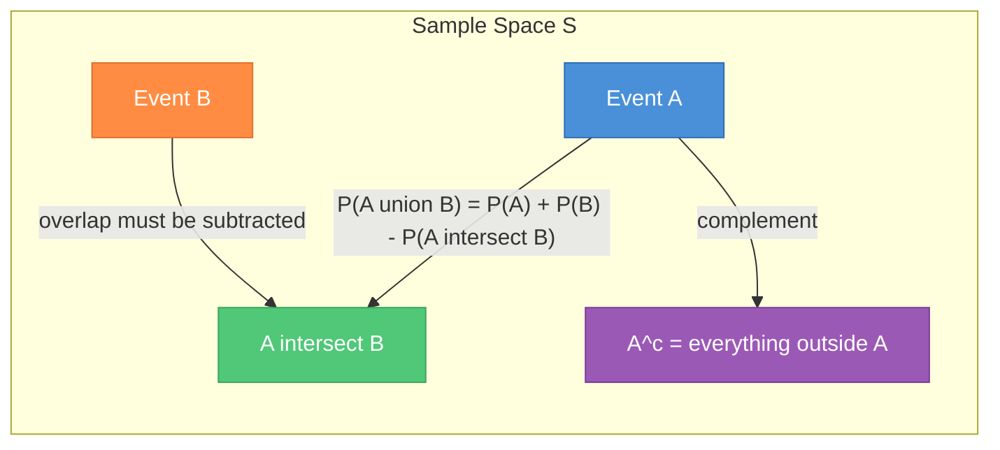
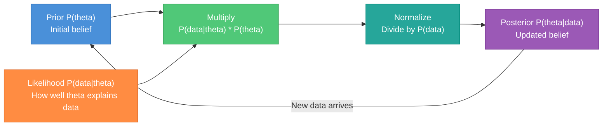
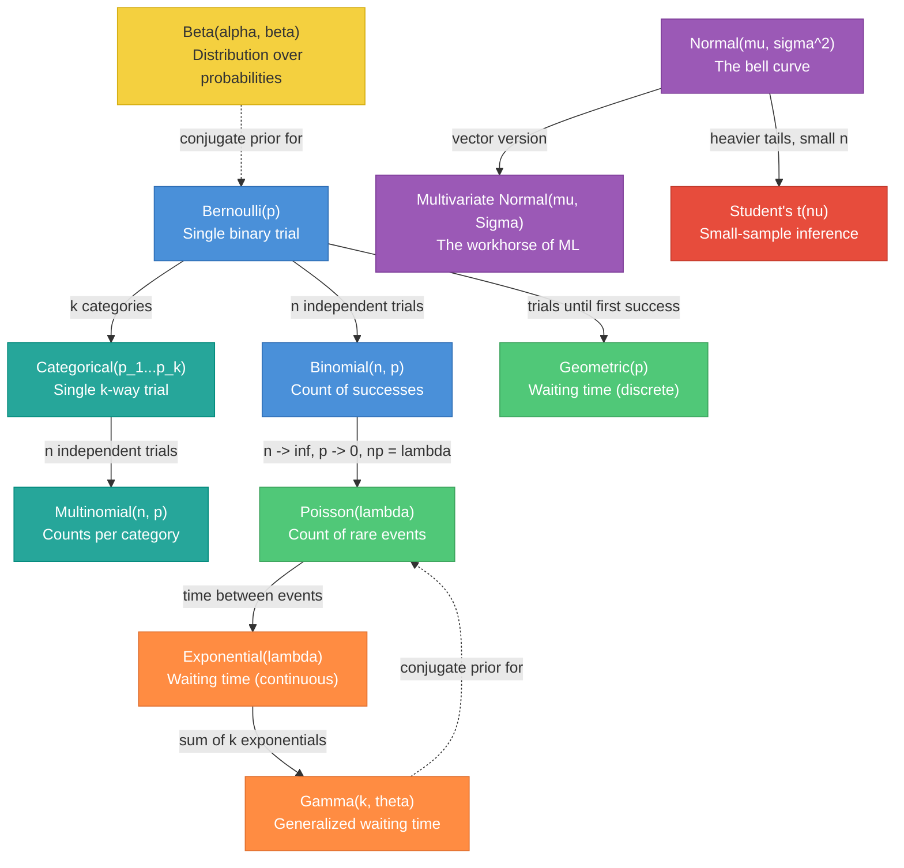
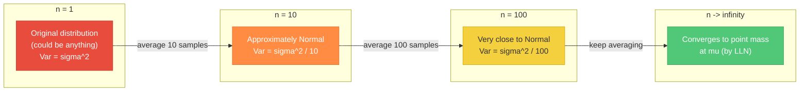
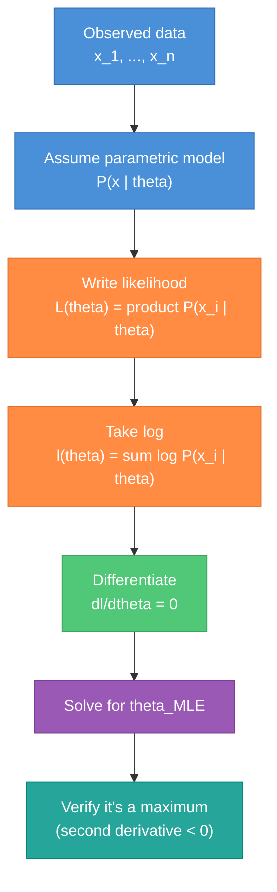
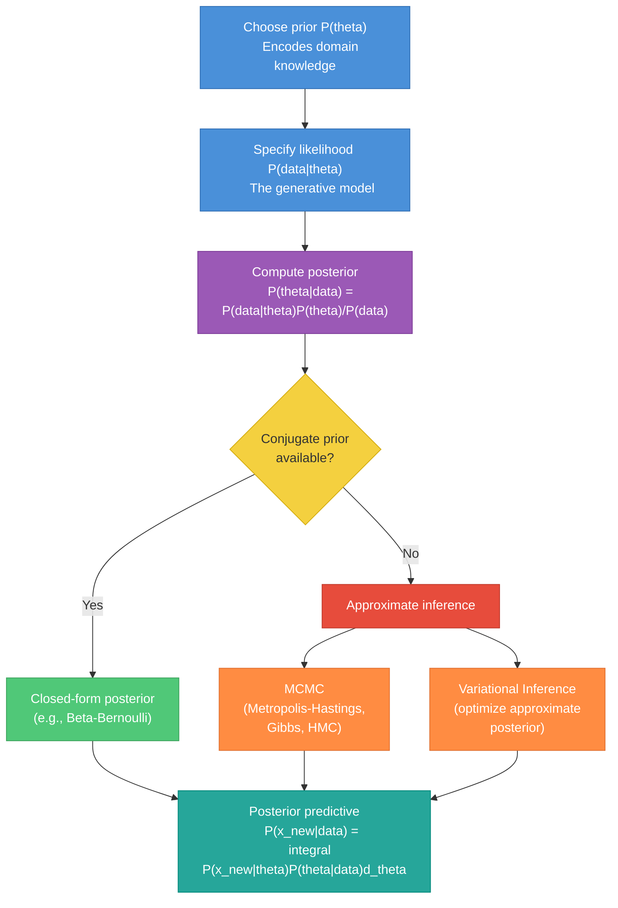
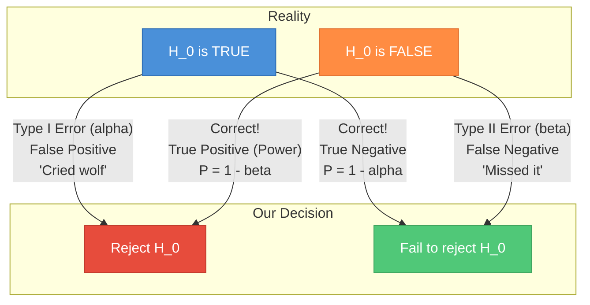
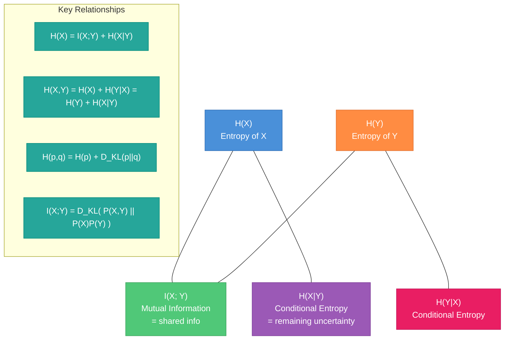
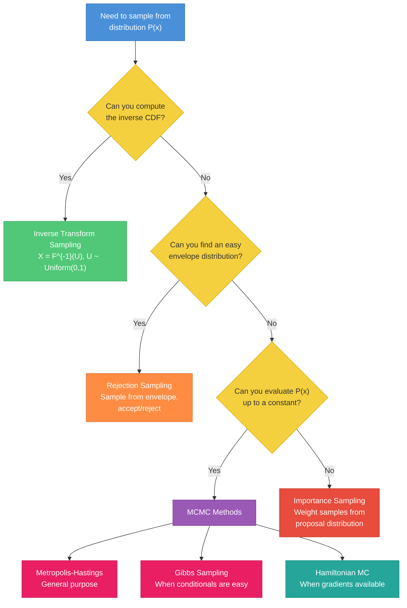

# Probability and Statistics for ML Interviews

A structured reference for probability and statistics concepts that appear in ML engineer interviews. Part 1 covers foundations you must know cold. Part 2 covers advanced topics and their direct applications in machine learning.

---

## Table of Contents

**Part 1 -- Foundations**
1. [Probability Basics](#1-probability-basics)
2. [Conditional Probability and Independence](#2-conditional-probability-and-independence)
3. [Bayes' Theorem](#3-bayes-theorem)
4. [Random Variables](#4-random-variables)
5. [Expectation, Variance, and Covariance](#5-expectation-variance-and-covariance)
6. [Common Distributions](#6-common-distributions)
7. [Joint Distributions and Marginals](#7-joint-distributions-and-marginals)
8. [Law of Large Numbers and Central Limit Theorem](#8-law-of-large-numbers-and-central-limit-theorem)

**Part 2 -- Advanced Topics & ML Applications**
9. [Maximum Likelihood Estimation (MLE)](#9-maximum-likelihood-estimation-mle)
10. [Maximum A Posteriori (MAP) Estimation](#10-maximum-a-posteriori-map-estimation)
11. [Bayesian Inference (Beyond Point Estimates)](#11-bayesian-inference-beyond-point-estimates)
12. [Hypothesis Testing](#12-hypothesis-testing)
13. [Confidence Intervals](#13-confidence-intervals)
14. [Information Theory](#14-information-theory)
15. [The Bias-Variance Tradeoff](#15-the-bias-variance-tradeoff)
16. [Sampling Methods](#16-sampling-methods)
17. [Applications in ML](#17-applications-in-ml)
18. [Interview Questions Checklist](#18-interview-questions-checklist)

---

# Part 1 -- Foundations

---

## 1. Probability Basics

### Core Definitions

- **Experiment.** A process with uncertain outcome (e.g., rolling a die).
- **Sample space `S` (or `Omega`).** The set of all possible outcomes. For a coin flip: `S = {H, T}`. For a die: `S = {1, 2, 3, 4, 5, 6}`.
- **Event.** A subset of the sample space. "Rolling an even number" = `{2, 4, 6}`.
- **Outcome.** A single element of the sample space.

### Axioms of Probability (Kolmogorov)

These three axioms form the foundation. Everything else is derived from them.

1. **Non-negativity:** `P(A) >= 0` for any event `A`
2. **Normalization:** `P(S) = 1` (something must happen)
3. **Additivity:** For mutually exclusive (disjoint) events `A` and `B`: `P(A union B) = P(A) + P(B)`

### Key Rules

| Rule | Formula |
|------|---------|
| Complement | `P(A^c) = 1 - P(A)` |
| Union (general) | `P(A union B) = P(A) + P(B) - P(A intersect B)` |
| Union (disjoint) | `P(A union B) = P(A) + P(B)` |
| Inclusion-exclusion (3 events) | `P(A union B union C) = P(A) + P(B) + P(C) - P(AB) - P(AC) - P(BC) + P(ABC)` |

### Visualizing Set Relationships



**Concrete example.** Draw one card from a standard 52-card deck.
- `P(Heart) = 13/52 = 1/4`
- `P(King) = 4/52 = 1/13`
- `P(Heart AND King) = 1/52` (king of hearts)
- `P(Heart OR King) = 13/52 + 4/52 - 1/52 = 16/52 = 4/13`

### Likely Interview Questions

- What are the axioms of probability? Why do we need them?
- If `P(A) = 0.3` and `P(B) = 0.5` and `P(A intersect B) = 0.1`, what is `P(A union B)`? What is `P(A^c intersect B)`?
- You roll two fair dice. What is the probability the sum is 7?

---

## 2. Conditional Probability and Independence

### Conditional Probability

The probability of `A` given that `B` has occurred:

```
P(A | B) = P(A intersect B) / P(B),   provided P(B) > 0
```

**Intuition:** We restrict the sample space to `B` and ask what fraction of `B` also belongs to `A`.

**Example: two dice.** What is `P(sum = 7 | first die = 3)`?
- `B` = {first die is 3}, so `P(B) = 1/6`
- `A intersect B` = {(3,4)}, so `P(A intersect B) = 1/36`
- `P(A | B) = (1/36) / (1/6) = 1/6`

### Multiplication Rule

Rearranging the definition: `P(A intersect B) = P(A | B) * P(B) = P(B | A) * P(A)`

For multiple events (chain rule):

```
P(A, B, C) = P(A) * P(B | A) * P(C | A, B)
```

This generalizes to `n` events and is the foundation of autoregressive language models.

### Independence

Two events are **independent** if knowing one tells you nothing about the other:

```
P(A intersect B) = P(A) * P(B)
```

Equivalently: `P(A | B) = P(A)` and `P(B | A) = P(B)`.

**Example:** Flipping a fair coin twice. `P(H on flip 1) = 1/2`, `P(H on flip 2) = 1/2`, `P(both H) = 1/4 = 1/2 * 1/2`. Independent.

**Counterexample:** Drawing two cards without replacement. `P(2nd card is Ace | 1st card is Ace) = 3/51 != 4/52`. Not independent.

### Conditional Independence

`A` and `B` are conditionally independent given `C` if:

```
P(A intersect B | C) = P(A | C) * P(B | C)
```

This does NOT imply marginal independence. The naive Bayes classifier assumes features are conditionally independent given the class label -- this is often wrong but works surprisingly well in practice.

### Law of Total Probability

If `B_1, B_2, ..., B_n` partition the sample space (mutually exclusive and exhaustive):

```
P(A) = sum_i P(A | B_i) * P(B_i)
```

**Example:** A factory has 3 machines producing 20%, 30%, 50% of items. Defect rates are 5%, 3%, 1%. What fraction of all items are defective?

```
P(defective) = 0.20 * 0.05 + 0.30 * 0.03 + 0.50 * 0.01
             = 0.010 + 0.009 + 0.005
             = 0.024 = 2.4%
```

### Likely Interview Questions

- Are disjoint events independent? (No -- if `A` and `B` are disjoint and both have positive probability, then `P(A | B) = 0 != P(A)`, so they are dependent.)
- Explain conditional independence. Why does naive Bayes work despite its incorrect assumption?
- Two cards are drawn without replacement. What is the probability both are aces?

---

## 3. Bayes' Theorem

### The Formula

```
P(A | B) = P(B | A) * P(A) / P(B)
```

Using the law of total probability in the denominator:

```
P(A | B) = P(B | A) * P(A) / [P(B | A) * P(A) + P(B | A^c) * P(A^c)]
```

### Terminology

| Term | Symbol | Meaning |
|------|--------|---------|
| Prior | `P(A)` | Belief about `A` before seeing evidence |
| Likelihood | `P(B \| A)` | Probability of evidence given `A` is true |
| Posterior | `P(A \| B)` | Updated belief after seeing evidence |
| Evidence | `P(B)` | Total probability of the evidence (normalizing constant) |

### Bayesian Update Flow



### Worked Example: Medical Testing

A disease affects 1 in 1000 people. A test has:
- **Sensitivity** (true positive rate): `P(test+ | disease) = 0.99`
- **Specificity** (true negative rate): `P(test- | no disease) = 0.99`

You test positive. What is the probability you have the disease?

```
P(disease | test+) = P(test+ | disease) * P(disease) / P(test+)

P(test+) = P(test+ | disease) * P(disease) + P(test+ | no disease) * P(no disease)
         = 0.99 * 0.001 + 0.01 * 0.999
         = 0.00099 + 0.00999
         = 0.01098

P(disease | test+) = 0.00099 / 0.01098 = 0.0902 ~ 9%
```

Despite a 99% accurate test, a positive result only means a ~9% chance of disease. The low prior (prevalence) dominates. This is the **base rate fallacy** -- one of the most important probability results for interviews.

### Why Bayes Matters in ML

- **MAP estimation:** Choose parameters that maximize `P(theta | data)`, not just `P(data | theta)`
- **Bayesian inference:** Maintain full posterior distributions, not point estimates
- **Naive Bayes classifier:** Directly applies Bayes' theorem for classification
- **Bayesian neural networks:** Place priors on weights for uncertainty quantification
- **Spam filtering:** The original Bayesian application in ML

### Likely Interview Questions

- Walk through the medical testing example from scratch on a whiteboard.
- A rare event has a 0.1% base rate. Your detector has 95% recall and 95% precision. What is the false discovery rate?
- Explain how Bayes' theorem connects to the naive Bayes classifier.
- What is the difference between Bayesian and frequentist approaches?

---

## 4. Random Variables

### Types

- **Discrete random variable:** Takes countable values (0, 1, 2, ... or finite set). Examples: number of heads in 10 flips, number of clicks on an ad.
- **Continuous random variable:** Takes values in an interval. Examples: height, temperature, model prediction score.

### Characterizing Distributions

| Function | Discrete | Continuous |
|----------|----------|------------|
| PMF / PDF | `P(X = x)` (probability mass function) | `f(x)` where `P(a <= X <= b) = integral_a^b f(x)dx` |
| CDF | `F(x) = P(X <= x) = sum_{t <= x} P(X = t)` | `F(x) = integral_{-inf}^{x} f(t) dt` |

Key properties:
- PMF: `P(X = x) >= 0` and `sum_x P(X = x) = 1`
- PDF: `f(x) >= 0` and `integral_{-inf}^{inf} f(x) dx = 1`. Note: `f(x)` can exceed 1 (it is a density, not a probability).
- CDF: non-decreasing, right-continuous, `F(-inf) = 0`, `F(inf) = 1`
- Relationship: `f(x) = F'(x)` (derivative of CDF gives PDF)

**Common gotcha in interviews:** For continuous RVs, `P(X = x) = 0` for any specific value `x`. Only intervals have nonzero probability.

### Likely Interview Questions

- Can a PDF value be greater than 1? (Yes -- `Uniform(0, 0.5)` has `f(x) = 2` on `[0, 0.5]`.)
- What is the relationship between PDF and CDF?
- What is `P(X = 3)` if `X` is continuous? (Zero.)

---

## 5. Expectation, Variance, and Covariance

### Expectation (Mean)

```
Discrete:   E[X] = sum_x  x * P(X = x)
Continuous: E[X] = integral  x * f(x) dx
```

**Law of the Unconscious Statistician (LOTUS):** For a function `g(X)`:

```
E[g(X)] = sum_x g(x) * P(X = x)   or   integral g(x) * f(x) dx
```

No need to find the distribution of `g(X)` first.

### Properties of Expectation

| Property | Formula | Conditions |
|----------|---------|------------|
| Linearity | `E[aX + bY] = aE[X] + bE[Y]` | **Always** holds, even if `X`, `Y` are dependent |
| Product (independent) | `E[XY] = E[X] * E[Y]` | Only if `X`, `Y` are independent |
| Constant | `E[c] = c` | -- |

**Linearity of expectation is the single most useful property in probability.** It lets you decompose complex expectations into simple pieces without worrying about dependencies.

**Example:** Expected number of fixed points in a random permutation of `n` elements. Let `X_i = 1` if element `i` is in position `i`. Then `E[X] = sum E[X_i] = n * (1/n) = 1`. Despite the `X_i` being dependent, linearity works perfectly.

### Variance

```
Var(X) = E[(X - mu)^2] = E[X^2] - (E[X])^2
```

The second form (`E[X^2] - (E[X])^2`) is the **computational formula** -- use it on whiteboards.

**Properties:**
- `Var(X) >= 0` always
- `Var(c) = 0` for any constant `c`
- `Var(aX + b) = a^2 * Var(X)` (shifting doesn't change spread, scaling squares)
- `Var(X + Y) = Var(X) + Var(Y) + 2*Cov(X, Y)`
- If `X`, `Y` independent: `Var(X + Y) = Var(X) + Var(Y)`

### Covariance and Correlation

```
Cov(X, Y) = E[(X - mu_X)(Y - mu_Y)] = E[XY] - E[X]*E[Y]
```

**Correlation** (Pearson):

```
rho(X, Y) = Cov(X, Y) / (sigma_X * sigma_Y)
```

- `rho` is in `[-1, 1]`
- `rho = 1` means perfect positive linear relationship
- `rho = 0` means uncorrelated (no linear relationship)

### Covariance Matrix

For a random vector `X = [X_1, ..., X_n]^T`:

```
Sigma = Cov(X) = E[(X - mu)(X - mu)^T]
```

The `(i, j)` entry is `Cov(X_i, X_j)`. Diagonal entries are variances. The matrix is symmetric and positive semi-definite.

This appears everywhere in ML: multivariate Gaussians, PCA, Mahalanobis distance, Kalman filters.

### The Critical Subtlety: Uncorrelated != Independent

`Cov(X, Y) = 0` means no *linear* relationship. But there can be nonlinear dependencies.

**Classic counterexample:** Let `X ~ Uniform(-1, 1)` and `Y = X^2`.
- `E[XY] = E[X^3] = 0` (odd function, symmetric distribution)
- `E[X] = 0`, so `Cov(X, Y) = 0 - 0 = 0`
- But `Y` is completely determined by `X`. They are maximally dependent yet uncorrelated.

**Exception:** For jointly Gaussian random variables, uncorrelated DOES imply independent.

### Likely Interview Questions

- Prove `Var(X) = E[X^2] - (E[X])^2` from the definition.
- Give an example where two variables are uncorrelated but dependent.
- What is the variance of the sum of 100 independent rolls of a fair die?
- Explain why linearity of expectation doesn't require independence.

---

## 6. Common Distributions

### Distribution Family Relationships



### Discrete Distributions

| Distribution | PMF | Mean | Variance | When to Use |
|-------------|-----|------|----------|-------------|
| Bernoulli(p) | `P(X=1) = p, P(X=0) = 1-p` | `p` | `p(1-p)` | Single yes/no trial: click, purchase, spam |
| Binomial(n, p) | `C(n,k) p^k (1-p)^(n-k)` | `np` | `np(1-p)` | Count of successes in fixed trials |
| Categorical(p) | `P(X=i) = p_i` | -- | -- | Classification output, one-of-k encoding |
| Poisson(lambda) | `e^{-lambda} lambda^k / k!` | `lambda` | `lambda` | Counts of rare events: website visits, typos |
| Geometric(p) | `(1-p)^{k-1} p` | `1/p` | `(1-p)/p^2` | Trials until first success |

**Bernoulli(p).** The simplest distribution. Binary classification targets follow this. The sigmoid output of logistic regression parameterizes `p`.

**Binomial(n, p).** The sum of `n` independent Bernoulli trials. If you flip a coin 100 times, the number of heads is `Binomial(100, 0.5)`.

**Poisson(lambda).** Models count data. The key property: `E[X] = Var(X) = lambda`. Useful approximation: `Binomial(n, p)` approaches `Poisson(np)` when `n` is large and `p` is small.

### Continuous Distributions

| Distribution | PDF | Mean | Variance | When to Use |
|-------------|-----|------|----------|-------------|
| Uniform(a, b) | `1/(b-a)` on `[a,b]` | `(a+b)/2` | `(b-a)^2/12` | Random number generation, max-entropy (bounded) |
| Normal(mu, sigma^2) | `(1/sqrt(2*pi*sigma^2)) exp(-(x-mu)^2 / (2*sigma^2))` | `mu` | `sigma^2` | Everywhere -- CLT, noise, priors |
| Exponential(lambda) | `lambda * exp(-lambda*x)` for `x >= 0` | `1/lambda` | `1/lambda^2` | Time between events, memoryless |
| Beta(alpha, beta) | `x^{alpha-1}(1-x)^{beta-1} / B(alpha,beta)` | `alpha/(alpha+beta)` | see below | Prior for probabilities, Bayesian A/B testing |
| Gamma(alpha, beta) | `beta^alpha x^{alpha-1} e^{-beta*x} / Gamma(alpha)` | `alpha/beta` | `alpha/beta^2` | Conjugate prior for Poisson rate |
| Student's t(nu) | (complex) | `0` (for `nu > 1`) | `nu/(nu-2)` (for `nu > 2`) | Small-sample confidence intervals |

**Normal (Gaussian).** The most important distribution. The **68-95-99.7 rule**:
- 68% of data within `mu +/- 1*sigma`
- 95% within `mu +/- 2*sigma`
- 99.7% within `mu +/- 3*sigma`

**Multivariate Normal `N(mu, Sigma)`.** Defined by mean vector `mu` and covariance matrix `Sigma`. The workhorse of ML:
- Linear regression assumes `y | x ~ N(x^T w, sigma^2)`
- PCA finds the directions of maximum variance in a multivariate Gaussian
- Gaussian processes generalize this to infinite dimensions
- GAN critics and VAE latent spaces use it

**Exponential.** The continuous analog of geometric. Key property: **memoryless** -- `P(X > s + t | X > s) = P(X > t)`. The only continuous memoryless distribution.

**Beta(alpha, beta).** A distribution over `[0, 1]` -- perfect for modeling probabilities. `Beta(1, 1) = Uniform(0, 1)`. As a conjugate prior for Bernoulli: if prior is `Beta(alpha, beta)` and you observe `k` successes in `n` trials, the posterior is `Beta(alpha + k, beta + n - k)`. Widely used in Bayesian A/B testing.

### Likely Interview Questions

- You see events arriving at 5 per minute on average. What distribution models the count in 10 minutes? The time between events?
- What is the conjugate prior for the Bernoulli distribution? Work through a Bayesian update.
- State and explain the 68-95-99.7 rule.
- Why is the normal distribution so prevalent? (CLT, maximum entropy for given mean and variance, analytical tractability.)

---

## 7. Joint Distributions and Marginals

### Joint PMF / PDF

For two random variables `X` and `Y`:

```
Discrete:   P(X = x, Y = y)        summing over all x, y gives 1
Continuous: f(x, y)                 double integral over all x, y gives 1
```

### Marginal Distributions

Recover the distribution of one variable by summing/integrating out the other:

```
Discrete:   P(X = x) = sum_y P(X = x, Y = y)
Continuous: f_X(x) = integral f(x, y) dy
```

### Conditional Distributions

```
f(y | x) = f(x, y) / f_X(x)
```

This is just Bayes' rule applied to densities.

### Independence Criterion

`X` and `Y` are independent if and only if their joint factors:

```
f(x, y) = f_X(x) * f_Y(y)    for all x, y
```

**Quick test:** If the joint PDF/PMF can be written as `g(x) * h(y)` for some functions `g` and `h`, the variables are independent.

**Example:** `f(x, y) = 6x^2 * y` for `0 < x < 1, 0 < y < 1`. This factors as `(6x^2)(y)`, but we need to check normalization. Integral = `integral_0^1 6x^2 dx * integral_0^1 y dy = 2 * 0.5 = 1`. Factors into valid marginals, so `X` and `Y` are independent.

### Likely Interview Questions

- Given a joint distribution table, compute marginals and conditional distributions.
- How do you test if two variables are independent from their joint PDF?
- What is the marginal distribution of one component of a multivariate normal?

---

## 8. Law of Large Numbers and Central Limit Theorem

### Law of Large Numbers (LLN)

Let `X_1, X_2, ..., X_n` be i.i.d. with mean `mu`. The sample mean `X_bar = (1/n) sum X_i` converges to `mu` as `n -> infinity`.

- **Weak LLN:** `X_bar` converges to `mu` in probability: for any `epsilon > 0`, `P(|X_bar - mu| > epsilon) -> 0`
- **Strong LLN:** `X_bar` converges to `mu` almost surely (with probability 1)

**Why it matters:** LLN justifies using sample averages to estimate population means. SGD works because mini-batch gradients are unbiased estimators of the true gradient, and LLN ensures they average out.

### Central Limit Theorem (CLT)

Let `X_1, ..., X_n` be i.i.d. with mean `mu` and variance `sigma^2`. Then:

```
sqrt(n) * (X_bar - mu) / sigma  -->  N(0, 1)    as n -> infinity
```

Equivalently: `X_bar ~ approximately N(mu, sigma^2 / n)` for large `n`.

**The remarkable thing:** This holds regardless of the original distribution of `X_i` (as long as it has finite variance). Whether the `X_i` are Bernoulli, Poisson, exponential, or any other distribution, the sample mean looks Gaussian for large enough `n`.

### CLT Visualization: Averaging Narrows the Distribution



**Practical rule of thumb:** `n >= 30` is often cited as "large enough" for CLT to kick in, but this depends heavily on the shape of the original distribution. Symmetric distributions converge faster; heavily skewed distributions may need much larger `n`.

### Why CLT Matters for ML

1. **Confidence intervals** for model metrics (accuracy, loss) rely on CLT
2. **Mini-batch gradient estimates** in SGD are approximately normal by CLT
3. **Justifies Gaussian noise assumptions** in many models
4. **A/B testing** statistical significance tests assume normality of sample means

### Likely Interview Questions

- State the CLT. What conditions are needed?
- Why is the normal distribution so common in nature? (CLT -- many phenomena are sums of small independent effects.)
- If `X_i ~ Bernoulli(0.5)`, what is the approximate distribution of `(1/1000) sum X_i`?
- What is the difference between LLN and CLT? (LLN says the mean converges; CLT says how it's distributed along the way.)

---

# Part 2 -- Advanced Topics & ML Applications

---

## 9. Maximum Likelihood Estimation (MLE)

### The Principle

Given observed data `x_1, ..., x_n` from a distribution with unknown parameter `theta`, find the `theta` that makes the data most probable:

```
theta_MLE = argmax_theta  P(x_1, ..., x_n | theta)
```

Assuming i.i.d. data:

```
theta_MLE = argmax_theta  product_{i=1}^{n} P(x_i | theta)
```

### The Log-Likelihood Trick

Products are numerically unstable and hard to differentiate. Take the log (monotonic, so same argmax):

```
theta_MLE = argmax_theta  sum_{i=1}^{n} log P(x_i | theta)
```

This is the **log-likelihood** `l(theta)`. Maximizing log-likelihood = minimizing negative log-likelihood (NLL), which is the standard loss function in deep learning.

### MLE Process Flow



### Derivation: MLE for Gaussian (Know This Cold)

Given `x_1, ..., x_n ~ N(mu, sigma^2)`:

```
Log-likelihood:
l(mu, sigma^2) = sum_{i=1}^{n} log[ (1/sqrt(2*pi*sigma^2)) exp(-(x_i - mu)^2 / (2*sigma^2)) ]
               = -n/2 * log(2*pi) - n/2 * log(sigma^2) - (1/(2*sigma^2)) sum (x_i - mu)^2

Maximize w.r.t. mu:
dl/dmu = (1/sigma^2) sum (x_i - mu) = 0
=> sum (x_i - mu) = 0
=> mu_MLE = (1/n) sum x_i = sample mean

Maximize w.r.t. sigma^2:
dl/d(sigma^2) = -n/(2*sigma^2) + (1/(2*sigma^4)) sum (x_i - mu)^2 = 0
=> sigma^2_MLE = (1/n) sum (x_i - mu_MLE)^2
```

**Important note:** `sigma^2_MLE` is **biased** -- it underestimates the true variance. The unbiased estimator divides by `(n-1)` instead of `n`. This is Bessel's correction.

### Derivation: MLE for Bernoulli

Given `x_1, ..., x_n ~ Bernoulli(p)` where each `x_i` is 0 or 1:

```
l(p) = sum [x_i * log(p) + (1 - x_i) * log(1 - p)]
     = k * log(p) + (n - k) * log(1 - p)     where k = sum x_i

dl/dp = k/p - (n-k)/(1-p) = 0
=> k(1-p) = (n-k)p
=> k = np
=> p_MLE = k/n = (number of 1s) / n
```

This is just the sample proportion, as you'd expect.

### Properties of MLE

- **Consistent:** `theta_MLE -> theta_true` as `n -> infinity`
- **Asymptotically efficient:** Achieves the Cramer-Rao lower bound for variance
- **Asymptotically normal:** `sqrt(n)(theta_MLE - theta_true) -> N(0, I(theta)^{-1})` where `I(theta)` is the Fisher information
- **Equivariant:** If `theta_MLE` is the MLE of `theta`, then `g(theta_MLE)` is the MLE of `g(theta)`

### Limitations

- Can overfit with small datasets (no regularization)
- May not exist or be unique for some models
- Point estimate only -- no uncertainty quantification
- Can be sensitive to model misspecification

### Likely Interview Questions

- Derive the MLE for the mean and variance of a Gaussian.
- Why do we minimize negative log-likelihood instead of maximizing likelihood directly?
- Is the MLE for Gaussian variance biased? Why?
- How does cross-entropy loss relate to MLE? (Minimizing cross-entropy = maximizing log-likelihood under a categorical model.)

---

## 10. Maximum A Posteriori (MAP) Estimation

### The Principle

Instead of maximizing `P(data | theta)`, maximize the posterior:

```
theta_MAP = argmax_theta  P(theta | data)
          = argmax_theta  P(data | theta) * P(theta)     (dropping P(data), which doesn't depend on theta)
          = argmax_theta  [log P(data | theta) + log P(theta)]
```

**MAP = MLE + prior.** The prior `P(theta)` acts as a regularizer.

### Derivation: Ridge Regression as MAP with Gaussian Prior

**Setup:** Linear regression `y = X*w + epsilon`, `epsilon ~ N(0, sigma^2*I)`.

Place a Gaussian prior on weights: `w ~ N(0, tau^2 * I)`.

```
log P(w | data) = log P(data | w) + log P(w) + const

Log-likelihood: log P(data | w) = -(1/(2*sigma^2)) ||y - Xw||^2 + const

Log-prior: log P(w) = -(1/(2*tau^2)) ||w||^2 + const

MAP objective:
theta_MAP = argmax_w  [-(1/(2*sigma^2)) ||y - Xw||^2 - (1/(2*tau^2)) ||w||^2]
          = argmin_w  [||y - Xw||^2 + (sigma^2/tau^2) ||w||^2]
          = argmin_w  [||y - Xw||^2 + lambda * ||w||^2]
```

where `lambda = sigma^2 / tau^2`. This is exactly **Ridge regression (L2 regularization)**.

### Derivation: Lasso as MAP with Laplace Prior

Place a Laplace prior: `P(w_j) proportional to exp(-|w_j| / b)`.

```
Log-prior: log P(w) = -(1/b) sum |w_j| + const

MAP objective:
argmin_w  [||y - Xw||^2 + (sigma^2/b) sum |w_j|]
= argmin_w  [||y - Xw||^2 + lambda * ||w||_1]
```

This is **Lasso (L1 regularization)**. The Laplace prior's sharp peak at zero encourages sparsity.

### MLE vs MAP

| Aspect | MLE | MAP |
|--------|-----|-----|
| Objective | `max P(data \| theta)` | `max P(theta \| data)` |
| Regularization | None (implicit) | Built-in via prior |
| Small data | Prone to overfitting | More robust |
| Large data | MLE and MAP converge | Prior gets overwhelmed by data |
| Interpretation | Frequentist | Bayesian (point estimate) |

### Connection to Neural Network Training

Standard neural network training with weight decay is MAP estimation:
- **Loss function** = negative log-likelihood (cross-entropy, MSE)
- **Weight decay** = Gaussian prior on weights
- **L1 regularization** = Laplace prior on weights
- **Dropout** can be interpreted as an approximate Bayesian posterior

### Likely Interview Questions

- Derive why L2 regularization corresponds to a Gaussian prior on weights.
- What prior gives L1 regularization? Why does it promote sparsity?
- When does MAP differ significantly from MLE? (Small data, strong priors.)
- Is weight decay in neural networks a form of MAP estimation?

---

## 11. Bayesian Inference (Beyond Point Estimates)

### Full Posterior

Unlike MLE (which gives a single `theta`) or MAP (which gives the mode of the posterior), full Bayesian inference maintains the entire posterior distribution:

```
P(theta | data) = P(data | theta) * P(theta) / P(data)

where P(data) = integral P(data | theta) * P(theta) d_theta    (the "evidence")
```

### Posterior Predictive Distribution

To predict a new data point `x_new`, average over all possible parameter values:

```
P(x_new | data) = integral P(x_new | theta) * P(theta | data) d_theta
```

This automatically accounts for parameter uncertainty. Predictions are less confident when the posterior is wide (little data) and more confident when it's narrow (lots of data).

### Conjugate Priors

When the posterior is in the same family as the prior, we say the prior is **conjugate** to the likelihood. This makes the math tractable.

| Likelihood | Conjugate Prior | Posterior |
|------------|----------------|-----------|
| Bernoulli(p) | Beta(alpha, beta) | Beta(alpha + k, beta + n - k) |
| Normal(mu, known sigma^2) | Normal(mu_0, sigma_0^2) | Normal(weighted average, ...) |
| Poisson(lambda) | Gamma(alpha, beta) | Gamma(alpha + sum x_i, beta + n) |
| Categorical(p) | Dirichlet(alpha) | Dirichlet(alpha + counts) |

**Beta-Bernoulli example:** Prior `Beta(2, 2)` (mild belief that `p ~ 0.5`). Observe 7 heads in 10 flips. Posterior: `Beta(2+7, 2+3) = Beta(9, 5)`. Posterior mean: `9/14 = 0.643`.

### Bayesian Inference Pipeline



### Why Full Bayesian is Hard

The denominator `P(data) = integral P(data | theta) * P(theta) d_theta` (called the **evidence** or **marginal likelihood**) is typically intractable. For a model with `d` parameters, this is a `d`-dimensional integral with no closed form.

**Solutions:**
- **MCMC:** Sample from the posterior without computing the evidence. Asymptotically exact but slow.
- **Variational Inference:** Approximate the posterior with a simpler distribution. Fast but approximate.

### Likely Interview Questions

- What is a conjugate prior? Give an example.
- Why is full Bayesian inference usually intractable?
- What is the posterior predictive distribution? How does it differ from a plug-in estimate?
- Compare MCMC and variational inference: when would you use each?

---

## 12. Hypothesis Testing

### Framework

- **Null hypothesis `H_0`:** The default claim (e.g., "the new model is no better than the baseline")
- **Alternative hypothesis `H_1`:** What we want to show (e.g., "the new model is better")
- **Test statistic:** A number computed from data that measures evidence against `H_0`
- **p-value:** Probability of seeing a test statistic this extreme (or more) if `H_0` is true

### Decision Matrix



| Error | Name | Probability | ML Analog |
|-------|------|-------------|-----------|
| Type I | False positive | `alpha` (significance level, typically 0.05) | Model says positive when actually negative |
| Type II | False negative | `beta` | Model misses a true positive |
| Power | True positive rate | `1 - beta` | Recall / sensitivity |

### p-value

The p-value is the probability of observing data as extreme as (or more extreme than) what we saw, assuming `H_0` is true.

- If `p-value < alpha`: reject `H_0` (result is "statistically significant")
- If `p-value >= alpha`: fail to reject `H_0` (NOT the same as accepting `H_0`)

**Common misinterpretation:** The p-value is NOT `P(H_0 is true | data)`. It's `P(data this extreme | H_0 is true)`. These are very different (see Bayes' theorem).

### Multiple Testing Problem

If you run 20 independent tests at `alpha = 0.05`, the probability of at least one false positive is `1 - (0.95)^20 = 0.64`. You'll almost certainly find something "significant" by chance.

**Bonferroni correction:** Use `alpha / m` as the threshold, where `m` is the number of tests. Conservative but simple.

**Benjamini-Hochberg:** Controls the false discovery rate (FDR) instead of the family-wise error rate. More powerful.

### Connection to ML: A/B Testing

When deploying a new model, run an A/B test:
1. `H_0`: new model performs the same as baseline
2. Choose metric (click-through rate, conversion, etc.)
3. Calculate required sample size for desired power
4. Run experiment, compute p-value
5. If significant, deploy new model

**Practical considerations:**
- Multiple metrics = multiple testing problem
- Network effects can violate independence
- Need to account for novelty effects and seasonality
- Sequential testing (peeking) inflates false positive rate -- use sequential analysis methods

### Likely Interview Questions

- What is the difference between Type I and Type II errors? Which is usually considered worse?
- Explain the p-value in plain English. What is a common misinterpretation?
- How do you determine sample size for an A/B test?
- You're testing 100 features for significance. How do you correct for multiple testing?

---

## 13. Confidence Intervals

### Definition

A `(1 - alpha)` confidence interval `[L, U]` for parameter `theta` satisfies:

```
P(L <= theta <= U) = 1 - alpha
```

For the mean of a normal distribution with known variance:

```
X_bar +/- z_{alpha/2} * sigma / sqrt(n)
```

where `z_{alpha/2}` is the critical value from the standard normal (`z_{0.025} = 1.96` for 95% CI).

### Interpretation

**Correct:** "If we repeated this experiment many times, 95% of the resulting intervals would contain the true parameter."

**Incorrect:** "There is a 95% probability that `theta` is in this specific interval." (This is wrong because `theta` is a fixed number, not random. The interval is random.)

This is one of the most commonly misunderstood concepts in statistics and a frequent interview gotcha.

### Factors Affecting Width

| Factor | Effect on CI Width |
|--------|-------------------|
| Larger sample size `n` | Narrower (by `1/sqrt(n)`) |
| Higher confidence `1-alpha` | Wider |
| More variability `sigma` | Wider |

### Bootstrap Confidence Intervals

When you don't know the sampling distribution of your statistic:

1. From your sample of size `n`, draw `B` bootstrap samples (sample with replacement, each of size `n`)
2. Compute the statistic of interest for each bootstrap sample
3. Use the percentiles of the bootstrap distribution as CI endpoints

**Example:** For a 95% CI, take the 2.5th and 97.5th percentiles of the `B` bootstrap statistics.

Bootstrap is extremely useful in ML for:
- Confidence intervals on model accuracy
- Uncertainty in feature importance scores
- Stability of cross-validation estimates

### Likely Interview Questions

- What does a 95% confidence interval actually mean? (NOT "95% probability the parameter is in the interval.")
- How does sample size affect the width of a confidence interval?
- Explain the bootstrap. When would you use it instead of an analytical confidence interval?
- Your model's test accuracy is 85% on 1000 samples. What is the 95% confidence interval?
  - `p = 0.85`, `SE = sqrt(p(1-p)/n) = sqrt(0.85*0.15/1000) = 0.0113`
  - CI: `0.85 +/- 1.96 * 0.0113 = [0.828, 0.872]`

---

## 14. Information Theory

### Entropy

Measures the average uncertainty (or information content) of a random variable:

```
H(X) = -sum_x P(x) * log P(x)
```

- **Units:** bits (log base 2) or nats (natural log)
- **Interpretation:** The average number of bits needed to encode an outcome
- **Maximum** when `X` is uniform (maximum uncertainty)
- **Zero** when `X` is deterministic (no uncertainty)

**Example:** A fair coin: `H = -(0.5 * log2(0.5) + 0.5 * log2(0.5)) = 1 bit`. A biased coin with `P(H) = 0.9`: `H = -(0.9 * log2(0.9) + 0.1 * log2(0.1)) = 0.469 bits`. Less uncertainty.

### Cross-Entropy

Measures how well distribution `q` predicts data from distribution `p`:

```
H(p, q) = -sum_x p(x) * log q(x)
```

**This is the standard classification loss function.** When training a neural network for classification:
- `p` = true labels (one-hot)
- `q` = model's predicted probabilities (softmax output)
- Minimizing cross-entropy = making `q` closer to `p`

Relationship: `H(p, q) = H(p) + D_KL(p || q)`. Since `H(p)` is fixed (determined by the data), minimizing cross-entropy = minimizing KL divergence.

### KL Divergence

Measures how different distribution `q` is from distribution `p`:

```
D_KL(p || q) = sum_x p(x) * log(p(x) / q(x))
             = E_p[log(p(x) / q(x))]
```

Key properties:
- `D_KL(p || q) >= 0` (Gibbs' inequality)
- `D_KL(p || q) = 0` iff `p = q`
- **Not symmetric:** `D_KL(p || q) != D_KL(q || p)`
- Not a true distance metric (fails triangle inequality too)

**Forward KL `D_KL(p || q)`** (mode-covering): The approximation `q` tries to cover all modes of `p`. Used in variational inference (evidence lower bound).

**Reverse KL `D_KL(q || p)`** (mode-seeking): The approximation `q` concentrates on the dominant mode of `p`. Can ignore minor modes.

This distinction is critical for understanding VAEs and variational inference.

### Mutual Information

```
I(X; Y) = H(X) - H(X | Y)
         = H(Y) - H(Y | X)
         = D_KL(P(X, Y) || P(X)P(Y))
```

- Measures the shared information between `X` and `Y`
- `I(X; Y) = 0` iff `X` and `Y` are independent
- Unlike correlation, captures nonlinear dependencies
- Used in feature selection, representation learning (InfoNCE loss), and mutual information neural estimation (MINE)

### Information Theory Relationships



### Likely Interview Questions

- What is the cross-entropy loss and how does it relate to KL divergence?
- What is the difference between forward and reverse KL divergence? Why does it matter for VAEs?
- A model outputs uniform probabilities over 10 classes. What is the cross-entropy loss with a one-hot label?
  - `H(p, q) = -log(1/10) = log(10) = 2.303 nats`
- What is mutual information? How does it differ from correlation?

---

## 15. The Bias-Variance Tradeoff

### The Decomposition (Derivation for Squared Loss)

For a prediction `h_hat(x)` trained on random training data `D`, and true function `y = f(x) + epsilon` where `epsilon ~ N(0, sigma^2)`:

```
E_D[(y - h_hat(x))^2]

= E_D[(f(x) + epsilon - h_hat(x))^2]

= E_D[(f(x) - E[h_hat(x)] + E[h_hat(x)] - h_hat(x) + epsilon)^2]

Expanding and using E[epsilon] = 0, independence of epsilon from h_hat:

= (f(x) - E[h_hat(x)])^2 + E_D[(h_hat(x) - E[h_hat(x)])^2] + sigma^2

= Bias^2              +  Variance                         +  Irreducible noise
```

**Bias^2 = (f(x) - E[h_hat(x)])^2:** How far the average prediction is from the truth. Caused by overly simplistic model assumptions.

**Variance = E[(h_hat(x) - E[h_hat(x)])^2]:** How much predictions vary across different training sets. Caused by model sensitivity to training data.

**Irreducible noise = sigma^2:** The inherent noise in the data. No model can do better than this.

### Practical Implications

| | High Bias | Low Bias |
|---|-----------|----------|
| **High Variance** | (Shouldn't happen -- both problems at once means something is very wrong) | Overfitting: complex model, small data. Decision tree with no pruning, high-degree polynomial |
| **Low Variance** | Underfitting: too simple a model. Linear regression for nonlinear data | The sweet spot |

### Regularization Trades Variance for Bias

- **MLE** (no regularization): low bias, high variance (especially with small `n`)
- **MAP / regularized** (L1, L2, dropout): introduces bias via the prior, but reduces variance
- **Ensemble methods** (bagging, random forests): reduce variance by averaging many high-variance models
- **Boosting** (AdaBoost, gradient boosting): reduce bias by combining many high-bias models

### Likely Interview Questions

- Derive the bias-variance decomposition for squared loss.
- How does model complexity relate to bias and variance?
- How does regularization affect bias and variance?
- Why do ensemble methods work? (Random forests reduce variance; boosting reduces bias.)
- A model has high training error and high test error. Is this a bias or variance problem? (Bias -- the model underfits.)

---

## 16. Sampling Methods

### Why Sampling?

Many quantities in ML require expectations or integrals that have no closed form:
- Posterior distributions in Bayesian inference
- Marginal likelihoods for model comparison
- Expected values under complex distributions

Sampling methods let us approximate these by drawing samples from the target distribution.

### Sampling Methods Decision Tree



### Inverse Transform Sampling

If `F` is the CDF of the target distribution and `U ~ Uniform(0, 1)`:

```
X = F^{-1}(U) ~ target distribution
```

**Example:** Exponential distribution. `F(x) = 1 - e^{-lambda*x}`. Setting `U = 1 - e^{-lambda*x}`, solve: `X = -ln(1 - U) / lambda`. Since `1 - U ~ Uniform(0, 1)`, equivalently `X = -ln(U) / lambda`.

**Limitation:** Requires a closed-form, invertible CDF. Not available for most distributions.

### Rejection Sampling

To sample from target `p(x)`:
1. Choose proposal distribution `q(x)` and constant `M` such that `M * q(x) >= p(x)` for all `x`
2. Sample `x ~ q(x)`
3. Sample `u ~ Uniform(0, 1)`
4. Accept `x` if `u < p(x) / (M * q(x))`, otherwise reject and repeat

**Acceptance rate:** `1/M`. In high dimensions, `M` is typically huge, making rejection sampling impractical.

### Importance Sampling

Compute expectations under `p` using samples from a different distribution `q`:

```
E_p[f(x)] = integral f(x) * p(x) dx
           = integral f(x) * (p(x)/q(x)) * q(x) dx
           = E_q[f(x) * w(x)]      where w(x) = p(x)/q(x) are importance weights
```

Approximate with samples `x_1, ..., x_n ~ q`:

```
E_p[f(x)] ~ (1/n) sum f(x_i) * w(x_i)
```

**Key issue:** High variance if `q` doesn't cover the tails of `p` well. The effective sample size can be much less than `n`.

### MCMC (Markov Chain Monte Carlo)

Construct a Markov chain whose stationary distribution is the target `p(x)`.

**Metropolis-Hastings:**
1. Start at some `x_0`
2. Propose `x' ~ q(x' | x_t)` (proposal distribution)
3. Accept with probability `min(1, [p(x') * q(x_t | x')] / [p(x_t) * q(x' | x_t)])`
4. If accepted, `x_{t+1} = x'`; otherwise `x_{t+1} = x_t`
5. Repeat. After a burn-in period, samples approximate draws from `p`

**Gibbs Sampling:** Special case where each variable is sampled conditioned on all others:
```
x_1^{t+1} ~ P(x_1 | x_2^t, x_3^t, ...)
x_2^{t+1} ~ P(x_2 | x_1^{t+1}, x_3^t, ...)
...
```
Requires that conditional distributions are easy to sample from. Used in LDA (topic models), Boltzmann machines.

### The Reparameterization Trick

Used in VAEs (variational autoencoders) to enable gradient flow through a sampling operation.

**Problem:** We need to sample `z ~ N(mu, sigma^2)` where `mu` and `sigma` are neural network outputs. But sampling is not differentiable.

**Solution:** Reparameterize:
```
epsilon ~ N(0, 1)
z = mu + sigma * epsilon
```

Now `z` is a deterministic, differentiable function of `mu` and `sigma` (given `epsilon`), so gradients can flow through. This is the key trick that makes VAE training possible.

### Likely Interview Questions

- Explain the reparameterization trick. Why is it needed for VAEs?
- What is MCMC? When would you use it?
- What is importance sampling? What can go wrong?
- Compare rejection sampling and MCMC for high-dimensional problems.

---

## 17. Applications in ML

### How Probability and Statistics Map to ML

```mermaid
graph TD
    subgraph "Probability & Statistics Concepts"
        CE["Cross-Entropy"]:::blue
        SM["Softmax Function"]:::blue
        KL["KL Divergence"]:::teal
        MLE2["MLE"]:::blue
        MAP2["MAP / Priors"]:::teal
        Bayes2["Bayesian Inference"]:::purple
        CLT2["CLT"]:::blue
        Reparam["Reparameterization"]:::teal
        Calib["Calibration"]:::purple
    end

    subgraph "ML Components"
        Loss["Classification Loss Function"]:::orange
        Output["Neural Network Output Layer"]:::orange
        VAE["VAE Latent Space Loss"]:::green
        Training["Standard Model Training"]:::orange
        Reg["Regularization (L1, L2, Dropout)"]:::green
        BNN["Bayesian Neural Networks, GP"]:::pink
        SGD["SGD Convergence"]:::orange
        VAETrain["VAE Training"]:::green
        Pred["Prediction Reliability"]:::pink
    end

    CE --> Loss
    SM --> Output
    KL --> VAE
    MLE2 --> Training
    MAP2 --> Reg
    Bayes2 --> BNN
    CLT2 --> SGD
    Reparam --> VAETrain
    Calib --> Pred

    classDef blue fill:#4A90D9,stroke:#2E6DB4,color:#fff
    classDef green fill:#50C878,stroke:#3DA35D,color:#fff
    classDef orange fill:#FF8C42,stroke:#E07030,color:#fff
    classDef purple fill:#9B59B6,stroke:#7D3C98,color:#fff
    classDef teal fill:#26A69A,stroke:#00897B,color:#fff
    classDef pink fill:#E91E63,stroke:#C2185B,color:#fff
```



### Cross-Entropy Loss = MLE Under a Categorical Model

When a neural network outputs class probabilities via softmax:
- The softmax output is a **categorical distribution**
- Training with cross-entropy loss is **maximizing the log-likelihood** of the data under this model
- Equivalently, **minimizing KL divergence** between the true label distribution and the predicted distribution

### Softmax = Categorical Distribution

```
softmax(z_i) = exp(z_i) / sum_j exp(z_j)
```

The output is a valid probability distribution (non-negative, sums to 1). **Temperature scaling** divides logits by `T`:

```
softmax(z_i / T)
```

- `T -> 0`: distribution becomes one-hot (argmax)
- `T = 1`: standard softmax
- `T -> inf`: distribution becomes uniform

Used in LLM sampling to control randomness.

### Gaussian Mixture Models (GMMs)

A mixture of `K` Gaussians:

```
P(x) = sum_{k=1}^{K} pi_k * N(x | mu_k, Sigma_k)
```

where `pi_k` are mixing weights (`sum pi_k = 1`). Trained with EM algorithm:
- **E-step:** Compute posterior `P(z_k | x_i)` (which cluster does each point belong to?)
- **M-step:** Update `mu_k`, `Sigma_k`, `pi_k` using weighted data

### Naive Bayes Classifier

Apply Bayes' theorem directly:

```
P(class | features) proportional to P(class) * product_i P(feature_i | class)
```

The "naive" assumption: features are conditionally independent given the class. Despite being wrong, it works well for text classification, spam filtering, and as a baseline.

### Variational Autoencoders (VAEs)

The VAE loss combines reconstruction and regularization:

```
L = E_q[log P(x | z)] - D_KL(q(z | x) || P(z))
  = reconstruction    - KL divergence to prior
```

- `q(z | x)` = encoder (approximate posterior)
- `P(x | z)` = decoder
- `P(z) = N(0, I)` = prior on latent space
- KL term keeps the latent space organized
- Reparameterization trick enables gradient-based training

### Dropout as Approximate Bayesian Inference

Gal and Ghahramani (2016) showed that a neural network with dropout applied at every layer is approximately equivalent to a deep Gaussian process. At test time, running multiple forward passes with dropout enabled and averaging gives an approximation to the Bayesian posterior predictive -- this is **MC Dropout** for uncertainty estimation.

### Calibration

A model is **well-calibrated** if when it says "80% probability," the event happens 80% of the time.

- **Reliability diagram:** Plot predicted probability vs actual frequency
- **Expected Calibration Error (ECE):** Weighted average of |predicted - actual| across bins
- **Temperature scaling:** Simple post-hoc calibration -- learn a single `T` to divide logits by
- Modern neural networks are often **overconfident** -- calibration matters for safety-critical applications

### Likely Interview Questions

- Explain why cross-entropy loss is equivalent to MLE.
- What does the KL term in the VAE loss do? What happens if you remove it?
- How does temperature affect LLM outputs? What temperature would you use for code generation vs creative writing?
- How would you estimate prediction uncertainty from a neural network?
- Explain the EM algorithm for GMMs.

---

## 18. Interview Questions Checklist

### Must-Know Derivations

These are the derivations you should be able to reproduce on a whiteboard without hesitation:

1. **Bayes' theorem applied to medical testing** (Section 3)
2. **MLE for Gaussian mean and variance** (Section 9)
3. **MLE for Bernoulli parameter** (Section 9)
4. **Ridge regression = MAP with Gaussian prior** (Section 10)
5. **L1 regularization = MAP with Laplace prior** (Section 10)
6. **Bias-variance decomposition** (Section 15)
7. **Reparameterization trick** (Section 16)

### Core Probability Questions

1. **What are the axioms of probability?** Non-negativity, normalization, additivity for disjoint events.
2. **Are disjoint events independent?** No. If `A` and `B` are disjoint with positive probability, `P(A|B) = 0 != P(A)`.
3. **Explain Bayes' theorem with an example.** Use the medical testing example. Emphasize how low base rates can make even accurate tests unreliable.
4. **What is the law of total probability?** `P(A) = sum P(A|B_i)P(B_i)` over a partition.
5. **Give an example of uncorrelated but dependent variables.** `X ~ Uniform(-1,1)`, `Y = X^2`. `Cov = 0` but `Y` is a function of `X`.

### Distributions and Properties

6. **Why is the normal distribution so important?** CLT: sums of many independent variables are approximately normal. Maximum entropy for given mean and variance. Analytical tractability.
7. **What is the conjugate prior for the Bernoulli?** Beta distribution. Posterior is `Beta(alpha + successes, beta + failures)`.
8. **Explain the 68-95-99.7 rule.** For a normal distribution, 68% of data falls within 1 standard deviation, 95% within 2, 99.7% within 3.
9. **When would you use a Poisson distribution?** Modeling count data: number of events in a fixed interval, when events are independent and occur at a constant rate.
10. **What is the memoryless property?** `P(X > s+t | X > s) = P(X > t)`. Only the exponential (continuous) and geometric (discrete) distributions have it.

### Estimation and Inference

11. **What is the difference between MLE and MAP?** MLE maximizes `P(data|theta)`. MAP maximizes `P(theta|data) = P(data|theta)P(theta)/P(data)`. MAP includes a prior, acting as regularization.
12. **Is the MLE for variance biased?** Yes, it divides by `n` instead of `n-1`. The bias is `-(sigma^2/n)`.
13. **What does a 95% confidence interval mean?** If we repeated the experiment many times, 95% of intervals would contain the true parameter. It does NOT mean "95% probability the parameter is in this interval."
14. **What is a p-value?** The probability of observing data as extreme as what we saw, assuming `H_0` is true.
15. **What is the multiple testing problem?** Running many tests inflates the false positive rate. Correct with Bonferroni (conservative) or Benjamini-Hochberg (FDR control).

### ML Applications

16. **How does cross-entropy loss relate to MLE?** Minimizing cross-entropy = maximizing log-likelihood under a categorical model.
17. **What is the KL divergence? Is it symmetric?** Measures how one distribution differs from another. Not symmetric. Not a true distance.
18. **What is the reparameterization trick?** Rewrite `z ~ N(mu, sigma^2)` as `z = mu + sigma * epsilon` where `epsilon ~ N(0,1)`. Makes sampling differentiable for VAE training.
19. **How does temperature scaling work in LLMs?** Divides logits by `T` before softmax. Low `T` = more deterministic, high `T` = more random.
20. **How do bias and variance relate to regularization?** Regularization increases bias but decreases variance. The optimal regularization strength balances the two.
21. **Why does dropout help with uncertainty?** Running multiple forward passes with dropout approximates Bayesian model averaging, giving calibrated uncertainty estimates.

### Rapid-Fire (Expect These as Warmups)

- What is `E[X^2]` if `X ~ Bernoulli(p)`? Answer: `p` (since `X^2 = X` for binary).
- What is the variance of the sample mean of `n` i.i.d. variables? Answer: `sigma^2 / n`.
- Two independent standard normals. What is the distribution of their sum? Answer: `N(0, 2)`.
- You flip a fair coin 100 times. Approximate the probability of getting more than 60 heads. Answer: CLT. `X ~ approx N(50, 25)`. `P(X > 60) = P(Z > 2) ~ 0.023`.
- What is `D_KL(p || p)`? Answer: 0.

---

*For deeper coverage of the linear algebra and calculus foundations, see [Linear Algebra](linear-algebra.md) and [Calculus](calculus.md).*
