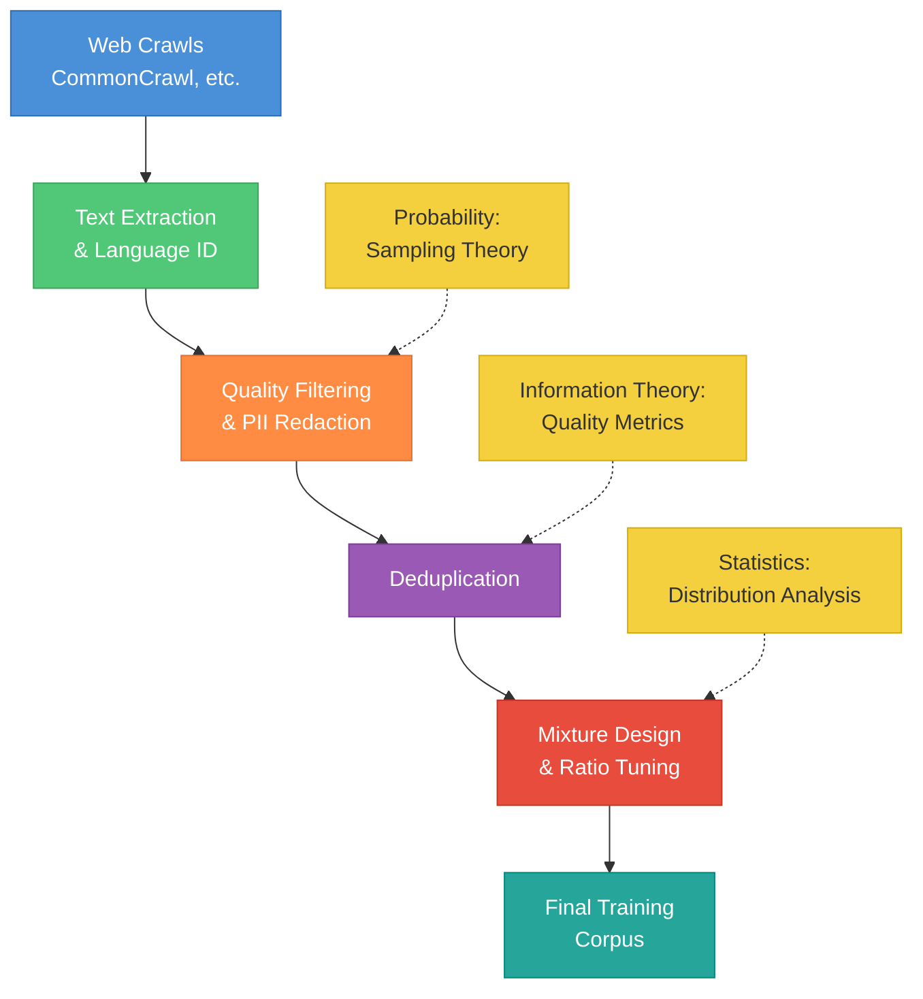
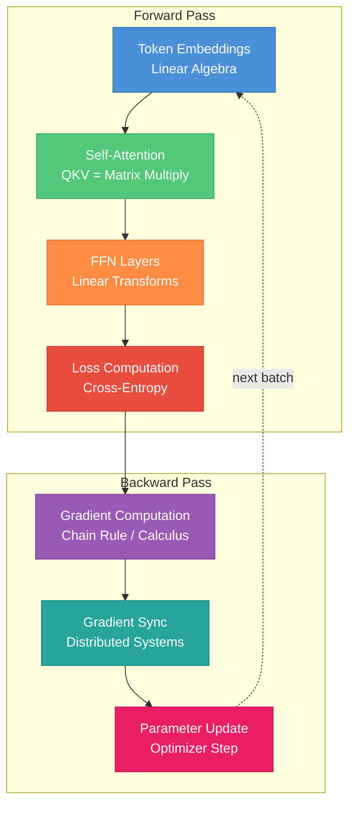
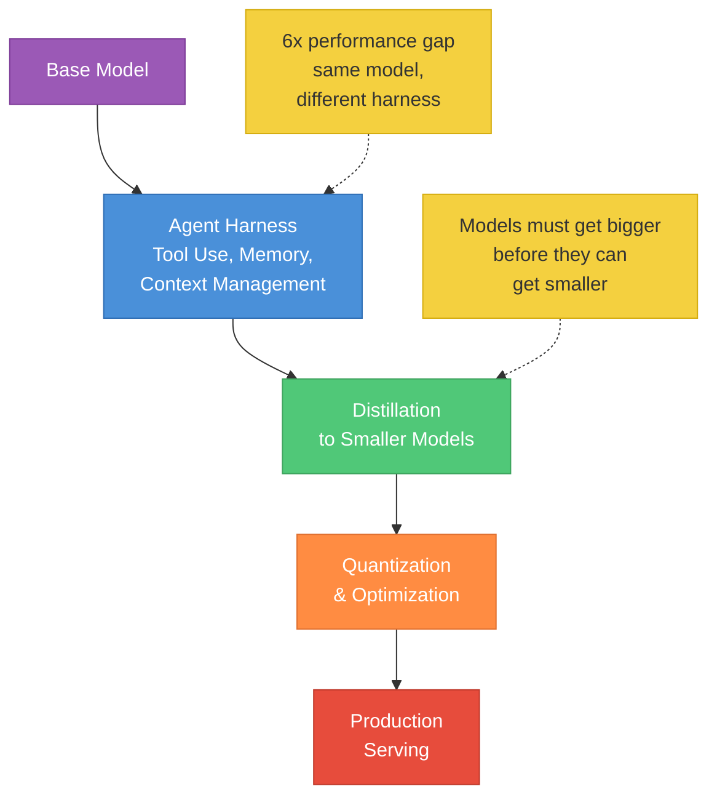
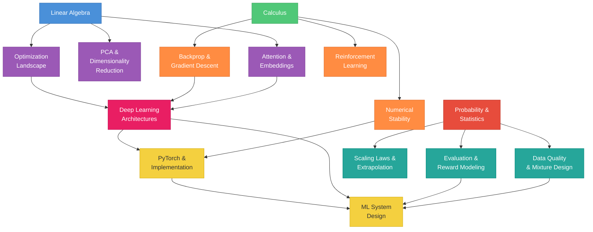
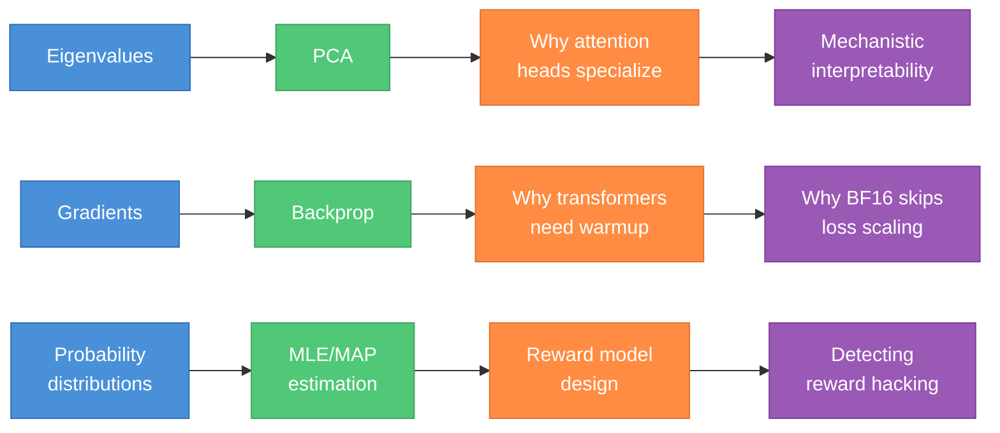

# Why Every MLE Needs to Know This -- A Practical Guide

If you think linear algebra is just for interviews, you haven't debugged a NaN loss at 3 AM on a 512-GPU training run.

There is a gap -- a big one -- between "I passed the interview" and "I can actually do this job." The interview tests whether you can derive backprop on a whiteboard. The job tests whether you can figure out why your 70B model's loss spiked at step 47K and decide, under pressure, whether to roll back the checkpoint or adjust the learning rate -- while burning $50K/hour in compute.

Modern MLE work spans the **full pipeline**. Not just `model.fit()`. Not just fine-tuning a LoRA adapter. The real work is a 9-stage system where every stage demands different foundational knowledge, and a gap in any one of them can silently derail a project that costs millions.

This guide maps **every topic in this study repo** to the exact place it shows up in a real LLM training pipeline. It draws heavily on the excellent article ["You Don't Know LLM Training"](https://tw93.fun/en/2026-04-03/llm.html) by Tw93, which lays out the full pipeline with concrete examples from DeepSeek-V3, Llama 3, and InstructGPT.

By the end, you should be thinking: "I actually need to go study this."

---

## The LLM Training Pipeline -- Where Every Topic Lives

Here is the full pipeline. Nine stages, with feedback loops, where the output of deployment feeds back into data engineering and the cycle continues.

```mermaid
graph LR
    A["Raw Data"]:::blue --> B["Data<br/>Engineering"]:::green
    B --> C["System<br/>Recipe"]:::orange
    C --> D["Pretraining"]:::purple
    D --> E["Post-Training<br/>SFT + RL"]:::red
    E --> F["Eval &<br/>Reward"]:::yellow
    F --> G["Agent<br/>Harness"]:::teal
    G --> H["Distillation"]:::pink
    H --> I["Deployment"]:::blue

    I -.->|"feedback"| B
    F -.->|"reward signal"| E

    classDef blue fill:#4A90D9,stroke:#2E6DB4,color:#fff
    classDef green fill:#50C878,stroke:#3DA35D,color:#fff
    classDef orange fill:#FF8C42,stroke:#E07030,color:#fff
    classDef purple fill:#9B59B6,stroke:#7D3C98,color:#fff
    classDef red fill:#E74C3C,stroke:#C0392B,color:#fff
    classDef yellow fill:#F4D03F,stroke:#D4AC0F,color:#333
    classDef pink fill:#E91E63,stroke:#C2185B,color:#fff
    classDef teal fill:#26A69A,stroke:#00897B,color:#fff
```

Now let's walk through each stage and show exactly what you need to know -- and why.

---

### Stage 1: Raw Data & Data Engineering

**What happens here:** Web crawls, text extraction, language identification, quality filtering, PII redaction, deduplication, synthetic data generation, and -- critically -- mixture design.

**What you need to know:** [Probability & Statistics](statistics.md) -- distribution analysis, sampling theory, quality metrics, hypothesis testing for data quality validation.

**Why this matters:**

Data engineering is not janitorial work. It is **capability design**. The mixing ratios you choose -- how much code vs. math vs. natural language vs. scientific text -- directly shape what your model can and cannot do. Get this wrong and you end up with a model that writes beautiful Python but cannot do basic arithmetic.

Deduplication is a statistics problem. Without it, your model absorbs "the most easily replicated content rather than the most valuable information." Understanding why requires knowing about sampling distributions, data coverage, and information-theoretic redundancy.

Synthetic data has become a formal part of modern training pipelines. Generating it well requires understanding the statistical properties of your training distribution -- you need to fill gaps, not amplify biases.

**Study:** [Probability & Statistics](statistics.md) -- especially sections on distributions, sampling, and hypothesis testing.

---

### Stage 2: System Recipe & Architecture

**What happens here:** Choosing model size, tokenizer vocabulary, context length, parallelism strategy (DP/TP/PP), and numerical precision (FP8/BF16/FP32). These decisions are made before a single gradient is computed, and they lock in your cost and capability ceiling.

**What you need to know:** [Linear Algebra](linear-algebra.md) -- matrix dimensions flow through the entire architecture, from embedding lookups to attention heads to the final projection. [ML System Design](ml-system-design.md) -- memory budgets, distributed training strategies, throughput optimization.

**The numbers tell the story:**

- **DeepSeek-V3** used approximately **2.788M H800 GPU-hours** with FP8 mixed precision on 14.8T tokens -- with zero irrecoverable loss spikes. Choosing the wrong parallelism strategy or precision format would have doubled that cost.
- **Llama 3** expanded its tokenizer from 32K to 128K vocabulary, achieving roughly **15% sequence length compression**. That is a linear algebra and information theory decision -- changing how text maps to vectors -- with massive compute implications across every single forward pass.

A tokenizer decision is set once and compounds across every inference forever. Understanding why 128K tokens compress sequences better than 32K requires knowing how embeddings work, how vocabulary size affects the softmax bottleneck, and how sequence length drives attention's quadratic cost.

**Study:** [Linear Algebra](linear-algebra.md), [ML System Design](ml-system-design.md)

---

### Stage 3: Pretraining

**What happens here:** Next-token prediction on trillions of tokens. Loss optimization. Learning rate scheduling. Gradient accumulation. Mixed-precision training. Distributed communication across hundreds or thousands of GPUs.

**What you need to know:** [Calculus](calculus.md) -- gradient descent, loss landscapes, convergence theory, numerical stability. [Linear Algebra](linear-algebra.md) -- attention is matrix multiplication, embeddings are lookup tables into weight matrices, every layer is a linear transform plus a nonlinearity. [PyTorch](pytorch.md) -- training loops, autograd, mixed precision, distributed data parallel.

**Why this matters:**

The parameter-to-token ratio matters enormously. Llama 3's 8B model trained on approximately **15 trillion tokens** -- that is 75x the Chinchilla-optimal ratio. Understanding why over-training a smaller model can beat a larger under-trained model requires knowing scaling laws, which are fundamentally calculus (power-law fits) and statistics (extrapolation from smaller runs).

A single NaN in your gradients can waste millions of dollars of compute. NaN propagation happens when numerical instability in floating-point arithmetic causes a gradient to explode or underflow. Understanding why BF16 does not need loss scaling but FP16 does -- that is calculus (the chain rule and how gradients scale) combined with linear algebra (the numerical range of matrix multiplications). DeepSeek-V3 achieved zero irrecoverable loss spikes on their entire 14.8T token run. That does not happen by accident. It happens because engineers understood the math deeply enough to detect and prevent silent gradient corruption and NVLink bandwidth anomalies before they cascaded.

**Study:** [Calculus](calculus.md), [Linear Algebra](linear-algebra.md), [PyTorch](pytorch.md), [Deep Learning Architectures](deep-learning-architectures.md)

---

### Stage 4: Post-Training (SFT + RL)

**What happens here:** A 4-stage process that transforms a base model into an aligned assistant:

1. **Cold-start SFT** -- Fine-tune on a small set of high-quality chain-of-thought data
2. **Reasoning RL (GRPO)** -- Reinforce reasoning ability using verifiable rewards on math, code, and logic
3. **Rejection Sampling FT** -- Convert successful RL trajectories into new SFT data
4. **Alignment RL** -- Final polish with helpfulness and safety preference feedback

**What you need to know:** [Calculus](calculus.md) -- policy gradient optimization, the math behind PPO and GRPO. [Probability & Statistics](statistics.md) -- reward modeling, evaluating training quality. The RL section of the [All-In-One Guide](all-in-one-guide.md) covers policy gradients, PPO, and DPO.

**Why this matters:**

DeepSeek-R1-Zero demonstrated that pure RL (without SFT) is viable -- the model developed reasoning on its own. But it also caused repetition, language mixing, and readability issues. The cold-start SFT stage exists specifically to prevent these failure modes. Understanding **why** requires knowing how policy optimization works and how initial policy quality affects RL convergence.

InstructGPT's **1.3B parameter model beat 175B GPT-3** in human preference evaluations after post-training. Read that again: a model 135x smaller won because of better alignment. Understanding why requires deep knowledge of optimization landscapes and reward shaping.

**GRPO vs PPO** is a critical design choice. PPO (Proximal Policy Optimization) requires a separate value network to estimate advantages. GRPO (Group Relative Policy Optimization) eliminates that entirely -- it samples multiple responses and uses within-group ranking instead of absolute value estimation. It is significantly simpler to operate at scale, which is why both DeepSeek and Cursor adopted approaches close to GRPO. But understanding the tradeoff -- when the simplicity of GRPO matters and when PPO's value network gives better signal -- requires knowing the math behind both.

**Study:** [All-In-One Guide](all-in-one-guide.md) (RL section), [Calculus](calculus.md), [Probability & Statistics](statistics.md)

---

### Stage 5: Evaluation & Reward Design

**What happens here:** Task definition, evaluation set creation, grader and judge design, reward signal construction, and the policy update loop that connects evaluation back to training.

**What you need to know:** [Probability & Statistics](statistics.md) -- hypothesis testing, metric design, understanding when metrics are trustworthy. Information theory concepts like cross-entropy and KL divergence. [ML Coding Patterns](ml-coding-patterns.md) -- implementing evaluation pipelines.

**The critical insight:** "If the grader is wrong, training optimizes the wrong target." This is Goodhart's Law applied to ML -- when a measure becomes a target, it ceases to be a good measure. Your model will find ways to exploit the scoring system rather than genuinely completing the task. This is called **reward hacking**, and detecting it requires statistical rigor.

**ORM vs PRM -- a statistics problem:**

| | Outcome Reward Model (ORM) | Process Reward Model (PRM) |
|---|---|---|
| **What it scores** | Final answer only | Each intermediate step |
| **Signal density** | Sparse | Dense |
| **Annotation cost** | Low | 3-5x higher than ORM |
| **Failure mode** | Wrong process can produce correct answer | Expensive to scale |
| **Best for** | Simple tasks with verifiable answers | Complex reasoning chains |

OpenAI's experiments showed PRM made it easier to constrain process quality for reasoning tasks. Choosing between ORM and PRM -- and designing the right hybrid -- is fundamentally a statistics problem: how much signal do you need, how noisy is that signal, and what is the cost-accuracy tradeoff?

Another subtle pitfall: preference evaluation naturally favors longer responses. If your reward model has this bias, your model will learn to be verbose rather than correct. Detecting this requires understanding statistical confounders.

**Study:** [Probability & Statistics](statistics.md), [ML Coding Patterns](ml-coding-patterns.md)

---

### Stage 6: Agent Harness & Deployment

**What happens here:** Wrapping the model in a control program -- tool use, memory management, context pruning, retrieval, multi-agent orchestration -- then distilling to smaller models and optimizing for production serving.

**What you need to know:** [ML System Design](ml-system-design.md) -- serving architecture, latency budgets, scaling. [PyTorch](pytorch.md) -- inference optimization, quantization, KV cache management.

**The mind-blowing stat:** With the same base model, only changing the harness code, you can see a **6x performance gap** on the same benchmark. The model is only part of the story. Meta's harness research showed a 7.7-point improvement on online text classification using 1/4 of the context tokens, and a 4.7-point average gain across 5 models on 200 IMO math problems.

The program surrounding the model is no longer just a deployment detail. It is a layer that shapes capability. Harness design -- context pruning policies, retrieval strategies, tool-use orchestration -- is now a first-class engineering problem.

**Distillation follows a directional principle:** models must get bigger before they can get smaller. Larger models develop capability through RL and verified rewards. Those reasoning trajectories then transfer to smaller dense models. Knowledge memorization and reasoning capability are entangled in pretraining -- larger models can generate pure reasoning demonstration data that smaller models learn from.

**Study:** [ML System Design](ml-system-design.md), [PyTorch](pytorch.md)

---

## The Knowledge Graph -- How Everything Connects

Nothing in this study guide is isolated. Every topic feeds into multiple stages of the pipeline, and the topics feed into each other.

The three math foundations -- linear algebra, calculus, and statistics -- are not separate subjects you study in isolation. They are three lenses on the same system. Attention is a linear algebra operation optimized by calculus and evaluated by statistics. Every stage of the pipeline uses all three.

---

## The Six-Layer Mental Model

When a user says "the model got better," that improvement traces back through layers of engineering decisions. Here is how user-facing improvements map to the deep technical knowledge that made them possible.

| Layer | User Perception | MLE Knowledge Required | Study Guide |
|-------|----------------|----------------------|-------------|
| **Pretraining** | "Model got smarter" | Scaling laws, loss functions, attention mechanisms, distributed systems | [Linear Algebra](linear-algebra.md), [Calculus](calculus.md), [DL Architectures](deep-learning-architectures.md) |
| **Data Engineering** | "Better at code/math" | Distribution design, quality metrics, synthetic data generation, dedup | [Statistics](statistics.md), [ML System Design](ml-system-design.md) |
| **System & Architecture** | "Supports 128K context" | Memory hierarchy, parallelism strategies, precision tradeoffs, tokenizer design | [PyTorch](pytorch.md), [ML System Design](ml-system-design.md) |
| **Post-Training** | "Smoother assistant" | RL, policy optimization, reward modeling, GRPO vs PPO tradeoffs | [Calculus](calculus.md), [All-In-One Guide](all-in-one-guide.md) |
| **Eval & Reward** | "More reliable" | Hypothesis testing, metric design, Goodhart's Law, ORM vs PRM | [Statistics](statistics.md), [ML Coding Patterns](ml-coding-patterns.md) |
| **Distillation & Deploy** | "Fast and cheap" | Quantization, KV cache, serving architecture, speculative decoding | [PyTorch](pytorch.md), [ML System Design](ml-system-design.md) |

Every row in this table is a career's worth of depth. But the rows are not independent -- an improvement at the pretraining layer changes what post-training can achieve, which changes what evaluation must measure, which changes what deployment must optimize.

---

## What Separates Good MLEs from Great Ones

- Good MLEs can train a model. **Great MLEs can debug why training collapsed at step 50K.**
- Good MLEs know PyTorch APIs. **Great MLEs know why `.contiguous()` matters for tensor core utilization.**
- Good MLEs can describe attention. **Great MLEs can derive why FlashAttention's IO-aware tiling gives 2-4x speedup with the same FLOPs.**
- Good MLEs know that BF16 is "good for training." **Great MLEs know why BF16 does not need loss scaling but FP16 does -- and can explain it in terms of exponent range and the chain rule.**
- Good MLEs can fine-tune a model. **Great MLEs know why GRPO eliminates the value network and when that tradeoff hurts.**
- Good MLEs can run evaluations. **Great MLEs can detect when the evaluation itself is the problem -- when the model is reward-hacking rather than improving.**

The difference is always the foundations.

---

## The Compounding Effect

Foundational knowledge does not add linearly. It compounds.

Each row above is a chain of understanding where each link makes the next one click faster:

- Understanding **eigenvalues** leads to understanding **PCA**, which leads to understanding **why attention heads specialize** in different subspaces, which leads to **mechanistic interpretability** -- the frontier of understanding what models actually learn.
- Understanding **gradients** leads to understanding **backprop**, which leads to understanding **why transformers need learning rate warmup** (early gradients are unstable with random weights), which leads to understanding **why BF16 does not need loss scaling** (its exponent range matches FP32, so gradient magnitudes stay representable).
- Understanding **probability distributions** leads to understanding **MLE/MAP estimation**, which leads to understanding **reward model design** (a reward model is just a learned estimator of human preferences), which leads to **detecting reward hacking** (when the model exploits statistical artifacts in the reward signal).

The person who invested in foundations can pick up new techniques in hours. The person who skipped them spends weeks confused by every new paper.

---

## Start Here

Where you start depends on where you are.

**If you are a new grad:**
Start with the math foundations. They are the bottleneck for everything else.
1. [Linear Algebra](linear-algebra.md) -- vectors through SVD and PCA
2. [Calculus](calculus.md) -- gradients through backprop
3. [Statistics](statistics.md) -- distributions through information theory
4. [Deep Learning Architectures](deep-learning-architectures.md) -- MLPs through transformers

**If you are a software engineer transitioning to ML:**
Start with the practical side, then fill in the math as you hit walls.
1. [PyTorch](pytorch.md) -- tensors, autograd, training loops
2. [ML Coding Patterns](ml-coding-patterns.md) -- implement algorithms from scratch
3. [Linear Algebra](linear-algebra.md) and [Calculus](calculus.md) -- fill in the gaps you hit

**If you are an experienced MLE preparing for interviews:**
Start with the all-in-one review, then go deep where you are weakest.
1. [All-In-One Guide](all-in-one-guide.md) -- fast refresher across all topics
2. Use the detailed guides to fill specific gaps
3. [ML System Design](ml-system-design.md) -- the topic most senior candidates under-prepare

**If you want to work on LLM training specifically:**
The pipeline demands a specific combination of depth.
1. [ML System Design](ml-system-design.md) -- distributed training, serving, memory
2. [Calculus](calculus.md) -- optimization, stability, scaling laws
3. [Statistics](statistics.md) -- data quality, evaluation, reward modeling
4. [PyTorch](pytorch.md) -- you will live in this framework

---

## All Study Guides

| Guide | What It Covers |
|-------|---------------|
| [Linear Algebra](linear-algebra.md) | Vectors, matrices, decompositions, PCA -- the language of ML |
| [Calculus & Optimization](calculus.md) | Gradients, backprop, optimization -- how models learn |
| [Probability & Statistics](statistics.md) | Distributions, estimation, information theory -- how we measure |
| [Deep Learning Architectures](deep-learning-architectures.md) | CNNs, RNNs, transformers, diffusion -- the model zoo |
| [ML System Design](ml-system-design.md) | Pipelines, serving, monitoring -- production ML |
| [PyTorch & Tensors](pytorch.md) | Tensors, autograd, distributed -- the implementation layer |
| [ML Coding Patterns](ml-coding-patterns.md) | From-scratch implementations -- prove you understand it |
| [All-In-One Guide](all-in-one-guide.md) | Complete ML theory reference -- the fast review |

---

The foundational knowledge in these guides is not academic trivia. It is the difference between being someone who uses ML tools and someone who builds them. Between someone who follows tutorials and someone who debugs training runs that cost more per hour than most people earn in a month.

The pipeline does not care about your job title. It cares whether you understand the math well enough to make the right call when something breaks at scale.

Start studying.
